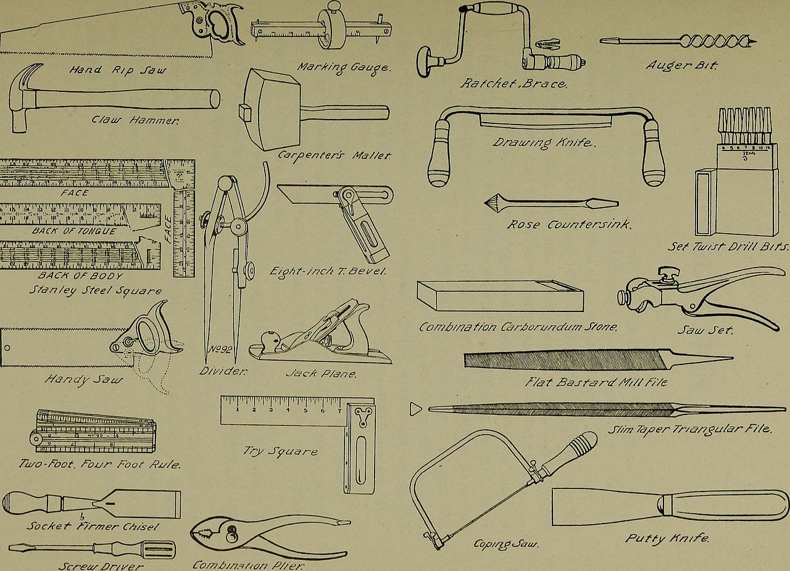

# Tools overview

*Every load tool is the same loop industrialized: virtual users, scripted journeys, timings, the percentile table. JMeter, k6, Gatling, and Locust are the 2026 big four - and the skill that transfers between them all is scenario design, not button knowledge.*

> Here's a secret that saves months of tool anxiety: every load-testing tool ever built is the same
> thirty-line program wearing increasingly fancy jackets. Simulate some users. Make each one run a
> scripted journey. Collect the timings. Print the percentile table. That's it - that's JMeter,
> that's k6, that's the expensive enterprise thing with the sales team. The jackets differ in real
> and useful ways (which language you script in, how many users one machine can fake, how pretty
> the report is), but the engine is identical - and the skill that actually gets testers hired is
> not knowing which buttons to press in one jacket. It's designing a scenario worth running and
> reading the table it produces. This note runs the thirty-line version first, so every real tool
> you ever open afterward looks familiar instead of magical.

> **In real life**
>
> A 1922 woodworking manual opens with a full-page plate of tools - every saw, plane, and gauge
> drawn and NAMED, before a single lesson. Not because the apprentice must master all of them by
> Friday, but because a craftsman needs to know what exists, what each is FOR, and which to reach
> for when. Notice something else about that plate: half the tools on it don't cut anything - the
> squares, rules, and marking gauges exist purely to MEASURE, because in fine work, measurement is
> the work. Load-testing tools are the same plate: several saws for several kinds of cutting, and
> the measuring instruments doing the half of the job that makes the other half mean anything.

**Load-testing tools**: Load-testing tools automate the load-and-measure loop: they create VIRTUAL USERS (simulated clients - k6 calls them VUs, JMeter calls them threads), run each through a SCRIPTED SCENARIO (a realistic user journey: log in, browse, add to cart), apply a LOAD PROFILE (how many users, arriving how - steady, ramping, spiking), and aggregate the results into the standard report: percentile response times, throughput, error counts, plus THRESHOLDS (machine-checkable pass/fail rules like 'p95 under 500ms', which let CI fail a build on a performance regression automatically). The 2026 big four: Apache JMeter (20+ years mature, GUI-driven, enormous plugin ecosystem, tests almost any protocol), Grafana k6 (scripts are real JavaScript/TypeScript, built for CI and developer workflows), Gatling (Java/Scala/Kotlin/JS, thousands of virtual users per machine, polished reports), and Locust (scenarios in plain Python). Browser-side, Lighthouse and DevTools measure single-user page performance - a different, complementary question.

## The landscape in 2026 - four workhorses and what each is for

- **JMeter: the twenty-year workhorse.** Free, Apache-run, GUI-driven, with a thousand-plugin
  ecosystem and protocol reach nothing else matches - HTTP, but also JDBC, JMS, LDAP, SOAP,
  FTP. The costs of the long history: test plans are XML files that diff terribly in Git, and
  the GUI feels its age. Still the default in enterprises and the name most job listings ask
  for - fluency here is employable, full stop.
- **k6: the developer-native one.** Scripts are genuine JavaScript/TypeScript - loops, modules,
  version control, code review all work like normal code - and thresholds make CI integration
  nearly effortless ('fail the build if p95 exceeds 500ms'). Acquired by Grafana, so results
  flow straight into the dashboards teams already watch; still actively evolving (k6 2.0 shipped
  in 2026). The modern-stack default, and the gentlest on-ramp if you can read the JavaScript
  in this course.
- **Gatling: the heavy hauler.** Engineered for efficiency - thousands of virtual users from a
  single machine where thread-based tools need a fleet - with scripts in Java, Scala, Kotlin,
  or JavaScript and famously polished HTML reports that non-engineers actually read. Strong fit
  for Java-house teams (your Selenium+Java skills transfer directly) and for anyone whose
  stakeholders judge tests by the report.
- **Locust: the Python one.** Scenarios are plain Python classes - if you can write the Python
  in this course's playgrounds, you can write a Locust test today. Distributed load via a
  master/worker web UI, and the project stays healthily active. The obvious pick where the
  team's tooling is already Python.
- **The browser-side family answers a different question.** Lighthouse (built into Chrome
  DevTools) and the Performance panel measure ONE user's page experience - load time, rendering,
  Core Web Vitals - not what 5,000 concurrent users do to a server. Complementary, not
  competing: a server can survive Black Friday while every page still renders slowly, and
  vice versa. Know which question you're asking before choosing which family answers it.
- **Choose by fit, not by fashion - and revalidate before you rely.** Team writes Python? Locust.
  Modern web stack with CI? k6. Enterprise Java shop or exotic protocols? JMeter or Gatling.
  All four are free to start, so 'try the one that matches your stack' costs an afternoon. And
  because tool landscapes shift under you (pricing, licenses, maintenance - this course has
  caught several tools changing mid-write), check any tool's current status the week you commit
  to it, not the year someone wrote the tutorial.

> **Tip**
>
> Learn ONE tool one level deep rather than four tools one demo deep - the concepts (virtual users,
> scenarios, ramps, thresholds, the percentile table) transfer wholesale, so the second tool costs
> a tenth of the first. For a first pick in 2026: k6 if you're comfortable with JavaScript and want
> CI integration, JMeter if you're aiming at enterprise job listings that name it. Either way, your
> first real script should be YOUR app's critical journey - not the tutorial's demo site.

> **Common mistake**
>
> Believing the tool IS the test. A load tool will faithfully hammer an unrealistic scenario
> (wrong mix, tiny data, warm caches, one endpoint instead of a journey) and print authoritative-
> looking percentiles about a system that doesn't resemble yours in production. The thinking from
> the previous notes - what's the real forecast, what's the honest mix, what's the promise, what
> will you watch - is the test; the tool merely industrializes its arithmetic. A great scenario in
> the 'wrong' tool beats a lazy scenario in the perfect one, every single time.


*Manual training for the rural schools (1922) — Internet Archive Book Images, Wikimedia Commons, no known restrictions. [Source](https://commons.wikimedia.org/wiki/File:Manual_training_for_the_rural_schools;_a_group_of_farm_and_farm_home_woodworking_problems_(1922)_(14781178044).jpg)*
- **The hand rip saw — the JMeter of the plate** — The big, general-purpose workhorse that's been on every bench for generations: not the newest or the sleekest, but it cuts everything and everyone knows it by name. Twenty years of JMeter is this saw - and 'I can use the tool the whole shop already owns' is a real employability claim.
- **The coping saw — a different saw for a different cut** — Nobody rips planks with a coping saw or cuts curves with a rip saw - same family, different fit. k6, Gatling, and Locust are all 'saws' too: the choice isn't better-or-worse, it's which language your team writes and which cut (CI checks, massive scale, Python-native) you're making.
- **The steel square and rules — half the plate doesn't cut, it measures** — Squares, rules, marking gauges: measurement instruments outnumber the cutting edges, because in fine work measuring IS the work. Same in load testing - generating traffic is trivial; the percentile table, thresholds, and resource graphs are the half of the tool that makes the other half mean anything.
- **The set of twist drill bits — one skill, many fittings** — One brace drives every bit in the set: the skill is in the driving, the bits swap per job. Scenario design is your brace - realistic journeys, honest mixes, written promises - and JMeter, k6, Gatling, and Locust are interchangeable bits it plugs into. Learn the brace deeply once; bits are cheap.
- **The claw hammer — the simple tool that's still on every bench** — A century of fancier tools hasn't retired the hammer. Your hammer is DevTools: timing a flow in the Network tab, throttling, Lighthouse on a page - the first reach before any virtual user exists, and frequently all the performance evidence a bug report needs.

**What actually happens when you press Start in any load tool - press Play**

1. **The tool spawns virtual users - 10 VUs, or 10,000** — Each VU is a simulated client (k6: VUs, JMeter: threads, Locust: users). No browsers involved for API load - just efficient request-makers, which is how one machine can impersonate a crowd.
2. **Each VU runs the scripted journey, over and over** — Home, search, add to cart, checkout - with think-time pauses between steps, because real humans read pages. The journey's realism is YOUR contribution; the tool just executes it at scale.
3. **Every request's timing and outcome is recorded** — Thousands of samples stream in: duration, status, size. This is the measuring half - the plate's squares and rules - happening automatically on every single request.
4. **The report: percentiles, throughput, errors - and thresholds decide pass/fail** — The same table every tool prints, the same one you read in key-metrics. Thresholds ('p95 under 500ms') turn it into a machine-checkable verdict, which is how a CI pipeline fails a build for slowness with nobody watching.

Before touching any real tool, run the whole idea in thirty lines - a working miniature of what
JMeter, k6, Gatling, and Locust all industrialize:

*Run it - a mini load tool: VUs, a scripted journey, and the standard report (Python)*

```python
# What k6/JMeter/Gatling/Locust actually DO, in 30 lines: spin up virtual
# users, fire scripted requests, collect timings, print the report.
VUS = 10            # virtual users (k6 calls them VUs, JMeter calls them threads)
ITERATIONS = 5      # each VU repeats the scripted journey 5 times

def scripted_journey(vu, iteration):
    # a deterministic stand-in for 'home -> search -> add to cart'
    base = 180
    contention = (vu * 7 + iteration * 13) % 90   # simulated jitter under load
    cart_penalty = 220 if (vu + iteration) % 4 == 0 else 0  # slow cart service, sometimes
    return base + contention + cart_penalty

samples = []
for vu in range(1, VUS + 1):
    for it in range(1, ITERATIONS + 1):
        samples.append(scripted_journey(vu, it))

s = sorted(samples)
total = len(s)
avg = sum(s) // total
p95 = s[max(1, (95 * total + 99) // 100) - 1]
print("mini-load-tool v0.1  (the part every real tool automates for you)")
print(f"  scenario: 'browse and add to cart'   VUs: {VUS}   iterations each: {ITERATIONS}")
print()
print("  requests.............: " + str(total))
print(f"  avg..................: {avg}ms")
print(f"  min / max............: {s[0]}ms / {s[-1]}ms")
print(f"  p95..................: {p95}ms")
slow = sum(1 for t in s if t > 400)
print(f"  over 400ms threshold.: {slow} ({slow * 100 // total}%)")
print()
print("That's the whole trick - every load tool is this loop, industrialized:")
print("  JMeter  adds a GUI, 20 years of plugins, every protocol imaginable")
print("  k6      makes the script real JavaScript and slots into CI cleanly")
print("  Gatling adds massive per-machine scale and executive-ready reports")
print("  Locust  lets you write the journey in plain Python")
print("The skill that transfers between ALL of them: designing a realistic")
print("scenario, choosing thresholds, and reading the percentile table -")
print("which you just did without installing anything.")
```

The same miniature tool in Java - identical loop, identical report:

*Run it - a mini load tool: VUs, a scripted journey, and the standard report (Java)*

```java
import java.util.*;

public class Main {
    static final int VUS = 10;         // virtual users (k6 calls them VUs, JMeter calls them threads)
    static final int ITERATIONS = 5;   // each VU repeats the scripted journey 5 times

    static int scriptedJourney(int vu, int iteration) {
        // a deterministic stand-in for 'home -> search -> add to cart'
        int base = 180;
        int contention = (vu * 7 + iteration * 13) % 90;            // simulated jitter under load
        int cartPenalty = (vu + iteration) % 4 == 0 ? 220 : 0;      // slow cart service, sometimes
        return base + contention + cartPenalty;
    }

    public static void main(String[] args) {
        List<Integer> samples = new ArrayList<>();
        for (int vu = 1; vu <= VUS; vu++)
            for (int it = 1; it <= ITERATIONS; it++)
                samples.add(scriptedJourney(vu, it));

        int[] s = samples.stream().mapToInt(Integer::intValue).sorted().toArray();
        int total = s.length;
        int avg = Arrays.stream(s).sum() / total;
        int p95 = s[Math.max(1, (95 * total + 99) / 100) - 1];
        System.out.println("mini-load-tool v0.1  (the part every real tool automates for you)");
        System.out.printf("  scenario: 'browse and add to cart'   VUs: %d   iterations each: %d%n", VUS, ITERATIONS);
        System.out.println();
        System.out.println("  requests.............: " + total);
        System.out.printf("  avg..................: %dms%n", avg);
        System.out.printf("  min / max............: %dms / %dms%n", s[0], s[total - 1]);
        System.out.printf("  p95..................: %dms%n", p95);
        long slow = Arrays.stream(s).filter(t -> t > 400).count();
        System.out.printf("  over 400ms threshold.: %d (%d%%)%n", slow, slow * 100 / total);
        System.out.println();
        System.out.println("That's the whole trick - every load tool is this loop, industrialized:");
        System.out.println("  JMeter  adds a GUI, 20 years of plugins, every protocol imaginable");
        System.out.println("  k6      makes the script real JavaScript and slots into CI cleanly");
        System.out.println("  Gatling adds massive per-machine scale and executive-ready reports");
        System.out.println("  Locust  lets you write the journey in plain Python");
        System.out.println("The skill that transfers between ALL of them: designing a realistic");
        System.out.println("scenario, choosing thresholds, and reading the percentile table -");
        System.out.println("which you just did without installing anything.");
    }
}
```

### Your first time: Your mission: first contact with a real tool, in under an hour

- [ ] Pick your first tool by stack fit, then verify it's current — JavaScript-comfortable + CI-minded: k6. Enterprise-Java aim or the job listing names it: JMeter. Python team: Locust. Then spend two minutes on the tool's own site confirming today's install method and license - never trust a tutorial's year-old assumptions.
- [ ] Install and run the hello-world against a practice target — k6: one script file, `k6 run script.js`. JMeter: GUI, add Thread Group + HTTP Sampler + Summary Report. Point it at a demo site or your own BuggyShop sandbox - NEVER at a production system, yours or anyone else's: uninvited load testing is indistinguishable from an attack.
- [ ] Replace the demo request with one real journey from YOUR app — Two or three steps with think-time between them - login, search, view item. This is the moment the tool becomes yours: the scenario is now about your system, not the tutorial's.
- [ ] Run 10 VUs for 2 minutes and read the table like key-metrics taught you — p95, not just average; error count next to speed. Then add one threshold ('p95 under 800ms') and re-run - you now have a machine-checkable performance test, which is the seed of performance testing in CI.

One hour, one real journey, one threshold - and every other tool in the family will now look like
a different jacket on an engine you've already driven.

- **The tool reports terrible response times, but the app feels fine in a browser.**
  Suspect the measurer before the measured: is the load GENERATOR itself maxed out (its CPU at 100% adds queuing delay it then blames on your app)? Is it running on your laptop over office Wi-Fi while the app sits in a datacenter? Check the generator's resource usage, run it closer to the target, and re-verify with a smaller VU count - a saturated or distant generator produces confident numbers about itself.
- **Results swing wildly between identical runs.**
  Load results are only as stable as the environment: shared staging (someone else's test mid-run), autoscaling flapping, caches cold on run one and warm on run two. Standardize the preamble - fixed environment window, cache-warming pass first, same data set - and run each configuration at least twice before believing either. A tool prints what it saw; making runs COMPARABLE is the tester's job.
- **Scripted requests all fail with 401/403 while the same journey works in a browser.**
  Your virtual users aren't logged in. Browsers carry cookies, tokens, and CSRF headers invisibly; scripts must do it explicitly - a login step first, extracting the token, attaching it to later requests (JMeter: cookie manager + extractors; k6: capture from the login response). This is the single most common first-script wall, and climbing it teaches half of how web auth actually works - time well spent.
- **Someone points the load tool at production 'just for a quick check'.**
  Stop the run. Uninvited load against production is a self-inflicted incident: real users get degraded service, alerting fires, and traffic-wise it's indistinguishable from an attack (cloud providers and security teams treat it as one). Load tests belong on isolated environments sized like production - and if only production will do, that's a planned, announced, off-peak exercise with ops in the room, never a quick check.

### Where to check

- **The tool's summary table after every run** — percentiles, throughput, error counts: the same four gauges from key-metrics, produced automatically; reading it as a set is the skill.
- **The generator machine's own CPU and network during the run** — the first suspect for weird numbers; a maxed-out load generator measures itself and blames your app.
- **Your app's resource dashboards DURING the run** — the tool shows what users would feel; the dashboards show why. The pair together is the diagnosis; either alone is half a story.
- **Each tool's official docs for current install and license status** — jmeter.apache.org, k6.io, gatling.io, locust.io: landscapes shift, and the week you commit is the week to verify.
- **[[non-functional-testing-intro/performance/load-vs-stress]]** — the scenarios worth feeding any of these tools; a tool without that thinking is a very fast way to get precise answers to the wrong question.

### Worked example: one journey, two tools, same verdict - proving it's the scenario that matters

1. A tester needs a first load test for a bookshop app's critical path: login → search → add to
   cart. Forecast peak: 120 concurrent users. Promise: p95 under 1 second. The team debates
   tools for a week - k6 or JMeter? - until the tester ends the debate by writing the SCENARIO
   first: the three steps, 2-second think-times, 60/30/10 mix, threshold p95 under 1000ms.
2. Implemented in k6 in an afternoon: a 40-line JavaScript file, login token captured and
   attached, ramping to 120 VUs. Result: p95 of 1.8 seconds - a fail against the promise - with
   the search request dominating the waterfall.
3. To settle the tool anxiety for good, the same scenario goes into JMeter the next day: thread
   group of 120, cookie manager, the same three steps and think-times. Result: p95 of 1.7-1.9
   seconds across runs, search again the dominant cost. Two tools, one truth: the scenario found
   the same bug in both jackets, because the bug is in the app, not the tool.
4. The finding files cleanly (search p95 1.8s at 120 users vs 1s promise; unindexed title query
   confirmed by the dev in the slow-query log; fix scheduled), and CI gets the k6 version with
   its threshold - every future build now fails automatically if search regresses past the
   promise.
5. The week of tool-debate produced nothing; the afternoon of scenario-writing produced the
   finding, the fix, and a permanent CI guardrail. The team's new rule of thumb, straight from
   the 1922 plate: stop comparing saws, start measuring - the tool is the jacket, the scenario
   is the engine.

**Quiz.** A team asks their new tester which load-testing tool to adopt. The honest expert answer starts with a question, not a brand. Which question?

- [ ] Which tool is ranked number one this year?
- [ ] What does the enterprise vendor recommend?
- [x] What's our stack and scenario - what language does the team write, what protocols do we test, does it need to run in CI, and who reads the reports?
- [ ] Which tool has the most YouTube tutorials?

*Tool choice is a fit question, because the four workhorses genuinely differ along exactly those axes: team language (Python → Locust, JavaScript → k6, Java shop → Gatling/JMeter), protocol needs (exotic protocols → JMeter's twenty-year ecosystem), CI integration (k6's thresholds make it near-effortless), and report audience (Gatling's polished HTML for stakeholder eyes). Rankings (A) measure fashion, not fit; vendor recommendations (B) measure the vendor's interests; tutorial volume (D) correlates with popularity, not with your stack. And underneath the fit question sits this note's core claim: all four run the same VU-scenario-report engine, so the scenario thinking transfers wholesale - which is why the choice matters less than the anxiety suggests, and why it should be made quickly, by fit, and then practiced deeply.*

- **What every load tool actually does** — The same loop, industrialized: spawn virtual users → run each through a scripted journey with think-times → record every request's timing and outcome → print percentiles, throughput, errors, and threshold verdicts.
- **JMeter in one line** — The 20-year Apache workhorse: GUI-driven, ~1,000 plugins, tests nearly every protocol (HTTP, JDBC, JMS, SOAP...). XML test plans diff poorly in Git; still the name enterprise job listings ask for.
- **k6 in one line** — Scripts are real JavaScript/TypeScript, thresholds make CI pass/fail trivial, results flow into Grafana; actively evolving (2.0 in 2026). The modern-stack and CI default.
- **Gatling in one line** — The heavy hauler: thousands of VUs per machine, scripts in Java/Scala/Kotlin/JS, and polished HTML reports non-engineers actually read. Natural fit for Java-house teams.
- **Locust in one line** — Scenarios in plain Python classes with a master/worker web UI for distributed load. If the team writes Python, the learning curve is nearly zero.
- **Lighthouse/DevTools vs load tools** — Different question: browser tools measure ONE user's page experience (rendering, Core Web Vitals); load tools measure what THOUSANDS of users do to the server. Complementary - a fast server can serve slow pages, and vice versa.
- **A threshold (and why CI cares)** — A machine-checkable pass/fail rule on the results - 'p95 under 500ms, errors under 1%'. It turns a load run into an automated verdict, letting CI fail a build for a performance regression with nobody watching.
- **The transferable skill (and the cardinal rule)** — Scenario design - realistic journeys, honest mixes, written promises - transfers across every tool; buttons don't. And never point a load tool at production uninvited: it's indistinguishable from an attack.

### Challenge

Install one tool this week - chosen by stack fit, in under ten minutes of deliberation - and
reproduce this note's mini-tool result for real: your app's (or BuggyShop's) critical journey,
10 virtual users, 2 minutes, one threshold. Then compare the real tool's report to the mini
tool's output above, line by line: requests, avg, p95, threshold verdict. The layout will match
almost exactly - which is the moment 'load testing tools' stops being a category you're
intimidated by and becomes a jacket you've already worn.

### Ask the community

> First load-testing tool: I'm choosing between `[k6 / JMeter / Locust / Gatling]` for a `[your stack]` app, aiming at `[CI checks / enterprise job market / quick team adoption]`. For those who've used two or more: what made you switch or stay, and what does each tool's tutorial NOT tell you about week two?

Week-two truths - the auth walls, the generator bottlenecks, the report nobody reads - are
exactly what tutorials skip and practitioners remember; ask for them and you inherit months of
someone else's friction for free.

- [Apache JMeter — official site and docs](https://jmeter.apache.org/)
- [Grafana k6 — official documentation](https://grafana.com/docs/k6/latest/)
- [Alex Hyett — How to do Performance Testing with k6](https://www.youtube.com/watch?v=ghuo8m7AXEM)

🎬 [Alex Hyett — How to do Performance Testing with k6](https://www.youtube.com/watch?v=ghuo8m7AXEM) (10 min)

- Every load tool runs the same engine - virtual users, scripted journeys, timing collection, the percentile report - so learn the engine once and every tool becomes a jacket.
- The 2026 big four by fit: JMeter (mature, GUI, every protocol, enterprise listings), k6 (JavaScript, CI thresholds, Grafana), Gatling (per-machine scale, executive reports, Java shops), Locust (plain Python).
- Browser tools (Lighthouse, DevTools) answer a different question - one user's page experience versus many users' server impact. Know which question you're asking.
- The scenario is the test; the tool is its calculator. Realistic journeys, honest mixes, and written promises produce findings in any tool - lazy scenarios produce confident noise in all of them.
- Pick by stack fit in minutes, verify the tool's current status the week you commit, then go one level deep - the second tool costs a tenth of the first.
- Never point a load tool at production uninvited: to every monitoring system and security team on earth, uninvited load is an attack.


## Related notes

- [[Notes/non-functional-testing-intro/performance/load-vs-stress|Load vs stress]]
- [[Notes/non-functional-testing-intro/performance/key-metrics|Key metrics]]
- [[Notes/testers-toolbox/choosing-tools-wisely/keeping-your-kit-current|Keeping your kit current]]


---
_Source: `packages/curriculum/content/notes/non-functional-testing-intro/performance/tools-overview.mdx`_
