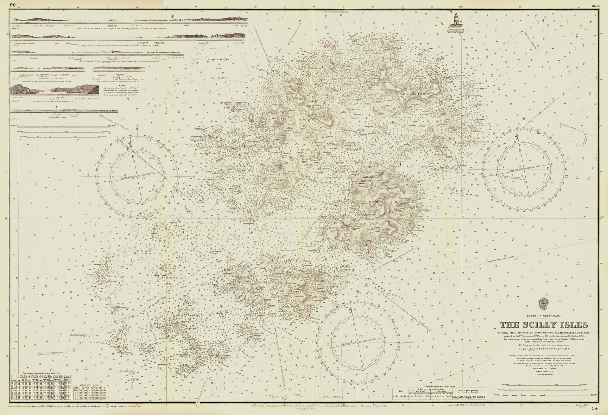

# OWASP preview

*The OWASP Top 10 is the industry's shared map of the most critical web risks — a numbered chart of known hazards so you don't rediscover each one. Testers use it as a common vocabulary and checklist: name a finding by its category and everyone from developer to CISO grasps its shape and stakes.*

> For four hundred years, no competent captain has sailed into the Scilly Isles trusting their own
> eyes and a good memory. They carry the chart — Admiralty Chart 34 — because generations of ships
> already found every rock the hard way, and someone drew each one, named it, and marked its depth so
> the next crew wouldn't repeat the discovery with their hull. That's what a chart IS: hard-won
> knowledge of known hazards, standardized so every mariner reads the same symbols and speaks the same
> names. Web security has exactly this chart, and it's called the OWASP Top 10. You do not need to
> personally discover that broken access control sinks ships or that injection lurks off every input —
> industry evidence and expert review already mapped these waters. The Top 10 is the mariner's chart for software:
> the ten most dangerous, most common hazards, named and numbered so a tester, a developer, and a
> security lead can all point at the same rock and agree it's there.

> **In real life**
>
> Look at what a nautical chart gives a crew that raw seamanship can't. First, KNOWN hazards: every
> rock, wreck, and shoal others already hit, so you avoid them by reading rather than by crashing.
> Second, a SHARED LANGUAGE: the same symbols and named features mean the navigator, the captain, and
> the harbor pilot are all talking about the identical danger — no translation, no ambiguity. Third,
> PRIORITIZATION: the chart shows which hazards are close to the shipping lane and which are far off in
> water nobody sails. The OWASP Top 10 is precisely this chart for web applications — the known
> hazards informed by contributed application-testing data, vulnerability metrics, and expert survey,
> plus a shared vocabulary that lets a whole team name a risk the same way. A tester who can read the
> chart doesn't have to rediscover the rocks; they navigate by the map everyone else is already using.

**The OWASP Top 10**: The OWASP Top 10 is a regularly updated awareness document covering ten critical web-application risk categories, published by the Open Worldwide Application Security Project (OWASP), a nonprofit. The 2025 edition combines contributed application-testing data, NVD/CVSS exploitability and impact metrics, and community survey input; two categories were promoted through the survey. Each category has a code, name, risk shape, and defenses. For a tester it provides shared vocabulary and a coverage map. Its category order is an industry-wide signal, not the severity of a particular bug in your application: prioritize each finding using exploitability, exposure, affected assets and data, existing controls, and technical and business impact. It is not exhaustive, a step-by-step testing guide, or a substitute for threat modeling. The current edition is OWASP Top 10:2025; the prior edition was 2021.

## Reading the chart — what the Top 10 gives a tester

- **A shared name for every hazard.** The single biggest value is vocabulary. "The URL thing where
  you see other people's stuff" and "A01: Broken Access Control" describe the same bug, but only one
  of them lands identically in the heads of a junior dev, a security lead, and a CISO. Naming a
  finding by its category turns a description into an instantly understood, consistently classified
  risk. Half of this note's demo is exactly this translation.
- **A coverage checklist, so nothing whole gets skipped.** Walk a feature down the ten categories
  and you're systematically asking "did I consider access control? injection? crypto? config?"
  instead of testing whatever happens to occur to you. It doesn't tell you HOW to test each (that's
  the Web Security Testing Guide) — it guarantees you didn't forget an entire class of risk.
- **An industry-wide awareness signal, not a finding-severity calculator.** The 2025 list uses
  contributed application-testing data, NVD/CVSS metrics, and community survey input. That helps
  teams choose coverage, but A01 is not automatically more urgent than an A10 finding in your app.
  Prioritize the actual finding by exploitability, exposure, affected data and assets, controls,
  and technical and business impact.
- **The 2025 edition, at a glance.** A01 Broken Access Control (still #1), A02 Security
  Misconfiguration, A03 Software Supply Chain Failures (elevated and broadened), A04 Cryptographic
  Failures, A05 Injection, A06 Insecure Design, A07 Authentication Failures, A08 Software or Data
  Integrity Failures, A09 Security Logging and Alerting Failures, A10 Mishandling of Exceptional
  Conditions. You don't memorize the numbers; you recognize the shapes and know where to look them up.
- **It moves, so cite the edition and check it's current.** The Top 10 is revised (2017 → 2021 →
  2025); categories merge, split, rename, and re-rank as the threat landscape shifts — supply-chain
  risk climbing in 2025 reflects real-world attacks on dependencies and build pipelines. Always name
  the edition you're referencing, and verify you're on the latest when it matters, exactly as you'd
  check a chart's correction date before trusting it.
- **It's the map, not the voyage.** The Top 10 tells you the known hazards and their names; it does
  not sail the ship. You still run the probes ([[non-functional-testing-intro/security/common-risks]]),
  still think adversarially ([[non-functional-testing-intro/security/a-testers-role]]), still
  escalate depth. The chart makes all of that legible and communicable — it doesn't replace it.

> **Tip**
>
> Use the Top 10 as the label on every security bug you file. Whatever you find, tag it with its
> category and edition: 'A01:2025 Broken Access Control — user reads another's invoice via ID'. Three
> things happen instantly: the developer knows the shape and standard fix, the security team can
> bucket and trend it, and management understands the stakes without a tutorial. A finding wearing its
> OWASP name gets triaged; the same finding described only by its mechanism gets a confused reply and a
> slow queue.

> **Common mistake**
>
> Treating the Top 10 as a complete test plan — 'we checked all ten, we're secure'. It's a map of the
> most COMMON critical risks, not every risk, and it names categories rather than telling you how to
> test them or guaranteeing your particular app's unique dangers are on it. Insecure business logic,
> a domain-specific abuse case, a novel integration flaw — none may map cleanly to a top-ten box, and
> all can still sink you. The chart keeps you off the known rocks; it does not promise the water
> between them is empty. Use it as coverage and vocabulary, paired with real testing and thinking, not
> as a certificate of safety.


*Admiralty Chart 34, The Scilly Isles (1911) — Rear Admiral A. Mostyn Field, Wikimedia Commons, public domain. [Source](https://commons.wikimedia.org/wiki/File:Admiralty_Chart_34_The_Scilly_Isles_published_1911.jpg)*
- **The marked rocks and shoals — the known hazards, named** — The Top 10 names ten broad risk categories using industry data and expert input — broken access control, injection, cryptographic failures — so teams share a coverage map and vocabulary.
- **The depth soundings — context determines local danger** — A chart category locates a kind of hazard; it does not determine the severity of your specific finding. Triage using exploitability, exposure, affected assets and data, controls, and business impact.
- **The title cartouche — cite the chart and its edition** — 'THE SCILLY ISLES', with its survey and publication date. Charts get corrected; so does the Top 10 (2017 → 2021 → 2025). Always name the edition you mean — 'A03:2025 Supply Chain' — and check you're on the current one, the way no captain trusts an uncorrected chart.
- **The coastal profile views — the shared symbols everyone reads** — Standardized sketches every navigator interprets identically — the chart's common language. The Top 10's codes and names are software's version: say 'A01 Broken Access Control' and a dev, a security lead, and a CISO all picture the same rock. Shared vocabulary is half the list's value.
- **The compass rose — orientation, not the voyage itself** — The chart orients you; it doesn't sail the ship. The Top 10 tells you the hazards and their names — you still run the probes, still think adversarially, still escalate depth. Map, not voyage: indispensable for navigating, useless if you never leave port.

**Four raw findings become four charted hazards everyone understands — press Play**

1. **You've been screening a feature and have four scribbled findings** — 'You can see other people's orders by changing a number.' 'A quote breaks the search.' 'Passwords look readable in the DB.' 'The error page dumps a stack trace.' All real — all currently in your private shorthand nobody else can prioritize.
2. **Open the chart and name each one by its OWASP category** — Change-the-ID → A01 Broken Access Control. Quote breaks the query → A05 Injection. Readable passwords → A04 Cryptographic Failures. Stack-trace error page → A02 Security Misconfiguration. Same bugs, now wearing standard names.
3. **The whole team suddenly speaks one language about them** — The developer recognizes each shape; the security lead can bucket and trend it. The OWASP label classifies the finding, while the report's evidence and impact establish its severity.
4. **Now prioritize each actual finding in application context** — Assess exploitability, exposure, affected assets and data, existing controls, and technical and business impact. Category rank never substitutes for that analysis.

Here's the tester's everyday use of the chart in runnable form — raw findings mapped to OWASP 2025
categories, then prioritized using explicit application-impact and exposure scores:

*Run it — mapping raw findings to the OWASP Top 10:2025 (Python)*

```python
# OWASP category numbers classify risk types; they are not finding severities.
TOP10_2025 = {
    1: "A01:2025 Broken Access Control",
    2: "A02:2025 Security Misconfiguration",
    3: "A03:2025 Software Supply Chain Failures",
    4: "A04:2025 Cryptographic Failures",
    5: "A05:2025 Injection",
    6: "A06:2025 Insecure Design",
    7: "A07:2025 Authentication Failures",
    8: "A08:2025 Software or Data Integrity Failures",
    9: "A09:2025 Security Logging and Alerting Failures",
    10: "A10:2025 Mishandling of Exceptional Conditions",
}

# Description, category, impact (1-5), exposure (1-5).
findings = [
    ("User sees another user's order by changing the ID", 1, 5, 5),
    ("A quote in search returns a raw database error",    5, 2, 4),
    ("Passwords are stored readable in the database",     4, 5, 3),
    ("An internal admin error reveals a stack trace",      2, 2, 1),
]

print("Findings classified by OWASP, prioritized by app context:\\n")
for desc, category, impact, exposure in sorted(findings, key=lambda f: f[2] * f[3], reverse=True):
    print(f"  [score {impact * exposure:02}] [{TOP10_2025[category]}]")
    print(f"     {desc} (impact={impact}, exposure={exposure})")
    print()
print("The OWASP code supplies shared vocabulary. The explicit context scores")
print("drive this example's triage; a real team uses its approved risk model.")
```

The same mapping in Java — findings in, charted and prioritized out:

*Run it — mapping raw findings to the OWASP Top 10:2025 (Java)*

```java
import java.util.*;

public class Main {
    static class Finding {
        String desc; int category, impact, exposure;
        Finding(String d, int c, int i, int e) { desc=d; category=c; impact=i; exposure=e; }
        int score() { return impact * exposure; }
    }

    public static void main(String[] args) {
        // Category numbers classify risk types; they are not finding severities.
        Map<Integer, String> top10 = new LinkedHashMap<>();
        top10.put(1, "A01:2025 Broken Access Control");
        top10.put(2, "A02:2025 Security Misconfiguration");
        top10.put(3, "A03:2025 Software Supply Chain Failures");
        top10.put(4, "A04:2025 Cryptographic Failures");
        top10.put(5, "A05:2025 Injection");
        top10.put(6, "A06:2025 Insecure Design");
        top10.put(7, "A07:2025 Authentication Failures");
        top10.put(8, "A08:2025 Software or Data Integrity Failures");
        top10.put(9, "A09:2025 Security Logging and Alerting Failures");
        top10.put(10, "A10:2025 Mishandling of Exceptional Conditions");

        List<Finding> findings = new ArrayList<>(Arrays.asList(
            new Finding("User sees another user's order by changing the ID", 1, 5, 5),
            new Finding("A quote in search returns a raw database error",    5, 2, 4),
            new Finding("Passwords are stored readable in the database",     4, 5, 3),
            new Finding("An internal admin error reveals a stack trace",      2, 2, 1)
        ));
        findings.sort((a, b) -> Integer.compare(b.score(), a.score()));

        System.out.println("Findings classified by OWASP, prioritized by app context:\\n");
        for (Finding f : findings) {
            System.out.printf("  [score %02d] [%s]%n", f.score(), top10.get(f.category));
            System.out.printf("     %s (impact=%d, exposure=%d)%n%n", f.desc, f.impact, f.exposure);
        }
        System.out.println("The OWASP code supplies shared vocabulary. The explicit context scores");
        System.out.println("drive this example's triage; a real team uses its approved risk model.");
    }
}
```

### Your first time: Your mission: read the chart and map your own findings onto it

- [ ] Open the current OWASP Top 10 (2025) and read just the ten category names and one-line descriptions — Twenty minutes. You're not memorizing — you're learning to recognize the shapes so that when you find a bug, you know which box it lives in and where to read more. The names ARE the vocabulary.
- [ ] Take any security findings you already have (or the ones from the common-risks note) and label each with its category — Change-an-ID leaks → A01. Quote breaks the query → A05. Readable passwords → A04. Stack-trace error → A02. The act of mapping is the skill; it forces you to name the shape, not just the symptom.
- [ ] Re-file one finding using its OWASP label and impact, and watch the reception change — 'A01:2025 Broken Access Control — authenticated user reads any other user's order via URL ID; ~N accounts; proof attached.' Named, edition-cited, impact-stated. Compare how that's received versus 'weird URL bug'.
- [ ] Bookmark the Top 10 and the Web Security Testing Guide together — The Top 10 is the map (what the hazards are); the Testing Guide is the pilot book (how to test for each). Kept side by side, they turn 'I should test security' into 'here's the category and here's how'.

You can now read the chart every other security professional reads — and, more importantly, you can
put your own findings on it, which is what makes them legible, comparable, and fixable by the whole
team.

- **Security findings get confused or slow replies because everyone describes them differently.**
  This is a vocabulary gap the Top 10 exists to close. Standardize every security bug on its OWASP category and edition — 'A05:2025 Injection', 'A01:2025 Broken Access Control' — so the description carries a shared, instantly-understood shape and standard fix. When the tester, the developer, and the security lead all name the same rock the same way, triage stops being a translation exercise and starts being a decision.
- **A team says 'we covered the OWASP Top 10, so we're secure'.**
  The Top 10 is a map of the most COMMON critical risks, not a completeness proof — it names categories, not your app's specific business-logic and integration dangers, and plenty of real breaches don't map cleanly to a top-ten box. Use it as coverage-and-vocabulary alongside adversarial testing and threat modeling, never as a certificate. 'We considered all ten categories' is a true, useful statement; 'therefore we're secure' is not.
- **People are citing OWASP categories that don't match the current list (e.g. old names or numbers).**
  The list is revised every few years (2017 → 2021 → 2025) and categories rename, merge, and re-rank — 2021's 'Vulnerable and Outdated Components' became part of 2025's broader 'A03 Software Supply Chain Failures', for instance. Always cite the edition ('A03:2025') and verify you're referencing the latest when it matters. Mixing editions causes real confusion; treat the edition like a chart's correction date — check it before you trust it.
- **A finding doesn't seem to fit any Top 10 category, so it gets dropped.**
  Not fitting the chart is not the same as not being real — the Top 10 covers common classes, and business-logic abuse, domain-specific flaws, and novel issues legitimately fall outside it. Don't discard a finding for lacking a box; report it on its own impact, and reach for the broader OWASP Web Security Testing Guide or a specialist. The map keeps you off the known rocks; the water between them still needs a lookout.

### Where to check

- **The current OWASP Top 10 page (2025 edition)** — the ten categories, codes, and descriptions; your source for the names and shapes, and the thing to re-check for the latest edition.
- **Your bug tracker's security findings** — label each with its OWASP category and edition; the tag is what makes findings legible, bucketable, and prioritizable across the whole team.
- **The OWASP Web Security Testing Guide** — the how-to companion: once the Top 10 tells you WHICH hazard, the Testing Guide tells you HOW to test for it (see [[non-functional-testing-intro/security/a-testers-role]]).
- **Requirements and acceptance criteria** — mapping stories to Top 10 categories early ('this feature touches A01 and A05') pushes security thinking into design, where it's cheapest.
- **[[non-functional-testing-intro/security/common-risks]]** — the same hazards from the tester's probe-first angle; the Top 10 is those risks given standard names, numbers, and an industry-wide audience.

### Worked example: the same audit, before and after the chart

1. A tester finishes a security screen of a new feature and has five findings in personal shorthand:
   'other people's data via URL number', 'quote crashes search', 'passwords readable', 'stack trace
   on error', 'no record of failed logins anywhere'. All real, all currently illegible to anyone
   who wasn't in the tester's head.
2. The tester opens the OWASP Top 10:2025 and maps each: URL-number leak → A01 Broken Access
   Control; quote-crashes-search → A05 Injection; readable passwords → A04 Cryptographic Failures;
   stack-trace error → A02 Security Misconfiguration; no failed-login records → A09 Security Logging
   and Alerting Failures. Five scribbles, five charted hazards.
3. The report is rewritten with names and editions, then each actual finding is prioritized using
   exploitability, exposure, affected assets and data, existing controls, and business impact. An
   A10 finding can outrank an A01 finding in this application; the category is taxonomy, while the
   evidence and context determine severity and release risk.
4. One finding — an odd multi-step abuse of the feature's business logic — maps to NO Top 10 box.
   The tester doesn't drop it; they file it on its own impact and flag it for the security specialist
   with the Web Security Testing Guide reference, noting explicitly that it falls outside the chart.
5. Nothing about the bugs changed between step 1 and step 4 — only their legibility. The chart didn't
   find a single rock; it named them so the whole crew could navigate the same waters, then use an
   explicit risk model to fix the dangerous ones first. That translation is the tester's everyday use of the
   Top 10.

**Quiz.** You've found that an authenticated user can read another user's records by changing an ID in the URL. What's the best way to use the OWASP Top 10 when reporting it?

- [ ] Skip the OWASP label — the plain description is clearer than a code
- [x] Tag it 'A01:2025 Broken Access Control' and state evidence, exposure, and impact so the team can classify and prioritize it
- [ ] Tag it with any Top 10 category, since the specific one doesn't really matter
- [ ] Report it as 'OWASP compliant tested' to show the feature was checked

*The OWASP label supplies shared vocabulary and an edition-cited category; the evidence, exposure, exploitability, affected assets, and business impact determine the finding's severity. Option A discards useful taxonomy. Option C sends readers toward the wrong risk shape and defenses. Option D misuses the Top 10 as a compliance badge. Name the exact category, cite the edition, and state the application-specific impact without inferring severity from A01–A10 order.*

- **What the OWASP Top 10 is** — A regularly updated awareness document covering ten critical web-application risk categories, published by OWASP. The 2025 edition combines contributed testing data, NVD/CVSS metrics, and community survey input. Codes A01–A10.
- **What it gives a tester** — (1) Shared vocabulary — name a finding by category and edition. (2) Coverage map — walk a feature past all ten. It does NOT assign the severity of an individual finding; application context does.
- **What the Top 10 is NOT** — Not exhaustive (business-logic and novel flaws fall outside it), not a how-to-test guide (that's the Web Security Testing Guide), not a completeness certificate. It's the map, not the voyage — pair it with real testing and thinking.
- **OWASP Top 10:2025 — the list** — A01 Broken Access Control, A02 Security Misconfiguration, A03 Software Supply Chain Failures, A04 Cryptographic Failures, A05 Injection, A06 Insecure Design, A07 Authentication Failures, A08 Software/Data Integrity Failures, A09 Security Logging & Alerting Failures, A10 Mishandling of Exceptional Conditions.
- **Why cite the edition** — The list is revised every few years (2017 → 2021 → 2025); categories rename, merge, and re-rank (2021 'Vulnerable & Outdated Components' → part of 2025 'A03 Supply Chain'). Always name the edition ('A03:2025') and check you're on the latest.
- **How a tester uses it day to day** — Label every security finding with its category + edition + impact ('A01:2025 Broken Access Control — user reads another's invoice via ID'). The tag makes findings legible, comparable, prioritizable, and taken seriously across the team.
- **Notable 2025 shift** — Broken Access Control stays #1 (A01); Software Supply Chain Failures (A03) is elevated and broadened from 2021's 'Vulnerable and Outdated Components' to cover dependencies, build systems, and distribution — reflecting real attacks on the software supply chain.

### Challenge

Open the OWASP Top 10:2025 and take every security finding you've made across this chapter — the
IDOR from why-it-matters, the injection and the risks from common-risks, the XSS from a-testers-role
— and build a one-page mapping: each finding, its category code, exploitability, exposure, affected
data, and business impact, sorted by your team's explicit risk model. Then find one plausible bug in your app that does NOT map cleanly to any category
and write down why. You'll have practiced both halves of chart-reading: navigating by the known
hazards, and keeping a lookout for the water between them the map doesn't cover.

### Ask the community

> I've started labeling all my security findings with OWASP Top 10:2025 categories (`[e.g. A01 Broken Access Control, A05 Injection]`) and reporting them with impact. For those who use the Top 10 regularly: how do you handle findings that don't map to any category, and how do you use the list in requirements/refinement rather than only at test time?

The 'doesn't fit a box' problem and the 'use it earlier than testing' question are exactly where the
Top 10 goes from a memorized list to a working tool — hearing how others handle both is the fastest
way to make the chart part of your everyday navigation.

- [OWASP Top 10:2025 — the current edition, all ten categories](https://owasp.org/Top10/2025/)
- [OWASP Cheat Sheet Series — concise defenses for each risk category](https://cheatsheetseries.owasp.org/)
- [Codific — OWASP Top 10 2025 explained: what it is, what changed, how to use it](https://www.youtube.com/watch?v=qzvfKXynk-I)

🎬 [Codific — OWASP Top 10 2025 explained: what it is, what changed, and how to use it](https://www.youtube.com/watch?v=qzvfKXynk-I) (7 min)

- The OWASP Top 10 is an industry awareness map of critical web-risk categories, informed in 2025 by contributed testing data, NVD/CVSS metrics, and community survey input.
- For a tester it gives shared vocabulary and a coverage map; its category order does not determine the severity of an individual finding.
- The 2025 edition keeps Broken Access Control at #1 (A01) and elevates/broadens Software Supply Chain Failures (A03) from 2021's Vulnerable and Outdated Components — always cite the edition and check it's current.
- Label every finding with category, edition, evidence, exposure, and impact; prioritize it with your approved risk model, not the A01–A10 number.
- It's the map, not the voyage, and not a completeness proof: business-logic and novel flaws fall outside it, so pair the chart with adversarial probes, thinking, and escalation.
- The tester's everyday use is translation — turn scribbled findings into standard-named categories, then provide the application context needed for triage.


## Related notes

- [[Notes/non-functional-testing-intro/security/common-risks|Common risks]]
- [[Notes/non-functional-testing-intro/security/a-testers-role|A tester's role]]
- [[Notes/api-testing-fundamentals/finding-api-bugs/validating-against-the-spec|Validating against the spec]]


---
_Source: `packages/curriculum/content/notes/non-functional-testing-intro/security/owasp-preview.mdx`_
