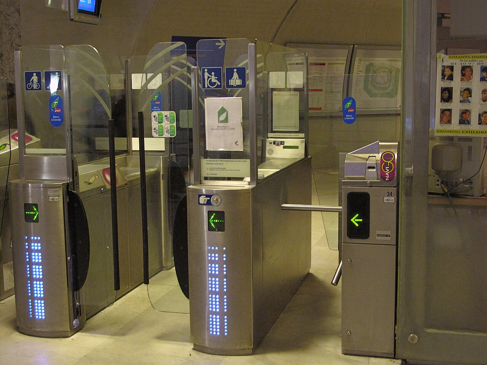

# Accessibility (WCAG)

*Use WCAG 2.2 as a testable web-accessibility standard, understand POUR and conformance levels, and combine automation with manual evaluation.*

> A station with a narrow turnstile technically has an entrance, but not everyone can use the same route.
> Digital products create the same exclusion when content cannot be perceived, controls cannot be
> operated, language cannot be understood, or markup cannot be interpreted reliably.

> **In real life**
>
> WCAG is a building code for digital access: it defines outcomes to check, not one universal floor plan.
> Passing an automated scanner is like checking doorway width from a blueprint—it helps, but a person
> still has to travel the route, find the door, operate it, and understand where it leads.

**Web Content Accessibility Guidelines (WCAG)**: WCAG 2.2 is a W3C Recommendation containing testable success criteria organized under four principles: perceivable, operable, understandable, and robust (POUR). Conformance levels A, AA, and AAA are cumulative. WCAG informs technical evaluation; applicable legal obligations depend on jurisdiction and context, so this note is not legal advice.

## Read the criterion, then test the user outcome

WCAG 2.2 is the current W3C Recommendation in this curriculum. A criterion has a level and normative
wording; Understanding documents and Techniques explain intent and examples but are informative. Common
manual checks include keyboard access and focus order, text alternatives, headings and labels, zoom and
reflow, error identification, captions, target size, and focus not being obscured. Automated tools find
some programmatically detectable failures, not overall conformance.

> **Tip**
>
> For every finding, cite the exact WCAG version, success-criterion number, level, page state, and tested
> technology. Then describe the human impact in plain language. The criterion makes it traceable; impact
> makes it understandable.

> **Common mistake**
>
> "The scanner says 100, therefore the page is WCAG compliant" is invalid. Tools cannot judge whether alt
> text is meaningful, focus order matches meaning, instructions make sense, or captions are accurate.
> Conformance also concerns complete pages and processes, not a cherry-picked component.


*Turnstile for disabled people and standard one — Tangopaso, Wikimedia Commons, public domain. [Source](https://commons.wikimedia.org/wiki/File:Turnstile_for_disabled_people_and_standard_one.jpg)*
- **A route more people can operate** — Operable design supports different bodies and input methods instead of requiring one narrow interaction.
- **Visible access symbols** — Perceivable information signals which route supports wheelchairs, strollers, and luggage; digital alternatives also need meaningful labels.
- **The narrow default gate** — A path can function for many people and still exclude others. Testing only the common path misses barriers.
- **Clear passage and controls** — Accessibility depends on the complete journey: discover the route, understand it, operate it, and receive reliable feedback.

**From WCAG criterion to defensible evidence**

1. **Choose WCAG 2.2 and the target conformance level** — Do not mix versions or imply a legal requirement without project-specific guidance.
2. **Map an important page state or process to relevant criteria** — Include errors, dialogs, authentication, and responsive states—not only the happy-path homepage.
3. **Combine automated and manual checks** — Use tools for detectable patterns; use keyboard, zoom, content review, and assistive technology for human outcomes.
4. **Report criterion plus user impact and retest** — Verify the repaired route, regression states, and the complete process.

*A small POUR evidence oracle (Python)*

```python
checks = {
    "perceivable_name": True,
    "operable_keyboard": True,
    "understandable_error": True,
    "robust_semantics": True,
}
for name, passed in checks.items():
    print(name + "=" + ("PASS" if passed else "FAIL"))
result = "PASS" if all(checks.values()) else "FAIL"
assert result == "PASS", "POUR oracle rejected accessibility evidence"
print("RESULT=" + result)
```

*A small POUR evidence oracle (Java)*

```java
import java.util.LinkedHashMap;
import java.util.Map;

public class Main {
    public static void main(String[] args) {
        Map<String, Boolean> checks = new LinkedHashMap<>();
        checks.put("perceivable_name", true);
        checks.put("operable_keyboard", true);
        checks.put("understandable_error", true);
        checks.put("robust_semantics", true);
        boolean ok = true;
        for (var entry : checks.entrySet()) {
            System.out.println(entry.getKey() + "=" + (entry.getValue() ? "PASS" : "FAIL"));
            ok &= entry.getValue();
        }
        String result = ok ? "PASS" : "FAIL";
        if (!result.equals("PASS")) throw new AssertionError("POUR oracle rejected accessibility evidence");
        System.out.println("RESULT=" + result);
    }
}
```

### Your first time: Run a compact WCAG-informed page check

- [ ] Record WCAG 2.2 and your project's target — Separate the technical target from legal interpretation; ask the responsible expert when obligations are uncertain.
- [ ] Navigate the complete task with a keyboard — Check visible focus, logical order, operability, escape, and whether focus becomes hidden or trapped.
- [ ] Zoom and inspect structure and meaning — Check reflow, labels, headings, text alternatives, instructions, and error recovery at relevant viewport states.
- [ ] Run automation, then report exact criteria and impact — Treat scanner output as leads. Reproduce each issue and add manual evidence before filing.

- **The accessibility tool reports zero violations.**
  Continue manual evaluation. Test keyboard flow, meaningful names, focus behavior, zoom/reflow, content clarity, media alternatives, and representative assistive technology.
- **A finding cites only 'fails WCAG'.**
  Add WCAG version, success-criterion number and level, exact state, reproduction, affected interaction, and user impact.
- **The team debates whether WCAG automatically settles a legal question.**
  Keep the technical evidence and legal interpretation separate. Document the criterion and seek jurisdiction-specific professional guidance.

### Where to check

- W3C WCAG 2.2 normative success criteria and the official Quick Reference.
- Keyboard order, focus appearance, dialogs, menus, forms, errors, and authentication flows.
- Browser accessibility tree and [[non-functional-testing-intro/usability-and-accessibility/assistive-tech]].
- Automated results from axe or Lighthouse, manually reproduced before filing.

### Worked example: keyboard focus hidden behind a sticky footer

1. At 200% zoom, a keyboard user tabs to the checkout button.
2. The button receives focus but a sticky cookie footer completely covers it.
3. The tester records viewport, zoom, key sequence, screenshot, and WCAG 2.2 SC 2.4.11 Focus Not
   Obscured (Minimum), level AA, plus the inability to see the active control.
4. The footer is repositioned; the entire checkout flow is retested with keyboard and zoom.

**Quiz.** What does a clean automated accessibility scan prove?

- [ ] The page fully conforms to WCAG 2.2
- [x] No tested programmatic rule found a violation in that scanned state
- [ ] The product meets every applicable law
- [ ] Assistive-technology users can complete every task

*Automation covers a useful but limited set of detectable patterns in the scanned state. Manual evaluation, complete processes, and human judgment remain necessary.*

- **POUR** — Perceivable, Operable, Understandable, Robust.
- **A / AA / AAA** — Cumulative conformance levels attached to success criteria; the target must be explicitly stated.
- **Automation limit** — Tools detect some patterns; they cannot establish overall conformance or meaningful human outcomes.

### Challenge

Choose one critical flow and find one check under each POUR principle. Cite exact WCAG 2.2 criteria where
applicable, record what automation can and cannot assess, and retest the entire route after repair.

- [W3C — Web Content Accessibility Guidelines (WCAG) 2.2](https://www.w3.org/TR/WCAG22/)
- [W3C WAI — How to Meet WCAG 2.2 Quick Reference](https://www.w3.org/WAI/WCAG22/quickref/)
- [W3C WAI — Introduction to Web Accessibility and W3C Standards](https://www.youtube.com/watch?v=20SHvU2PKsM)

🎬 [Introduction to Web Accessibility and W3C Standards](https://www.youtube.com/watch?v=20SHvU2PKsM) (4 min)

- WCAG 2.2 organizes testable success criteria under POUR and cumulative A, AA, and AAA levels.
- Cite exact criteria and describe user impact; do not reduce findings to a scanner badge.
- Automated checks and manual evaluation are complementary, and complete processes matter.
- Technical WCAG evidence does not by itself guarantee legal compliance in every jurisdiction.


## Related notes

- [[Notes/non-functional-testing-intro/usability-and-accessibility/assistive-tech|Assistive tech]]
- [[Notes/non-functional-testing-intro/usability-and-accessibility/usability-testing|Usability testing]]
- [[Notes/testers-toolbox/accessibility-and-quality/axe-devtools|axe DevTools]]


---
_Source: `packages/curriculum/content/notes/non-functional-testing-intro/usability-and-accessibility/accessibility-wcag.mdx`_
