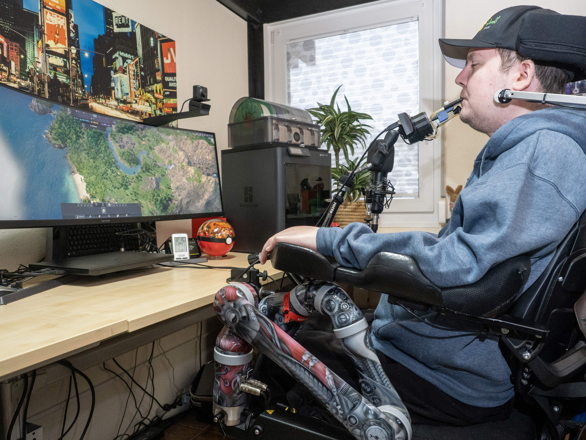

# Assistive tech

*Test the semantic contract that browsers expose to screen readers, switch controls, voice input, magnifiers, and other assistive technologies.*

> The same game can be played with hands, voice, eye movement, switches, or a mouth-operated controller—
> if the software exposes stable actions and meaningful state. A screen full of custom painted controls
> may look obvious while presenting assistive technology with an empty, silent interface.

> **In real life**
>
> Assistive technology is an interpreter at a live event. It needs a structured message: who is speaking,
> what role they have, what changed, and what action is available. If the application sends only pixels
> and vague labels, the interpreter cannot invent the missing meaning.

**Assistive technology**: Assistive technology is hardware or software that helps a person interact with digital content, including screen readers, refreshable Braille displays, magnifiers, voice input, switch controls, alternative pointers, captions, and customized input devices. Users combine tools, browsers, settings, and strategies in many ways, so no single setup represents everyone.

## Test the accessibility API contract

Browsers transform native HTML and valid ARIA into an accessibility tree containing roles, names,
states, relationships, and actions. A tester checks that a control has the right role and accessible
name, keyboard behavior, focus management, and state announcements. Native elements usually provide
more of this contract than a scripted `div`; ARIA can supplement semantics but does not add behavior by
itself.

> **Tip**
>
> Build a small, documented matrix: one supported browser and screen reader, keyboard-only, zoom or
> magnification, and the input modes relevant to your audience. Test critical journeys consistently and
> add representative user evaluation when possible.

> **Common mistake**
>
> Do not switch on a screen reader, hear words, and declare success. Verify navigation, control names,
> roles, state changes, focus placement, error recovery, and task completion. Also avoid assuming your
> brief simulation equals the lived experience of an expert user.


*Person Using Quadstick 20 — InclusiveGameLab, Wikimedia Commons, CC BY-SA 4.0. [Source](https://commons.wikimedia.org/wiki/File:Person_Using_Quadstick_20.jpg)*
- **Mouth-operated input** — Alternative hardware can map sip, puff, and movement to standard actions when the interface exposes operable controls.
- **The same application** — The product should preserve task meaning and feedback across input modes rather than requiring a specific physical gesture.
- **Mounted control system** — Real setups combine hardware, operating-system configuration, browser, and application. Record the complete matrix when reproducing issues.
- **Keyboard remains available** — Standard keyboard operability is a foundation for switches and other mapped input, but it is not the only accessibility check.

**How visible UI becomes an assistive-technology interaction**

1. **HTML and ARIA describe role, name, state, and relationships** — Native semantics provide a strong default contract; invalid or excessive ARIA can corrupt it.
2. **The browser builds an accessibility tree** — Inspect the tree to see the information exposed beyond pixels.
3. **Assistive technology presents and operates that contract** — A screen reader speaks it; a switch or voice tool invokes supported actions.
4. **The tester completes a real task and verifies changes** — Names alone are insufficient—focus, state, errors, and recovery must work through the journey.

*An accessible-control contract oracle (Python)*

```python
checks = {
    "role_button": True,
    "name_save_changes": True,
    "keyboard_operable": True,
    "state_announced": True,
}
for name, passed in checks.items():
    print(name + "=" + ("PASS" if passed else "FAIL"))
result = "PASS" if all(checks.values()) else "FAIL"
assert result == "PASS", "assistive-tech contract rejected"
print("RESULT=" + result)
```

*An accessible-control contract oracle (Java)*

```java
import java.util.LinkedHashMap;
import java.util.Map;

public class Main {
    public static void main(String[] args) {
        Map<String, Boolean> checks = new LinkedHashMap<>();
        checks.put("role_button", true);
        checks.put("name_save_changes", true);
        checks.put("keyboard_operable", true);
        checks.put("state_announced", true);
        boolean ok = true;
        for (var entry : checks.entrySet()) {
            System.out.println(entry.getKey() + "=" + (entry.getValue() ? "PASS" : "FAIL"));
            ok &= entry.getValue();
        }
        String result = ok ? "PASS" : "FAIL";
        if (!result.equals("PASS")) throw new AssertionError("assistive-tech contract rejected");
        System.out.println("RESULT=" + result);
    }
}
```

### Your first time: Complete one form with keyboard and a screen reader

- [ ] Record the supported browser, assistive technology, OS, and versions — Compatibility varies across combinations; a reproducible finding names the whole setup.
- [ ] Learn the tool's basic navigation commands — Use official documentation and avoid treating novice operation mistakes as product defects.
- [ ] Complete a critical form without the mouse — Verify names, roles, focus order, instructions, errors, state changes, and recovery—not only speech output.
- [ ] Inspect the accessibility tree and retest after repair — Confirm the semantic cause and then repeat the complete user task.

- **A custom button is visible but skipped by keyboard and screen reader.**
  Prefer a native button. If a custom widget is unavoidable, implement correct role, accessible name, focusability, keyboard behavior, states, and focus styling.
- **A success toast appears visually but is never announced.**
  Expose the status through an appropriate live region or status role, avoid stealing focus, and verify one announcement in the supported matrix.
- **The issue happens only in one browser and screen-reader pair.**
  Record the complete matrix and compare supported combinations. Do not erase the finding or generalize it to every tool without evidence.

### Where to check

- Browser accessibility tree for roles, names, states, and relationships.
- Keyboard and focus behavior across the full task.
- Official tool commands and supported browser combinations.
- W3C ARIA Authoring Practices for expected widget interaction patterns.

### Worked example: the silent save

1. A profile form's custom "Save" element works by mouse and updates a green message.
2. Keyboard focus skips the element; the accessibility tree exposes no button role; the success text
   is inserted silently.
3. The team replaces it with a native button and exposes the result as a status message.
4. Keyboard, screen reader, error path, and repeated saves are retested in the supported matrix.

**Quiz.** What is the strongest assistive-technology test result?

- [ ] The screen reader spoke some text
- [ ] The accessibility scanner returned a high score
- [x] A critical task completed with correct names, roles, focus, state announcements, and recovery in a documented setup
- [ ] The UI looked unchanged

*Task completion plus the semantic and interaction contract provides evidence. Speech alone or a score can hide broken focus, behavior, and recovery.*

- **Accessibility tree** — The browser's semantic representation of roles, names, states, relationships, and actions.
- **ARIA limit** — ARIA can describe semantics; it does not automatically add keyboard behavior, focus management, or visual design.
- **Matrix evidence** — Record AT, browser, OS, versions, settings, task, and result; one combination does not represent every user.

### Challenge

Inspect one custom control in the accessibility tree, then operate it by keyboard and one supported
assistive technology. Compare its role, name, state, focus, and behavior with a native equivalent.

- [W3C WAI — Tools and Techniques Used by People with Disabilities](https://www.w3.org/WAI/people-use-web/tools-techniques/)
- [W3C WAI — ARIA Authoring Practices Guide](https://www.w3.org/WAI/ARIA/apg/)
- [UCSF — Screen Reader Demo for Digital Accessibility](https://www.youtube.com/watch?v=dEbl5jvLKGQ)

🎬 [Screen Reader Demo for Digital Accessibility](https://www.youtube.com/watch?v=dEbl5jvLKGQ) (5 min)

- Assistive technology relies on a semantic and behavioral contract, not visual appearance alone.
- Test complete tasks: names, roles, states, focus, operation, feedback, errors, and recovery.
- Native HTML usually supplies stronger defaults; ARIA does not create behavior by itself.
- Document the full AT-browser-OS matrix and avoid claiming one setup represents every user.


## Related notes

- [[Notes/non-functional-testing-intro/usability-and-accessibility/accessibility-wcag|Accessibility (WCAG)]]
- [[Notes/non-functional-testing-intro/usability-and-accessibility/usability-testing|Usability testing]]
- [[Notes/the-web-platform-for-testers/html-essentials/why-semantics-matter|Why semantics matter]]


---
_Source: `packages/curriculum/content/notes/non-functional-testing-intro/usability-and-accessibility/assistive-tech.mdx`_
