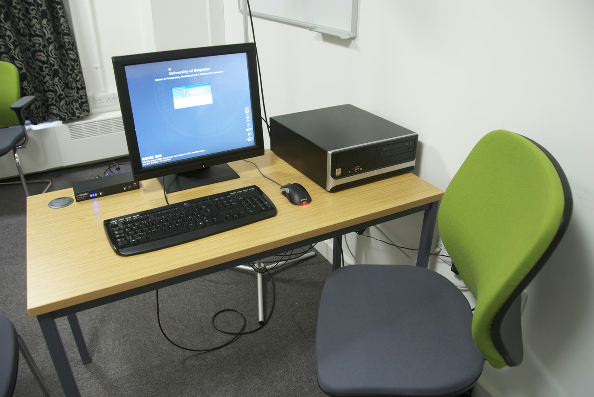

# Usability testing

*Learn to observe representative users attempting realistic tasks, turn behavior into evidence, and separate usability friction from opinion.*

> A door can be perfectly built and still fool everyone into pushing when it must be pulled. Functional
> testing proves the hinge, latch, and lock work; usability testing watches whether a person can get
> through without instructions. The failure lives between a correct mechanism and a human expectation.

> **In real life**
>
> Usability testing is a driving lesson, not a vehicle inspection. The facilitator gives a destination,
> then watches the driver choose a route. Grabbing the wheel, teaching the route, or asking only whether
> the driver "likes the car" destroys the evidence you came to collect.

**Usability testing**: Usability testing is an observational evaluation in which representative participants attempt realistic tasks while a team records effectiveness, efficiency, errors, and signs of confusion. It studies use in context; it does not guarantee that every user or situation has been covered.

## Watch behavior, not agreement

A useful session starts with a neutral task such as "Find a waterproof jacket and arrange delivery to
your home." It does not say "Use Filters, choose Waterproof, and press Checkout." Record whether the
participant finishes, where they hesitate, the path they take, errors and recoveries, and relevant
comments. A post-session opinion adds context, but observed behavior is stronger evidence than a polite
"that was easy."

> **Tip**
>
> Ask the participant to think aloud, then tolerate silence. Use neutral prompts such as "What are you
> looking for?" Avoid "Did you see the blue button?" because it reveals the answer and converts a finding
> into a coached success.

> **Common mistake**
>
> Do not recruit only teammates who know the product. Familiarity hides terminology, navigation, and
> onboarding problems. Match participants to the intended audience and document the sample and scenario;
> small studies reveal friction, but their counts are not population-wide guarantees.


*University of Brighton usability lab — Yandle, Wikimedia Commons, CC BY 2.0. [Source](https://commons.wikimedia.org/wiki/File:Brighton_Uni_Usability_Lab_-_3231959554.png)*
- **The product under test** — The participant sees the real interface or prototype; the team tests a realistic journey rather than isolated controls.
- **The participant's seat** — Recruit for the target audience. Prior product knowledge can erase the very friction the session should reveal.
- **Keyboard and mouse** — Observe actions, errors, hesitation, and recovery. Behavior is the evidence; a satisfaction rating is supporting context.
- **Observation equipment** — Capture notes consistently, with consent and appropriate data handling, so the team can compare sessions without relying on memory.

**A neutral usability session**

1. **Recruit a representative participant** — State the audience and screening criteria; convenience alone can bias the result.
2. **Give a realistic goal, not click instructions** — The task preserves room for the participant to reveal their mental model.
3. **Observe completion, path, errors, and hesitation** — Use neutral prompts and do not rescue the participant too quickly.
4. **Cluster evidence and prioritize the blocked journeys** — Report what happened, under which conditions, and the user impact; avoid universal claims from a small sample.

*A failure-sensitive usability-session oracle (Python)*

```python
checks = {
    "neutral_task": True,
    "representative_participant": True,
    "completed_without_coaching": True,
    "evidence_recorded": True,
}

for name, passed in checks.items():
    print(name + "=" + ("PASS" if passed else "FAIL"))

result = "PASS" if all(checks.values()) else "FAIL"
assert result == "PASS", "session oracle rejected usability evidence"
print("RESULT=" + result)
```

*A failure-sensitive usability-session oracle (Java)*

```java
import java.util.LinkedHashMap;
import java.util.Map;

public class Main {
    public static void main(String[] args) {
        Map<String, Boolean> checks = new LinkedHashMap<>();
        checks.put("neutral_task", true);
        checks.put("representative_participant", true);
        checks.put("completed_without_coaching", true);
        checks.put("evidence_recorded", true);

        boolean ok = true;
        for (var entry : checks.entrySet()) {
            System.out.println(entry.getKey() + "=" + (entry.getValue() ? "PASS" : "FAIL"));
            ok &= entry.getValue();
        }
        String result = ok ? "PASS" : "FAIL";
        if (!result.equals("PASS")) throw new AssertionError("session oracle rejected usability evidence");
        System.out.println("RESULT=" + result);
    }
}
```

### Your first time: Run a 20-minute hallway study without contaminating it

- [ ] Choose one important journey and define success — Write the end state, allowed starting state, and evidence to capture before meeting a participant.
- [ ] Recruit someone close to the intended audience — Record relevant experience and avoid someone who helped build the feature.
- [ ] Read a neutral task and ask for think-aloud — Explain that the product, not the participant, is being tested; ask permission before recording.
- [ ] Observe, debrief, and write one evidence-based finding — Include task, behavior, condition, impact, and a short clip or timestamp only when consent and policy allow it.

- **Every participant succeeds after the facilitator points at the control.**
  Count that as coached, not unassisted success. Rewrite prompts to be neutral and let the participant attempt recovery before intervening.
- **Participants say the page is easy but repeatedly backtrack.**
  Report the observed backtracking and time-on-task, then use the rating as context. Politeness and recall can disagree with behavior.
- **One participant struggles and the team calls the design unusable for everyone.**
  State the exact observation and sample. Look for repeated patterns and high-impact blockers; do not turn a small qualitative sample into a population estimate.

### Where to check

- Session plan: target audience, scenario, neutral tasks, success criteria, and consent.
- Notes or recordings: actions, errors, hesitation, recovery, quotes, and timestamps.
- Analytics or support evidence: whether the observed friction appears in broader product signals.
- [[non-functional-testing-intro/usability-and-accessibility/ux-heuristics]] for an expert inspection that complements participant sessions.

### Worked example: checkout succeeds functionally and fails humanly

1. The team verifies every checkout API response and button transition.
2. Three first-time shoppers are asked to buy an item for home delivery. Two abandon the address step
   because "Continue" is below an optional company panel; the facilitator does not point it out.
3. The finding states the task, viewport, observed path, two blocked sessions, and impact. It does not
   claim that two-thirds of all customers will abandon.
4. The team collapses the optional panel and keeps the primary action beside required fields. A repeat
   session completes without coaching, and analytics are monitored for broader confirmation.

**Quiz.** Which facilitator prompt preserves the strongest usability evidence?

- [ ] Click the blue Filters button to continue
- [ ] Did you notice the delivery selector?
- [x] What are you looking for now?
- [ ] Let me show you the intended path

*The neutral prompt invites the participant to explain their current goal without revealing a control or route. The others coach the task and erase evidence about findability.*

- **Task wording** — Describe a realistic goal, not the controls or clicks needed to reach it.
- **Primary evidence** — Completion, path, errors, hesitation, and recovery observed under documented conditions.
- **Small-sample caution** — Qualitative sessions reveal mechanisms and friction; their counts are not automatic population estimates.

### Challenge

Rewrite one click-by-click test as a neutral user goal. Run it with one representative person, record
where you wanted to help, and turn the strongest uncoached observation into a finding with conditions.

- [W3C WAI — Involving Users in Web Accessibility](https://www.w3.org/WAI/test-evaluate/involving-users/)
- [Nielsen Norman Group — Usability Testing 101](https://www.nngroup.com/articles/usability-testing-101/)
- [NNgroup — Introducing a Participant to a Usability Test: A Demonstration](https://www.youtube.com/watch?v=bcfqmx2hnUQ)

🎬 [Introducing a Participant to a Usability Test: A Demonstration](https://www.youtube.com/watch?v=bcfqmx2hnUQ) (4 min)

- Test realistic goals with representative participants; do not encode the intended route in the task.
- Observed behavior is primary evidence, while opinions and ratings add context.
- Neutral facilitation protects the evidence; coaching creates false success.
- Document audience, conditions, sample, and limits instead of making population-wide guarantees.


## Related notes

- [[Notes/non-functional-testing-intro/usability-and-accessibility/ux-heuristics|UX heuristics]]
- [[Notes/non-functional-testing-intro/usability-and-accessibility/accessibility-wcag|Accessibility (WCAG)]]
- [[Notes/ui-ux-design-qa/design-qa-in-practice/design-bugs-devs-respect|Design bugs devs respect]]


---
_Source: `packages/curriculum/content/notes/non-functional-testing-intro/usability-and-accessibility/usability-testing.mdx`_
