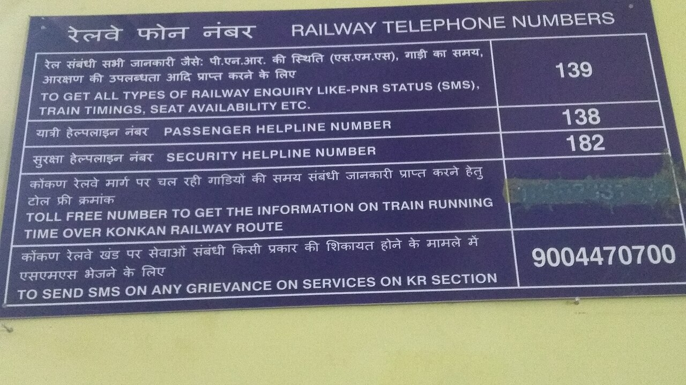

# Eventual consistency bugs

*Reproduce stale reads, define convergence deadlines, protect session guarantees, and test conflict handling without flaky sleeps.*

> A user saves a delivery address, sees “updated,” then the next page shows the old address. Refreshing
> eventually fixes it. The database converged exactly as designed; the user journey still broke.

> **In real life**
>
> A railway office replaces its phone-number noticeboard, then sends copies to branch stations. For a
> while, headquarters shows version 2 while one branch still shows version 1. “All boards will match
> eventually” is useful only when the team also knows the deadline and what a traveler sees meanwhile.

**eventual consistency**: Eventual consistency permits replicas to return different committed versions temporarily, while promising that they converge when updates stop and propagation succeeds. It does not by itself specify a maximum convergence time, read-your-writes behavior, monotonic reads, or conflict resolution.

## Turn “eventually” into a user-visible contract

A convergence window begins when a write is accepted and ends when every required read path returns
the accepted version. During that window, a replica, index, cache, or regional projection may return a
stale value. A test should identify the source version, observed version, read route, and elapsed time.

Session guarantees narrow the surprise. **Read-your-writes** means a session can read its own accepted
update. **Monotonic reads** mean that after a session observes version 2, a later read will not fall back
to version 1. Systems may provide these through causal sessions, sticky routing, version tokens, or a
stronger read mode; they are not automatic consequences of eventual convergence.

Concurrent writes add a separate problem. Last-write-wins, version vectors, merge functions, CRDTs,
or explicit conflicts preserve different kinds of intent. Test the documented resolver and the product
workflow for rejected or merged intent rather than accepting any common final value.

> **Tip**
>
> Poll an observable version with a bounded deadline and a short controlled interval. Capture every
> attempt. The assertion should say “version 2 was absent after 5 seconds,” not “sleep 5 and hope.”

> **Common mistake**
>
> Retrying until the stale read disappears without first asserting it. That turns a reproducible
> read-after-write bug into a passing test and loses the route, version, and convergence-time evidence.


*Railway station in Goa, India, notice board — Fredericknoronha, CC BY-SA 4.0. [Source](https://commons.wikimedia.org/wiki/File:Railway_station_in_Goa,_India,_notice_board.jpg)*
- **Board identity** — The railway telephone heading identifies the projection being read; tests should name the exact replica, region, index, or cache path.
- **Enquiry version** — The visible 139 entry is a concrete value. Compare versioned content, not merely a successful response.
- **Passenger number** — A branch may still display an older value after headquarters accepts an update, producing a stale read.
- **Security number** — Once a session has seen the newer board, monotonic reads prevent a later route from showing an older edition.
- **Grievance contact** — Conflict handling needs a visible path when two offices change the same notice before their copies synchronize.

**Test a bounded convergence window**

1. **Read baseline** — Record version 1 through every relevant read route.
2. **Write version 2** — Capture acknowledgment, source version, session token, and request ID.
3. **Read immediately** — Route deliberately to the lagging projection and surface version 1 as a stale-read assertion.
4. **Poll by version** — Retry with a monotonic clock until version 2 appears or the deadline expires.
5. **Check session guarantees** — Prove read-your-writes and ensure later reads never regress to an older version.
6. **Resolve conflicts** — Issue concurrent updates and assert the documented winner, merge, rejection, or conflict record.

*Run it — stale read then deterministic convergence (Python)*

```python
``source_version = 1
replica_version = 1

source_version = 2
print("WRITE source version=2 status=ACCEPTED")

stale_detected = replica_version < source_version
print(f"STALE_READ {'DETECTED' if stale_detected else 'MISSED'} replica=1 expected=2")

for attempt in range(1, 4):
    if attempt == 2:
        replica_version = source_version
        print("REPLICATION advanced version=2")
    if replica_version == source_version:
        print(f"CONVERGED attempt={attempt} replica=2")
        break

converged = replica_version == source_version
print(f"RESULT stale_detected={str(stale_detected).lower()} converged={str(converged).lower()}")

assert stale_detected and converged``
```

*Run it — stale read then deterministic convergence (Java)*

```java
``public class Main {
    public static void main(String[] args) {
        int sourceVersion = 1;
        int replicaVersion = 1;

        sourceVersion = 2;
        System.out.println("WRITE source version=2 status=ACCEPTED");

        boolean staleDetected = replicaVersion < sourceVersion;
        System.out.println("STALE_READ " + (staleDetected ? "DETECTED" : "MISSED") + " replica=1 expected=2");

        for (int attempt = 1; attempt <= 3; attempt++) {
            if (attempt == 2) {
                replicaVersion = sourceVersion;
                System.out.println("REPLICATION advanced version=2");
            }
            if (replicaVersion == sourceVersion) {
                System.out.println("CONVERGED attempt=" + attempt + " replica=2");
                break;
            }
        }

        boolean converged = replicaVersion == sourceVersion;
        System.out.println("RESULT stale_detected=" + staleDetected + " converged=" + converged);

        if (!(staleDetected && converged)) throw new AssertionError();
    }
}``
```

### Your first time: Your mission: specify one read-after-write journey

- [ ] Expose a version — Use an entity revision, event offset, update token, or test-only marker rather than comparing ambiguous display text.
- [ ] Name each route — Record whether reads use source, replica, search index, cache, or another region.
- [ ] Set the deadline — Derive a maximum convergence window from the product promise and use a monotonic timer.
- [ ] Protect the session — After observing version 2, assert that the same user never sees version 1 again.

You now have a bounded consistency contract instead of a sleep.

- **A save succeeds, but the confirmation page shows the old value.**
  Use read-your-writes routing or a version/session token, then verify every post-write read path.
- **Polling passes locally and times out under load.**
  Measure propagation percentiles, queue depth, throttling, replica lag, and the full read path against a fixed deadline.
- **A user sees version 2 and later version 1.**
  Test monotonic reads; inspect load-balancer routing, causal/session configuration, and caches serving older versions.
- **Two accepted edits converge by silently losing one user's intent.**
  Inspect conflict metadata and resolver rules; assert merge, rejection, compensation, or a visible conflict workflow.

### Where to check

- **Write acknowledgment** — accepted version, durability or write concern, region, request ID, and session token.
- **Read routing** — replica identity, consistency option, cache result, and index or projection offset.
- **Propagation telemetry** — replication lag, queue depth, event offset, retry count, and dead letters.
- **Version history** — source and observed revisions, logical timestamps, conflict siblings, and resolver decision.
- **User journey traces** — whether one session moved between routes or regressed after seeing a newer version.

### Worked example: delivery tracking that moved backward

1. The carrier writes version 42, changing a parcel from “label created” to “collected.”
2. The mobile API acknowledges the update, then reads from a regional projection still at version 41.
3. The customer sees “label created,” refreshes, sees “collected,” then another replica sends the journey backward again.
4. A bounded poll proves all required projections reach version 42 within the objective.
5. A session token additionally prevents read regression, while a concurrent correction test proves the conflict rule.

**Quiz.** What does eventual consistency guarantee by itself?

- [ ] Every read immediately reflects the latest accepted write
- [ ] A session always reads its own writes
- [x] Replicas converge if updates stop and propagation succeeds, without necessarily promising a deadline or session behavior
- [ ] Concurrent writes are always merged without lost intent

*Eventual convergence is weaker than immediate freshness, bounded convergence, read-your-writes, monotonic reads, or a particular conflict-resolution policy.*

- **Convergence window** — Time between an accepted write and all required read paths returning its version.
- **Stale read** — A read that returns an older committed version than the required freshness contract allows.
- **Read-your-writes** — A session's reads reflect writes that the same session previously completed.
- **Monotonic reads** — Once a session observes a version, later reads do not return an earlier state.
- **Conflict handling** — The documented winner, merge, rejection, sibling exposure, or compensation for concurrent updates.

### Challenge

Adapt the playground to a real asynchronous projection. Write a unique version, deliberately read the
lagging path, then poll with a bounded deadline. Add assertions for read-your-writes, no version
regression, exact attempt evidence, and two concurrent updates with a documented conflict outcome.

### Ask the community

> After write version [n] is acknowledged on [source], read route [replica/index/cache] returns version [m]. It converges after [time/never], and session [id] does/does not regress. Which guarantee or conflict check is missing?

Share sanitized versions, routes, consistency settings, deadlines, and resolver rules; omit customer data.

- [Amazon DynamoDB — Read consistency](https://docs.aws.amazon.com/amazondynamodb/latest/developerguide/HowItWorks.ReadConsistency.html)
- [MongoDB Manual — Read isolation, consistency, and recency](https://www.mongodb.com/docs/manual/core/read-isolation-consistency-recency/)
- [MongoDB Manual — Replication and secondary reads](https://www.mongodb.com/docs/manual/replication/)
- [Apache CouchDB — Replication conflicts](https://docs.couchdb.org/en/stable/replication/conflicts.html)

🎬 [Distributed Systems 7.3: Eventual consistency — Martin Kleppmann](https://www.youtube.com/watch?v=9uCP3qHNbWw) (15 min)

- Eventual convergence does not automatically bound delay or protect a user's session.
- Expose versions and routes so stale reads are observable and reproducible.
- Use deadline-bounded polling rather than fixed sleeps or unlimited retries.
- Test read-your-writes and monotonic reads as explicit guarantees.
- A common final value is incomplete evidence when concurrent updates can lose user intent.


## Related notes

- [[Notes/nosql-and-modern-data/the-nosql-landscape/cap-theorem-in-plain-words|CAP theorem in plain words]]
- [[Notes/nosql-and-modern-data/distributed-data-gently/replication-and-sharding|Replication & sharding]]


---
_Source: `packages/curriculum/content/notes/nosql-and-modern-data/distributed-data-gently/eventual-consistency-bugs.mdx`_
