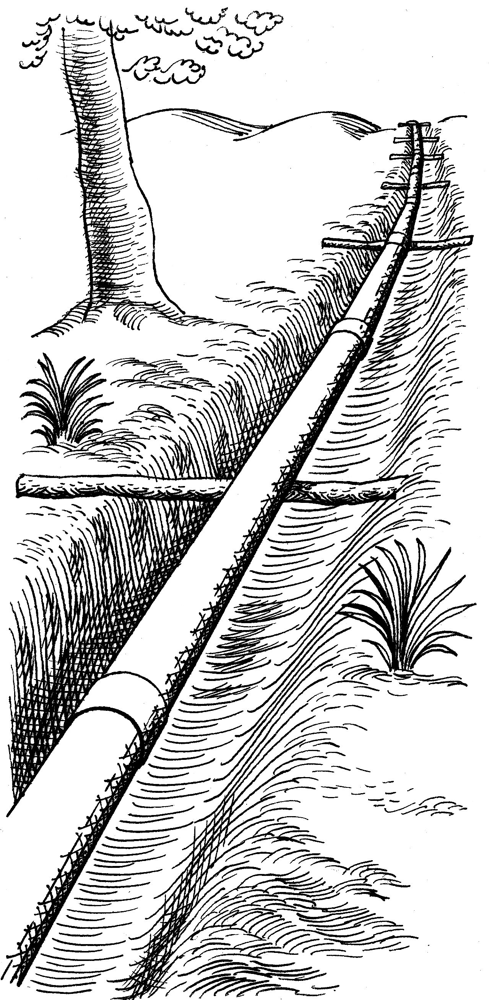

# Aggregation pipeline, gently

*Build and test MongoDB aggregation one observable stage at a time, from selective matching through grouping, reshaping, sorting, and joins.*

> A final dashboard total can be wrong even when its `$group` formula is perfect. One earlier `$unwind`
> may have multiplied rows, one `$match` may have dropped missing values, or one `$lookup` may have joined
> duplicates. The pipeline is testable because every stage has an observable input and output.

> **In real life**
>
> Water entering a pipeline passes gates, branches, meters, and outlets. Inspect only the final bucket and
> you cannot tell which stage lost, duplicated, or redirected the flow.

**aggregation pipeline**: A MongoDB aggregation pipeline is an ordered array of stages that transform a stream of documents. Stages such as $match, $unwind, $group, $project, $sort, and $lookup can filter, multiply, combine, reshape, or reorder documents before returning results.

## Learn six stages first

- `$match` filters documents; place selective, index-supported filters early when possible.
- `$project` selects or computes output fields.
- `$unwind` emits one document per array element and can multiply the stream.
- `$group` collects documents by a key and applies accumulators such as `$sum` or `$avg`.
- `$sort` orders results and may require memory or an index.
- `$lookup` brings matching documents from another collection and can create arrays or fan-out.

Most aggregation pipelines do not modify source data. `$out` and `$merge` are important exceptions and
deserve explicit destructive-write review. Optimization can reorder work internally, so use `explain`
for execution evidence rather than assuming written order equals physical work.

> **Tip**
>
> Develop with stage checkpoints: run the first stage, then the first two, recording count, key set, and
> one representative document. The first unexpected delta locates the bug.

> **Common mistake**
>
> Grouping money with binary floating-point and comparing rounded display values. Preserve an appropriate
> numeric type and define when rounding occurs in the business contract.


*Pipeline (PSF) — Pearson Scott Foresman, public domain. [Source](https://commons.wikimedia.org/wiki/File:Pipeline_(PSF).png)*
- **$match inlet** — Restrict the stream with exact business and tenant conditions before expensive transformations.
- **$unwind expansion** — One input can become many outputs; measure cardinality before grouping.
- **$group meter** — Accumulators depend on the exact stream produced by every earlier stage.
- **$project outlet** — Shape the final contract and verify required identifiers and numeric types remain.

**Debug an aggregation by stage**

1. **Freeze representative input** — Include missing, null, empty-array, duplicate-join, and boundary-value documents.
2. **Run $match** — Assert surviving identifiers and count, including tenant boundaries.
3. **Run expansion stages** — After $unwind or $lookup, assert expected cardinality and preserved empties.
4. **Run $group** — Compare group keys, counts, sums, and numeric types with an independent oracle.
5. **Shape and order** — Verify projection, field names, sort ties, and limit behavior.
6. **Inspect explain** — Check index use, scanned volume, blocking stages, spills, and production-shaped performance.

*Run it — stage-by-stage order totals (Python)*

```python
``orders = [
    {"tenant":"A", "status":"paid", "lines":[10, 5]},
    {"tenant":"A", "status":"open", "lines":[100]},
    {"tenant":"B", "status":"paid", "lines":[7]},
]
matched = [o for o in orders if o["tenant"] == "A" and o["status"] == "paid"]
unwound = [price for o in matched for price in o["lines"]]
total = sum(unwound)
print("matched", len(matched), "line rows", len(unwound), "total", total)
assert (len(matched), len(unwound), total) == (1, 2, 15)``
```

*Run it — stage-by-stage order totals (Java)*

```java
``import java.util.*;

public class Main {
    record Order(String tenant, String status, List<Integer> lines) {}
    public static void main(String[] args) {
        var orders = List.of(new Order("A","paid",List.of(10,5)), new Order("A","open",List.of(100)), new Order("B","paid",List.of(7)));
        var matched = orders.stream().filter(o -> o.tenant().equals("A") && o.status().equals("paid")).toList();
        var lines = matched.stream().flatMap(o -> o.lines().stream()).toList();
        int total = lines.stream().mapToInt(Integer::intValue).sum();
        System.out.println("matched " + matched.size() + " line rows " + lines.size() + " total " + total);
        if (matched.size()!=1 || lines.size()!=2 || total!=15) throw new AssertionError();
    }
}``
```

### Your first time: Your mission: test one pipeline in checkpoints

- [ ] Create adversarial input — Include empty and missing arrays, duplicate lookup keys, null group key, and a tenant neighbor.
- [ ] Record identifiers after $match — Counts alone can hide one missing and one extra document.
- [ ] Record cardinality after expansion — Explain every multiplication or disappearance after $unwind and $lookup.
- [ ] Build an independent oracle — Calculate the final groups with simple trusted code or SQL, not a copy of the pipeline.

You now know which stage establishes each final claim.

- **Totals are exact multiples of the expected value.**
  Inspect fan-out from $unwind or $lookup and whether joined keys are unique.
- **Documents with empty arrays disappear.**
  Review $unwind preserveNullAndEmptyArrays and the intended business rule.
- **A pipeline is correct but slow.**
  Use explain; move selective $match early, verify indexes, and inspect blocking sorts/groups or disk spills.
- **Output order changes between runs.**
  Add an explicit deterministic $sort with a unique tie-breaker before limit or pagination.

### Where to check

- **Per-stage preview and count** — identify the first unexpected transformation.
- **Identifier sets** — counts can balance while the wrong documents pass.
- **Explain output** — inspect indexes, examined documents, memory, and spills.
- **Join-key uniqueness** — `$lookup` fan-out may be valid or accidental.
- **Numeric BSON types and rounding** — aggregation can promote or coerce values.

### Worked example: a revenue report doubled by a lookup

1. Orders join a promotions collection on `code` before revenue is grouped.
2. Promotions accidentally contains two active documents with the same code.
3. `$lookup` returns two matches, `$unwind` duplicates each order, and `$sum` doubles revenue.
4. Stage tests catch the cardinality jump before grouping.
5. The team enforces promotion-key uniqueness and keeps a fan-out assertion in the report test.

**Quiz.** After adding $unwind, 100 input documents become 260. What should you check first?

- [ ] Whether MongoDB randomly duplicated data
- [x] Array cardinality and the stage's empty/null preservation behavior
- [ ] Only the final $sort order
- [ ] Whether _id indexes are unique

*$unwind emits one output per array element and may drop empty or missing arrays depending on options. Its cardinality is the first evidence to inspect.*

- **$match** — Filters the document stream; verify identifiers, types, tenant scope, and index support.
- **$unwind** — Emits one document per array element and changes cardinality.
- **$group** — Groups by a key and applies accumulators to the exact incoming stream.
- **$lookup** — Joins another collection into an array and can introduce fan-out.
- **Write-capable stages** — $out and $merge can modify collections; most other aggregation pipelines return results only.

### Challenge

Create a pipeline for paid revenue by tenant with line arrays and promotion lookup. Add fixtures for
empty lines, duplicate promotion keys, null amount, wrong tenant, equal-sort ties, and decimal rounding.

### Ask the community

> Pipeline cardinality changes [a→b] at stage [stage]. Input edge case is [shape], expected rule is [rule], and explain shows [evidence]. Is this stage behaving correctly?

Share a minimal pipeline and synthetic documents, not production records.

- [MongoDB Manual — Aggregation pipeline](https://www.mongodb.com/docs/manual/core/aggregation-pipeline/)
- [MongoDB Manual — Aggregation stages](https://www.mongodb.com/docs/current/reference/operator/aggregation-pipeline/)
- [MongoDB Manual — Pipeline optimization](https://www.mongodb.com/docs/v8.0/core/aggregation-pipeline-optimization/)

🎬 [Master MongoDB Aggregation Pipeline — MongoDB](https://www.youtube.com/watch?v=acvyf-Im-NU) (5 min)

- Treat every aggregation stage as an observable transformation.
- $unwind and $lookup commonly change cardinality before totals are computed.
- Assert identifier sets and per-stage counts, not final values alone.
- Use an independent oracle and explicit deterministic sorting.
- Explain output connects logical correctness with production performance.


## Related notes

- [[Notes/nosql-and-modern-data/mongodb-hands-on/crud-and-query-operators|CRUD & query operators]]
- [[Notes/nosql-and-modern-data/mongodb-hands-on/embedding-vs-referencing|Embedding vs referencing]]
- [[Notes/relational-databases-engineer-level/sql-mastery/window-functions|Window functions]]


---
_Source: `packages/curriculum/content/notes/nosql-and-modern-data/mongodb-hands-on/aggregation-pipeline-gently.mdx`_
