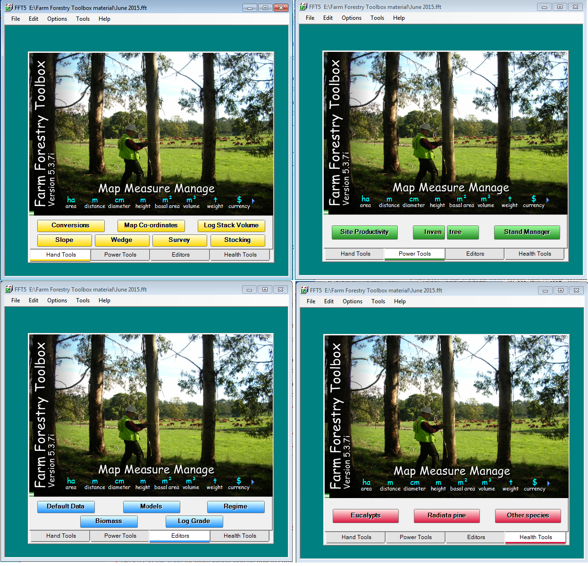

# Where each database model shines

*Match relational, document, key-value, graph, and wide-column models to honest workloads—and spot when one feature is being stretched past its natural shape.*

> Every capable database can be forced to imitate another model. The question is not whether it can.
> The question is how much application code, duplication, indexing, synchronization, and operational
> risk you must buy to make it do so.

> **In real life**
>
> A toolbox contains overlapping tools: pliers can turn a nut, and a wrench can grip wire. The best tool
> is the one whose natural action matches the job while leaving the fewest dangerous workarounds.

**access pattern**: An access pattern is a concrete description of how an application reads or changes data: lookup key, filters, traversal, ordering, result size, frequency, latency, and consistency need. It is more useful than a vague requirement such as fast queries.

## A practical fit map

| Workload | Often a natural fit | Why | Pressure test |
|---|---|---|---|
| money, inventory, ledgers | relational | constraints and coordinated transactions | contention and isolation |
| content/catalog aggregates | document | related data loads and changes together | document growth and mixed versions |
| sessions, counters, hot cache | key-value | known-key operations with low latency | expiry, eviction, durability |
| social, fraud, dependencies | graph | relationships and variable-depth paths | supernodes and traversal bounds |
| telemetry, event history | wide-column | partitioned high-volume ordered access | skew and cross-partition queries |

This map gives a starting hypothesis. A graph database is not automatically right because entities
have relationships; relational joins may be simpler for shallow, stable queries. A document database
is not automatically right because an API emits JSON; the write invariants may still be relational.

> **Tip**
>
> Test a candidate with its least comfortable required query. A model that flies through the happy read
> but collapses under deletion, audit, or correction is not yet a fit.

> **Common mistake**
>
> Optimizing every workload into a different store on day one. Each extra engine adds credentials,
> patching, backup, monitoring, data ownership, synchronization, and incident paths.


*Toolbox photograph — Peter Volker, CC BY-SA 4.0. [Source](https://commons.wikimedia.org/wiki/File:Toolbox_photograph.png)*
- **One job, many categories** — The same domain exposes conversions, maps, surveys, models, and health work—one label does not imply one tool.
- **Power tools selected** — Choose around the dominant operation, not around which product has the longest feature list.
- **Editors selected** — Correction and migration paths matter as much as the first write.
- **Health tools selected** — Observability, recovery, and failure behavior determine whether a technically fitting model survives production.

**Find the model's natural fit**

1. **Inventory operations** — List important reads, writes, deletes, corrections, reports, and recovery actions.
2. **Find the center** — Identify whether transactions, aggregates, keys, paths, or partitioned ranges dominate.
3. **Try the natural model** — Build the hardest representative operation using production-like size and skew.
4. **Count workarounds** — Record duplicated facts, client joins, custom locks, secondary copies, and manual repairs.
5. **Exercise failure** — Test unavailability, lag, invalid data, restore, and migration.
6. **Choose the smallest estate** — Adopt another engine only when its benefit pays its permanent operational cost.

*Run it — map workloads to dominant models (Python)*

```python
``workloads = [
    ("ledger transfer", "coordinated transaction", "relational"),
    ("shopping session", "known-key lookup", "key-value"),
    ("fraud ring", "variable-depth traversal", "graph"),
    ("device history", "partitioned time range", "wide-column"),
    ("product page", "aggregate document", "document"),
]
for name, center, model in workloads:
    print(f"{name}: {center} -> test {model} first")
assert len({model for _, _, model in workloads}) == 5``
```

*Run it — map workloads to dominant models (Java)*

```java
``import java.util.*;

public class Main {
    record Workload(String name, String center, String model) {}
    public static void main(String[] args) {
        var items = List.of(
            new Workload("ledger transfer", "coordinated transaction", "relational"),
            new Workload("shopping session", "known-key lookup", "key-value"),
            new Workload("fraud ring", "variable-depth traversal", "graph"),
            new Workload("device history", "partitioned time range", "wide-column"),
            new Workload("product page", "aggregate document", "document")
        );
        items.forEach(w -> System.out.println(w.name()+": "+w.center()+" -> test "+w.model()+" first"));
        if (items.stream().map(Workload::model).distinct().count() != 5) throw new AssertionError();
    }
}``
```

### Your first time: Your mission: run a fit workshop

- [ ] Collect eight real operations — Include delete, correction, report, and restore—not only create and read.
- [ ] Mark the dominant shape — Classify each as transaction, aggregate, key lookup, traversal, or partitioned range.
- [ ] Highlight mixed pressure — Find the operation whose shape conflicts with the majority and estimate its workaround.
- [ ] Set a complexity budget — Define how many engines and synchronization paths the team can operate credibly.

You now have evidence for fit and for the cost of exceptions.

- **One read requires fetching hundreds of documents and joining in code.**
  Revisit aggregate boundaries or whether a relational/query-oriented copy is the honest model.
- **A graph query explodes around a highly connected node.**
  Bound depth and relationship types, inspect supernodes, and test with production-like degree distribution.
- **A key-value store becomes the system of record by accident.**
  Clarify durability, enumeration, audit, and recovery requirements; name an authority explicitly.
- **Five stores must change for one user update.**
  Reduce ownership, publish one authoritative event, and test idempotent projection repair.

### Where to check

- **Production-shaped distributions** — average record size and degree conceal hot outliers.
- **Deletion and correction paths** — duplicated data makes these expensive and failure-prone.
- **Cross-store ownership** — label authoritative facts and derived projections.
- **Operational runbooks** — verify each engine can be restored and upgraded by the actual team.
- **Fallback behavior** — a cache or projection failure should have a deliberate product response.

### Worked example: a graph-shaped question hidden in SQL joins

1. A fraud team asks for accounts connected within five transfers to a flagged device.
2. Fixed-depth SQL joins work at depth two but become generated, slow, and hard to explain as paths vary.
3. A graph prototype expresses the traversal directly and records the path used for the alert.
4. The ledger remains relational and authoritative; only a derived relationship projection enters the graph.
5. Tests cover event replay, missing edges, duplicate edges, depth bounds, and reconciliation with the ledger.

**Quiz.** When is adding a second database engine justified?

- [ ] Whenever another engine benchmarks faster on one query
- [x] When a measured workload benefit exceeds the ongoing synchronization, security, recovery, and operating cost
- [ ] When the API uses JSON
- [ ] Whenever the architecture diagram looks simpler with more boxes

*A second engine creates permanent system responsibilities. Its measured value must exceed those costs, and ownership must remain explicit.*

- **Access pattern** — A concrete read or write including key, filter, order, size, frequency, latency, and consistency.
- **Relational sweet spot** — Constraints, coordinated transactions, relationships, and flexible querying.
- **Document sweet spot** — Aggregates that are read and updated together with evolving nested structure.
- **Graph sweet spot** — Relationship-heavy questions with variable-depth traversal and path meaning.
- **Wide-column sweet spot** — Large partitioned datasets read by predictable key and ordered range.

### Challenge

Choose one product domain and build a fit table for all five models. Include the best operation, worst
required operation, new bug class, recovery burden, and migration cost for each.

### Ask the community

> Our dominant operation is [access pattern], but [required exception] is awkward. Candidate [model] needs [workaround]. Is that workaround safer than introducing [second engine]?

Include realistic volume and skew, ownership, consistency, and recovery requirements.

- [MongoDB Manual — Data modeling](https://www.mongodb.com/docs/manual/data-modeling/)
- [Neo4j — Graph database concepts](https://neo4j.com/docs/getting-started/graph-database/)
- [Redis Docs — Data types](https://redis.io/docs/latest/develop/data-types/)

🎬 [Relational vs. Non-Relational Databases — IBM Technology](https://www.youtube.com/watch?v=E9AgJnsEvG4) (8 min)

- Match the model to dominant access patterns and invariants, not the API's surface format.
- Test the least natural required operation before committing to a model.
- Relational, document, key-value, graph, and wide-column stores each have recognizable centers of gravity.
- A second engine creates permanent ownership, synchronization, security, and recovery work.
- Production-like skew matters more than average-shaped prototypes.


## Related notes

- [[Notes/nosql-and-modern-data/the-nosql-landscape/document-key-value-graph-columnar|Document, key-value, graph & columnar]]
- [[Notes/nosql-and-modern-data/the-nosql-landscape/sql-vs-nosql-choosing-honestly|SQL vs NoSQL: choosing honestly]]
- [[Notes/nosql-and-modern-data/mongodb-hands-on/embedding-vs-referencing|Embedding vs referencing]]


---
_Source: `packages/curriculum/content/notes/nosql-and-modern-data/the-nosql-landscape/where-each-shines.mdx`_
