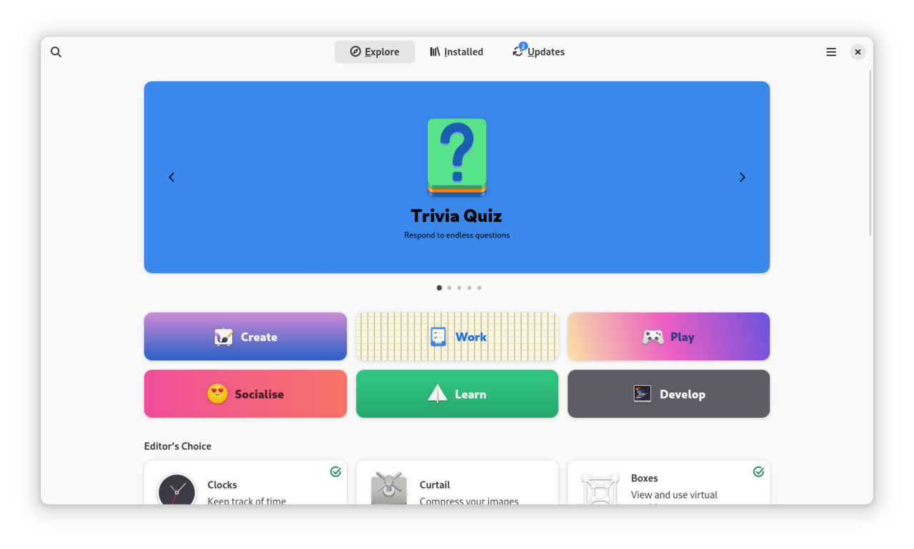

# App stores vs downloads

*Every install is a trust decision you make in three seconds. Who reviewed this code, who packaged it, and who can change it tomorrow — the three questions that separate a safe install from a bad afternoon.*

> When you install something, you are handing a stranger's code permission to run on the
> machine where you check your bank balance. You do this casually, several times a month,
> based on a green Download button and a logo that looked right. This is not a lecture
> about being paranoid — paranoia is useless. It's about the three questions that make
> the decision *fast and correct*, so you can go back to being casual with good reason.

> **In real life**
>
> Installing from a store versus a random download is **eating at a licensed restaurant
> versus a van in a car park.** The van might be the best food in the city. But the
> restaurant has an inspector, a fixed address, and a reputation that dies if it poisons
> you. You're not choosing based on the food — you can't see the food. You're choosing
> based on **who's accountable when it's bad**, which is the only information you
> actually have before you eat.

## The three questions

Every source of software answers these differently, and the answers *are* the security
model:

1. **Who reviewed this?** A store reviewer? A distro maintainer? Nobody?
2. **Who packaged it?** The original developer, or someone who repackaged it — possibly with additions?
3. **What can it do once installed?** Sandboxed to its own box, or full run of your files?

| Source | Reviewed? | Packaged by | Powers |
|---|---|---|---|
| **OS app store** | Yes, and code-signed | Developer, verified | Sandboxed; asks for each permission |
| **Linux distro repo** | Yes, by maintainers | Distro maintainers | Full, but audited + reproducible |
| **Developer's website** | No | Developer (if you got the right site) | Full |
| **Random download site** | No | **Whoever runs the site** | Full. This is the van. |


*Screenshot: GNOME Software 47 — Wikimedia Commons, GPL. [Source](https://commons.wikimedia.org/wiki/File:GNOME_Software_47.0_Overview.png)*
- **'From:' — question 2, answered in one line** — The packager. 'Flathub', 'Fedora Linux', 'Microsoft Store'. Software has an AUTHOR and a PACKAGER and they're frequently different people. The packager is who actually hands you the bytes — so the packager is who you're trusting.
- **The Install button — the trust decision** — This click grants a stranger's code the right to run as you. Not as an abstraction: as YOU, on the machine where your email is logged in. Three seconds of thought is proportionate, not paranoid.
- **Permissions listed BEFORE install** — Question 3, answered up front. A store that shows you 'this app wants: camera, network, all your files' before you commit is doing the thing a download page structurally cannot do.
- **Updates — the ongoing trust** — You don't trust software once; you trust it every time it updates. A store re-checks each version. A random installer with an auto-updater checks nothing — and the update channel is a permanent door into your machine.
- **Categories — the reviewed shelf** — The whole value of a curated shelf is that a stranger checked the box before you opened it — exactly note 1's 'the label is not the file', enforced by someone other than you.

**Two paths to the same app — press Play**

1. **🔎 You search 'install VLC'** — Results: the store, the official site (videolan.org), and four download portals with big green buttons that rank high because they buy ads. All four look professional. That's the point of them.
2. **🏪 Path A: the store** — The package is code-signed: cryptographic proof it came from the developer and hasn't been altered. Reviewed. Sandboxed. Auto-updating. You clicked once and answered all three questions without asking any.
3. **🌐 Path B: a download portal** — You get an installer wrapping the real VLC — plus a 'download manager', a toolbar, and a changed search engine. The app works! That's what makes it effective. The bundle is the business model of the portal, not of VLC.
4. **🔬 What you could have checked** — The domain (videolan.org, not vlc-download-free.co). The signature (does the OS say 'unidentified developer'?). The checksum, if the project publishes one — a fingerprint of the exact bytes the developer released.
5. **🎯 The real lesson** — Both paths installed a working VLC. Path B ALSO installed three things you didn't choose, with your permission, granted by that one click. Bad installs rarely announce themselves. They work perfectly, and do extra.

*Try it — checksums: how you verify bytes you didn't watch arrive*

```python
import hashlib

# A project publishes a checksum next to its download: a fingerprint of the exact
# bytes it released. You hash what you downloaded and compare. Any difference at
# all — one byte — produces a completely different fingerprint.

official   = b"VLC installer v3.0.20 -- the real bytes the developers released"
tampered   = b"VLC installer v3.0.20 -- the real bytes the developers released!"  # ONE char added

def fingerprint(data):
    return hashlib.sha256(data).hexdigest()

published = fingerprint(official)
print("published checksum: ", published)
print()

for name, downloaded in [("from the official site", official), ("from a mirror", tampered)]:
    got = fingerprint(downloaded)
    ok = got == published
    print(f"{name:24} {got[:32]}...")
    print(f"{'':24} {'✓ MATCH — these are the exact published bytes' if ok else '✗ MISMATCH — do NOT run this file'}")
print()
print("Note how little the tampered input differs (one '!') and how totally")
print("different the fingerprint is. That's the property that makes checksums useful:")
print("you cannot quietly change a file and keep its hash.")
print()
print("What a checksum does NOT prove: that the software is SAFE. Only that it's")
print("the same file the publisher published. If you don't trust the publisher,")
print("a matching hash just proves you got authentic malware.")
```

## Code signing: the part that actually protects you

When your OS says *"unidentified developer"* or *"unknown publisher"*, it's telling you
a precise thing: this file carries no valid **code signature**: A cryptographic signature attached to software, proving (a) which registered developer published it, and (b) that not one byte has changed since they signed it. The OS verifies it before running the file.. It is **not** saying
the file is dangerous. It's saying: *nobody has put their name on this, so if it's
malicious, there's no one to blame and no one to revoke.*

That's the whole game. Not "is this code safe" — nobody can know that from the outside —
but **"is somebody accountable for it, and can they be cut off if they betray it?"**

> **Tip**
>
> The three-second checklist, in order of value: **(1) Is it in my OS's store or my
> distro's repo?** Done, install it. **(2) If not, am I on the developer's actual domain?**
> Check the URL character by character — typosquatted domains are the #1 delivery
> mechanism for bundled junk. **(3) Does my OS recognize the signature?** If it says
> unidentified developer, stop and ask why *this particular program* isn't signed. Three
> questions, three seconds, and you've eliminated the overwhelming majority of the ways
> normal people get compromised.

### Your first time: Your mission: run the three questions on a real install

- [ ] Open your OS's store and search for an app you already have — Is the version you're running the store's, or something you downloaded? Check the 'From:' line. Most people can't answer this about their own machine.
- [ ] Search the web for that same app — Count how many results ABOVE the official site are download portals. That's the trap, sitting where you'd naturally click, paid for on purpose.
- [ ] Look at the official site's download page — Does it publish a checksum (SHA-256) or a signature? Serious projects do. Note that you can only verify what the publisher bothered to publish.
- [ ] Find the 'unidentified developer' setting — Mac: System Settings → Privacy & Security. Windows: SmartScreen settings. Read what it actually says. It's about accountability, not danger.
- [ ] Audit one app you didn't choose — Look in your installed-apps list for something you don't remember installing. It came bundled with something. That's the download-portal business model, on your machine, with your permission.

Three questions, one real audit. You now install with reasons rather than reflexes.

- **'macOS cannot verify that this app is free from malware' / 'Windows protected your PC'.**
  The OS found no valid signature (or one it doesn't recognize) and is telling you nobody is accountable. It is NOT a malware detection. Ask: is this a small open-source tool whose author didn't buy a signing certificate (common, usually fine), or an installer from a site I found via a search ad (stop)? The prompt hands you the decision because only you know where the file came from. Answer that question rather than clicking through it.
- **I installed one thing and got three. There's a new browser toolbar and my search engine changed.**
  You used a download portal, not the developer's site — the extras are the portal's product and you're the customer being sold. Fix: uninstall each extra properly (last note's procedure), reset your browser's search settings, then reinstall the real app from the store or the true domain. Then look at where you clicked from: it was almost certainly the first search result, which was an ad.
- **The checksum on the site doesn't match my download.**
  Do not run it. Two innocent causes (an interrupted download, or you hashed the wrong file) and one serious one (the bytes were altered between publisher and you). Re-download and re-check. If it mismatches again from a clean network, stop and get the file from another official mirror. This is a two-minute check that people skip because nothing bad has happened yet — the same reasoning as postponing security updates.
- **The app is only available as a random .exe / .dmg from a personal blog.**
  Sometimes true and fine — plenty of excellent small tools live exactly there. Raise your standard of evidence instead of refusing: is there a public source repository? Real users discussing it in places you trust? A signature or a checksum? An author with a name and a history? You're not looking for proof it's safe — that isn't obtainable. You're looking for someone accountable, per the code-signing lesson.

### Where to check

Your trust surface, before every install:

- **The URL bar.** Character by character. `videolan.org` vs `vlc-official-download.net`. This is where most compromises are actually decided, and it costs one second.
- **The 'From:' line** in your store — the packager, not just the author.
- **The signature warning** — accountability, not danger. Read which it is.
- **The permission list** — before install if the store shows it, after install in Privacy & Security if it doesn't.
- **The checksum**, when a project publishes one. Proves the bytes are authentic; proves nothing about intent.
- **Your installed-apps list, monthly.** Anything you don't recognize arrived as a passenger with something you did choose.

Tester's angle: this is your first taste of **threat modelling** — asking "who could
hurt me here, and what would I have to believe for this to be safe?" Track E turns it
into a discipline. It starts as a habit at a download button.

### Worked example: the free PDF reader that read everything else too

A boringly ordinary compromise, walked step by step:

1. Someone needs a PDF tool. They search "free pdf reader download". The first result is an ad. They click it.
2. The site looks professional — logos, a big green button, "100% safe" badges (which are images anyone can add to a page and mean exactly nothing).
3. They download `pdf-reader-setup.exe`. Windows says "unknown publisher". They click through, because that prompt appears so often it has stopped carrying meaning.
4. The PDF reader **works**. It reads PDFs beautifully. This is the crucial part: nothing looks wrong, so no alarm fires, ever.
5. Bundled with it: a browser extension with permission to read every page they visit, and an auto-updater that runs at startup with full privileges — a permanent, silent channel from a stranger onto their machine.
6. **Which of the three questions would have caught it?** Question 1 (who reviewed this: nobody). Question 2 (who packaged it: the download portal, not the PDF developer). Question 3 (what can it do: everything, and it asked for a browser extension for a PDF reader — a request with no innocent explanation).
7. **Total time to run all three: about three seconds.** The compromise lasted eight months and was discovered by accident. The asymmetry between the cost of checking and the cost of not checking is the entire argument of this note.

> **Common mistake**
>
> Reading "unidentified developer" as "this is a virus," clicking through in irritation,
> and learning nothing. The prompt is not an accusation — it's the OS admitting it cannot
> name anyone responsible for this code. That's genuinely fine for a small open-source
> tool from a repository you can read, and genuinely alarming for an installer you
> reached from a search ad. **Identical prompt, opposite correct responses.** The prompt
> can't tell the difference; only you know where the file came from. Security prompts
> that get clicked through reflexively provide zero protection — and the fix is not
> clicking less, it's knowing what the prompt is actually asking.

**Quiz.** You download a tool from its official site. The OS warns 'unidentified developer'. The published SHA-256 checksum matches your file exactly. What have you proven?

- [ ] That the software is safe to run
- [x] Only that the file is byte-for-byte what that publisher published — it's authentic, not necessarily safe. The checksum proves nothing about the publisher's intent or competence, and no signature means nobody is formally accountable. Authenticity and trustworthiness are different questions.
- [ ] That the OS warning is a false positive
- [ ] That the developer signed the file

*A matching checksum answers 'did I get the bytes they released?' — that's authenticity. It's silent on 'should I trust whoever released them?' If you don't trust the publisher, a matching hash just proves you downloaded authentic malware. And a checksum is not a signature: it proves the file matches a number on a webpage, and if an attacker controls the page they control both. Signatures are cryptographically bound to a registered identity that can be revoked. Different tools, different guarantees.*

- **The three questions** — 1. Who reviewed this? 2. Who packaged it (author ≠ packager)? 3. What can it do once installed? Every source answers these differently — the answers ARE the security model.
- **What code signing proves** — Which registered developer published it, and that not one byte changed since. It does NOT prove the code is safe — it proves someone is accountable and can be revoked.
- **'Unidentified developer' means…** — Nobody has put their name on this file. Not 'this is malware'. Fine for a small open-source tool; alarming for an installer you reached via a search ad.
- **Checksum vs signature** — Checksum: these are the exact bytes published (authenticity). Signature: cryptographically bound to a revocable identity. A checksum on a page an attacker controls proves nothing.
- **Why download portals exist** — They wrap real software in bundled extras. The app works perfectly — that's what makes it effective. The bundle is their business model, not the developer's.
- **Trust is ongoing** — You don't trust software once; you trust every update. A store re-checks each version; a stranger's auto-updater is a permanent door into your machine.

### Challenge

Take the last app you installed that did not come from a store. Answer all three
questions about it, out loud, with evidence: who reviewed it, who packaged it, what
permissions does it hold right now (go look in Privacy & Security). If you can't answer
question 2 — if you don't know whether you were on the developer's real domain — that
alone is the finding. Then do the same for the app you're most likely to install next.
Three seconds, before the click, is worth eight months of not knowing.

### Ask the community

> Trust question: about to install [app] from [exact URL]. OS says [signature status]. Site publishes [checksum? signature? nothing?]. Store alternative exists: [yes/no]. Permissions requested: [list]. Does this look legitimate?

Pasting the exact URL is what makes this answerable — nine times out of ten someone
spots the typosquatted domain in under a second, and the tenth time you learn the site
is fine and you install with confidence. Asking BEFORE installing costs one message;
asking after costs a reinstall of your operating system.

- [EFF — how to verify what you downloaded](https://www.eff.org/deeplinks/2015/11/how-verify-your-downloads)
- [Wikipedia — code signing, and what it actually guarantees](https://en.wikipedia.org/wiki/Code_signing)
- [How bundled software gets on your machine](https://www.youtube.com/watch?v=b4b8ktEV4Bg)

🎬 [Where software really comes from](https://www.youtube.com/watch?v=b4b8ktEV4Bg) (10 min)

- Every install answers three questions: who reviewed this, who packaged it, and what can it do once running. Stores answer all three for you; download portals answer none.
- Code signing proves accountability (a named, revocable publisher), not safety. 'Unidentified developer' means nobody put their name on it — sometimes fine, sometimes the whole warning.
- A checksum proves authenticity, not trustworthiness. Matching bytes from a publisher you shouldn't trust just means authentic malware.
- Bad installs work perfectly. That's what makes them effective — nothing looks wrong while extras run with your permission.
- Trust is ongoing, not one-time: every update re-asks the question, and an auto-updater is a permanent door into your machine.


---
_Source: `packages/curriculum/content/notes/operating-systems-and-files/installing-and-managing-software/app-stores-vs-downloads.mdx`_
