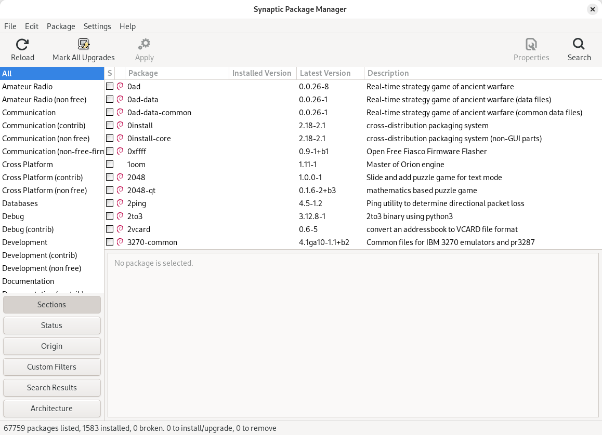

# Uninstalling

*Dragging an app to the Trash is not uninstalling it. What actually gets left behind, why your disk fills up with ghosts, and how to remove software the way the OS intended.*

> There is software on your computer right now that you uninstalled years ago. Its
> settings folder is still there. Its startup entry may still fire. Its permission to
> use your camera is, technically, still granted. You didn't do anything wrong — you
> did the thing everyone does, which is delete the part you could see. Today: the parts
> you couldn't.

> **In real life**
>
> Uninstalling by deleting the app folder is **evicting a tenant by throwing their bed
> out the window.** The bed is gone. Their name is still on the lobby directory, their
> keys still open the gym, their mail still arrives, and the building's records insist
> they live here. Eviction is a *procedure* — you have to unwind the four things move-in
> did, in reverse. That procedure has a name and a button, and almost nobody uses it.

## Unwinding the four steps

The last note taught the four steps of installing. Uninstalling is those four in
reverse, and every method you'll meet differs only in **how many of the four it
actually does**:

1. **Remove the files** — the part everyone does.
2. **Remove the registration** — delete the OS's record: the entry in the installed-apps list, the file associations, the uninstall command itself.
3. **Revoke permissions** — camera, microphone, network, startup.
4. **Remove the shortcut** — the signpost.

Plus a fifth thing installers never talk about: **your data.** Settings, caches, saved
files. A good uninstaller asks whether to keep it. A bad one silently keeps it forever,
or silently destroys it. Removing that data too has a name — **purging**: A 'purge' (or 'remove completely') deletes an app's configuration and data along with the program itself. A plain 'remove' deletes the program but keeps your config, so a reinstall restores your setup — which is why a reinstall can bring a broken setting back with it. — and it's a
separate button in almost every package manager for exactly this reason.


*Screenshot: Synaptic Package Manager on Debian — Wikimedia Commons, CC0. [Source](https://commons.wikimedia.org/wiki/File:Synaptic_Package_Manager_on_Debian_Trixie.png)*
- **'Remove' vs 'Remove completely'** — Two different buttons in almost every package manager, and the difference is step 5. 'Remove' deletes the program but keeps your config files. 'Purge' / 'Remove completely' deletes config too. Choosing wrong is why reinstalling an app sometimes 'remembers' your broken settings.
- **Dependencies — the shared furniture** — App A and App B both need library X. Uninstall A and X must stay — B is using it. When B goes too, X becomes an orphan nobody needs. 'autoremove' cleans those up. This is why 'uninstall one app, free 900 MB' sometimes happens and sometimes doesn't.
- **Installed size — what you'd actually reclaim** — Read it before assuming an uninstall will save you space. Often the app is 40 MB and its CACHE is 3 GB living somewhere else entirely — a folder no uninstaller touches.
- **The search box — find the ghosts** — Search your package list for an app you 'uninstalled' by deleting the folder. If it's still listed, you found an orphan. This is the exact check the last note's playground simulated.
- **Apply — the procedure runs** — Now the OS runs the stored uninstall command: remove files, deregister, drop permissions, delete shortcut, maybe ask about data. All four steps unwound, in order, by the machine that recorded them.

**Two ways to remove an app — press Play**

1. **😐 Way 1: drag folder to Trash** — Step 1 undone. Files gone. Feels finished — the icon disappeared, the disk space came back, the dopamine arrived. This is where most people stop.
2. **👻 What survives** — The registry entry (app still listed as installed). The permissions (still granted). The startup entry (still fires — and now fails loudly, or silently). Your settings and caches (still on disk, possibly gigabytes). Four ghosts.
3. **🙂 Way 2: run the uninstaller** — Settings → Apps → Uninstall, or the package manager's Remove. The OS looks up the uninstall command it stored at install time (step 2 of the last note — that's what it was FOR) and runs it.
4. **🧹 The unwind** — Files removed. Registration deleted. Permissions revoked. Shortcut removed. The uninstaller knows every place the installer wrote, because it was written by the same people who wrote the installer.
5. **❓ The leftover question** — Your data. `~/Library/Application Support/App/`, `%AppData%\\App\\`, `~/.config/app/`. Most uninstallers deliberately leave this — so a reinstall restores your setup. Great feature, silent disk hog. THIS is the folder you clean by hand, and only if you're sure.

*Try it — uninstall two ways and count the ghosts*

```python
registry     = {"Notes": {"perms": ["files"], "startup": False},
                "Camly": {"perms": ["camera", "network"], "startup": True}}
disk         = {"/Applications/Notes": "...", "/Applications/Camly": "..."}
user_data    = {"~/.config/notes": "500 MB of cache", "~/.config/camly": "2 GB of thumbnails"}
shortcuts    = {"Notes", "Camly"}

def drag_to_trash(app):
    disk.pop(f"/Applications/{app}", None)          # step 1 ONLY
    print(f"🗑  dragged {app} to Trash")

def proper_uninstall(app, purge_data=False):
    disk.pop(f"/Applications/{app}", None)          # 1 files
    registry.pop(app, None)                          # 2 registration + permissions + startup
    shortcuts.discard(app)                           # 4 shortcut
    if purge_data:
        user_data.pop(f"~/.config/{app.lower()}", None)   # 5 your data (only if asked)
    print(f"✓ properly uninstalled {app} (purge_data={purge_data})")

drag_to_trash("Notes")
proper_uninstall("Camly")
print()

def audit():
    for app in ["Notes", "Camly"]:
        ghosts = []
        if app in registry:  ghosts.append(f"registry entry (perms={registry[app]['perms']}, startup={registry[app]['startup']})")
        if app in shortcuts: ghosts.append("dangling shortcut")
        key = f"~/.config/{app.lower()}"
        if key in user_data: ghosts.append(f"data: {user_data[key]}")
        on_disk = f"/Applications/{app}" in disk
        print(f"{app}: files_on_disk={on_disk}")
        for g in ghosts: print(f"    👻 {g}")
        if not ghosts: print("    clean")
audit()
print()
print("Notes: files gone, but still 'installed', still holds permissions,")
print("still has a shortcut, still owns 500 MB. Camly is clean except its 2 GB")
print("of data — left ON PURPOSE, so a reinstall restores your setup.")
```

## Where the ghosts actually live

- **Windows:** `%AppData%` (roaming + local), plus registry keys under `HKEY_CURRENT_USER\Software\`.
- **macOS:** `~/Library/Application Support/`, `~/Library/Preferences/`, `~/Library/Caches/`.
- **Linux:** `~/.config/appname/`, `~/.cache/appname/`, `~/.local/share/appname/`.

Notice they're all in your **Home** folder — inside the tree you learned to walk two
notes ago. These aren't secret. They're just hidden (names starting with `.` on
Mac/Linux; a folder you never open on Windows) and nobody told you they exist.

> **Tip**
>
> Before you go on a deleting spree in those folders: **the ghosts are usually harmless
> and occasionally precious.** That `~/.config/` folder holds the settings you spent
> three hours getting right. Delete files there only when (a) you're reclaiming real
> space, and (b) you know which app they belong to. And the classic professional move:
> uninstall, reinstall, and if the app comes back *with your old broken settings*, THEN
> the config folder is your problem. That's a two-minute diagnosis for a bug that
> otherwise eats an afternoon.

### Your first time: Your mission: evict one tenant properly

- [ ] Open the installed-apps list — Windows: Settings → Apps → Installed apps. Mac: Applications folder + System Settings → General → Storage → Applications. Linux: software center → Installed. This list is the registry, made visible.
- [ ] Find an app you don't use — Everyone has one. Sort by size or by 'last used' if your OS offers it. Look for something installed for one task, two years ago.
- [ ] Uninstall it the OS way — Use the Uninstall button — do NOT drag anything anywhere. Watch whether it asks about keeping your data. That question is step 5.
- [ ] Hunt for the ghost — Search your Home for the app's name (last chapter's search skills, applied). Check ~/.config, ~/Library/Application Support, or %AppData%. Is a folder still there? That's normal, and now you can see it.
- [ ] Check permissions and startup — Settings → Privacy & Security, and your startup/login items. Is the uninstalled app still listed? If yes, you found a real leftover — remove it and note which app was sloppy.

One clean eviction, one ghost identified. You now know why 'I uninstalled it' is a claim, not a fact.

- **I uninstalled the app but it's still in my installed-apps list.**
  Either you deleted the folder instead of uninstalling (orphaned registry entry), or the uninstaller crashed halfway. Fix: reinstall the SAME version, then uninstall properly — the reinstall restores the uninstall command that the OS needs to run. Counterintuitive and correct. If that fails, Windows has 'Program Install and Uninstall Troubleshooter'; Mac/Linux orphans are usually harmless list noise.
- **I uninstalled it, reinstalled it, and the bug is STILL there.**
  Your settings survived. The uninstaller left ~/.config or %AppData% intact (by design, step 5), the reinstall found them and restored your corrupted config. Fix: uninstall, delete the app's data folder by hand, then reinstall. This one move solves a shocking fraction of 'reinstalling didn't help' cases — for you and, later, for the users whose bugs you triage.
- **Uninstalling one app removed something another app needed.**
  Shared dependency. Two apps used one library and the uninstaller took it with them. This is what package managers' dependency tracking exists to prevent, and why 'autoremove' asks so carefully. Fix: reinstall the missing library (the broken app usually names it in its error). Note the shape of this: shared state, removed by one owner, breaks another. You'll meet that exact shape again in databases and in caching.
- **The app won't uninstall — 'this app is currently running'.**
  Correct behavior, not a bug: you cannot delete files an OS has open (that's the OS's file-management job protecting you). Quit the app, including its background/tray process — check Task Manager / Activity Monitor / System Monitor, which you learned to read in ch1. Kill it there, then uninstall.

### Where to check

The five places an uninstall should touch, and where to verify each:

- **Program files** — `C:\Program Files`, `/Applications`, `/usr/bin`. Gone?
- **The installed-apps list** — the registry. Still listed = orphan.
- **Permissions** — Settings → Privacy & Security. Still granted = leftover.
- **Startup / login items** — still firing = leftover, and a real slowdown source (Module 1's slow-computer note, collecting again).
- **Your data** — `~/.config`, `~/Library/Application Support`, `%AppData%`. Usually left on purpose. Delete only deliberately.

Tester's angle: **the uninstall path is the least-tested path in most products.** Try
it: install, use, uninstall, then reinstall and see what the app remembers. Every
"remembered" thing is either a feature nobody documented or a leftover nobody intended.
Both are findings. This is a genuinely under-explored corner of QA — walk in and start
opening drawers.

### Worked example: the app that came back haunted

The single most useful debugging sequence in this whole chapter:

1. **Report:** "The app crashes on startup. I uninstalled and reinstalled it. Still crashes."
2. **The tempting conclusion:** the app is broken for everyone, it's a bad build. But other users are fine, and a fresh machine runs it perfectly.
3. **The question that cracks it:** what SURVIVED the reinstall? Answer: the config folder — the uninstaller deliberately left `~/.config/theapp/` alone so the user's setup would return.
4. **Check it:** `settings.json` in that folder contains a value the new version can't parse (a setting removed in v3, still present from v2). App reads it on launch, throws, dies.
5. **Confirm:** rename the config folder (don't delete it — you might need it as evidence) and launch. Clean start, no crash. **The bug is not the crash — the bug is that the app cannot survive its own old config.**
6. **The report writes itself:** 'v3 crashes on startup when a v2 config containing the removed `x` key is present. Repro: install v2, launch, upgrade to v3.' That's a migration bug (last note's specialty) found through an uninstall (this note's). The chapter is teaching you one skill wearing two hats: *know what persists.*

> **Common mistake**
>
> Believing the disk-space number an uninstall reports. It counts the program files —
> step 1 — and cheerfully ignores your data folder, the cache, and the shared libraries
> it couldn't remove. Uninstall a 40 MB photo app and you may leave a 3 GB thumbnail
> cache behind, then wonder why your "cleanup" freed nothing. The number isn't a lie,
> it's an answer to a narrower question than you asked. Getting precise about *which
> question a tool actually answers* is, when you zoom out, the entire discipline of
> testing.

**Quiz.** You uninstall a buggy app properly (via Settings → Apps), reinstall it fresh, and the exact same bug appears immediately. What is the most likely explanation?

- [ ] The uninstall didn't work at all
- [x] Your settings/config folder survived by design (uninstallers usually keep user data), the reinstall found it, and the app restored the same broken configuration. Delete the data folder before reinstalling to get a genuinely fresh start.
- [ ] The bug is in the OS, not the app
- [ ] Reinstalling never fixes anything

*A proper uninstall unwinds files, registration, permissions and shortcuts — but deliberately leaves your data so a reinstall restores your setup. That's a feature, and it's also why 'I reinstalled and it's still broken' is so common. The genuinely fresh start requires removing ~/.config, ~/Library/Application Support, or %AppData% too. Knowing that one fact makes you the person who solves this in two minutes.*

- **Uninstall = 4 steps in reverse** — Remove files, remove registration, revoke permissions, remove shortcut. Plus a 5th question: keep your data or not?
- **Dragging to Trash does what?** — Step 1 only. Leaves the registry entry, permissions, startup entry, shortcut, and all your data. Four ghosts and a lie in the installed-apps list.
- **Where the ghosts live** — Windows %AppData%; macOS ~/Library/Application Support + Preferences + Caches; Linux ~/.config, ~/.cache, ~/.local/share. All inside your Home.
- **'Reinstalled, still broken'** — The config folder survived the uninstall by design and restored the broken settings. Delete the data folder before reinstalling for a genuinely fresh start.
- **Remove vs purge** — Remove = program gone, config kept. Purge / 'remove completely' = config gone too. Choosing wrong explains a reinstall that 'remembers' your broken setup.
- **Why 'app is running' blocks uninstall** — The OS won't delete files it has open — its file-management job protecting you. Quit the app AND its background process (Task Manager / Activity Monitor).

### Challenge

Pick an app you genuinely don't need. Uninstall it properly, then go hunting: search
your Home folder for its name and see what's left behind. Measure the leftover folder's
size. Then check your Privacy settings and startup items for its corpse. Write down
how many of the five things survived. Anything above zero is normal — and the fact that
you can now *see* it puts you permanently ahead of the person who thinks 'uninstalled'
means 'gone'.

### Ask the community

> Uninstall question: removed [app] via [Settings → Apps / dragged to Trash / package manager]. Still seeing [listed as installed / permission granted / startup entry / data folder at PATH, size X]. Reinstalled and the old [settings/bug] came back: [yes/no].

That last line — 'reinstalled and the old settings came back' — is the single fact that
tells anyone whether you're chasing a leftover config or a genuine app bug. It's also
the fact almost nobody thinks to include, which is why these threads run for twenty
messages. Include it and get answered in one.

- [Apple — uninstalling apps, and what stays behind](https://support.apple.com/guide/mac-help/uninstall-apps-mh40564/mac)
- [Microsoft Learn — how uninstall works on Windows](https://learn.microsoft.com/en-us/windows/apps/get-started/uninstall-apps)
- [Install and uninstall: what's really happening](https://www.youtube.com/watch?v=Kg1Yvry_Ydk)

🎬 [Installing and removing software, under the hood](https://www.youtube.com/watch?v=Kg1Yvry_Ydk) (9 min)

- Uninstalling is the four install steps unwound in reverse — files, registration, permissions, shortcut — plus a fifth question about your data.
- Dragging an app to the Trash does step 1 only, leaving an orphan: still 'installed', still holding permissions, still starting at boot.
- Uninstallers deliberately keep your config (~/.config, %AppData%, ~/Library/Application Support) so reinstalls restore your setup. That's why 'reinstalled and still broken' happens.
- Shared dependencies mean removing one app can break another — the same shared-state failure shape you'll meet again in databases and caches.
- The uninstall path is the least-tested path in most products. Install → use → uninstall → reinstall, and note everything the app 'remembers'. Every one is a finding.


---
_Source: `packages/curriculum/content/notes/operating-systems-and-files/installing-and-managing-software/uninstalling.mdx`_
