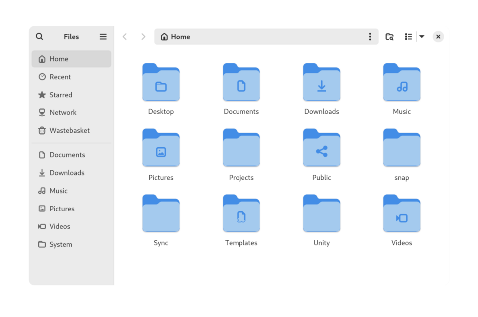

# Common OS tasks

*The daily moves — copy, paste, rename, search, undo, screenshot — done properly, with the shortcuts that quietly double your speed.*

> Watch two people do the same office task. One right-clicks → Copy, mouses to the
> folder, right-clicks → Paste, reaches for the menu, hunts for Rename... The other's
> hands never leave the keyboard: Ctrl+C, Ctrl+V, F2, done — finished before the
> first person found the menu. Same knowledge, triple the speed. Today you become
> the second person, permanently, in about ten minutes.

> **In real life**
>
> OS tasks are **kitchen knife skills**. Every cook chops onions; chefs chop them in
> a third of the time with fewer tears, because someone taught them grip and angle
> once. Copy-paste-rename-search are your onions — you'll do them tens of thousands
> of times in a QA career. Knife skills aren't glamorous. They're just the difference
> between a cook and a chef, forty hours a week.

## The moves, and where they live

The file manager is the practice kitchen. Here's a real one (GNOME Files —
yours has the same organs):


*Screenshot: GNOME Files — Wikimedia Commons, CC BY-SA 4.0. [Source](https://commons.wikimedia.org/wiki/File:GNOME_Files_47.png)*
- **The sidebar — your teleports** — Home, Recent, Starred, Downloads: one-click jumps to the places you actually use. 'Recent' alone finds half of all 'lost' files — it remembers what you touched, even when you don't.
- **The path bar — you are HERE** — Home → Documents → Projects: the trail from the top to where you stand. This trail has a text form (a 'path') — next chapter makes it famous. For now: this bar always answers 'where am I?'.
- **The folders — the standard set** — Desktop, Documents, Downloads, Music, Pictures... every OS creates the same starter set. Downloads is where files go to be forgotten — you cleaned it in Module 1 and it's already growing back.
- **Search — the magnifying glass** — Type a few letters of a filename and stop browsing folders like it's 1995. Search-first beats navigate-first for anything you can name. Chefs search.
- **Wastebasket — the safety net** — Deleted ≠ gone: files sit here, restorable, until you empty it. This two-step design has saved careers. (Shift+Delete skips it. Now you know what NOT to press casually.)

## The knife skills (learn once, use forever)

- **Copy / Cut / Paste** — Ctrl+C / Ctrl+X / Ctrl+V (Cmd on Mac). Works on text, files, images, ALMOST EVERYTHING. The single highest-value trio in computing.
- **Undo** — Ctrl+Z. Also works on file operations! Renamed wrong? Moved to the wrong folder? Deleted? Ctrl+Z in the file manager. Criminally unknown.
- **Rename** — F2 (Windows/Linux) or Enter (Mac). Select file, one key, type, done.
- **Search everything** — Windows key then type (Windows), Cmd+Space (Mac). Apps, files, settings — the launcher finds it faster than any menu.
- **Screenshot** — Windows+Shift+S / Cmd+Shift+4. Installed as a tester reflex last note; repeated here because it's THAT important.
- **Switch windows** — Alt+Tab / Cmd+Tab. Hold, tap, release. The move that makes you look like you've done this for years.

**What copy-paste actually does — press Play**

1. **📄 Ctrl+C** — The OS notes what you copied onto the clipboard — an invisible shelf that holds ONE item (copy again and the old one silently vanishes).
2. **📋 The clipboard holds** — The item waits on the shelf — text, file reference, image, whatever. Windows key+V (Windows) even shows a HISTORY of the shelf. Yes really. Try it.
3. **🚚 Ctrl+V** — The OS delivers the shelf's contents wherever you are now — pasting a FILE copies the real bytes; pasting text inserts it. Same gesture, context-aware delivery.
4. **♻️ Reusable** — The shelf keeps its item until replaced — paste the same thing ten times. One copy, many pastes: half of all office work, honestly.

*Try it — bulk-rename like a power user*

```python
# The move that separates chefs from cooks: renaming 100 files at once.
# This simulates it — the real version is one loop away in Track B.
files = ["IMG_2041.jpg", "IMG_2042.jpg", "IMG_2043.jpg", "IMG_2044.jpg"]
project = "bug-evidence"

for i, old in enumerate(files, start=1):
    new = f"{project}-{i:03d}.jpg"
    print(f"{old}  →  {new}")
print(f"Renamed {len(files)} files in 0.001 seconds. By hand: 2 boring minutes.")
```

> **Tip**
>
> Why this is a QA module and not office training: testers GENERATE files all day —
> screenshots, logs, exports, evidence — and shuttle them between apps, tickets and
> folders constantly. Slow file handling doesn't just cost time; it interrupts your
> train of thought mid-bug. The knife skills keep your brain on the BUG while your
> hands do the filing. That's the real speed gain: uninterrupted attention.

### Your first time: Your mission: the knife-skills drill

- [ ] The trio, ten times — Copy a sentence, paste it. Copy a FILE, paste it into another folder. Feel the same Ctrl+C/V do both. Ten reps makes it muscle, not memory.
- [ ] Undo a file operation — Rename any file (F2), then Ctrl+Z in the file manager — watch the name come back. Move a file, Ctrl+Z again. The safety net is real; test it while nothing's at stake.
- [ ] Search-launch three apps — Windows key (or Cmd+Space), type 3 letters of an app's name, Enter. Three times. You may never click an app icon again.
- [ ] Open your clipboard history — Windows: Windows key+V (enable it when asked). Mac: needs a helper app — note that gap. Ten items deep, and suddenly copy-copy-paste-paste workflows work.
- [ ] Alt+Tab like you mean it — Open three windows, hold Alt, tap Tab to walk the list, release to land. This is how testers bounce between the app and the bug report all day long.

Trio drilled, undo trusted, launcher adopted, windows switched. Speed: doubled.
Tears while chopping onions: reduced.

- **I copied something new but it pasted the OLD thing.**
  The copy didn't register — the classic cause: you pressed Ctrl+C with nothing actually SELECTED, so the shelf kept its previous item. Select first (watch for the highlight), copy second. Clipboard history (Windows+V) shows you exactly what's on the shelf — no more paste surprises.
- **I deleted a file and now I need it back. Panicking.**
  Breathe — check the Wastebasket/Recycle Bin first: right-click → Restore puts it back where it lived. Just deleted seconds ago? Ctrl+Z may undo it directly. Only Shift+Delete (or emptying the bin) truly removes files — which is why that shortcut deserves respect and ceremony.
- **Paste is greyed out / does nothing in one particular app.**
  Some fields block pasting on purpose (password fields especially — a misguided 'security' choice), and some apps have their own internal clipboard. Test: does paste work in a text editor? Yes → the APP is blocking it, not your clipboard. The one-app-vs-everywhere fork, pocket edition — it works on clipboards too.
- **I saved/downloaded a file and it has VANISHED.**
  It's somewhere — the app just chose the location. Check Downloads (always Downloads first), then the file manager's 'Recent' view (it remembers everything touched today), then search the exact filename from the launcher. Three lookups, ninety seconds, file found. The pantry is big; Recent is your receipt.

### Where to check

The OS keeps receipts on all of it:

- **Recent files** — the file manager's Recent view + each app's File → Recent menu. What you touched, in order, even when you've forgotten.
- **Clipboard history** — Windows key+V: the shelf's last ten items, pasteable individually.
- **The Wastebasket** — deletion's waiting room. Check before mourning.
- **Default folders** — Downloads and Documents catch almost everything apps drop. When in doubt, look there before searching anywhere.

'Where did it go?' is never a mystery — it's a three-lookup routine. Downloads →
Recent → search. Write it once, use it for life.

### Worked example: the disappearing report, found in 40 seconds

The classic office panic, walked calmly:

1. **Panic:** "I worked on the report all morning and it's GONE. The app closed and everything disappeared!"
2. **Lookup one — Recent:** the word processor's File → Recent menu lists 'Report_final_v2' touched 11:52. It exists. Half the panic evaporates.
3. **Open it:** the file opens from Recent — saved location turns out to be a folder the Save dialog defaulted to last week ('Documents/old-project/'). Never lost; just filed by a dialog nobody read.
4. **Verdict:** file recovered, moved to the right folder, and one habit installed: glance at WHERE the save dialog points before hitting Save. Forty seconds, zero data lost — and the 'app ate my work' report was actually a filing misunderstanding. Most of them are.

> **Common mistake**
>
> Mousing through menus for things you do fifty times a day. It feels harmless —
> right-click → Copy costs 'only' three seconds more than Ctrl+C. Fifty times daily
> × working years = entire DAYS of your life spent inside context menus. Learn six
> shortcuts (the trio, undo, search, Alt+Tab) and reclaim the days. Your future
> self, mid-bug-hunt with seventeen windows open, sends thanks.

process

**Quiz.** You need the same error message pasted into a bug ticket, a chat message, and a search box. The chef's approach?

- [ ] Copy it three separate times, once before each paste
- [x] Copy ONCE — the clipboard keeps its item through unlimited pastes: Ctrl+C, then Ctrl+V in all three places
- [ ] Type it out manually each time for accuracy
- [ ] Screenshot it three times

*One copy, many pastes — the shelf holds until replaced. The triple-paste of an error message into ticket/chat/search is literally a daily tester workflow, and doing it in four keystrokes instead of six mouse-trips is the knife skills paying rent. (Bonus: Windows+V would let you juggle TWO errors at once.)*

- **The trio** — Ctrl+C / Ctrl+X / Ctrl+V (Cmd on Mac) — copy, cut, paste. Works on text, files, images. Highest-value keystrokes in computing.
- **Ctrl+Z on files** — Undo works in the file manager too: renames, moves, even deletions. The criminally unknown safety net.
- **Clipboard** — The invisible one-item shelf between copy and paste. Windows key+V opens its ten-item history. Copy with nothing selected = old item stays.
- **The three-lookup routine** — 'File vanished': Downloads → Recent → search the name. Ninety seconds, works every time, no panic required.
- **Shift+Delete** — Skips the Wastebasket — truly gone. A shortcut that deserves ceremony, not casual fingers.

### Challenge

The speed test: create a folder called 'practice', create three files in it (right-
click → New), rename all three with F2, copy them into a second folder, then delete
the first folder and restore it from the Wastebasket — using ONLY keyboard shortcuts
where possible. Time yourself. Under two minutes = knife skills acquired. Then
delete both folders (properly, via the bin — ceremony!) and carry the skills
forever.

### Ask the community

> OS task question on [OS + version]: trying to [task], expected [result], got [behavior]. Checked: [Recent/clipboard history/Wastebasket]. Is there a shortcut or setting I'm missing?

Even simple-task questions deserve the evidence habit — 'checked Recent and the
bin' saves the first two replies anyone would give you. And asking 'is there a
shortcut' is never embarrassing: every chef once asked how to hold the knife.

- [GCFGlobal — navigating your computer (the moves, illustrated)](https://edu.gcfglobal.org/en/computerbasics/navigating-your-computer/1/)
- [Microsoft — the full Windows shortcut list (bookmark it)](https://support.microsoft.com/en-us/windows/keyboard-shortcuts-in-windows-dcc61a57-8ff0-cffe-9796-cb9706c75eec)
- [Top keyboard shortcuts that double your speed](https://www.youtube.com/watch?v=TF9L1Nh-3Ao)

🎬 [Keyboard shortcuts that double your speed](https://www.youtube.com/watch?v=TF9L1Nh-3Ao) (8 min)

- Six shortcuts — the trio, undo, search-launch, Alt+Tab — are knife skills: learned once, used tens of thousands of times.
- Ctrl+Z works on FILE operations. The safety net most users never discover.
- The clipboard is a one-item shelf (with a hidden history on Windows+V). Copy with nothing selected = paste surprises.
- 'Vanished' files: Downloads → Recent → search. A routine, not a mystery.
- The real gain isn't seconds — it's unbroken attention. Hands do the filing; brain stays on the bug.


---
_Source: `packages/curriculum/content/notes/operating-systems-and-files/what-an-os-does/common-os-tasks.mdx`_
