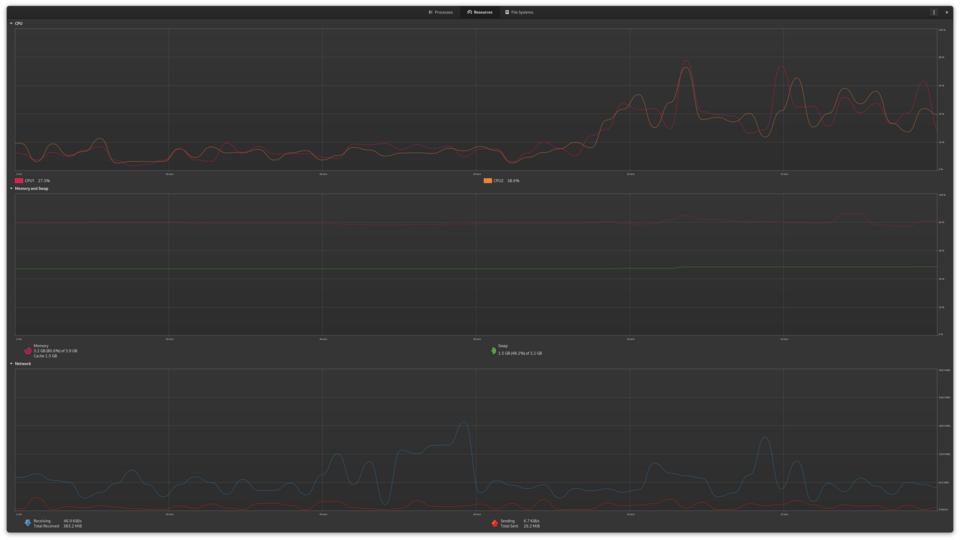

# Managing hardware

*How the OS bosses the metal around — drivers, resource sharing, and the dashboards that show you exactly what the hardware is doing right now.*

> Two hundred processes, four CPU cores. Dozens of programs "using" one network card,
> one screen, one disk — all at once, none of them fighting. Who's directing this
> traffic? The OS, performing its least glamorous, most constant job: convincing
> every program it has the hardware to itself, while actually rationing everything.
> It's the greatest ongoing magic trick in computing, and today you get to see the
> wires.

> **In real life**
>
> The OS manages hardware like an **air-traffic controller runs a runway**. Every
> plane (process) believes it's THE priority; the tower schedules take-offs
> (CPU turns), assigns gates (memory), sequences cargo loading (disk access) and
> radio frequencies (network). No plane ever talks to the runway directly — they
> talk to the tower. One runway, hundreds of flights, zero collisions... when the
> tower is doing its job.

## The three tricks of the trick

1. **Drivers — the translators (you know them!).** The OS speaks one language; every device speaks its own dialect. Drivers translate. Module 1's handshake ceremony was your first sighting; now you know who EMPLOYS all those translators.
2. **Scheduling — slicing time.** Four chefs, two hundred order queues: the OS gives each process a milliseconds-long turn, switches, repeats — thousands of times per second. It looks simultaneous because the slices are thinner than perception.
3. **Abstraction — the beautiful lie.** Programs ask for "a file", "the network", "some memory" — never "sector 4,096 of disk 2". The OS translates wishes into hardware operations. This is why the same app runs on wildly different machines: the OS hides the differences.

## The dashboard, live

Every OS ships a hardware dashboard. This is Linux's (GNOME System Monitor) under
real load — same organs as your Task Manager, arranged differently:


*Screenshot: GNOME System Monitor — Wikimedia Commons, GPLv3. [Source](https://commons.wikimedia.org/wiki/File:GNOME_System_Monitor_42.0,_Resources_tab,_Debian_12.webp)*
- **CPU graphs — the runway schedule** — Two lines = two cores, each one's workload over time. The spikes are moments the tower packed the runway. Flat at 100% = planes circling, waiting. You read these curves fluently since Module 1 — now you know who DRAWS them.
- **Memory & swap — the gate assignments** — RAM in use, and below it SWAP — the overflow trick where the OS quietly uses disk as fake-RAM when gates run out. Swap heavily used = the choking sequence from 'Why computers slow down', visible as a line.
- **Network graphs — the radio traffic** — Receiving (blue) and sending — every program's internet use, totaled. A machine 'doing nothing' with busy network lines = something IS talking. Updates? Sync? Malware? The graph starts that conversation.
- **The tabs — Processes / Resources / File Systems** — The three views every OS dashboard offers: WHO is running, WHAT resources they're consuming, WHERE the storage went. Task Manager, Activity Monitor, System Monitor — same trinity everywhere.

**How 200 programs share 4 cores — press Play**

1. **⏱ Slice** — The scheduler hands core #1 to process A for a few milliseconds. A believes it owns the machine. Adorable.
2. **🔄 Switch** — Time's up: the OS freezes A mid-thought (saving its exact state), and hands the core to process B. The switch takes microseconds.
3. **⏱ Slice again** — B computes, gets frozen, C gets a turn... thousands of switches per second, across all cores, forever.
4. **✨ The illusion** — Every program ran 'continuously' — says every program. None of them noticed the freezing. Multitasking is just very fast turn-taking with perfect memory.

*Try it — feel a time slice*

```python
# The OS freezes and resumes programs thousands of times a second.
# This program measures how long ITS turns actually take.
import time

start = time.time()
total = 0
for i in range(5_000_000):
    total += 1
elapsed = time.time() - start

print(f"5 million operations took {elapsed:.3f} seconds")
print("In that time, the OS may have paused this program dozens of times")
print("to let others run — and this code never noticed. That's scheduling.")
```

> **Tip**
>
> Tester translation: resource graphs are the vital signs of every performance bug.
> "The app is slow" becomes measurable the moment you open the dashboard: CPU pinned
> (compute-bound)? Memory climbing (leak)? Network saturated (download fighting your
> test)? Disk at 100% (the real bottleneck hiding behind 'slow app')? Four graphs,
> four different bug reports — the Module 1 triage, now with its full instrument
> panel.

### Your first time: Your mission: read the full instrument panel

- [ ] Open your dashboard's resource view — Windows: Task Manager → Performance. Mac: Activity Monitor → CPU/Memory/Network tabs. Linux: System Monitor → Resources. The trinity is everywhere.
- [ ] Idle-read all four instruments — CPU, memory, disk, network at rest. THIS is your machine's baseline — you can't spot 'abnormal' without knowing normal.
- [ ] Cause a spike on each — CPU: open 15 tabs. Disk: copy a big file. Network: start a video. Watch each graph respond to its cause. You're calibrating your instruments.
- [ ] Find the swap/compressed memory line — Windows: 'Committed'. Mac: 'Swap used'. That's the overflow trick in numbers — heavily used = your counter is too small for your habits.
- [ ] Catch one driver in the books — Device Manager (Windows): pick any device → Driver tab → version and date. The translator's employment record — the thing you'd update when 'detected but misbehaving' strikes.

Baseline learned, spikes caused on purpose, instruments calibrated. You now read
hardware the way the OS sees it.

- **Disk usage sits at 100% and everything crawls — but CPU and RAM look fine.**
  The forgotten bottleneck: the disk is the slowest organ, and at 100% EVERYTHING queues behind it (especially on old spinning drives). Check the dashboard's disk column for the culprit — indexing, updates, antivirus scans and sync clients are the usual suspects. This exact signature (CPU fine, disk pinned) is why dashboards show FOUR instruments, not one.
- **After a driver update, the device acts WORSE — or the system blue-screens.**
  Translators can ship with bugs too. Windows keeps the previous translator on file: Device Manager → the device → Driver tab → 'Roll Back Driver'. Rollback exists precisely because driver regressions are common enough to need an undo button. (New driver breaks things → roll back → report. That's a regression workflow, hardware edition.)
- **The network graph shows constant traffic while I'm doing 'nothing'.**
  Something is talking. Windows: Task Manager → Performance → open Resource Monitor → Network tab shows WHICH process. Usually legitimate (cloud sync, updates, telemetry) — occasionally not. Identify before panicking: the graph says THAT something talks; the process list says WHO. Evidence chain, as always.
- **A game/heavy app says my hardware is 'not supported' — but the parts seem fine.**
  Often not the hardware but its TRANSLATOR: an outdated graphics driver missing features the app requires. Update the GPU driver from the maker (NVIDIA/AMD/Intel) rather than relying on the OS's older copy. 'Hardware not supported' frequently decodes to 'driver too old' — a fix that costs nothing.

### Where to check

The manager's hardware books, all public:

- **The dashboard:** Task Manager Performance / Activity Monitor / System Monitor — live vital signs, per resource.
- **The per-process ledger:** which process uses which resource — the dashboard's other half (Resource Monitor on Windows goes deepest).
- **The translator registry:** Device Manager / System Report — every device, every driver, versions and rollback buttons.
- **Baseline first:** all numbers are meaningless without your machine's normal. Two minutes of idle-watching today = calibrated instincts forever.

Pattern from Module 1, now complete: symptom → which instrument is abnormal →
which process owns it → verdict. The dashboard turns every 'it's slow' into a
three-step lookup.

### Worked example: the 'broken Wi-Fi' that was a busy disk

A misdirected complaint, redirected by instruments:

1. **Report:** "the internet is broken — pages take forever." Instinct says network; instruments say otherwise.
2. **Dashboard:** network graph nearly idle. But disk: pinned at 100%, and the culprit process is the search indexer, rebuilding after yesterday's big file import.
3. **Interpret:** the browser isn't waiting for the network — it's waiting to WRITE its cache to a drowning disk. Everything queues behind the slowest organ; the symptom just SURFACED in the browser.
4. **Verdict:** let the indexer finish (or pause it) — 'internet' instantly fine. The user swore it was Wi-Fi; the instruments convicted the disk. Symptoms lie about causes — dashboards don't. This exact misdirection pattern appears in web performance testing weekly.

> **Common mistake**
>
> Watching only CPU. It's the famous number, so slowness = 'CPU must be full' in most
> heads — but modern machines choke on DISK and MEMORY far more often (CPUs got fast;
> disks and habits didn't keep pace). The four-instrument check takes ten seconds and
> regularly points the OPPOSITE way from instinct. Instruments over instinct — the
> whole module in three words.

device driver

**Quiz.** An app is slow. Dashboard: CPU 12%, memory 40%, disk 8%, network 95% sustained. What kind of problem is this, and what's the sharp next question?

- [ ] CPU problem — always is
- [x] The app is network-bound: it's waiting on data transfer. Next question: is it the connection's ceiling, or a competing process hogging the bandwidth?
- [ ] The machine needs more RAM
- [ ] No problem — all numbers are under 100%

*Three instruments idle + one saturated = the bottleneck names itself: network. The follow-up splits it further: slow LINK (test another device) vs greedy NEIGHBOR (per-process network view). You just triaged a performance issue with real methodology — instruments, then process attribution. That's the actual workflow, and it never changes.*

- **Scheduling** — The OS slicing CPU time into milliseconds-long turns across all processes — multitasking is fast turn-taking with perfect state-saving.
- **Abstraction** — The beautiful lie: programs ask for 'a file' or 'the network', never raw hardware. The OS translates — which is why apps run on wildly different machines.
- **Swap** — Disk pressed into service as fake-RAM when the counter overflows. Heavily used swap = the slow-machine choking sequence, in one number.
- **Driver rollback** — Windows keeps the previous translator on file — Device Manager → Driver → Roll Back. Exists because driver regressions are that common.
- **Instruments over instinct** — CPU, memory, disk, network — check all four before believing any theory. Symptoms lie about causes; dashboards don't.

### Challenge

Run a one-week baseline diary: open your dashboard at the same time each day for a
week and jot four numbers — idle CPU %, memory %, disk activity, network activity.
Seven entries, one minute each. At week's end you'll know your machine's 'normal'
cold — which means you'll spot 'abnormal' instantly, forever. Monitoring baselines
is a real practice in real QA teams; yours just costs a sticky note.

### Ask the community

> Performance issue: [symptom]. Instruments: CPU [%], memory [%], disk [%], network [activity]. Culprit process: [name or unknown]. Baseline for this machine: [known/unknown]. Which instrument should I dig into?

Four numbers turn 'my computer is slow' into a solvable ticket — you've pre-run
the triage everyone would have asked you to do. Notice you now do this
automatically. Module 1 you would be proud.

- [GCFGlobal — the OS and its hardware duties](https://edu.gcfglobal.org/en/computerbasics/understanding-operating-systems/1/)
- [Crash Course — operating systems (scheduling included)](https://www.youtube.com/watch?v=26QPDBe-NB8)
- [How-To Geek — Task Manager, the complete field guide](https://www.howtogeek.com/405806/windows-task-manager-the-complete-guide/)

🎬 [Crash Course — operating systems](https://www.youtube.com/watch?v=26QPDBe-NB8) (13 min)

- The OS rations all hardware while letting every program believe it's alone — drivers, scheduling, abstraction: the three tricks.
- Multitasking = milliseconds-long turns with perfect state-saving, thousands of switches per second. Nobody notices the freezing.
- Four instruments — CPU, memory, disk, network — and the bottleneck names itself. Disk is the forgotten one; check it.
- Drivers get updates AND rollbacks, because translator regressions are routine. 'Hardware not supported' often means 'driver too old'.
- Baseline first: normal must be known before abnormal can be seen. Instruments over instinct, always.


---
_Source: `packages/curriculum/content/notes/operating-systems-and-files/what-an-os-does/managing-hardware.mdx`_
