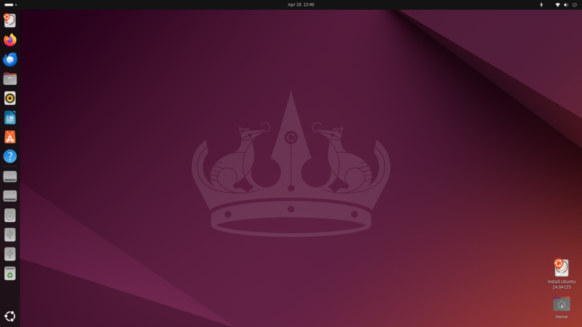

# The desktop & UI

*The desktop metaphor decoded — windows, icons, menus, pointers — and why every screen you'll ever test is built from the same handful of parts.*

> Why is it called a "desktop"? Why are they "windows"? Why is there a "trash can"?
> Because in the 1980s, engineers needed to explain computers to humans who had never
> seen one — so they drew an OFFICE DESK on the screen: papers (files), folders
> (folders!), a trash can, and windows to look through. The metaphor won so hard that
> forty years later you're reading this inside it. Time to see the furniture
> consciously — because testers judge this furniture for a living.

> **In real life**
>
> The **GUI**: Graphical User Interface — everything you see and click: windows, icons, menus, buttons. The visual layer the OS draws over its five jobs.
> is the hotel's **lobby and signage**. The manager (OS) does its real work in back
> offices you never see — but the lobby is how guests find anything: signs (icons),
> reception (menus), room doors (windows). A hotel with a confusing lobby is a bad
> hotel even if the plumbing is perfect. Apps are judged the same way — and that
> judgment has a job title.

## The furniture, on a real desktop

A clean Ubuntu Linux desktop (free-licensed, so we can dissect it — but every OS
has the same organs, arranged differently). Tap around:


*Screenshot: Ubuntu 24.04 — Wikimedia Commons, GPL. [Source](https://commons.wikimedia.org/wiki/File:Ubuntu_24.04_LTS_default_desktop_-_English.png)*
- **The dock / taskbar** — The row of app icons — launch, switch, and see what's running. Windows puts it at the bottom, macOS calls it the Dock, this Ubuntu puts it left. Same organ, different placement — your first cross-platform difference.
- **The clock & system bar** — Date, time, and the system menus. Boring? This clock is drawn by the OS itself — when it FREEZES, you know the whole manager is stuck, not just one app. Module 1 knowledge, on-screen.
- **Status icons — the dashboard** — Network, volume, battery, input language (remember the AZERTY mystery? Its switch lives here). Tiny icons, huge diagnostic value — the first place to LOOK when Wi-Fi 'is broken'.
- **Desktop icons** — Files and shortcuts living on the 'desk surface' itself — the purest part of the 1980s metaphor. Double-click to open: the gesture that launched a billion programs.
- **The power menu** — Sleep, restart, shut down — the holy trinity from Module 1, living in the top-right corner. Every OS keeps these behind one icon; knowing where saves you during a freeze.

## The four letters that built it all: WIMP

Every GUI since 1984 is made of the same four ingredients —
**W**indows, **I**cons, **M**enus, **P**ointer:

- **Windows** — each app gets a resizable rectangle to live in. Move, resize, minimize, overlap — the OS referees the geometry.
- **Icons** — pictures that stand for things: apps, files, actions. Faster to recognize than words (and language-independent — mostly).
- **Menus** — organized lists of actions, so nothing needs memorizing. Right-click's context menu = "what can I do to THIS thing?"
- **Pointer** — your remote hand. One pixel-precise finger for a machine with no idea where you're looking.

Phones remixed the recipe (touch replaced the pointer, apps went fullscreen) — but
icons, menus and gestures are the same ingredients wearing athleisure.

**What happens when you drag a window — press Play**

1. **🖱 You grab** — Mouse down on the title bar. The OS (not the app!) owns window geometry — the app doesn't even know it's being dragged yet.
2. **🎩 OS redraws** — Sixty-plus times per second, the OS repaints the window at the pointer's position — compositing it over everything behind it. That smoothness is job 4 flexing.
3. **🪟 Neighbors react** — Windows underneath get revealed and repainted; the taskbar updates; maybe edges snap to a grid. All refereed by the manager.
4. **📍 You drop** — Mouse up: the OS finalizes the geometry and tells the app its new position. The app mostly just... finds out where it now lives. Windows are OS territory.

*Try it — draw a window like an OS does*

```python
# A 'window' is a rectangle the OS draws. Change the size and title, press Run.
title = "My First Window"
width, height = 30, 6

print("┌" + "─" * (width - 2) + "┐")
print("│ " + title.ljust(width - 6) + "✕ │")
print("├" + "─" * (width - 2) + "┤")
for _ in range(height - 4):
    print("│" + " " * (width - 2) + "│")
print("└" + "─" * (width - 2) + "┘")
print("Congratulations: you just did the OS's job 4, in miniature.")
```

> **Tip**
>
> Tester lens: the GUI is your primary CRIME SCENE. Half of all bug reports are UI
> bugs: buttons off-screen (the resolution case from Module 1!), overlapping windows,
> menus that vanish, icons that lie about state. There's a whole discipline — UI/UX
> testing — with its own Track C module. Everything you learn to NAME here (title
> bar, context menu, focus, modal) becomes vocabulary for bugs later. "The thing was
> broken" vs "the modal dialog trapped focus and Escape didn't dismiss it" — one of
> these gets fixed.

### Your first time: Your mission: the furniture tour on YOUR machine

- [ ] Find your four WIMP parts — Locate your taskbar/dock, one icon, one menu bar, and your pointer settings (yes, the pointer has settings — speed, size, color).
- [ ] Master window geometry in 30 seconds — Drag a window by its title bar, resize from a corner, then try Windows key+arrows (Windows) or the green button (Mac) — snap and maximize. Testers arrange windows ALL day; the shortcuts compound.
- [ ] Right-click five different things — The desktop, a file, the taskbar, inside a text field, a browser tab. Different menus each time — context menus answer 'what can I do to THIS?'. Right-clicking everything is literally a tester habit.
- [ ] Find the focus — Open two windows and type — only ONE receives your keys: the focused one. Click the other; focus moves. 'Which window has focus' explains a thousand mysteries, including typing your password into the group chat.
- [ ] Check your status icons — Hover/click each little icon by the clock: network, sound, battery, language. Ten seconds of hovering = the machine's whole dashboard, memorized.

Furniture named, geometry mastered, focus understood. The lobby is now YOUR lobby.

- **A window is stuck OFF-SCREEN — I can see it in the taskbar but not on any display.**
  The classic multi-monitor leftover: the window remembers coordinates on a screen that's no longer there. Windows: hover the taskbar icon → right-click the preview → Move, then use arrow keys. Or Windows key+arrows to snap it back into view. The window was never gone — it was faithfully sitting at coordinates nobody can see. (Yes, this is a real bug class in apps too: 'restores to invalid position'.)
- **I'm typing and NOTHING appears — the keyboard 'died' again.**
  Check focus first: is the window you're looking at actually the focused one? A background click, a popup stealing focus, or a notification can move it silently. Click directly into the text field and retype. The Module 1 rule ('input works in layers') meets its most common everyday case: keys go to the focused window, not the watched one.
- **The desktop icons all vanished / the taskbar disappeared.**
  The GUI itself is drawn by a process (Explorer on Windows, the shell on Linux) — and processes can crash. Windows: Ctrl+Shift+Esc → find 'Windows Explorer' → Restart. The desktop rebuilds in seconds. You just End-Task'd the LOBBY and watched the manager redraw it — Module 1 process knowledge saving the day in the fanciest way possible.
- **Everything on screen is suddenly HUGE / tiny.**
  Display scaling changed — a shortcut mishap or a monitor reconnect. Settings → Display → Scale (100%/125%/150%). While there, remember the tester detail: apps must survive EVERY scale setting, and plenty don't — cut-off buttons at 150% scale is a genuinely common bug you now know how to cause on purpose.

### Where to check

The GUI's control room:

- **Display settings** — resolution, scale, multiple monitors, which is 'main'. Half of all 'looks wrong' reports resolve here.
- **Taskbar/dock settings** — position, hiding, which icons show. (Auto-hide taskbar 'disappearing' scares someone every day.)
- **Accessibility settings** — pointer size, contrast, text size: the GUI's adaptability panel, and a preview of Track C's accessibility module.
- **The shell process** in Task Manager — the GUI is software with a name; when the lobby glitches, its process can be restarted like any other.

UI bugs get screenshots. Every bug tracker on Earth: 'attach a screenshot'. Learn
your OS's shortcut now — Windows key+Shift+S (Windows) / Cmd+Shift+4 (Mac) — and
you've acquired the single most-used tester tool after the keyboard itself.

### Worked example: the button that existed but couldn't be clicked

A UI mystery, walked with furniture vocabulary:

1. **Report:** "the Submit button doesn't work." Vague — so reproduce: the button IS visible, but clicks do nothing. Hover doesn't highlight it either.
2. **Furniture check:** no highlight on hover = the clicks aren't REACHING it. Something invisible is on top — and there it is: a transparent overlay from a dismissed popup that never actually closed. The pointer is clicking the ghost, not the button.
3. **Confirm:** press Tab until focus reaches the button, press Enter — it works! Keyboard path bypasses the overlay. Mouse path is blocked. Now THAT is a precise bug.
4. **Verdict:** filed as 'dismissed modal leaves invisible click-blocking overlay; keyboard activation unaffected'. The developer knew where to look immediately. 'Button doesn't work' would have bounced back 'cannot reproduce' — furniture vocabulary made it fixable.

> **Common mistake**
>
> Assuming everyone's screen looks like yours. Different OS, theme, scale, resolution,
> font size, language (German buttons are LONG) — the same app wears a hundred
> outfits. 'It looks fine' is always 'it looks fine ON MINE'. Testers write WHICH
> outfit: OS + resolution + scale + theme. You've been building that environment line
> since Module 1 — the GUI just added three more fields to it.

**Quiz.** A user reports: 'I keep typing my message and nothing appears, then suddenly three messages send at once from the search bar.' What's the GUI diagnosis?

- [ ] Their keyboard is broken
- [x] Focus is moving without them noticing — something (popup? notification? click) shifts focus, their keys land elsewhere, then Enter fires wherever focus ended up
- [ ] The app is haunted
- [ ] They type too fast for the computer

*Keys always go to the FOCUSED element — and focus can move silently. Something steals it (a notification, an auto-focusing popup), their typing lands in the wrong field, and Enter 'sends' from there. Focus-stealing is a genuine, hated bug class — and 'where was focus?' is the professional first question for any typing mystery.*

- **GUI** — Graphical User Interface — the visual layer (windows, icons, menus, pointer) the OS draws over its five jobs. The lobby of the hotel.
- **WIMP** — Windows, Icons, Menus, Pointer — the four ingredients of every desktop GUI since 1984. Phones remixed it; the ingredients survived.
- **Focus** — The one window/field currently receiving keyboard input. Silent focus moves explain most 'my typing vanished' mysteries.
- **Context menu** — Right-click's menu: 'what can I do to THIS thing?' Different for every object — and a tester right-clicks everything.
- **Display scaling** — The 100%/125%/150% zoom the OS applies to everything. Apps must survive every setting; cut-off buttons at high scale is a classic bug.

### Challenge

Take three screenshots with your OS's snipping shortcut (learn it now: Windows
key+Shift+S / Cmd+Shift+4): (1) your whole desktop, (2) one window, (3) one small
UI detail you've never noticed before. Attach-worthy screenshots are a tester's
daily currency — and screenshot #3 trains the noticing muscle. Bonus: find one UI
oddity on your OWN machine (misaligned icon? truncated text?) — congratulations,
your first UI bug observation.

### Ask the community

> UI issue on [OS + version, scale %, resolution]: [element] does [behavior] when [action]. Focus check: [done?]. Screenshot: [attached]. Is this a known [OS/app] furniture bug?

UI questions live and die by the screenshot plus the furniture words — 'the modal',
'the context menu', 'focus' — which you now speak. Screenshot + vocabulary + scale
setting = the difference between 'weird glitch??' and an answerable report.

- [GCFGlobal — getting to know your OS's interface](https://edu.gcfglobal.org/en/computerbasics/getting-to-know-the-os/1/)
- [Crash Course — Graphical User Interfaces (the 1984 story)](https://www.youtube.com/watch?v=XIGSJshYb90)
- [Nielsen — the 10 usability heuristics (Track C preview)](https://www.nngroup.com/articles/ten-usability-heuristics/)

🎬 [Crash Course — Graphical User Interfaces](https://www.youtube.com/watch?v=XIGSJshYb90) (12 min)

- The desktop is a 40-year-old metaphor: desk, papers, folders, trash. It won so hard you live inside it.
- WIMP — windows, icons, menus, pointer — builds every GUI. Phones remixed it; the ingredients remain.
- Focus decides where keys go, and it moves silently. 'Where was focus?' solves typing mysteries.
- The GUI is drawn by a process — it can glitch, crash and be restarted like any software. Because it is.
- Same app, hundred outfits: OS + resolution + scale + theme. UI bug reports name the outfit and attach the screenshot.


---
_Source: `packages/curriculum/content/notes/operating-systems-and-files/what-an-os-does/the-desktop-and-ui.mdx`_
