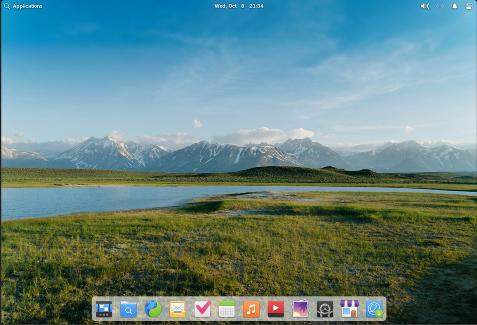

# macOS tour

*Apple's desktop OS toured landmark by landmark — the always-on-top menu bar, the Dock, Cmd-instead-of-Ctrl, Finder, and the tester traps of the walled garden.*

> Hand a lifelong Windows user a Mac and watch the rituals fail: Ctrl+C does
> nothing (it's Cmd+C), closing the last window doesn't quit the app, the menus
> aren't even ON the window — they've moved to the top of the screen. Nothing is
> broken. It's a different country with different customs — and since designers,
> developers and a chunk of your future users live here, a tester learns the
> customs.

> **In real life**
>
> If Windows is the giant international airport, macOS is the **boutique airport
> with one airline**. Fewer destinations, but every gate matches, the signage is
> beautiful, and the airline controls the whole building — plane, gate, coffee
> shop. Smoother by design, stricter by design: the same trade, made the opposite
> way. (The one-airline model has a name you'll meet below: the walled garden.)

## The landmarks

Same licensing story as the Windows tour: real macOS screenshots are
copyrighted, so here's **elementary OS — a free system famous for using the Mac
layout**. Every landmark maps:


*Screenshot: elementary OS 8 — Wikimedia Commons, GPLv3. [Source](https://commons.wikimedia.org/wiki/File:Elementary_OS_8.0_default_desktop_-_English.png)*
- **Top-left — where the  menu lives** — On a real Mac: the Apple menu (About This Mac, System Settings, Shut Down) followed by the ACTIVE APP's menus. Yes — the menu bar belongs to the screen, not the window. One menu bar, always on top, changing with whichever app has focus.
- **The menu bar clock — and Spotlight country** — Top-center/right on a real Mac holds the clock and the Spotlight search icon. Cmd+Space opens Spotlight — the launch-by-typing you already drilled; macOS made it famous.
- **Status icons — the menu bar extras** — Wi-Fi, battery, volume, Control Center: the Mac's dashboard lives top-right (Windows keeps it bottom-right — same organs, opposite corner).
- **The Dock — macOS' signature strip** — Launcher + running apps in one centered row. A dot under an icon = that app is RUNNING (remember: closing its windows doesn't quit it — the dot is the truth).
- **Finder — the Mac's file manager** — The smiling face at the Dock's start on a real Mac: Finder, macOS' File Explorer. Same file-manager organs from Common OS tasks; different customs (Cmd+C/Cmd+V, and 'cut' works differently — paste with Cmd+Option+V to move).

## The customs that matter (tester edition)

- **Cmd, not Ctrl** — every shortcut you drilled swaps modifier: Cmd+C/V/Z/F/Tab. Muscle memory transfers in a day; knowing BOTH dialects is a job skill.
- **The red ✕ doesn't quit** — closing the last window leaves the app RUNNING (dot in the Dock). Real quit = Cmd+Q. Testers must know which state they're testing: window-closed-but-alive is a real app state with real bugs.
- **One menu bar, top of screen** — menus belong to the focused APP, not the window. UI tests and user instructions must account for it.
- **Paths look like Linux** — `/Users/sajan/Documents`, forward slashes, no drive letters. macOS is Unix under the paint — which is why developers love it, and why your Linux knowledge (next topic) half-applies here.
- **The walled garden** — apps are signed and checked (Gatekeeper); unsigned apps need explicit permission. Fewer malware incidents, more "why can't I install this" moments — the exact opposite trade from Windows' freedom.
- **Case-insensitive by default (but weirder)** — like Windows for most disks, UNLIKE the Linux servers it resembles. The trap from the Windows tour, wearing a turtleneck.

**The Mac way: focus moves, the menu bar follows — press Play**

1. **🌐 Browser focused** — The single top menu bar shows: Safari — File, Edit, View... The browser owns the bar right now.
2. **📝 Click a text editor** — Same bar, new owner: the menus INSTANTLY swap to the editor's — File, Edit, Format... The bar never moved; its contents follow focus.
3. **🖼 Click the desktop** — Now Finder owns the bar. One bar, whole screen, always the focused app. Windows users look for menus on the window and find nothing — nothing is missing, it's all upstairs.
4. **⌨️ Cmd+Q vs red ✕** — Close the editor's window: the bar STILL says the editor's name — it's alive without windows (dot in the Dock). Cmd+Q actually quits. Two different states; testers test both.

*Try it — the shortcut translator*

```python
# Windows/Linux muscle memory → Mac dialect. Add your own daily shortcuts.
translations = {
    "Ctrl+C (copy)":        "Cmd+C",
    "Ctrl+V (paste)":       "Cmd+V",
    "Ctrl+Z (undo)":        "Cmd+Z",
    "Alt+Tab (switch app)": "Cmd+Tab",
    "Ctrl+Shift+Esc":       "Cmd+Option+Esc (force quit)",
    "Windows key + type":   "Cmd+Space (Spotlight)",
    "F2 (rename)":          "Enter (yes, Enter renames on Mac)",
}
print("WINDOWS/LINUX              →  MAC")
for w, m in translations.items():
    print(f"{w:26} →  {m}")
print()
print("Same brain, different modifier. Fluency in both = a hiring point.")
```

> **Tip**
>
> Why testers care about macOS: it's disproportionately what DESIGNERS and
> DEVELOPERS use — meaning apps often get built and demoed on Macs, then break
> on the Windows zoo (the backslash worked example was born exactly this way).
> Also: Safari. macOS is the only place desktop Safari exists, and Safari's
> rendering quirks are their own testing specialty — this very platform's e2e
> suite runs WebKit for precisely that reason. Mac coverage = Safari coverage.

### Your first time: Your mission: the customs check (Mac users directly; others via the playground + a borrowed Mac someday)

- [ ] Speak Spotlight — Cmd+Space, type 'calc', Enter. Same launch-by-typing habit, Mac dialect. (Non-Mac: you already have the Windows/Linux version in muscle memory.)
- [ ] Watch the menu bar change owners — Click between two apps and watch the top-left app name swap. The FlowAnimation above, live on real hardware.
- [ ] Catch an app alive-without-windows — Close a Dock app's last window: the dot stays. Cmd+Q: the dot leaves. Two states, now witnessed — remember them when a 'closed' app still holds a file lock.
- [ ] Read a Mac path — Finder → any file → Cmd+I (Get Info): /Users/you/... Forward slashes, no C: — the Unix ancestry showing through the paint.
- [ ] Find the force-quit ritual — Cmd+Option+Esc = the Mac's Ctrl+Alt+Del. Locate it before you need it — freezes don't schedule appointments.

Customs learned, dialect translated, both quit-states witnessed. Dual citizenship
in progress.

- **An app is frozen — beachball of doom spinning forever.**
  The rainbow beachball = macOS' 'Not Responding'. Cmd+Option+Esc → Force Quit the offender (the Mac's End Task). Same Module 1 rules apply: one beachballing app = guest problem; the whole system beachballing = manager problem, much rarer.
- **'App can't be opened because it is from an unidentified developer.'**
  Gatekeeper — the garden wall doing its job on an unsigned app. If you truly trust the source: System Settings → Privacy & Security → 'Open Anyway' (appears after the first block). Testers meet this constantly with internal test builds — knowing the gate is half the job of testing on Macs.
- **I closed the app but the file it had open is still 'in use'.**
  Closed the WINDOW, not the app — the dot in the Dock tells the truth. Cmd+Q the app properly and the lock releases. The two-state lesson, now costing someone a saved file: this is why testers explicitly test the window-closed-but-running state.
- **My keyboard shortcuts 'don't work' on this Mac (says every Windows user, day one).**
  They work — they're spelled differently. Run the translator from the playground above: Cmd replaces Ctrl almost everywhere, Cmd+Tab switches apps, Enter renames. Give muscle memory 2-3 days; keep a sticky note of the five you use most. Every cross-platform tester has lived this exact week.

### Where to check

The Mac's record offices, mapped to what you know:

- ** → About This Mac** — macOS version (e.g., 'macOS 15.2'), chip, memory: the environment line, Apple flavor.
- **Activity Monitor** (Spotlight → 'activity') — Task Manager's Mac twin: processes, CPU, memory, energy.
- **Console** — the OS diary (Event Viewer's twin): crashes and errors, timestamped.
- **System Settings → Privacy & Security** — the key cabinet AND Gatekeeper's gate, one address.

Every Module 1-2 tool has a Mac name — the concepts never changed, only the
signage.

### Worked example: the 'lost' report that was never lost — Mac quit-state edition

A Mac-customs mystery, walked:

1. **Panic report:** "the editor CRASHED and ate my document — the window vanished!" A Windows-native user, first week on a Mac.
2. **Check the Dock:** the editor's dot is still there — the app didn't crash; the user hit the red ✕ expecting Windows behavior (close = quit). The app quietly kept running, document open, window gone.
3. **Recover:** click the Dock icon — the window returns, document intact, unsaved changes and all. Nothing was ever lost.
4. **Verdict:** not a bug — a customs collision. But note the REAL finding: if this app's window-close behavior confuses migrating users this reliably, that's UX feedback worth filing. Testers report confusion patterns, not just crashes — half of quality is 'did the user understand what happened?'

> **Common mistake**
>
> Treating macOS as 'just prettier Windows'. The customs differ at the CONCEPT
> level — quit vs close, one menu bar, Gatekeeper's gate, Unix paths — and app
> behavior differs with them. Testing a Mac build by walking your Windows test
> script clicks the wrong things in the wrong places and misses the states that
> only exist here (window-closed-but-alive!). Port the INTENT of tests, never the
> clicks. That sentence will earn you money someday.

Finder

**Quiz.** A cross-platform app locks a data file while running. On Windows, closing the window releases the lock. QA gets a Mac-only bug: 'file stays locked after closing'. Why does this happen and is it a bug?

- [ ] Macs have broken file systems
- [x] On macOS, closing the window doesn't quit the app — it keeps running (and holding the lock). The app should release the lock on window-close or the report should note Cmd+Q releases it. Platform-behavior difference, genuinely worth filing.
- [ ] The user imagined it
- [ ] Windows is just better

*The two-state custom strikes: window-closed ≠ quit on macOS, so the process legitimately lives and holds its lock. Whether that's 'working as designed' or 'should release on close' is a real product decision — which makes it a real, well-founded report either way. Cross-platform testing = knowing which behaviors are platform customs vs bugs.*

- **Cmd+Space** — Spotlight — the Mac's launch-by-typing. The Windows-key habit, different modifier.
- **Red ✕ vs Cmd+Q** — Close window ≠ quit app on macOS. The Dock dot tells the truth. Two distinct app states — test both.
- **The global menu bar** — One bar, top of screen, owned by whichever app has focus. Menus follow focus, not windows.
- **Gatekeeper** — macOS' signed-apps gate: unsigned apps blocked until explicitly allowed (Privacy & Security). The walled garden's front door.
- **Cmd+Option+Esc** — Force Quit — the Mac's Ctrl+Alt+Del. Beachball's natural predator.

### Challenge

Write the 'customs collision' list for an app you know: which THREE behaviors
would confuse a user migrating Windows→Mac (or Mac→Windows)? Think: quitting,
shortcuts, menus, file dialogs. You've just drafted the platform-differences
section of a cross-platform test plan — Track C teaches the formal version, but
the instinct is now installed.

### Ask the community

> macOS [version from About This Mac] behavior: [exact]. Coming from [Windows/Linux] so possibly a customs thing: is [behavior] a Mac convention or an actual bug? Dock state: [dot present?]. Gatekeeper involved: [yes/no].

Mac questions from migrants are half customs, half bugs — saying which OS you
came FROM lets answerers spot the collision instantly. 'Is this a convention or
a bug?' is a genuinely professional question; you'll ask it in test triage
forever.

- [GCFGlobal — macOS basics course](https://edu.gcfglobal.org/en/macosbasics/)
- [Apple — the official macOS user guide](https://support.apple.com/guide/mac-help/welcome/mac)
- [Mac tutorial for Windows users — the customs, demonstrated](https://www.youtube.com/watch?v=67keaaWOKzE)

🎬 [Mac for Windows users — the customs tour](https://www.youtube.com/watch?v=67keaaWOKzE) (14 min)

- macOS = the boutique one-airline airport: fewer configs, tighter control, smoother by design, stricter by design.
- The customs: Cmd not Ctrl, red ✕ ≠ quit (Cmd+Q does), one menu bar following focus, Unix paths under the paint.
- Gatekeeper guards the walled garden — testers testing unsigned builds meet it weekly.
- Mac coverage = Safari coverage: the only desktop Safari lives here, and it renders its own way.
- Port the intent of tests across platforms, never the clicks — customs differ at the concept level.


---
_Source: `packages/curriculum/content/notes/operating-systems-and-files/windows-macos-and-linux/macos-tour.mdx`_
