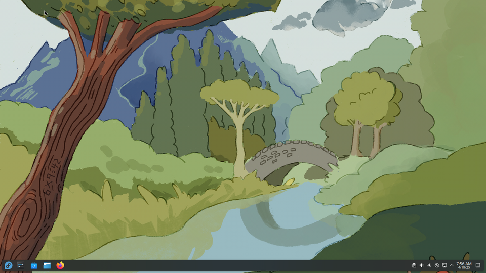

# Windows tour

*The world's most common desktop OS, toured landmark by landmark — Start, taskbar, File Explorer, drive letters, and the quirks every tester must know.*

> Roughly seven out of ten desktop computers on Earth run Windows. Whatever you end
> up testing, a huge slice of your users lives here — with its Start menu, its
> `C:\` drives, its backslashes and its Ctrl+Alt+Del folklore. Today you tour the
> territory like a professional visitor: landmarks first, quirks second, tester
> traps clearly marked.

> **In real life**
>
> Windows is the **giant international airport** of operating systems: not always
> elegant, occasionally chaotic, but it connects EVERYBODY — every printer, every
> ancient office app, every game, every corporate IT department. Other airports are
> prettier; this one has a flight to everywhere, which is exactly why seven in ten
> travelers pass through it.

## The landmarks

Fun licensing fact with your tour: real Windows screenshots are copyrighted, so
this is **KDE Plasma — a free desktop that uses the same layout** (and proof the
layout itself is the idea that won). Every landmark maps one-to-one:


*Screenshot: Fedora KDE Plasma — Wikimedia Commons, GPL. [Source](https://commons.wikimedia.org/wiki/File:Fedora_42_KDE_Plasma_Desktop_English.png)*
- **The launcher — Windows' Start menu** — Bottom-left corner: THE landmark. On real Windows this is the Start button — apps, search, power options, one click. Pressing the Windows KEY opens it; typing immediately searches. Start-then-type is the fastest way to launch anything, and you drilled it in Common OS tasks.
- **The taskbar — running + pinned apps** — Windows' signature strip: pinned favorites and every open window, always visible along the bottom. Click to switch, right-click for options. When someone says 'it's in the taskbar', this is where they mean.
- **The system tray — background-app corner** — Tiny icons of everything running quietly: antivirus, sync clients, audio, network. The visible tip of the background-process iceberg from Module 1 — and the first place to check what's auto-running.
- **Clock + notification corner** — Time, date, and notification center. On real Windows, clicking here opens quick settings (Wi-Fi, volume, brightness) — the control strip users find by accident.
- **The desktop itself** — Files, shortcuts and wallpaper. Real Windows layers File Explorer on top — same file manager organs you toured in Common OS tasks, Windows flavor.

## The quirks that matter (tester edition)

- **Drive letters** — Windows names storage `C:` (the main disk), `D:`, `E:`... A historical leftover (A: and B: were floppy drives — ask a museum). Paths look like `C:\Users\Sajan\Documents`.
- **Backslashes** — Windows paths use `\`; the whole rest of computing uses `/`. This single character difference breaks countless cross-platform apps — and generates real bugs you WILL file someday.
- **Case-insensitive files** — `Report.txt` and `report.txt` are the SAME file on Windows, different files on Linux servers. Cross-platform bug factory #2.
- **.exe and installers** — programs arrive as `.exe`/`.msi` installers from anywhere on the internet (an app store exists; the internet remains the real store). Freedom + risk in one design choice — the install chapter digs in.
- **Ctrl+Alt+Del** — the sacred keys: opens the emergency menu with Task Manager. When everything is stuck, this survives.
- **The registry** — a giant hidden settings database for the whole system. You don't touch it (yet); you just know its name, because error messages mention it and grown-up bug reports occasionally cite it.

**A Windows session, landmark by landmark — press Play**

1. **🔑 Login** — Password, PIN or fingerprint — Windows Hello. The OS loads YOUR profile: wallpaper, files, settings. Same machine, different user = different world.
2. **🏠 Desktop + taskbar** — The landmarks assemble: taskbar below, tray on the right, icons on the desk. Startup apps pile in (Module 1 alumni will now check what auto-started).
3. **🚀 Windows key → type** — Launch anything: tap the Windows key, type three letters, Enter. No menu-hunting. This one habit marks experienced users at fifty paces.
4. **🧰 Ctrl+Shift+Esc when needed** — Task Manager on speed dial — processes, performance, startup apps: the whole Module 1 toolkit lives behind one shortcut on this OS.

*Try it — speak Windows paths vs everyone else's*

```python
# The backslash problem, demonstrated. One path, two dialects.
import ntpath, posixpath

folder = "Users"; user = "sajan"; file = "bug-report.txt"

win = ntpath.join("C:\\\\", folder, user, file)
unix = posixpath.join("/", "home", user, file)

print("Windows says :", win)
print("Linux/Mac say:", unix)
print()
print("Same idea, different dialect — and mixing them up is a REAL bug class.")
```

> **Tip**
>
> Why testers care about Windows specifically: it's where your least technical
> users live, on the widest zoo of hardware (every manufacturer, every driver,
> every screen scale from Module 1), often on older versions. "Works on the dev's
> MacBook, breaks on a 3-year-old Windows laptop at 125% scale" is not a joke —
> it's a Tuesday. Windows coverage is usually the FIRST row of any test matrix.

### Your first time: Your mission: the tourist checklist (Windows users — others, observe a friend's)

- [ ] Press the Windows key and just type 'calc' — Calculator appears before you finish. Launch-by-typing: adopted. (On non-Windows, note your OS's equivalent — you drilled it already.)
- [ ] Find your drive letters — File Explorer → This PC: there's C:, maybe D:. Meet the 1980s naming scheme still running the world.
- [ ] Read one full Windows path — Click any file → Properties → Location. Read it aloud: 'C, colon, backslash, Users...' — the dialect from the playground above, on your own disk.
- [ ] Visit the system tray — Bottom-right: click the little arrow (hidden icons). Count the quiet background residents. Any surprises = your startup-audit skills from Module 1 want a word.
- [ ] Summon Task Manager the sacred way — Ctrl+Shift+Esc (direct) — then once via Ctrl+Alt+Del to see the emergency menu. Two roads to the same CCTV; the second works even mid-freeze.

Landmarks visited, dialect spoken, emergency exits located. You're no longer a
tourist here.

- **Everything is frozen and even the taskbar won't respond.**
  The sacred keys: Ctrl+Alt+Del — this screen is drawn by the most protected part of Windows and usually survives when everything else drowns. From it: Task Manager → end the offender. If even Ctrl+Alt+Del is dead, it's a system-level freeze (Module 2 ch1 taught you the difference) — fire-escape time.
- **'Windows protected your PC' blocks an app I downloaded on purpose.**
  SmartScreen — Windows' bouncer for internet-downloaded apps. For software you genuinely trust (verified the source!): 'More info' → 'Run anyway'. The bouncer is right more often than users think — the install chapter covers how to judge sources. When testing your own unsigned builds someday, you'll meet this screen weekly.
- **An update restarted my machine overnight and closed everything.**
  Windows Update's infamous move. Damage control: Settings → Windows Update → set Active Hours so it won't restart while you work, and pause updates before critical days. But don't disable updates entirely — unpatched Windows is the #1 malware buffet, and the security track will make you allergic to that idea.
- **A program 'is not responding' — but only sometimes, and only on my machine, not my colleague's.**
  Welcome to the Windows hardware zoo: different drivers, different startup residents, different antivirus hooking into everything. The Module 1 environment-diff applies: compare startup apps, antivirus, driver versions. Windows' diversity is exactly why it needs the most testing — you're living the reason.

### Where to check

Windows' record offices, mapped to what you already know:

- **Settings → System → About** — edition and version (e.g., 'Windows 11 24H2'): the exact string for the environment line.
- **Task Manager** (Ctrl+Shift+Esc) — processes, performance, startup apps: the Module 1 trinity, Windows flavor.
- **Event Viewer** — the OS diary (search it from Start). Crashes, errors, the 3 AM truth.
- **Device Manager** — the translator registry with its yellow ⚠ warnings.

Everything this module taught has a Windows address — and now you know each one.

### Worked example: the app that broke only on Windows — the backslash strikes

A classic cross-platform bug, walked:

1. **Report:** a web app's file-upload works for Mac users, fails for Windows users with 'invalid file path'. Same browser, same app version.
2. **Environment diff:** the only systematic difference is the OS — and the failing paths in the error logs contain `C:\Users\...` with backslashes.
3. **Hypothesis:** the app splits paths on `/` (developer wrote it on a Mac), so Windows paths never split correctly — the whole path is treated as one weird filename.
4. **Verdict:** reproduced with any Windows path, filed with the exact dialect explanation. One character (`\` vs `/`), thousands of affected users, found by asking Module 1's question: 'what's different about the failing environment?' Cross-platform testing exists because of exactly this.

> **Common mistake**
>
> Testing only on the latest, cleanest Windows. Real users run last year's version,
> 50 startup apps, an aggressive antivirus, 125% scale and a decade of accumulated
> drivers. A fresh Windows VM passes everything; the wild Windows population is
> where apps go to be humbled. When you build test matrices later, 'which WindowsES'
> (plural) is the professional question.

Registry

**Quiz.** A file saved as 'Report.TXT' on Windows can't be found by the same app running on a Linux server looking for 'report.txt'. What bit?

- [ ] The file was deleted in transit
- [x] Case sensitivity: Windows treats them as the same file, Linux as two different files — a classic cross-platform trap
- [ ] Linux can't read text files
- [ ] The backslashes ate it

*Windows is case-insensitive (Report.TXT = report.txt); Linux is case-sensitive (two distinct names). Code that works flawlessly on the developer's Windows machine loses files on the Linux server. This exact bug ships constantly — and testers who know BOTH dialects catch it before users do.*

- **Start + type** — Windows' fastest launcher: tap the Windows key, type 3 letters, Enter. The habit that marks experienced users.
- **C:\\ and backslashes** — Windows paths: drive letters + `\\`. The rest of computing uses `/`. One character, a whole cross-platform bug class.
- **Ctrl+Alt+Del / Ctrl+Shift+Esc** — The emergency menu / direct Task Manager. Drawn by protected code — survives freezes that kill everything else.
- **Case-insensitive files** — Report.txt = report.txt on Windows, two different files on Linux. Cross-platform trap #2 after backslashes.
- **The Windows zoo** — Widest hardware/driver/version diversity of any OS = why Windows needs the most testing and heads every test matrix.

### Challenge

Write the Windows row of a test matrix for any app you use: which Windows
versions would you test (current + how far back?), at which display scales
(100%/125%/150% — Module 1!), with what security software present? Three
decisions, one row. Compare with what the app's team probably tested. Feel the
gap? That gap is where its Windows bugs live.

### Ask the community

> Windows [version, from Settings → About] issue: [exact behavior]. Environment: [scale %, antivirus, recent updates]. Same app works on [other OS/machine?]. Which Windows quirk am I hitting?

Windows questions need the version string (there are MANY Windowses) and the
environment details — its diversity is the whole diagnostic game. You've been
collecting these facts since Module 1; here they earn their keep.

- [GCFGlobal — Windows basics course (free, gentle)](https://edu.gcfglobal.org/en/windowsbasics/)
- [Windows keyboard shortcuts that change everything](https://www.youtube.com/watch?v=KXYxxQ1F4-M)
- [Microsoft Support — the official manual](https://support.microsoft.com/en-us/windows)

🎬 [Windows shortcuts that change everything](https://www.youtube.com/watch?v=KXYxxQ1F4-M) (9 min)

- Windows = the everything-airport: ~70% of desktops, widest hardware zoo, first row of every test matrix.
- Landmarks: Start (Windows key + type!), taskbar, system tray, Task Manager behind Ctrl+Shift+Esc.
- The dialect: C:\\ drives, backslashes, case-insensitive files — each one a real cross-platform bug class.
- Ctrl+Alt+Del survives almost any freeze — protected code draws it.
- Test the wild Windows (old versions, 125% scale, antivirus present), not the lab one. That's where the bugs are.


---
_Source: `packages/curriculum/content/notes/operating-systems-and-files/windows-macos-and-linux/windows-tour.mdx`_
