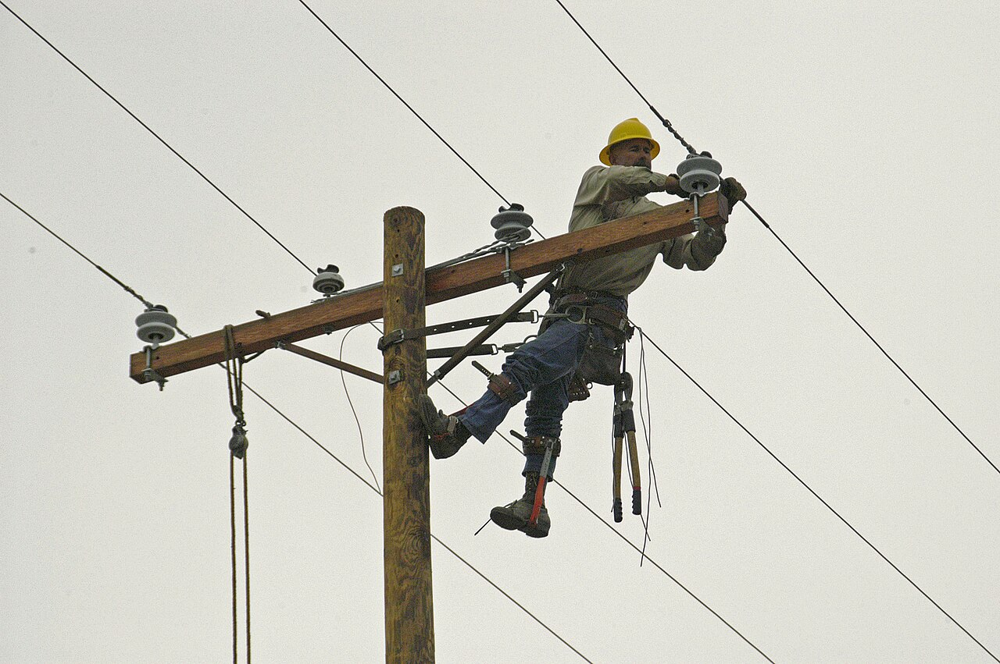

# Recovery

*Surviving overload is only half the test - the other half is what happens when the overload ends. Systems can stay 'up' yet remain unusable for an hour behind a queued backlog, and some never come back without a human. Recovery time and recovery style are findings in their own right.*

> The spike test 'passes': traffic surged to five times capacity, the system slowed but never
> crashed, and when the surge ended the dashboards went green again. Ship it? One question first -
> how LONG after the surge did users wait for a normal page? Because there is a version of this
> story where the honest answer is 'twenty-five minutes': the surge lasted five, and the backlog it
> left behind punished every user who arrived AFTER the emergency was over. The system survived; the
> users who showed up during the cleanup did not. That difference - between staying alive and coming
> back - is what recovery testing measures.

> **In real life**
>
> A storm knocks power lines down across a town. Nobody judges the electric company by whether the
> storm happened - storms happen. They judge it by what comes next: are crews on the poles within
> the hour, or three days later? Does power return neighborhood by neighborhood in a planned order -
> hospital first, then homes - or does the grid limp back all at once and trip again from the
> surge of every air conditioner restarting together? Two towns can take the identical storm and
> have completely different weeks. Software is the same: the spike is the storm, and recovery -
> how fast, how orderly, and whether restoration itself causes a second failure - is the part the
> company actually controls.

**Recovery**: Recovery, in performance testing, is a system's return to normal behavior after a period of overload or failure - and it is measured, not assumed. The key questions: how long from the end of the overload until response times and error rates return to baseline (recovery time)? Does the system recover by ITSELF, or does it need human intervention like a restart (self-healing vs manual)? And does anything remain damaged afterwards - lost jobs, corrupted state, a backlog still being chewed through? A spike or stress test that stops measuring the moment the load drops has skipped the second half of its own result.

## What recovery looks like when you actually measure it

- **Recovery time is its own metric.** Load returns to normal at 12:05; when do USERS get normal
  service back - 12:05, 12:20, or tomorrow? The gap is the backlog draining, caches rewarming,
  connection pools resetting. Two systems with identical spike behavior can differ by an hour
  here.
- **Self-healing beats manual, and the difference is a test result.** 'Recovers alone in 90
  seconds' and 'recovers when on-call restarts three services' are different products. If the
  test never watched the aftermath, nobody knows which one shipped.
- **Queues are where recovery goes to die.** A system that accepts every request during overload
  builds a backlog; after the spike, new arrivals wait behind thousands of stale requests - many
  for users who gave up long ago. Work on dead requests delays live ones: the overload is
  gone, the punishment continues.
- **Load shedding is the counterintuitive fix.** Refusing excess work FAST (a clear error in
  200 ms beats a spinner for 30 seconds) keeps the queue short, so the moment the surge ends,
  service is instantly normal. Systems that say no during the storm recover first - the ones that
  heroically accept everything recover last.
- **Watch for the death spiral.** Slow responses trigger client timeouts; timeouts trigger
  retries; retries ADD load to an already-overloaded system. Past a certain point the system keeps
  itself overloaded even after real users leave. If load drops but internal traffic stays high,
  you have found one - a finding worth a severity level of its own.
- **Recovery can also lose things.** After the backlog drains, check the ledger: were queued jobs
  dropped? Emails sent twice? Orders half-processed? 'Back to normal speed' with quietly missing
  work is not recovered - it is a data-integrity bug wearing a green dashboard.

> **Tip**
>
> The cheapest upgrade to any spike or stress test: do not stop measuring when the load stops. Keep
> the monitoring running for 15-30 minutes after, and put one number in the report - 'time from
> end-of-overload to baseline response times'. That single number turns 'it survived' into a real
> verdict, and the first time it reads 25 minutes instead of 2, it will justify every test you run
> afterwards.

> **Common mistake**
>
> Judging recovery from the server's point of view instead of the user's. Dashboards say CPU is back
> to 40%, memory normal, 'system healthy' - but the queue still holds eight thousand stale requests,
> so a user arriving NOW waits ninety seconds. Health metrics recover before user experience does,
> sometimes by half an hour. Always measure recovery as 'when did a FRESH request get a normal
> response again' - send one yourself every few seconds after the test and watch when it comes back
> to baseline - not 'when did the graphs calm down'.


*Power restoration after Hurricane Rita, Cameron, Louisiana — Marvin Nauman / FEMA, Wikimedia Commons, Public domain. [Source](https://commons.wikimedia.org/wiki/File:FEMA_-_20472_-_Photograph_by_Marvin_Nauman_taken_on_11-10-2005_in_Louisiana.jpg)*
- **The lineman — manual recovery has a cost** — This is what 'needs human intervention' looks like: a skilled person, physically on the pole, per failure, per site. Systems that self-heal after overload skip this entirely - and 'self-healing vs needs-a-human' is a test finding you can only make if the test watches what happens after the load drops.
- **The wire being reconnected — the path back to service** — Until THIS line is live again, everyone downstream waits - however healthy the rest of the grid looks. Software recovery has the same shape: one drained queue or rewarmed cache is often the single path everything else waits behind. Finding which piece recovers LAST tells you your real recovery time.
- **The pole still standing — what survived vs what needs rebuilding** — The storm took the wires but not the pole - so restoration takes hours, not weeks. Ask the same of your system after overload: what stayed intact (processes, data) and what needs rebuilding (connections, caches, queue state)? The less that needs rebuilding, the faster the comeback.
- **The safety harness — recovering without making it worse** — Rushing recovery creates second accidents - for the grid, a surge that trips everything again; for software, the classic is restarting into a thundering herd: every client that was waiting retries at once and knocks the system straight back down. Recovery procedures need the same care as the failure response itself.
- **The pulley rope — preparation determines recovery speed** — Crews stage equipment before storms; that is why restoration takes hours instead of days. The software equivalent is what your team prepared BEFORE overload: load shedding configured, backpressure limits set, runbooks written. Recovery speed is mostly decided before the spike ever arrives - which is exactly why it is testable in advance.

**Two systems, same spike - watch the aftermath, not the storm - press Play**

1. **The spike hits both systems: 5x capacity for five minutes** — System A queues every request - nothing refused, waits grow silently. System B sheds what it cannot handle - excess requests get a fast, clear 'try again' error. During the spike, A looks kinder: no errors on the dashboard.
2. **The spike ends. Real traffic is back to normal** — System B is instantly normal - its queue never grew, so the first post-spike user gets a fast response. System A now owns a backlog of thousands of requests, most for users who gave up minutes ago.
3. **The aftermath punishes System A's users** — Every NEW request waits behind the stale backlog. The overload is over, but users arriving now - during the 'recovery' - wait 20 seconds for pages. Worse: their timeouts trigger retries, adding load. This is how death spirals start.
4. **The report tells the real story** — A: 'zero errors during spike; recovery to baseline: 24 minutes; retry amplification observed.' B: 'errors served during spike: 78% (fast + clear); recovery to baseline: under 1 minute.' B failed the storm and won the week - which is the finding.

The whole story in one runnable simulation - a system that queues everything versus one that sheds
overload, and what each one's aftermath looks like:

*Run it - the same spike, two very different recoveries (Python)*

```python
# Two systems survive the same 5-second overload. Watch what happens AFTER it ends.

CAPACITY = 100  # requests/second each system can process

def simulate(name, sheds_excess):
    print(f"--- {name} ---")
    queue = 0
    # 5 seconds of 500 rps spike, then normal 50 rps traffic
    timeline = [500] * 5 + [50] * 7
    recovered_at = None
    for second, arriving in enumerate(timeline, start=1):
        if sheds_excess and arriving > CAPACITY:
            accepted = CAPACITY  # overflow is rejected fast with a clear error
            shed = arriving - CAPACITY
        else:
            accepted = arriving  # everything is queued, nothing is refused
            shed = 0
        queue += accepted
        processed = min(queue, CAPACITY)
        queue -= processed
        wait_s = queue / CAPACITY  # how long a NEW request waits behind the backlog
        note = f" (shed {shed})" if shed else ""
        print(f"t={second:2}s arriving={arriving:3}{note}  backlog={queue:4}  new-request wait={wait_s:.1f}s")
        if recovered_at is None and second > 5 and queue == 0:
            recovered_at = second
    if recovered_at:
        print(f"RECOVERED: backlog empty {recovered_at - 5}s after the spike ended")
    else:
        print("NOT RECOVERED: the spike is long gone, but users are still stuck behind the backlog")
    print()

print("Spike: 500 rps for 5 seconds against a 100 rps system. Then traffic returns to normal.")
print()
simulate("System A: queues EVERYTHING, refuses nothing", sheds_excess=False)
simulate("System B: sheds overload - rejects what it cannot handle", sheds_excess=True)
print("Both 'survived' the spike. Only one was actually USABLE afterwards -")
print("recovery is its own test result, separate from whether the system stayed up.")
```

The same two systems in Java - same spike, same tell-tale backlog column:

*Run it - the same spike, two very different recoveries (Java)*

```java
public class Main {
    // Two systems survive the same 5-second overload. Watch what happens AFTER it ends.

    static final int CAPACITY = 100; // requests/second each system can process

    static void simulate(String name, boolean shedsExcess) {
        System.out.println("--- " + name + " ---");
        int queue = 0;
        // 5 seconds of 500 rps spike, then normal 50 rps traffic
        int[] timeline = {500, 500, 500, 500, 500, 50, 50, 50, 50, 50, 50, 50};
        int recoveredAt = -1;
        for (int i = 0; i < timeline.length; i++) {
            int second = i + 1;
            int arriving = timeline[i];
            int accepted, shed;
            if (shedsExcess && arriving > CAPACITY) {
                accepted = CAPACITY; // overflow is rejected fast with a clear error
                shed = arriving - CAPACITY;
            } else {
                accepted = arriving; // everything is queued, nothing is refused
                shed = 0;
            }
            queue += accepted;
            int processed = Math.min(queue, CAPACITY);
            queue -= processed;
            double waitS = (double) queue / CAPACITY; // how long a NEW request waits behind the backlog
            String note = shed > 0 ? " (shed " + shed + ")" : "";
            System.out.println(String.format("t=%2ds arriving=%3d%s  backlog=%4d  new-request wait=%.1fs",
                    second, arriving, note, queue, waitS));
            if (recoveredAt < 0 && second > 5 && queue == 0) recoveredAt = second;
        }
        if (recoveredAt > 0) {
            System.out.println("RECOVERED: backlog empty " + (recoveredAt - 5) + "s after the spike ended");
        } else {
            System.out.println("NOT RECOVERED: the spike is long gone, but users are still stuck behind the backlog");
        }
        System.out.println();
    }

    public static void main(String[] args) {
        System.out.println("Spike: 500 rps for 5 seconds against a 100 rps system. Then traffic returns to normal.");
        System.out.println();
        simulate("System A: queues EVERYTHING, refuses nothing", false);
        simulate("System B: sheds overload - rejects what it cannot handle", true);
        System.out.println("Both 'survived' the spike. Only one was actually USABLE afterwards -");
        System.out.println("recovery is its own test result, separate from whether the system stayed up.");
    }
}
```

### Your first time: Your mission: add an aftermath to a test you already run

- [ ] Take any load/spike/stress test your team already has (or the toy one from this chapter's first note) — Recovery measurement is an add-on, not a new test - you are extending the last chapter of a story that already exists.
- [ ] Extend monitoring 15-30 minutes past the end of the load — Whatever you watch during the test (response times, error rate, CPU, memory, queue depth), keep watching after. Most tools stop reporting when the load stops - your monitoring must not.
- [ ] Probe like a fresh user: one clean request every few seconds after the load ends — A tiny script or even manual requests. Note the timestamp when responses return to pre-test baseline - THAT is recovery from the user's side, and it routinely lags the 'healthy' dashboards.
- [ ] Write two numbers into the report: recovery time, and human-touches needed — 'Baseline restored after 4 min, zero intervention' or 'required service restart at +11 min'. If anything queued during the test, add a third check: did all of it complete, or did work quietly vanish?

Your existing test just doubled its findings for the cost of waiting around after it - and the
first time recovery reads '25 minutes' or 'needed a restart', you will have found a bug every
user would have met and no functional test could see.

- **After every load test, the staging environment stays slow for ages - the team shrugs and restarts it.**
  That shrug is a swallowed finding: the restart IS the recovery mechanism, and nobody chose it. Measure what stays slow (queue backlog? connection pool exhausted? cache poisoned?) and file it: 'system does not recover from overload without restart' - with the component named. In production that restart is an incident with an on-call human attached; better it becomes a ticket now.
- **Load drops back to normal but internal traffic and CPU stay high - the system will not calm down.**
  Death-spiral signature: timeouts during the overload triggered client retries, and the retries are now re-overloading the system in a loop that no longer needs the original traffic. Trace request sources (real users vs retry storms), and check retry configs for exponential backoff and retry budgets. This finding outranks the original test goal - a system that keeps ITSELF down after users leave fails in a category of its own.
- **Everything recovered speed-wise, but days later users report missing orders/emails from around the test window.**
  Recovery dropped work. During overload, queued jobs hit limits - queues overflow, messages exceed TTLs, jobs die past max-retries and land in dead-letter queues nobody watches. After every overload test, reconcile: N submitted, N completed, N failed-with-clear-error - the three must add up. Anything silently missing is a data-loss bug that a green response-time graph will never show you.
- **The system comes back, immediately falls over again, comes back, falls over - a recovery yo-yo.**
  Thundering herd: every client that waited through the outage retries the instant service returns, delivering a fresh spike bigger than the original. Look for missing jitter in client retry logic (everyone retries on the same schedule) and missing warm-up on the server side (cold caches make the system temporarily WEAKER than normal right when the herd arrives). The fix is engineering work - jittered backoff, gradual traffic ramp - but the yo-yo pattern in your test report is what gets it prioritized.

### Where to check

- **Response times of FRESH requests after load ends** — the user's-eye recovery clock; probe every few seconds and record when baseline returns.
- **Queue depths and message-broker dashboards** — the backlog draining is usually THE recovery bottleneck; watch depth, drain rate, and the dead-letter queue.
- **Traffic sources after the test** — if load 'dropped' but request counts have not, you are watching a retry storm feed itself; separate real users from retries.
- **Job/order/email reconciliation counts** — submitted vs completed vs failed-with-error around the overload window; silent gaps are recovery data loss.
- **[[system-design-for-testers/scaling-building-blocks/message-queues-and-async-work]]** — the queue mechanics behind why backlogs form and drain the way they do.

### Worked example: the flash sale that passed, and the finding that mattered more

1. A retail app preps a one-hour flash sale. QA runs a spike test: traffic jumps 8x for ten
   minutes. During the spike: slow but alive, error rate 2%, dashboards recover to green within a
   minute of the load dropping. Early verdict: pass.
2. One tester keeps probing after the load stops - one clean checkout request every 10 seconds.
   Baseline response is 400 ms; five minutes after the spike, probes still take 9 seconds. Green
   dashboards, 9-second checkouts. The backlog is invisible to the health metrics.
3. Digging in: the order queue absorbed everything during the spike and is draining at merely
   normal speed. Full drain projection: 31 minutes. Then the reconciliation check lands the second
   finding - 214 orders submitted during the spike exist in the payment log but not in the order
   system. Queue overflow had silently dropped them AFTER charging.
4. Both findings file as blockers. Devs add queue limits with fast rejection (shed, do not
   swallow), an alert on queue depth, and a reconciliation job. The spike test reruns: recovery
   time 90 seconds, submitted = completed + cleanly-rejected. Money refused is refundable; money
   swallowed is a support nightmare.
5. Sale day: the spike arrives as predicted, some late shoppers see a polite 'high demand, try
   again' - and every order that was accepted, exists. The test that mattered was not the storm;
   it was the twenty minutes of watching after the storm, plus one act of counting.

**Quiz.** A spike test ends. Server dashboards (CPU, memory) returned to normal within 2 minutes, so the report says 'recovered in 2 minutes'. What is the biggest flaw in that claim?

- [ ] Nothing - CPU and memory returning to normal is the definition of recovery
- [ ] The test should also verify the system recovers from a full crash, not just a spike
- [x] Health metrics recover before user experience does - a queued backlog can keep FRESH requests slow for many more minutes while CPU sits comfortably at normal; recovery must be measured by probing as a user
- [ ] Two minutes is too fast to be believable, so the monitoring is probably broken

*CPU and memory measure how hard the system is working - not how long a user waits. After a spike, a system with a big absorbed backlog works at merely-normal intensity (normal CPU!) while every fresh request queues behind thousands of stale ones, so checkout takes 9 seconds under green dashboards. The only honest recovery clock is the user's: send clean probe requests every few seconds after the load ends and record when responses return to baseline. Option B changes the subject (crash recovery is a different, also-valid test), and option D invents a problem - 2 minutes is perfectly plausible for the METRICS to recover, which is exactly why they mislead.*

- **Recovery time** — The gap between the END of overload and the return of baseline behavior for FRESH requests - measured by probing as a user, because health dashboards (CPU, memory) routinely go green while a backlog still punishes new arrivals.
- **Self-healing vs manual recovery** — 'Returns to normal alone in 90 seconds' vs 'needs on-call to restart services' - two different products behind identical spike behavior. Only visible if the test keeps watching after the load drops.
- **Why queuing everything backfires** — The queue absorbs the spike, then punishes the aftermath: new users wait behind thousands of stale requests from people who already gave up. The overload ends; the punishment continues until the backlog drains.
- **Load shedding** — Rejecting excess work fast (clear error in 200 ms) instead of queueing it. Feels harsh during the storm, wins the aftermath: the queue never grows, so recovery is instant. Systems that say no recover first.
- **Death spiral (retry storm)** — Slow responses -> client timeouts -> retries -> MORE load on the overloaded system. Past a threshold it keeps itself down after real users leave. Signature: load 'dropped' but internal request counts stayed high.
- **Recovery data loss** — After the backlog drains, reconcile: submitted = completed + failed-with-clear-error. Overflowed queues, expired messages, and dead-lettered jobs make work vanish silently - 'back to normal speed' can still be missing 214 orders.
- **Thundering herd** — Every client that waited retries the moment service returns - a fresh spike, often bigger than the original, hitting a system with cold caches. Causes the recover-crash-recover yo-yo; fixed with jittered backoff and warm-up ramps.

### Challenge

Design (on paper) the recovery half of a spike test for the app you test: name the flow to spike,
the probe you would send every few seconds afterwards and its baseline response time, the three
graphs you would keep watching for 30 minutes after the load ends (one must be a queue), and the
reconciliation count you would run the next day (what was submitted during the window vs what
completed). Then predict: does your system queue everything, or shed? If you cannot answer that
last question, write down who you would ask - it is the single most recovery-relevant fact about
your architecture.

### Ask the community

> After load tests, our system takes `[X minutes]` to feel normal again, and I suspect `[queued backlog / retry storms / cold caches]`. We use `[stack/queue tech if known]`. How do others measure recovery time from the user's side, and what recovery-time targets do your teams actually agree to for `[type of product]`?

Recovery targets are rarely written down anywhere public, so real answers from teams who have
agreed one ('we alert if baseline is not back within 5 minutes of load dropping') are gold - and
naming your suspected mechanism usually gets you the exact dashboard queries others used to
confirm the same suspicion.

- [Google SRE Book — Handling Overload](https://sre.google/sre-book/handling-overload/)
- [AWS Builders' Library — Using Load Shedding to Avoid Overload](https://aws.amazon.com/builders-library/using-load-shedding-to-avoid-overload/)
- [Grafana k6 — Spike Testing (includes recovery)](https://grafana.com/docs/k6/latest/testing-guides/test-types/spike-testing/)
- [AWS Developers — What is Chaos Engineering & Why You Should Care](https://www.youtube.com/watch?v=hQPcT89f3-U)

🎬 [AWS Developers — What is Chaos Engineering & Why You Should Care](https://www.youtube.com/watch?v=hQPcT89f3-U) (20 min)

- Surviving overload and recovering from it are two separate test results - a spike test that stops measuring when the load drops reported half its findings.
- Measure recovery as a user: probe with fresh requests after the load ends and clock when baseline returns - health dashboards go green long before the backlog stops punishing new arrivals.
- Queue-everything systems win the storm and lose the aftermath; load-shedding systems serve errors during the surge and recover instantly - the second trade is usually the better product.
- Watch for the two recovery monsters: the death spiral (retries keep the system down after users leave) and the thundering herd (everyone returns at once to a cold system).
- Recovery can lose work silently - always reconcile submitted vs completed vs cleanly-failed around the overload window; a green speed graph says nothing about 214 missing orders.


## Related notes

- [[Notes/performance-testing/load-vs-stress-vs-soak/types-of-perf-testing|Types of performance testing]]
- [[Notes/system-design-for-testers/scaling-building-blocks/message-queues-and-async-work|Message queues & async work]]
- [[Notes/system-design-for-testers/scaling-building-blocks/load-balancers|Load balancers]]


---
_Source: `packages/curriculum/content/notes/performance-testing/load-vs-stress-vs-soak/recovery.mdx`_
