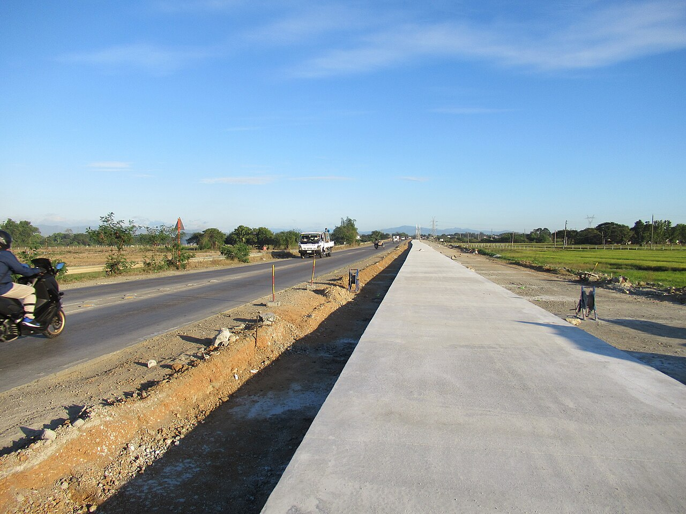

# Scalability

*Scalability is whether a system can GROW to meet demand - scale up with bigger machines or out with more of them. Neither is linear: shared parts like the database tax every added server, and a scalability test measures the claim 'just add servers' instead of trusting it.*

> "If we get more users, we'll just add servers." Every tester eventually hears this sentence,
> delivered with total confidence, usually instead of a performance test. It contains a testable
> claim: that adding servers actually adds capacity, one-for-one, indefinitely. Sometimes it is even
> true. And sometimes the team doubles the fleet before launch day, watches the site die anyway,
> and discovers at the worst possible moment that every one of those servers was standing in line
> for the same database - which nobody had scaled at all. 'Just add servers' is not a plan. It is a
> hypothesis. Scalability testing is how the hypothesis meets evidence before launch day does.

> **In real life**
>
> A road that carries more traffic every year. Option one: make the vehicles bigger - replace cars
> with buses, buses with double-deckers. Works brilliantly, until you hit the biggest vehicle that
> physically fits the road - that is scaling UP, and its ceiling is hard. Option two: add lanes
> beside the old ones - two lanes become four - that is scaling OUT, and the ceiling moves much
> further away. But notice what adding lanes does NOT fix: every lane still funnels into the same
> toll booth, the same bridge, the same roundabout at the end. Six lanes feeding one toll booth is
> six lanes of parked cars. Systems are the same: you can multiply servers all day, but everything
> they SHARE - database, session store, file storage - is the toll booth, and it is usually where
> the 'just add servers' plan quietly dies.

**Scalability**: Scalability is a system's ability to gain capacity when resources are added - and how EFFICIENTLY it gains it. Scaling up (vertical) means a more powerful machine: simple, no code changes, but capped at the biggest machine available and leaves one machine as a single point of failure. Scaling out (horizontal) means more machines behind a load balancer: the ceiling moves much further away, but shared components and coordination mean each added machine contributes slightly less than the last. A scalability test measures capacity at increasing resource levels - 1, 2, 4 servers - and reveals whether growth is near-linear, diminishing, or secretly capped by a shared bottleneck.

## Up, out, and the toll booth that catches both

- **Scaling up (vertical): a bigger box.** More CPU, more RAM, faster disks on the machine you
  already have. No code changes, no architecture changes - which is why it is always the first
  move. Two catches: prices grow faster than capacity at the high end, and there is a biggest
  machine money can buy. Also, it is still ONE machine - when it reboots, everything is down.
- **Scaling out (horizontal): more boxes.** Ordinary machines added behind a load balancer.
  The ceiling is much further away and failure of one machine is survivable. The catch: your
  software must actually COPE with being many copies - which is exactly where the bugs live
  (sessions stuck to one server, files written to one disk).
- **Neither scales linearly, and the gap is the finding.** Double the servers and get 1.9x the
  capacity - fine. Get 1.2x - something shared is saturating. Get 1.0x - the bottleneck is fully
  elsewhere, and every server you add from now on is pure cost. The measured curve, not the
  architecture diagram, tells you which world you are in.
- **The shared parts are the real ceiling.** Database, session store, cache, file storage, the
  balancer itself: components every server depends on scale with great difficulty or not at all.
  Under real load the system's capacity IS the capacity of its most saturated shared part - the
  app servers are often just the queue in front of it.
- **Elasticity is scalability with a clock.** Cloud systems that add servers automatically under
  load (autoscaling) still take minutes to react while a spike takes seconds. 'We autoscale' and
  'we survive a spike' are different claims - the second one needs a spike test aimed at the
  autoscaler's reaction time.

> **Tip**
>
> The cheapest scalability test that exists: run the same load test twice - once at N servers, once
> at 2N - and divide. That single ratio is the team's most important capacity-planning number. Close
> to 2.0 means 'add servers' genuinely works (for now); near 1.0 means the next spend on servers
> buys nothing and the bottleneck hunt starts today, while it is still a planning exercise instead
> of an outage.

> **Common mistake**
>
> Testing scalability by scaling the app servers while pointing everything at one shared staging
> database - then declaring 'we scale linearly'. The app tier usually DOES scale linearly; that was
> never the question. In production, the database (or session store, or file storage) is where the
> curve bends, and a test that holds the shared parts constant while multiplying the easy tier has
> measured the part that was never going to fail. Scale the test environment the way production
> would actually scale - same shared components, same proportions - or label the result honestly:
> 'app tier scales; shared-tier ceiling not tested'.


*Widening works from 2-lanes to 4-lanes, Plaridel Bypass, Bulacan — FBenjr123, Wikimedia Commons, CC BY-SA 4.0. [Source](https://commons.wikimedia.org/wiki/File:Widening_works_from_2-lanes_to_4-lanes_of_Plaridel_Bypass_Galas-Maasim_section_01.jpg)*
- **The old two-lane road — current capacity, still serving** — Live traffic on the left: the system as it runs today, at whatever capacity it has. Scaling out rarely happens during downtime - the new capacity is built WHILE the old serves users, which is exactly why rollout and cutover deserve their own test attention.
- **Traffic still flowing — load does not wait for the upgrade** — The motorbike and truck do not care that an expansion is underway. Neither do your users: growth pressure arrives on its own schedule, which is why scalability is tested BEFORE the demand shows up - the measured curve tells you how much runway the current setup really has.
- **The new concrete lanes — capacity being added beside the old** — This is horizontal scaling made physical: not a bigger road surface for the same lanes, but MORE lanes of the same size. When these open, capacity roughly doubles - roughly, because both carriageways still merge into the same junctions at each end.
- **The trench between old and new — integration is where it breaks** — The seam where new lanes must join the old road bed - and where cracks appear first. In systems, the seam is state: sessions, uploads, caches that assumed ONE server. The classic scale-out bugs all live at this join, which makes it prime testing ground the first time a second server is added.
- **The fields beyond the new lanes — the next ceiling is already visible** — Four lanes today; the land for six is right there - but somewhere ahead a bridge or junction will be the piece that cannot widen. Every scaling strategy has its next ceiling: for scale-out systems it is usually the shared database. A scalability test's real job is telling you which piece is YOUR bridge, before you pay to widen everything else.

**Why doubling servers did not double capacity - press Play**

1. **Baseline: 2 app servers + 1 database handle 200 rps** — Growth is coming, so the team plans capacity. The confident sentence gets said: 'we will just add servers'. The tester asks to measure instead of assume - same load test, more servers, compare.
2. **4 servers: 360 rps - not 400. The curve is bending** — Doubling the app tier gained 1.8x. Not a scandal - but the missing 10% went somewhere. Somewhere shared. The test continues, because a bend at small scale is a wall at large scale.
3. **8 servers: 410 rps - a wall. The database is at 100% CPU** — Four more servers bought almost nothing: every request needs the database, and the database is done. The app servers are now just an expensive waiting room. 'Add servers' has stopped converting money into capacity.
4. **The finding: 'capacity ceiling is the DB at ~410 rps; app-tier scaling is linear until then'** — Now the team optimizes queries, adds read replicas and caching - the work that actually moves the ceiling. Discovered in a test, this is a roadmap item; discovered on launch day, it is an outage with a very awkward postmortem.

Both scaling strategies and the bent curve, in one runnable comparison:

*Run it - scale up vs scale out, and the overhead that bends the curve (Python)*

```python
# Three ways to grow the same 100-rps system - and what each one's ceiling looks like.

BASE_CAPACITY = 100  # requests/second one ordinary server handles

def report(name, capacity, note):
    print(f"{name:34} capacity ~{capacity:4} rps   {note}")

print("=== Option 0: do nothing ===")
report("1 ordinary server", BASE_CAPACITY, "fine until growth arrives")

print()
print("=== Option 1: scale UP (vertical) - buy a bigger machine ===")
for factor, price in [(2, "2x price"), (4, "6x price"), (8, "20x price")]:
    report(f"1 server, {factor}x hardware", BASE_CAPACITY * factor, price)
print("Ceiling: the biggest machine money can buy - and prices grow FASTER than capacity.")
print("Bonus problem: it is still ONE machine. It reboots, everything is down.")

print()
print("=== Option 2: scale OUT (horizontal) - add ordinary machines ===")
overhead = {1: 1.0, 2: 0.95, 4: 0.90, 8: 0.85}  # coordination eats a little per server
for n in [2, 4, 8]:
    effective = int(BASE_CAPACITY * n * overhead[n])
    report(f"{n} servers behind a balancer", effective, f"{n}x price, roughly linear")
print("Ceiling: much further away - keep adding servers. But note the overhead column:")
print("8 servers gave ~680 rps, not 800. Coordination (balancing, shared state) taxes every server.")

print()
print("=== Why testers care: the scaling assumption is TESTABLE ===")
print("Claim: 'we doubled the servers, so we handle double the load'")
n2 = int(BASE_CAPACITY * 2 * overhead[2])
print(f"Measured: 2 servers -> ~{n2} rps, not 200. The missing 5% hides in shared parts -")
print("the database, the session store, the balancer - and under real load the shared part,")
print("not the servers, is usually what breaks first. A scalability test finds THAT ceiling.")
```

The same comparison in Java - same options, same bent curve:

*Run it - scale up vs scale out, and the overhead that bends the curve (Java)*

```java
import java.util.LinkedHashMap;
import java.util.Map;

public class Main {
    // Three ways to grow the same 100-rps system - and what each one's ceiling looks like.

    static final int BASE_CAPACITY = 100; // requests/second one ordinary server handles

    static void report(String name, int capacity, String note) {
        System.out.println(String.format("%-34s capacity ~%4d rps   %s", name, capacity, note));
    }

    public static void main(String[] args) {
        System.out.println("=== Option 0: do nothing ===");
        report("1 ordinary server", BASE_CAPACITY, "fine until growth arrives");

        System.out.println();
        System.out.println("=== Option 1: scale UP (vertical) - buy a bigger machine ===");
        int[] factors = {2, 4, 8};
        String[] prices = {"2x price", "6x price", "20x price"};
        for (int i = 0; i < factors.length; i++) {
            report("1 server, " + factors[i] + "x hardware", BASE_CAPACITY * factors[i], prices[i]);
        }
        System.out.println("Ceiling: the biggest machine money can buy - and prices grow FASTER than capacity.");
        System.out.println("Bonus problem: it is still ONE machine. It reboots, everything is down.");

        System.out.println();
        System.out.println("=== Option 2: scale OUT (horizontal) - add ordinary machines ===");
        Map<Integer, Double> overhead = new LinkedHashMap<>(); // coordination eats a little per server
        overhead.put(1, 1.0);
        overhead.put(2, 0.95);
        overhead.put(4, 0.90);
        overhead.put(8, 0.85);
        for (int n : new int[]{2, 4, 8}) {
            int effective = (int) (BASE_CAPACITY * n * overhead.get(n));
            report(n + " servers behind a balancer", effective, n + "x price, roughly linear");
        }
        System.out.println("Ceiling: much further away - keep adding servers. But note the overhead column:");
        System.out.println("8 servers gave ~680 rps, not 800. Coordination (balancing, shared state) taxes every server.");

        System.out.println();
        System.out.println("=== Why testers care: the scaling assumption is TESTABLE ===");
        System.out.println("Claim: 'we doubled the servers, so we handle double the load'");
        int n2 = (int) (BASE_CAPACITY * 2 * overhead.get(2));
        System.out.println("Measured: 2 servers -> ~" + n2 + " rps, not 200. The missing 5% hides in shared parts -");
        System.out.println("the database, the session store, the balancer - and under real load the shared part,");
        System.out.println("not the servers, is usually what breaks first. A scalability test finds THAT ceiling.");
    }
}
```

### Your first time: Your mission: map your system's scaling story before testing it

- [ ] Find out how your app runs in production: how many servers, behind what? — Ask a dev or ops: 'how many instances of the app run in prod, and what balances them?' One box, three VMs behind nginx, autoscaling containers - each is a different scaling story with different bugs to hunt.
- [ ] List what ALL those servers share — Database, session store (Redis?), file/object storage, cache, external APIs. This list is your candidate-bottleneck list - every item on it is a toll booth that adding servers cannot fix.
- [ ] Ask the capacity question: 'if traffic doubled next month, what is the plan?' — The answer tells you the team's scaling hypothesis: 'bigger instance' (up), 'more instances' (out), 'autoscaling handles it' (elasticity), or a shrug (a finding all by itself).
- [ ] Write the one test that would check the hypothesis — For 'more instances': same load test at N and 2N instances, compare the ratio. For 'autoscaling': a spike test faster than the autoscaler's reaction time. You may not have the environment to RUN it yet - but a written, specific test proposal is how the environment gets justified.

You now know your system's scaling shape: what multiplies, what is shared, and what the team is
betting on. That map is the difference between 'we should performance test sometime' and a
specific, answerable question - which is what gets scalability testing actually scheduled.

- **The team doubled the servers and capacity barely moved.**
  The bottleneck is shared, not per-server: database CPU, connection-pool limits, session-store throughput, or a synchronized lock in code. Measure each shared component's saturation while the load runs - whichever sits at 100% while app servers idle is your ceiling. Adding app servers past this point is pure spend; the report should say so in exactly those terms, because that sentence is what redirects the money.
- **Capacity scaled beautifully in the test, then production fell over during the real growth spurt.**
  Check what the test held constant that production did not: the test usually scales app servers against a lightly-loaded shared database, while production's database also carries reporting jobs, backups, and every other service. Recheck with production-shaped shared load (or in a production-sized environment), and re-read the test report for the quiet caveat 'shared-tier not scaled' - the finding was probably labeled, just not heard.
- **Autoscaling is configured, but spikes still cause minutes of errors before things stabilize.**
  Autoscaling reacts on a clock: detect high load, provision, boot, warm up, join the pool - minutes, while spikes need seconds. Test the GAP: spike faster than the autoscaler reacts and measure the damage window. Mitigations to suggest: scheduled pre-scaling before known events, a permanently higher floor of warm instances, or (dev-side) faster-booting services. 'We autoscale' answers the growth question, not the spike question.
- **Adding a second server broke logins/uploads/carts - features fine on one server misbehave on two.**
  The state-locality bug family: sessions in one server's memory, files on one server's disk, in-process caches now disagreeing between copies. This is not a capacity problem - it is the software incorrectly ASSUMING one copy of itself. Repeat the failing flow across many requests (forcing server switches) to characterize it, and point the team at shared session storage / object storage. The first scale-out of any app is a testing event for exactly this reason.

### Where to check

- **Instance counts and autoscaling config** — cloud console or ask ops: current server count, autoscaling min/max/triggers, and the reaction time nobody has measured.
- **Shared-component saturation during load** — database CPU and connections, cache throughput, storage IOPS, balancer limits: the candidate ceilings; whichever maxes out first while app servers idle IS your capacity.
- **The capacity ratio from paired tests** — capacity at N servers vs 2N; near 2.0 = servers convert to capacity, near 1.0 = the money now buys nothing.
- **Connection-pool configs** — a classic silent ceiling: 8 app servers times 50 connections each versus a database that accepts 200 - the last 200 connections queue, whatever the CPU graphs say.
- **[[system-design-for-testers/scaling-building-blocks/load-balancers]]** — the machinery that makes scale-out possible, and the bug family (sticky sessions, state locality) that arrives with it.

### Worked example: the capacity plan that was measured instead of believed

1. A booking platform expects 3x traffic for a holiday campaign. The plan on the table: "we run 4
   app servers now, we will go to 12 - triple the servers, triple the capacity." Budget approved,
   confidence high. A tester asks for one week to check the arithmetic.
2. Paired load tests in a production-shaped environment: 4 servers, 380 rps. 8 servers, 590 rps.
   The ratio is 1.55, not 2.0 - the curve is already bending. At 12 servers (projected): well
   under the 1,140 rps the '3x' plan assumed. The bend traces to the database connection pool:
   each app server opens 50 connections; the database caps at 400. At 8 servers the pool is the
   queue; at 12, the cap itself would be the wall.
3. Report, in three sentences: capacity is connection-bound at about 600 rps regardless of app
   servers past 8; tripling servers delivers roughly half the assumed capacity; the campaign
   forecast exceeds the measured ceiling. Attached: the two test runs and the pool math.
4. The plan changes shape: connection pooling middleware (PgBouncer) plus read replicas for the
   browse-heavy queries, THEN 10 app servers. A rerun measures 1,250 rps - over the target, with
   the shared tier now the monitored, understood piece instead of the invisible one.
5. Campaign day peaks at 1,080 rps: tight, survivable, boring. The alternative timeline - 12
   servers pointing at a 400-connection database - would have been an outage at two-thirds of
   the forecast load, with the extra servers actively making the connection storm worse. Cost of
   finding out early: two test runs and some division.

**Quiz.** A team doubles app servers from 4 to 8 to prepare for growth. A load test measures capacity going from 400 rps to 430 rps. What is the most accurate reading of this result?

- [ ] The test is faulty - doubling servers must roughly double capacity
- [ ] The app needs code optimization to use the new servers efficiently
- [x] A shared component (database, session store, or similar) is the real ceiling at ~430 rps - additional app servers cannot add capacity until IT scales, so further server spend is currently waste
- [ ] Eight servers is past the practical limit of horizontal scaling for most applications

*A near-flat capacity curve while server count doubles is the signature of a saturated SHARED dependency: every request still funnels through the same database / session store / storage, and that component - not the app tier - now defines total capacity at ~430 rps. The confirming move is watching shared-component saturation during the test: it will sit at 100% while the eight app servers idle. Option A has it backwards - the measurement is exactly how you discover this; the test working correctly is WHY the number disappoints. Option B guesses at code without evidence, and option D invents a universal limit that does not exist - systems scale out to hundreds of servers fine once their shared tiers scale too. The actionable sentence for the report: capacity is ceiling-bound at the shared tier; server spend past this point buys nothing until that changes.*

- **Scaling up (vertical)** — A more powerful machine: no code changes, simple - but prices grow faster than capacity, there is a biggest machine money can buy, and one machine remains a single point of failure.
- **Scaling out (horizontal)** — More ordinary machines behind a load balancer: ceiling much further away, one machine can die safely - but the software must cope with being many copies, and shared parts tax every addition.
- **Why scaling is never quite linear** — Coordination and shared dependencies (database, session store, balancer) take a cut of every added server. 2x servers -> 1.9x capacity is healthy; 1.2x means a shared part is saturating; 1.0x means it is fully saturated.
- **The shared-component ceiling** — Total capacity equals the capacity of the most saturated component every server depends on. Once the database is at 100%, app servers are an expensive waiting room - and adding more makes connection storms worse, not better.
- **The cheapest scalability test** — The same load test at N and 2N servers; divide. That one ratio says whether 'just add servers' currently converts money into capacity - and it is the first number a capacity plan should contain.
- **Elasticity vs scalability** — Elasticity is scaling with a clock: autoscaling adds servers in minutes, spikes arrive in seconds. 'We autoscale' answers the growth question; only a spike test faster than the autoscaler answers the surge question.
- **State-locality bugs (the scale-out tax)** — Sessions in one server's memory, files on one disk, per-server caches disagreeing: features that work on one copy break on two. The first scale-out of any app is a testing event for this exact family.

### Challenge

Build the capacity one-pager for the app you test, from questions alone (no test environment
needed yet): current production server count and what balances them; the full list of components
they share; the team's scaling hypothesis for 2x traffic (up, out, autoscale, or shrug); and the
single paired-test you would run to check it, written as 'measure capacity at N and 2N, expect
ratio above [your threshold], watch [most-suspect shared component] during both runs'. End with a
prediction: which shared component do YOU think is the toll booth? Testers who predict before
measuring get calibrated; the prediction habit is free.

### Ask the community

> Our app runs `[N]` instances sharing `[database/session store/storage]`, and the plan for growth is `[bigger boxes / more boxes / autoscaling]`. For those who have run paired scalability tests (N vs 2N servers) - what capacity ratio did you actually measure, and which shared component turned out to be the real ceiling?

Measured ratios are rare, war stories about which shared component hit the wall first are not -
and both are exactly what you need: real numbers to calibrate expectations against, and a ranked
list of usual suspects (it is the database connection pool a remarkable amount of the time) to
watch during your own first run.

- [MongoDB — Horizontal vs Vertical Scaling](https://www.mongodb.com/resources/basics/horizontal-vs-vertical-scaling)
- [DigitalOcean — Horizontal vs Vertical Scaling](https://www.digitalocean.com/resources/articles/horizontal-scaling-vs-vertical-scaling)
- [Gaurav Sen — System Design Basics: Horizontal vs Vertical Scaling](https://www.youtube.com/watch?v=xpDnVSmNFX0)

🎬 [Gaurav Sen — System Design Basics: Horizontal vs Vertical Scaling](https://www.youtube.com/watch?v=xpDnVSmNFX0) (8 min)

- Scaling up is a bigger machine (simple, hard ceiling, single point of failure); scaling out is more machines (further ceiling, but the software must cope with being many copies).
- 'Just add servers' is a hypothesis, not a plan - the paired test (capacity at N vs 2N servers) turns it into a measured ratio, and that ratio is the heart of any honest capacity plan.
- Nothing scales linearly: shared components tax every added server, and total capacity equals the capacity of the most saturated shared part - usually the database or its connection pool.
- Test the environment shaped like production scales: multiplying app servers against an idle shared database measures the tier that was never going to fail.
- Autoscaling answers growth, not surges - the autoscaler's reaction time is minutes, spikes are seconds, and the gap between them is a testable damage window.


## Related notes

- [[Notes/performance-testing/load-vs-stress-vs-soak/types-of-perf-testing|Types of performance testing]]
- [[Notes/system-design-for-testers/scaling-building-blocks/load-balancers|Load balancers]]
- [[Notes/system-design-for-testers/scaling-building-blocks/caching-redis-and-its-bugs|Caching (Redis) & its bugs]]


---
_Source: `packages/curriculum/content/notes/performance-testing/load-vs-stress-vs-soak/scalability.mdx`_
