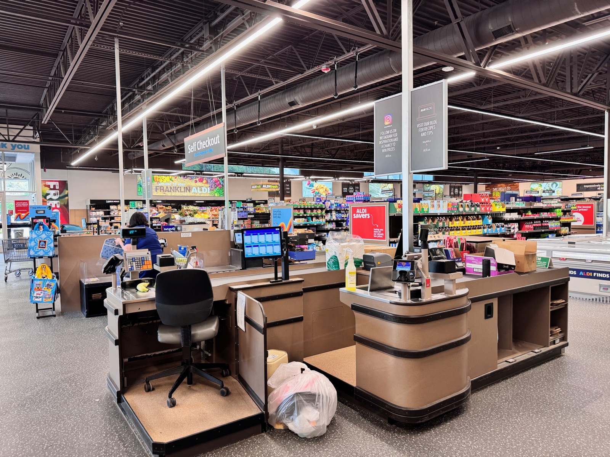

# Latency & throughput

*Latency asks how long one request takes; throughput asks how many requests the system processes per second. They move independently - a system can get faster per request and still collapse under volume, or vice versa. Confusing the two hides the real bottleneck.*

> A report lands on the release channel: "checkout now processes 400 orders/second, up from 250 -
> a 60% throughput win!" Everyone celebrates. Three days later a single customer complains that
> their one order took eleven seconds to confirm. Both numbers are true, measured on the same
> system, in the same week. The team optimized the number that made the dashboard look good and
> never looked at the number that customer actually felt - because nobody had agreed those were two
> different numbers in the first place.

> **In real life**
>
> A supermarket with two checkout lanes, one cashier working, one closed - chair pushed back, items
> still on the belt from the last shift. That one open lane has a fixed speed: however fast this
> particular cashier scans and bags, that is the LATENCY every customer in that lane experiences,
> and no amount of store policy changes it faster than the scanner allows. THROUGHPUT is a
> different question entirely: how many customers walk out per hour. Right now it equals whatever
> one lane can push through. Open the second lane and throughput can double overnight - twice the
> customers per hour - while every individual customer's checkout still takes exactly as long as it
> did before, because the hardware and the cashier's hands did not get faster. A store manager who
> only tracks "customers served per hour" can celebrate a great week while missing that the one
> lane open on a Tuesday afternoon left forty people standing in a line that grew for twenty
> minutes straight.

**Latency and throughput**: Latency is how long a single request takes end-to-end, usually measured in milliseconds from the moment a client sends it to the moment the response finishes arriving. Throughput is how many requests a system completes per unit time, usually measured in requests-per-second (rps) or transactions-per-second (tps). The two are not opposites and not the same axis: a system can have excellent latency and poor throughput (a single fast worker with no help), or high throughput and poor latency (many slow workers running in parallel), and only measuring one of them gives a release decision made on half the evidence.

## Two different questions about the same system

- **Latency answers "how long did THIS request take?"** It is a per-request number: 42 ms, 800 ms,
  11 seconds. It is what an individual user actually experiences while staring at a spinner.
- **Throughput answers "how much work got done in total?"** It is a system-wide rate: 400 requests
  per second, 12,000 orders per hour. It is what capacity planning and infra cost conversations
  actually care about.
- **Adding parallel capacity raises throughput without touching latency.** Open a second checkout
  lane, add a second application server, spin up a second worker process - each one processes its
  own requests at the same per-request speed as before. The ceiling on total volume rises; nobody's
  individual wait time improves directly (it can improve indirectly, by shortening queues).
- **Speeding up a single request raises latency-per-request without necessarily changing throughput
  at low load.** Optimize a slow database query and every request that hits it gets faster - a
  latency win. Whether that ALSO raises throughput depends on whether that query was the
  bottleneck; if it was not, throughput barely moves.
- **A system can be throughput-healthy and latency-broken at the same time, or the reverse.** A
  batch data pipeline can process a million records an hour (great throughput) while any single
  record you check on took most of that hour to arrive (terrible latency for that one record). A
  live chat feature can respond to any one message in `<50ms` (great latency) while only being able
  to handle 20 concurrent conversations before falling over (poor throughput ceiling). Neither
  number substitutes for the other - a serious performance report always states both.

> **Tip**
>
> When you can only report ONE performance sentence, make it a pair, not a single number: "p95
> latency is 210 ms at 400 rps sustained load" tells a release-ready story. "p95 latency is 210 ms"
> alone hides whether that was measured at 5 rps or 5,000 - and "throughput is 400 rps" alone hides
> whether users at that load were waiting 80 ms or 8 seconds. State the load the latency was measured
> under, every time.

> **Common mistake**
>
> Treating "the system got faster" and "the system handles more load" as the same finding. A team
> that adds three more application server instances and reports "40% faster" has usually raised
> THROUGHPUT (more parallel capacity, shorter queues at the same traffic level) while per-request
> latency - the actual time one database query and one render take - never changed line by line. The
> inverse mistake is just as common: shipping a query optimization and expecting the throughput
> dashboard to visibly jump, when the query was never the bottleneck resource in the first place.
> Name which axis moved before claiming a win on the other one.


*Aldi Sud supermarket checkout lanes in Franklin, North Carolina, US — Harrison Keely, Wikimedia Commons, CC BY 4.0. [Source](https://commons.wikimedia.org/wiki/File:Aldi_S%C3%BCd_supermarket_checkout_lanes_in_Franklin,_North_Carolina,_US_15.jpg)*
- **The one open lane - latency lives here** — One cashier, one customer, one scanner. However long THIS transaction takes to ring up is the latency this customer experiences - and it will not change no matter how many other lanes exist in the store.
- **A closed lane - unused throughput, not a latency problem** — The chair is pushed back, the lane is dark, a bag sits abandoned on the floor. This is spare capacity nobody turned on - exactly like an idle application server. Opening it changes the STORE's total throughput; it changes nothing about how fast the first cashier scans an item.
- **Self Checkout - a second, parallel channel** — A whole additional path for customers to be served, running independently of the two staffed lanes. Adding this kind of channel is how real systems raise throughput: more parallel workers, not a faster single worker.
- **The scanner and card reader - the floor under latency** — However many lanes you open, no single transaction here goes faster than this hardware allows one item to be scanned and one payment to clear. That fixed per-transaction floor is latency's ceiling - throughput can be added around it, but it cannot be engineered away by adding more of it.

**Same traffic, two different levers - press Play**

1. **Users report slowness - which number moved?** — Before touching anything, ask: did an individual request get slower (latency), or did the system start rejecting/queueing requests it used to handle (throughput)? The fix for each is different.
2. **Latency problem -> look at ONE request's path** — Slow query, slow external API call, unnecessary serialization, a blocking call on the critical path. The fix speeds up what ALREADY happens per request - parallel capacity does not help here.
3. **Throughput problem -> look at CAPACITY, not one request** — Not enough worker processes, a connection pool too small, a single-threaded bottleneck serializing everything. The fix adds parallel capacity - lanes, workers, instances - without necessarily touching per-request speed.
4. **Report both numbers together, always** — 'p95 latency X ms at Y rps' is a complete sentence. Either number alone lets the next reader assume the other one is fine - and it might not be.

A toy server that shows the split directly - watch throughput rise while opening a lane barely
moves the per-customer wait, until queueing (not scanning speed) is what actually improves:

*Run it - lanes, latency, and the throughput ceiling (Python)*

```python
LANES = 3               # open checkout lanes (parallel servers)
SERVICE_TIME_S = 2.0    # seconds one lane takes to fully serve one customer

def capacity(lanes, service_time):
    """Max customers/sec the system can fully serve - the throughput ceiling."""
    return lanes / service_time

def average_latency_s(arrival_rate, lanes, service_time):
    """Average time a customer spends (wait + service), using a simple queueing model.
    As arrival rate approaches capacity, latency grows without bound - the classic
    'latency and throughput are not the same number' curve."""
    cap = capacity(lanes, service_time)
    utilization = arrival_rate / cap
    if utilization >= 1:
        return None
    return service_time / (1 - utilization)

print(f"=== {LANES} lanes open, {SERVICE_TIME_S}s to serve one customer -> capacity = {capacity(LANES, SERVICE_TIME_S):.2f} customers/sec ===")
for arrival in [0.3, 0.8, 1.2, 1.45, 1.49]:
    cap = capacity(LANES, SERVICE_TIME_S)
    lat = average_latency_s(arrival, LANES, SERVICE_TIME_S)
    achieved = min(arrival, cap)
    if lat is None:
        print(f"{arrival} customers/sec arriving -> queue grows without bound, throughput stuck at {cap:.2f}/sec")
    else:
        print(f"{arrival} customers/sec arriving -> avg latency {lat:.2f}s, throughput {achieved:.2f}/sec")

print()
print("=== Same arrival rates, one more lane opened (4 lanes) - throughput ceiling rises ===")
LANES2 = 4
for arrival in [0.3, 0.8, 1.2, 1.45, 1.9]:
    cap2 = capacity(LANES2, SERVICE_TIME_S)
    lat2 = average_latency_s(arrival, LANES2, SERVICE_TIME_S)
    achieved2 = min(arrival, cap2)
    if lat2 is None:
        print(f"{arrival} customers/sec arriving -> queue grows without bound, throughput stuck at {cap2:.2f}/sec")
    else:
        print(f"{arrival} customers/sec arriving -> avg latency {lat2:.2f}s, throughput {achieved2:.2f}/sec")

print()
print("Lesson: opening a lane raised the THROUGHPUT ceiling (1.5 -> 2.0 customers/sec) without changing")
print("how long any single lane takes to serve one customer - that per-customer number is latency,")
print("and it only improved here because less queueing happened, not because scanning got faster.")
```

The identical model in Java - same lanes, same curve, same lesson:

*Run it - lanes, latency, and the throughput ceiling (Java)*

```java
public class Main {
    static final int LANES = 3;              // open checkout lanes (parallel servers)
    static final double SERVICE_TIME_S = 2.0; // seconds one lane takes to fully serve one customer

    // Max customers/sec the system can fully serve - the throughput ceiling.
    static double capacity(int lanes, double serviceTime) { return lanes / serviceTime; }

    // Average time a customer spends (wait + service), using a simple queueing model.
    // Returns -1 when the queue grows without bound (utilization >= 1).
    static double averageLatencyS(double arrivalRate, int lanes, double serviceTime) {
        double cap = capacity(lanes, serviceTime);
        double utilization = arrivalRate / cap;
        if (utilization >= 1) return -1;
        return serviceTime / (1 - utilization);
    }

    public static void main(String[] args) {
        System.out.printf("=== %d lanes open, %.1fs to serve one customer -> capacity = %.2f customers/sec ===%n",
                LANES, SERVICE_TIME_S, capacity(LANES, SERVICE_TIME_S));
        double[] arrivals1 = {0.3, 0.8, 1.2, 1.45, 1.49};
        for (double arrival : arrivals1) {
            double cap = capacity(LANES, SERVICE_TIME_S);
            double lat = averageLatencyS(arrival, LANES, SERVICE_TIME_S);
            double achieved = Math.min(arrival, cap);
            if (lat < 0) {
                System.out.printf("%.2f customers/sec arriving -> queue grows without bound, throughput stuck at %.2f/sec%n", arrival, cap);
            } else {
                System.out.printf("%.2f customers/sec arriving -> avg latency %.2fs, throughput %.2f/sec%n", arrival, lat, achieved);
            }
        }

        System.out.println();
        System.out.println("=== Same arrival rates, one more lane opened (4 lanes) - throughput ceiling rises ===");
        int lanes2 = 4;
        double[] arrivals2 = {0.3, 0.8, 1.2, 1.45, 1.9};
        for (double arrival : arrivals2) {
            double cap2 = capacity(lanes2, SERVICE_TIME_S);
            double lat2 = averageLatencyS(arrival, lanes2, SERVICE_TIME_S);
            double achieved2 = Math.min(arrival, cap2);
            if (lat2 < 0) {
                System.out.printf("%.2f customers/sec arriving -> queue grows without bound, throughput stuck at %.2f/sec%n", arrival, cap2);
            } else {
                System.out.printf("%.2f customers/sec arriving -> avg latency %.2fs, throughput %.2f/sec%n", arrival, lat2, achieved2);
            }
        }

        System.out.println();
        System.out.println("Lesson: opening a lane raised the THROUGHPUT ceiling (1.5 -> 2.0 customers/sec) without changing");
        System.out.println("how long any single lane takes to serve one customer - that per-customer number is latency,");
        System.out.println("and it only improved here because less queueing happened, not because scanning got faster.");
    }
}
```

### Your first time: Your mission: find both numbers for one flow

- [ ] Pick one flow and find its latency number — Response time for a single request under light load - close to the best case the flow can produce. This is the 'one customer, empty store' number.
- [ ] Find its throughput ceiling — Ramp concurrent load until latency starts climbing sharply - the rps just before that knee is roughly your throughput ceiling for this flow, on this hardware.
- [ ] Write one sentence with both numbers together — 'Checkout: 120 ms at low load, ceiling around 350 rps before latency climbs past 1s.' Neither number alone tells this story.
- [ ] Name which lever you would pull for each problem — If latency needs to drop: what's the slowest step in ONE request? If throughput needs to rise: what's the first thing that runs out of parallel capacity?

You now have the two numbers most reports quietly conflate - and a plan for which lever fixes
which one, instead of guessing.

- **Throughput dashboards look great (rps is up) but support tickets about slowness are rising.**
  Check the LATENCY distribution at current load, not just total rps. A system can process more total requests per second while individual requests queue longer than before - throughput went up because more requests are IN FLIGHT at once, not because any one of them finishes faster. Look at p95/p99 response time under today's real load, not the rps counter alone.
- **A code change makes one endpoint measurably faster in isolation, but the throughput ceiling for the whole service does not move.**
  The endpoint you sped up was never the bottleneck resource. Find what IS saturating first at the ceiling - often a database connection pool, a single-threaded queue, or a downstream service's own limit - and that is the throughput lever. Latency wins on non-bottleneck code are still real user-facing improvements; they just will not show up on a throughput graph.
- **Adding more server instances raised throughput less than expected.**
  Something shared did not scale with the instances - a single database, a shared cache, a downstream API with its own rate limit. Parallel application capacity only raises throughput up to whatever the next shared bottleneck allows. Trace one slow request under the new load to find where it is actually waiting.
- **A report states one number - 'latency is good' or 'throughput is good' - with no load level attached.**
  Ask for the missing half immediately: latency at what rps? Throughput at what latency budget? A latency number with no stated load is meaningless (120 ms at 1 rps says nothing about 500 rps), and a throughput number with no latency budget hides whether users were happy at that volume.

### Where to check

- **Load-test tool's own summary AND its full response-time distribution** — the summary rps number and the latency percentiles at that rps are two different tabs; read both.
- **APM traces for one slow request at peak load** — shows exactly where time went for a single request, which is where a latency fix lives.
- **Connection pool, thread pool, and queue-depth metrics** — the usual home of a throughput ceiling; a pool maxed out caps total volume regardless of per-request speed.
- **[[performance-testing/metrics/resource-use]]** — once you know throughput has a ceiling, this is how you find WHICH resource is causing it.

### Worked example: a 'performance win' that was really a capacity win

1. A team reports checkout throughput rose from 250 rps to 400 rps after adding two application
   server instances, and calls it a "40% performance improvement."
2. QA checks the latency distribution at 250 rps on both the old and new setup: p95 response time
   is 310 ms either way - completely unchanged. The database query, the payment call, the render -
   every step inside one request takes exactly as long as before.
3. What actually changed: at 250 rps, the OLD setup was running close to its capacity ceiling,
   so requests queued and p95 latency was creeping upward under that load. The NEW setup has more
   parallel capacity, so at that same 250 rps there is no queueing - which is why p95 latency
   looks fine on both, but the ceiling itself (where latency starts climbing) moved from around
   300 rps to around 450 rps.
4. The tester rewrites the finding precisely: "no per-request latency improvement; throughput
   ceiling raised from ~300 rps to ~450 rps by adding parallel capacity." Same facts, correct
   attribution - and next quarter's capacity-planning conversation uses the right lever.

**Quiz.** A checkout service's p95 latency stays flat at 180 ms whether load is 50 rps or 300 rps, then suddenly climbs to 4 seconds at 320 rps. What does 320 rps most likely represent?

- [ ] A latency bug that only appears under high traffic
- [x] The service's approximate throughput ceiling - the capacity beyond which requests start queueing
- [ ] Proof that the database is too slow at any load level
- [ ] A sign that p95 is the wrong metric to use here

*Flat latency across a wide range of load, followed by a sharp climb at one specific rps, is the signature of hitting a capacity ceiling: below it, every request gets served without queueing (latency stays at its floor); at and above it, arrivals outpace service capacity and requests start waiting behind each other, so latency grows fast. That crossover point IS the throughput ceiling for this flow on this hardware - not a bug confined to high traffic (nothing in the code got slower, capacity simply ran out) and not evidence the database is universally too slow (it was fine for the entire flat region). p95 remains exactly the right metric; it is what revealed the knee in the first place.*

- **Latency** — How long ONE request takes, end to end - the number a single user actually feels. Measured per-request, usually in ms.
- **Throughput** — How much work the system completes per unit time - a system-wide rate, usually in rps/tps. Measures volume, not any one user's wait.
- **Why adding parallel capacity raises throughput but not latency directly** — More lanes/workers process more requests at once, raising the ceiling on total volume - but each individual worker still takes the same time per request it always did.
- **The complete performance sentence** — State BOTH numbers together with the load they were measured at: 'p95 latency X ms at Y rps.' Either number alone hides what the other one is doing.
- **The throughput-ceiling signature** — Latency stays flat across a wide load range, then climbs sharply at one rps value - that crossover is roughly the system's capacity limit for that flow.
- **Diagnosing which lever to pull** — Latency problem -> trace ONE slow request's path (query, call, render). Throughput problem -> find what parallel resource is maxed out (pool, queue, single-threaded step).

### Challenge

Take one flow in an app you test and measure both numbers yourself: latency at light load (one
request, minimal concurrency), then ramp concurrent users until you find roughly where latency
stops being flat and starts climbing - that is your throughput ceiling. Write one sentence
combining both, in the format `latency X at Y load`, then name which lever (per-request speed, or
parallel capacity) you would pull first if asked to improve this flow, and why.

### Ask the community

> My flow is `[flow name]`, currently showing latency around `[X ms]` at `[Y rps]` of load. I'm trying to figure out whether my next fix should target per-request latency or the throughput ceiling - what signals told you which lever mattered for a similar flow, and which did you tackle first?

Sharing both numbers together, instead of asking generically "how do I make this faster," gets you
answers pointed at the actual bottleneck - and you'll often hear back exactly which metric
(latency floor vs throughput ceiling) other testers checked first before touching any code.

- [Grafana k6 — Metrics Reference (latency and throughput built-ins)](https://grafana.com/docs/k6/latest/using-k6/metrics/)
- [AWS — What Is Latency?](https://aws.amazon.com/what-is/latency/)
- [Response Time, Latency and Throughput in Performance Testing](https://www.youtube.com/watch?v=Ngzi_4ToVJg)

🎬 [Response Time, Latency and Throughput in Performance Testing](https://www.youtube.com/watch?v=Ngzi_4ToVJg) (6 min)

- Latency measures how long ONE request takes; throughput measures how much work the system completes per unit time - they move on different axes.
- Adding parallel capacity (more lanes, workers, instances) raises the throughput ceiling without directly changing any single request's latency.
- Speeding up a single slow step raises latency for every request that hits it, but only moves throughput if that step was the actual bottleneck.
- A complete performance statement names both numbers together with the load level: 'p95 latency X ms at Y rps' - either alone hides the other.
- Flat latency across a wide load range followed by a sharp climb marks the approximate throughput ceiling - the signal to look for capacity, not code speed.


## Related notes

- [[Notes/performance-testing/metrics/percentiles-vs-averages|Percentiles vs averages]]
- [[Notes/performance-testing/metrics/resource-use|Resource use]]
- [[Notes/non-functional-testing-intro/performance/key-metrics|Key metrics]]


---
_Source: `packages/curriculum/content/notes/performance-testing/metrics/latency-and-throughput.mdx`_
