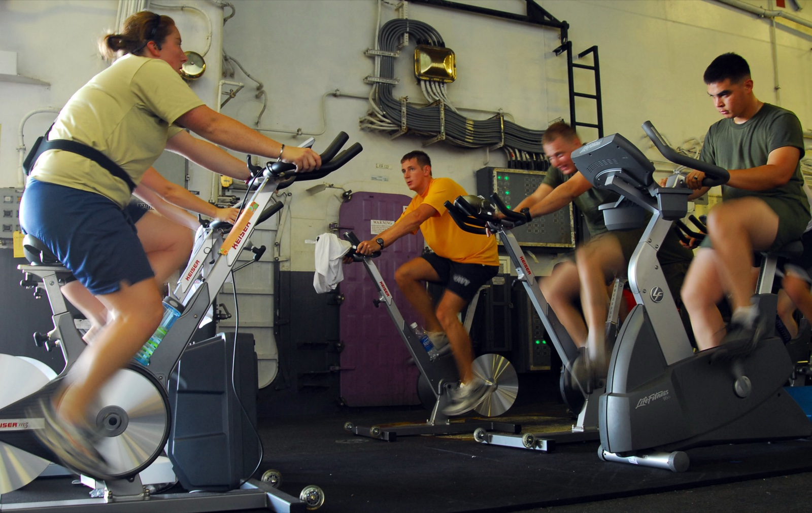

# Designing a test

*A trustworthy load test is designed before it's run: a scenario shape (ramp-up, steady state, ramp-down), realistic think-time between requests, realistic varied data, and a pass/fail threshold agreed on before anyone sees a result.*

> A team runs their first load test: 200 virtual users, all starting at once, each one hammering the
> same demo account with zero pause between requests, for exactly 60 seconds. It "passes" - nothing
> crashed. Three weeks later, real Black Friday traffic takes checkout down in nine minutes. The test
> wasn't wrong because the tool was bad or the server was fragile; it was wrong because nobody
> designed it - it measured 200 clones sprinting in place, not 200 different people shopping.

> **In real life**
>
> An indoor spin class aboard a ship, four riders on four bikes. Nobody just hops on and mashes the
> pedals at random - the instructor set the resistance dial on every bike BEFORE class started: an
> easy warm-up spin first, then a long stretch at a hard, steady resistance everyone holds together,
> then a cool-down taper at the end. Every rider is a genuinely different person at a different pace -
> one stands and sprints, one stays seated and steady - and each one still catches their breath between
> hard efforts instead of pedaling flat-out with zero rest for the entire class. And the target heart
> rate zone that counts as "a good class" was decided by the instructor before anyone clipped in, not
> judged afterward by whoever felt tired. A load test is that class: a resistance profile (ramp-up,
> steady state, ramp-down) set in advance, realistically varied riders instead of identical clones,
> paced effort instead of nonstop mashing, and a pass/fail bar fixed before the first pedal turns.

**Designing a load test**: Designing a load test means fixing four decisions before it runs: the scenario shape (a ramp-up period that gradually increases load, a steady-state period long enough to observe a stable throughput ceiling, and a ramp-down that tapers off cleanly); realistic think-time (pacing between a virtual user's requests, matching how long a real user actually takes to read, decide, and click); realistic data (enough unique accounts/records that concurrent virtual users don't all collide on the same row); and a pass/fail threshold agreed on before the run, not chosen afterward to match whatever number the run happened to produce.

## Four decisions, made before anything runs

- **Scenario shape.** Ramp-up gives the system (and its caches, connection pools, autoscalers) time
  to warm up instead of slamming it cold. Steady state is the part that actually answers "what can
  this handle sustained" - too short and you never leave the noisy warm-up phase. Ramp-down confirms
  the system recovers cleanly instead of leaving connections or threads stuck open.
- **Think-time.** Real users pause - reading a page, typing a card number, deciding. A script that
  fires request after request with zero pause simulates a very different (and much harsher, and much
  less realistic) load than the same VU count with 1-3 seconds of pacing between actions.
- **Realistic data.** If 200 virtual users all log into the same one demo account, you are testing
  one row's lock contention 200 times over, not 200 independent shoppers. A pool of unique
  accounts/records sized to the VU count is what makes concurrency findings meaningful.
- **A threshold decided in advance.** "p95 under 300ms, error rate under 1%" written down BEFORE the
  run is a real bar. The same numbers, chosen by looking at what the run produced and calling it
  acceptable, is not a threshold - it's a description.

> **Tip**
>
> Size the steady-state window to be the majority of the total run - a common rule of thumb is at
> least 40-50% of total duration - so there's enough flat, stable data to trust a throughput or
> latency reading. A 10-second steady state sandwiched between two 2-minute ramps tells you almost
> nothing about sustained behavior.

> **Common mistake**
>
> Deciding the pass/fail bar AFTER looking at the results ("well, 480ms isn't THAT bad, let's call it
> acceptable"). A threshold set after seeing the data isn't a threshold - it's a rationalization
> wearing a threshold's clothes. Write the bar down, ideally from a real requirement or SLO, before
> the first request of the real run fires.


*Sailors and Marines work out during a spin class aboard USS Bonhomme Richard (LHD 6) — U.S. Navy photo by MC2 Drew Williams, Wikimedia Commons, Public domain. [Source](https://commons.wikimedia.org/wiki/File:US_Navy_090707-N-0515W-019_Sailors_and_Marines_work_out_during_a_spin_class_aboard_the_amphibious_assault_ship_USS_Bonhomme_Richard_(LHD_6).jpg)*
- **The resistance dial - set before class starts** — This is the scenario shape decided in advance: an easy start, a hard held stretch, a taper down - fixed before the first pedal turns, exactly like ramp-up/steady/ramp-down.
- **The console - the target set in advance** — A pass/fail bar (a heart-rate zone, a wattage target) that existed before this ride started - not judged afterward by however tired anyone feels.
- **A genuinely different rider, a genuinely different pace** — Not a clone of the rider beside them - different posture, different effort. Realistic test data means concurrent virtual users this varied, not 200 copies of one account.
- **Full effort, no pause between strokes** — This rider is mid-sprint with zero rest between pedal strokes right now - fine for one interval, but a script with this as EVERY request, forever, has no think-time at all.

**Designing a test before it runs - press Play**

1. **Pick the scenario shape** — Ramp-up long enough to warm caches and pools, steady state long enough to trust a reading, ramp-down to confirm clean recovery.
2. **Add realistic think-time** — Pacing between a VU's requests that matches how long a real user actually takes - not zero, not identical for every user.
3. **Build a realistic data pool** — Enough unique accounts/records that concurrent VUs don't collide on the same row and hide contention bugs behind 'it was just one account.'
4. **Write the pass/fail threshold down** — Before the run, from a real requirement - p95 latency, error rate - so the result can actually fail.
5. **Only then, run it** — Every decision above already happened. The run itself just measures against a bar and a shape that were fixed in advance.

A validator for the scenario-shape decisions above - it rejects a design before a single request
would ever fire:

*Run it - load-test scenario-shape validator (Python)*

```python
def validate_scenario(name, ramp_up_s, steady_s, ramp_down_s, target_vus, think_time_s, unique_rows):
    total = ramp_up_s + steady_s + ramp_down_s
    errors = []
    steady_share = steady_s / total
    if steady_share < 0.4:
        errors.append(f"steady state is only {steady_share:.0%} of the {total}s run - too short to trust a throughput reading, aim for 40%+")
    if think_time_s <= 0:
        errors.append("think-time is 0s - every virtual user fires requests back-to-back with no pacing, unlike real users reading a screen between clicks")
    if unique_rows < target_vus:
        errors.append(f"only {unique_rows} unique data rows for {target_vus} virtual users - many VUs will hammer the same account/record and hide per-record contention bugs")
    return total, steady_share, errors

scenarios = [
    {"name": "Checkout draft (rejected)", "ramp_up_s": 60, "steady_s": 60, "ramp_down_s": 30, "target_vus": 200, "think_time_s": 0, "unique_rows": 5},
    {"name": "Checkout final (accepted)", "ramp_up_s": 120, "steady_s": 600, "ramp_down_s": 60, "target_vus": 200, "think_time_s": 2, "unique_rows": 500},
]

for sc in scenarios:
    total, steady_share, errors = validate_scenario(**sc)
    print(f"=== {sc['name']}: ramp-up {sc['ramp_up_s']}s / steady {sc['steady_s']}s / ramp-down {sc['ramp_down_s']}s (total {total}s, steady={steady_share:.0%}) ===")
    if errors:
        for e in errors:
            print("  REJECT:", e)
        print("  RESULT=REJECTED - fix the shape before this test ever runs")
    else:
        print("  RESULT=ACCEPTED - realistic shape, pacing, and data; safe to run")
    print()

print("Lesson: every check here is a decision made BEFORE a single request fires - the pass/fail bar,")
print("the shape, the pacing, and the data variety. Designing a test is what makes its result trustworthy;")
print("no amount of clever reading-the-results afterward fixes a run that hammered one account with zero think-time.")
```

The same validator in Java - identical checks, identical verdicts:

*Run it - load-test scenario-shape validator (Java)*

```java
import java.util.ArrayList;
import java.util.List;

public class Main {

    static class Scenario {
        String name;
        int rampUpS, steadyS, rampDownS, targetVus, uniqueRows;
        double thinkTimeS;
        Scenario(String name, int rampUpS, int steadyS, int rampDownS, int targetVus, double thinkTimeS, int uniqueRows) {
            this.name = name; this.rampUpS = rampUpS; this.steadyS = steadyS; this.rampDownS = rampDownS;
            this.targetVus = targetVus; this.thinkTimeS = thinkTimeS; this.uniqueRows = uniqueRows;
        }
    }

    public static void main(String[] args) {
        List<Scenario> scenarios = new ArrayList<>();
        scenarios.add(new Scenario("Checkout draft (rejected)", 60, 60, 30, 200, 0, 5));
        scenarios.add(new Scenario("Checkout final (accepted)", 120, 600, 60, 200, 2, 500));

        for (Scenario sc : scenarios) {
            int total = sc.rampUpS + sc.steadyS + sc.rampDownS;
            double steadyShare = (double) sc.steadyS / total;
            List<String> errors = new ArrayList<>();

            if (steadyShare < 0.4) {
                errors.add(String.format("steady state is only %.0f%% of the %ds run - too short to trust a throughput reading, aim for 40%%+", steadyShare * 100, total));
            }
            if (sc.thinkTimeS <= 0) {
                errors.add("think-time is 0s - every virtual user fires requests back-to-back with no pacing, unlike real users reading a screen between clicks");
            }
            if (sc.uniqueRows < sc.targetVus) {
                errors.add(String.format("only %d unique data rows for %d virtual users - many VUs will hammer the same account/record and hide per-record contention bugs", sc.uniqueRows, sc.targetVus));
            }

            System.out.printf("=== %s: ramp-up %ds / steady %ds / ramp-down %ds (total %ds, steady=%.0f%%) ===%n",
                    sc.name, sc.rampUpS, sc.steadyS, sc.rampDownS, total, steadyShare * 100);
            if (!errors.isEmpty()) {
                for (String e : errors) System.out.println("  REJECT: " + e);
                System.out.println("  RESULT=REJECTED - fix the shape before this test ever runs");
            } else {
                System.out.println("  RESULT=ACCEPTED - realistic shape, pacing, and data; safe to run");
            }
            System.out.println();
        }

        System.out.println("Lesson: every check here is a decision made BEFORE a single request fires - the pass/fail bar,");
        System.out.println("the shape, the pacing, and the data variety. Designing a test is what makes its result trustworthy;");
        System.out.println("no amount of clever reading-the-results afterward fixes a run that hammered one account with zero think-time.");
    }
}
```

### Your first time: Your mission: design one scenario before writing a single request

- [ ] Pick a shape: ramp-up, steady, ramp-down durations — Give steady state at least 40% of the total run - that's the part you'll actually trust.
- [ ] Decide think-time before scripting requests — 1-3 seconds is a reasonable starting pace for a human-driven flow; zero is only realistic for machine-to-machine traffic.
- [ ] Size a data pool to your target VU count — Unique accounts/records, at least one per concurrent virtual user, ideally more.
- [ ] Write the pass/fail threshold down first — From a real requirement if one exists - a documented SLO beats a number picked after seeing the run.

You now have a design that was fixed before a single request happened - which is what makes the
result, whatever it turns out to be, something you can actually trust.

- **The test 'passed' but production fell over under real traffic.**
  Check for zero think-time and/or a single shared test account in the original design - a test with unrealistic pacing or data can pass cleanly while measuring nothing like real usage.
- **Results vary wildly between runs of the supposedly identical test.**
  Steady state is likely too short relative to ramp-up/ramp-down, so each run is mostly measuring warm-up noise rather than a stable state. Lengthen steady state.
- **A 'performance regression' turns out to just be a stricter threshold this time.**
  Confirm the threshold was written once, from a real requirement, and hasn't quietly been re-tuned run to run to make results look better or worse.
- **Concurrency bugs never show up in testing but appear constantly in production.**
  The data pool is too small - every virtual user is probably hitting the same handful of records, which hides the exact contention bugs that a real, varied user base triggers.

### Where to check

- **The test script's own `options`/config block** — ramp stages, VU counts, and thresholds should all be visible and readable there, not buried in someone's memory of "how we usually run it."
- **The data-seeding script or fixture file** — confirms how many unique accounts/records actually exist relative to the VU count.
- **[[performance-testing/tools-intro/jmeter]]** and **[[performance-testing/tools-intro/k6]]** — where these four decisions get encoded as an actual Thread Group or script.
- **[[performance-testing/load-vs-stress-vs-soak/types-of-perf-testing]]** — which of load, stress, or soak testing a given scenario shape is actually built for.

### Worked example: the 200-user test that passed and still didn't predict Black Friday

1. A team's first load test: 200 virtual users start simultaneously (no ramp-up), all log into the
   same shared demo account, fire requests back-to-back with no pause, for a flat 60 seconds.
2. Nothing crashes. p95 latency looks acceptable. The test is marked "passed" and the team moves on.
3. Real Black Friday traffic arrives gradually over an hour, from thousands of different accounts,
   with normal human pauses between clicks - and checkout goes down within nine minutes, jammed on a
   row-lock contention bug the original test never triggered because it only ever hit one account.
4. The redesign: a 5-minute ramp-up, a 30-minute steady state at target load, realistic 1-2 second
   think-time, and a seeded pool of 2,000 unique accounts. That version reproduces the contention bug
   in minutes - the SAME server, a differently designed test.

**Quiz.** A load test uses 200 virtual users, all hitting the same one test account with zero pause between requests. It passes with good numbers. What does that result most likely tell you?

- [ ] The application can definitely handle 200 real concurrent users
- [x] The application handles 200 back-to-back requests against one account - which may say very little about 200 independent real users
- [ ] The test was stress testing, not load testing
- [ ] The result is invalid and can be ignored entirely

*A passing result is only as meaningful as the design behind it. Hitting one shared account with zero think-time measures a very specific, narrow case - one row's contention behavior under back-to-back hammering - which is a real and valid thing to know, but it is not equivalent to 200 independent users browsing, pausing, and acting on their own data. The result isn't worthless (it's not option D), but generalizing it to 'handles 200 real users' overstates what was actually tested.*

- **Ramp-up** — The period where load climbs gradually, giving caches, pools, and autoscalers time to warm up instead of being slammed cold.
- **Steady state** — The stable, sustained-load portion of a test - the part that should be long enough (often 40%+ of total duration) to actually trust a reading from.
- **Think-time** — Pacing between a virtual user's requests, matching how long a real user takes to read/decide/click. Zero think-time is rarely realistic for human-driven flows.
- **Realistic data pool** — Enough unique accounts/records that concurrent virtual users don't collide on the same row and mask contention bugs.
- **Threshold set in advance** — A pass/fail bar written down before the run, ideally from a real requirement - not chosen afterward to match whatever the run produced.
- **Why a 'passing' test can still mislead** — A test can pass cleanly while measuring an unrealistic shape - one account, no pacing, no ramp - and still say almost nothing about real traffic.

### Challenge

Take the scenario validator above and design a THIRD scenario for a flow you know (a login page, a
search bar, a form submit): pick your own ramp-up/steady/ramp-down seconds, VU count, think-time,
and unique-row count. Run it through the validator and see whether it's ACCEPTED or REJECTED -
then fix whichever decision caused a rejection before calling the design done.

### Ask the community

> I'm designing a load test for `[flow name]` and trying to decide on realistic think-time and data-pool size before I script anything. What numbers did you land on for a similar human-driven flow, and how did you justify the pass/fail threshold to stakeholders before the first run?

Asking about the DESIGN decisions - pacing, data size, and how a threshold got justified - rather
than "is my load test good," gets you answers you can defend later, instead of a vague gut check.

- [Grafana k6 — Test Types (scenario shapes explained)](https://grafana.com/docs/k6/latest/testing-guides/test-types/)
- [Apache JMeter — Building a Web Test Plan](https://jmeter.apache.org/usermanual/build-web-test-plan.html)
- [Ramp Up, Ramp Down and Steady State in Performance Testing](https://www.youtube.com/watch?v=7wcX_sYrbzU)

🎬 [Ramp Up, Ramp Down and Steady State in Performance Testing](https://www.youtube.com/watch?v=7wcX_sYrbzU) (4 min)

- A trustworthy load test is designed before it runs: scenario shape, think-time, realistic data, and a threshold are all decided in advance.
- Steady state - not ramp-up or ramp-down - is the part that should dominate the run if you want a reading you can trust.
- Zero think-time and a single shared test account both produce unrealistic results that can still 'pass' cleanly.
- A threshold chosen after seeing the data is a rationalization, not a threshold - write the bar down first.
- A passing result is only as meaningful as the design behind it - the same server can pass an unrealistic test and fail under real traffic.


## Related notes

- [[Notes/performance-testing/tools-intro/jmeter|JMeter]]
- [[Notes/performance-testing/tools-intro/reading-results|Reading results]]
- [[Notes/performance-testing/load-vs-stress-vs-soak/types-of-perf-testing|Types of performance testing]]


---
_Source: `packages/curriculum/content/notes/performance-testing/tools-intro/designing-a-test.mdx`_
