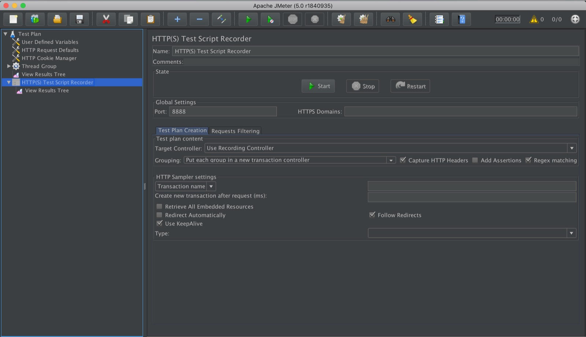

# JMeter

*Apache JMeter is a free, Java-based load-testing tool built around a visual tree: Thread Groups schedule virtual users, Samplers fire requests, Listeners show results. Powerful once configured, but GUI mode is for building a test, never for running the real load.*

> A tester opens JMeter, builds a Thread Group with 200 users, drags on an HTTP sampler, adds a
> "View Results Tree" listener so they can watch requests scroll by in real time, and hits the green
> Start arrow. The report that comes out looks alarming - p95 response time near four seconds,
> several timeouts. They file it as a performance bug. A colleague opens the same `.jmx` file, runs
> it from a terminal instead of the GUI, and gets a p95 under 300ms with zero timeouts. Nothing about
> the application changed between the two runs - only how JMeter itself was asked to run it.

> **In real life**
>
> A pipe organ. Before a single pipe sounds, the organist sits at a large console covered in stops -
> dozens of labeled knobs, each one pulled by hand to route air to a particular rank of pipes: flutes,
> reeds, principals. Nothing plays itself. Every registration is assembled physically, at the console,
> before the first note - and once it's set, that same console can drive an enormous, layered sound
> no single instrument could produce alone. Change the piece and the organist returns to the console
> and repulls stops by hand; there is no way to reconfigure the instrument except by sitting there and
> doing it. JMeter is that console: a Thread Group, a Sampler, a Listener are stops an engineer pulls
> one at a time, by hand, in a visual tree, long before any request leaves the machine - and once
> assembled, the same configuration can drive far more load than any one person clicking through a UI
> ever could themselves.

**JMeter**: Apache JMeter is a free, open-source, Java-based load-testing tool built around a visual tree of configuration elements. A Thread Group defines how many virtual users run, how quickly they ramp up, and how many times each loops. Samplers (most commonly HTTP Request) define what each virtual user actually sends. Listeners collect and display results - tables, trees, graphs - while a test runs or afterward. JMeter ships with a full GUI for building and debugging a test tree, and a separate non-GUI (CLI) mode intended for actually generating load, since the GUI itself consumes CPU and memory that would otherwise skew results.

## The tree is the test

Every JMeter test is a tree of elements, assembled visually before anything runs:

- **Thread Group** - the scheduling element. It sets the number of threads (virtual users), the
  ramp-up period (how long JMeter takes to start all of them), and the loop count (how many times
  each thread repeats its work). This one element decides the entire shape of the load.
- **Samplers** - what a thread actually does each loop. An HTTP Request sampler is the common case:
  method, path, parameters, body. A Thread Group with no sampler generates threads that do nothing.
- **Listeners** - where results surface. "View Results Tree" shows every request and response in
  detail (invaluable while building a test, dangerous at real scale). "Summary Report" and
  "Aggregate Report" roll results into per-sampler averages, percentiles, and error counts.
- **Config and logic elements** - HTTP Request Defaults (set the host once instead of retyping it
  on every sampler), CSV Data Set Config (feed each thread different data instead of the same
  record), Timers (add pacing between requests).

> **Tip**
>
> Build and debug in GUI mode with a small thread count and "View Results Tree" open so you can see
> exactly what each request sent and got back. Then, for any run whose numbers matter, switch to
> non-GUI mode from a terminal: `jmeter -n -t plan.jmx -l results.jtl`. Disable or remove
> heavyweight listeners first - collecting full response data from hundreds of threads is exactly
> the kind of memory and CPU pressure that makes the tool generating the load become the bottleneck
> instead of the server under test.

> **Common mistake**
>
> Running the load itself with the GUI open, watching a live listener update in real time, and
> reporting those numbers as the test result. The GUI's own rendering and the listener's own
> bookkeeping compete for the same CPU and memory JMeter needs to generate load and time responses
> accurately - so the numbers reflect JMeter straining under its own UI, not the server under test.
> GUI mode is for building and sanity-checking a test plan on a handful of threads; every number that
> goes in a report should come from a non-GUI run.


*Apache JMeter 5.0 GUI, HTTP(S) Test Script Recorder screenshot — Pmouawad, Wikimedia Commons, CC BY-SA 4.0. [Source](https://commons.wikimedia.org/wiki/File:ApacheJMeter-5.0-screenshot.png)*
- **Thread Group - the ramp lives here** — Number of threads, ramp-up period, loop count. This single element decides the entire shape of the load - not the sampler, not the listener.
- **A Listener nested in the tree** — View Results Tree shows every request and response in full detail - essential while debugging a handful of threads, far too heavy to leave running under real load.
- **Start / Stop / Restart - the GUI itself** — These buttons run the test from inside the same process rendering this window. That rendering is exactly the overhead a non-GUI run avoids.
- **A settings form, filled in by hand** — Capture HTTP Headers, Add Assertions, Regex matching - every option here is a checkbox someone clicks, one test plan at a time, before a single request is sent.

**Building a JMeter test - press Play**

1. **Add a Thread Group** — Set virtual users, ramp-up period, and loop count - the shape of the load, decided before anything else exists in the tree.
2. **Add a Sampler** — Usually an HTTP Request: method, path, body. This is what each virtual user actually does on every loop.
3. **Add a Listener, build and debug in GUI mode** — View Results Tree on a handful of threads confirms requests and assertions behave as expected.
4. **Switch to non-GUI mode for the real run** — `jmeter -n -t plan.jmx -l results.jtl` - no rendering overhead competing with the load JMeter is trying to generate.
5. **Read the results file, not the live GUI** — Generate an HTML dashboard from the `.jtl` file afterward - percentiles, throughput, and errors, computed once the run is over.

A toy simulator for the one Thread Group decision that matters most - how ramp-up spreads threads
over time, and where the peak concurrency actually lands:

*Run it - Thread Group ramp simulator (Python)*

```python
NUM_THREADS = 10       # JMeter "Number of Threads (users)"
RAMP_UP_S = 5.0        # JMeter "Ramp-up period (seconds)"
LOOP_COUNT = 3         # JMeter "Loop Count"
REQUEST_TIME_S = 1.0   # how long one user's one request takes

def start_times(num_threads, ramp_up_s):
    """JMeter starts threads evenly spaced across the ramp-up period, not all at once."""
    if num_threads <= 1:
        return [0.0]
    interval = ramp_up_s / num_threads
    return [round(i * interval, 2) for i in range(num_threads)]

def active_per_second(starts, loop_count, request_time_s):
    total_runtime = max(s + loop_count * request_time_s for s in starts)
    buckets = {}
    for sec in range(int(total_runtime) + 1):
        active = sum(1 for s in starts if s <= sec < s + loop_count * request_time_s)
        buckets[sec] = active
    return buckets

starts = start_times(NUM_THREADS, RAMP_UP_S)
print(f"=== Thread Group: {NUM_THREADS} threads, {RAMP_UP_S}s ramp-up, {LOOP_COUNT} loops ===")
print("Thread start times (s):", starts)
print()

buckets = active_per_second(starts, LOOP_COUNT, REQUEST_TIME_S)
for sec in sorted(buckets):
    active = buckets[sec]
    print(f"t={sec:2d}s  active_threads={active:2d}  {'#' * active}")

peak = max(buckets.values())
print()
print(f"Peak concurrent threads: {peak}")
print("Lesson: raising ramp-up spreads the SAME thread count over more time (gentler climb to peak);")
print("raising thread count raises the peak itself. JMeter's GUI makes you set both by hand, per Thread Group.")
```

The identical model in Java - same spacing, same peak, same lesson:

*Run it - Thread Group ramp simulator (Java)*

```java
import java.util.ArrayList;
import java.util.List;

public class Main {
    static final int NUM_THREADS = 10;
    static final double RAMP_UP_S = 5.0;
    static final int LOOP_COUNT = 3;
    static final double REQUEST_TIME_S = 1.0;

    static List<Double> startTimes(int numThreads, double rampUpS) {
        List<Double> starts = new ArrayList<>();
        if (numThreads <= 1) {
            starts.add(0.0);
            return starts;
        }
        double interval = rampUpS / numThreads;
        for (int i = 0; i < numThreads; i++) {
            starts.add(Math.round(i * interval * 100.0) / 100.0);
        }
        return starts;
    }

    public static void main(String[] args) {
        List<Double> starts = startTimes(NUM_THREADS, RAMP_UP_S);
        System.out.printf("=== Thread Group: %d threads, %.1fs ramp-up, %d loops ===%n", NUM_THREADS, RAMP_UP_S, LOOP_COUNT);
        System.out.print("Thread start times (s): [");
        for (int i = 0; i < starts.size(); i++) {
            System.out.print(starts.get(i));
            if (i < starts.size() - 1) System.out.print(", ");
        }
        System.out.println("]");
        System.out.println();

        double totalRuntime = 0;
        for (double s : starts) totalRuntime = Math.max(totalRuntime, s + LOOP_COUNT * REQUEST_TIME_S);

        int peak = 0;
        for (int sec = 0; sec <= (int) totalRuntime; sec++) {
            int active = 0;
            for (double s : starts) {
                if (s <= sec && sec < s + LOOP_COUNT * REQUEST_TIME_S) active++;
            }
            peak = Math.max(peak, active);
            StringBuilder bar = new StringBuilder();
            for (int i = 0; i < active; i++) bar.append("#");
            System.out.printf("t=%2ds  active_threads=%2d  %s%n", sec, active, bar.toString());
        }

        System.out.println();
        System.out.println("Peak concurrent threads: " + peak);
        System.out.println("Lesson: raising ramp-up spreads the SAME thread count over more time (gentler climb to peak);");
        System.out.println("raising thread count raises the peak itself. JMeter's GUI makes you set both by hand, per Thread Group.");
    }
}
```

### Your first time: Your mission: build and correctly run one JMeter test

- [ ] Add a Thread Group and one HTTP Request sampler — Point it at a real endpoint you're allowed to test. Set a small thread count - 3 to 5 - while you're still building.
- [ ] Add View Results Tree and confirm requests look right — Check status codes and response bodies for each thread. This is GUI mode doing its actual job: verifying the test plan, not measuring performance.
- [ ] Save the plan, then run it from a terminal — `jmeter -n -t plan.jmx -l results.jtl` with the GUI closed or at least not the thing generating load.
- [ ] Generate and read the HTML dashboard — `jmeter -g results.jtl -o report/` turns the raw `.jtl` file into percentile and throughput graphs you can actually read.

You now have a test plan built visually, verified in GUI mode, and measured the way JMeter is
actually designed to measure - from the command line, with nothing competing for the same CPU.

- **Response times look far worse than users actually report in production.**
  Check whether the run happened in GUI mode with active listeners. Re-run the same `.jmx` with `jmeter -n` and minimal listeners; GUI overhead alone can add hundreds of milliseconds of apparent latency that has nothing to do with the server.
- **JMeter itself runs out of memory partway through a large test.**
  A heavyweight listener like View Results Tree is retaining every request and response in memory. Remove it for real runs and rely on the summary/aggregate listeners, or write straight to a `.jtl` file instead.
- **Every virtual user appears to hit the exact same account or record.**
  No CSV Data Set Config (or equivalent) is feeding each thread different data. Add one so 200 threads exercise 200 different records, not the same row 200 times.
- **One machine running JMeter can't generate enough load to stress the server at all.**
  The load generator itself is the bottleneck, not the server under test. Distribute the test across multiple JMeter instances (a controller/agent setup) rather than trusting a single overloaded machine's numbers.

### Where to check

- **The generated HTML dashboard** (`jmeter -g results.jtl -o report/`) — percentiles, throughput, and error rate computed after the run, not read live off a listener.
- **`jmeter.log`** in the run directory — engine-level errors (out-of-memory, connection failures) that never show up in the results file itself.
- **[[performance-testing/tools-intro/k6]]** — the same load-testing job, approached script-first instead of GUI-first.
- **[[performance-testing/metrics/error-rate]]** — once a run is captured, this is how to read the error percentage JMeter's aggregate report hands back.

### Worked example: the 'broken checkout' that was really a GUI-mode artifact

1. A tester builds a 200-thread Thread Group against the checkout endpoint, leaves View Results
   Tree attached, and clicks Start inside the JMeter GUI.
2. The aggregate report shows p95 near 4 seconds and a handful of timeouts. The tester files a
   performance bug against checkout.
3. A second engineer opens the identical `.jmx`, removes View Results Tree, and runs
   `jmeter -n -t checkout.jmx -l results.jtl` from a terminal on the same machine.
4. The non-GUI run reports p95 under 300ms with zero timeouts. Nothing in checkout changed between
   the two runs - the first number measured JMeter's GUI competing with itself for CPU and memory,
   not the application.

**Quiz.** A JMeter run executed inside the GUI, with View Results Tree actively updating, shows dramatically worse response times than the same test run from the command line with `jmeter -n`. What's the most likely explanation?

- [ ] The server has a memory leak that only appears under GUI-mode traffic
- [x] The GUI and its listener are competing with JMeter's own load-generation and timing for CPU and memory, inflating the measured times
- [ ] Non-GUI mode silently sends fewer requests, making it look faster
- [ ] View Results Tree caches old, faster responses instead of showing new ones

*JMeter's GUI rendering and a heavyweight listener like View Results Tree run in the same process and compete for the same CPU and memory that JMeter needs to generate load and time responses precisely. That overhead inflates the measured response times without touching the server at all - which is exactly why real load-generating runs use non-GUI mode with minimal listeners, and why the two runs in this scenario measured different things despite an identical test plan.*

- **Thread Group** — Sets number of threads (virtual users), ramp-up period, and loop count - the element that decides the shape of the load.
- **Sampler** — What each thread actually does per loop - most commonly an HTTP Request (method, path, body).
- **Listener** — Collects and displays results. Heavy ones (View Results Tree) are for debugging small runs; summary/aggregate listeners scale to real load.
- **GUI mode vs non-GUI mode** — GUI mode is for building and debugging a test tree on a handful of threads. Non-GUI (`jmeter -n`) is for any run whose numbers will be reported.
- **Why GUI-mode numbers mislead** — The GUI's own rendering and listeners compete with JMeter's load generation for CPU and memory, inflating measured response times.
- **CSV Data Set Config** — Feeds each thread different data instead of every virtual user hammering the same account or record.

### Challenge

Take the ramp simulator above and change only `RAMP_UP_S` to 20 while keeping `NUM_THREADS` and
`LOOP_COUNT` the same. Predict, then confirm by running it, what happens to the peak concurrent
thread count - and write one sentence explaining why ramp-up changes the CLIMB to peak but not the
peak's ceiling itself (that's set by thread count and loop duration).

### Ask the community

> I'm building a JMeter test for `[endpoint/flow]` and the numbers I get in GUI mode look much worse than users actually report. Before I file this as a performance bug, what non-GUI setup (listeners, distributed agents, JVM args) did you land on for trustworthy results on a single machine?

JMeter's GUI-vs-CLI gap catches nearly everyone once - asking specifically about a non-GUI setup,
instead of "why is JMeter slow," gets you straight to the JVM heap flags and listener choices that
actually fixed it for someone else's setup.

- [Apache JMeter — Getting Started](https://jmeter.apache.org/usermanual/get-started.html)
- [Apache JMeter — Building a Web Test Plan](https://jmeter.apache.org/usermanual/build-web-test-plan.html)
- [Apache JMeter — Component Reference (Thread Groups, Samplers, Listeners)](https://jmeter.apache.org/usermanual/component_reference.html)
- [JMeter Tutorial 4: Thread Group, Samplers, Listeners & Configuration](https://www.youtube.com/watch?v=ZkEDBsAicjM)

🎬 [JMeter Tutorial 4: JMeter Elements - Thread Group, Samplers, Listeners & Configuration](https://www.youtube.com/watch?v=ZkEDBsAicjM) (5 min)

- JMeter's test tree is built from Thread Groups (load shape), Samplers (what each user does), and Listeners (where results show up).
- The GUI is for building and debugging a test plan on a handful of threads - it is never the mode that should generate the load you report on.
- Non-GUI mode (`jmeter -n -t plan.jmx -l results.jtl`) avoids the CPU and memory competition that makes GUI-mode numbers unreliable.
- Heavy listeners like View Results Tree are essential while debugging and dangerous at real scale - remove them before a run that matters.
- A single overloaded JMeter machine can become the bottleneck itself; distributed runs exist for exactly that failure mode.


## Related notes

- [[Notes/performance-testing/tools-intro/k6|k6]]
- [[Notes/performance-testing/tools-intro/designing-a-test|Designing a test]]
- [[Notes/performance-testing/metrics/error-rate|Error rate]]


---
_Source: `packages/curriculum/content/notes/performance-testing/tools-intro/jmeter.mdx`_
