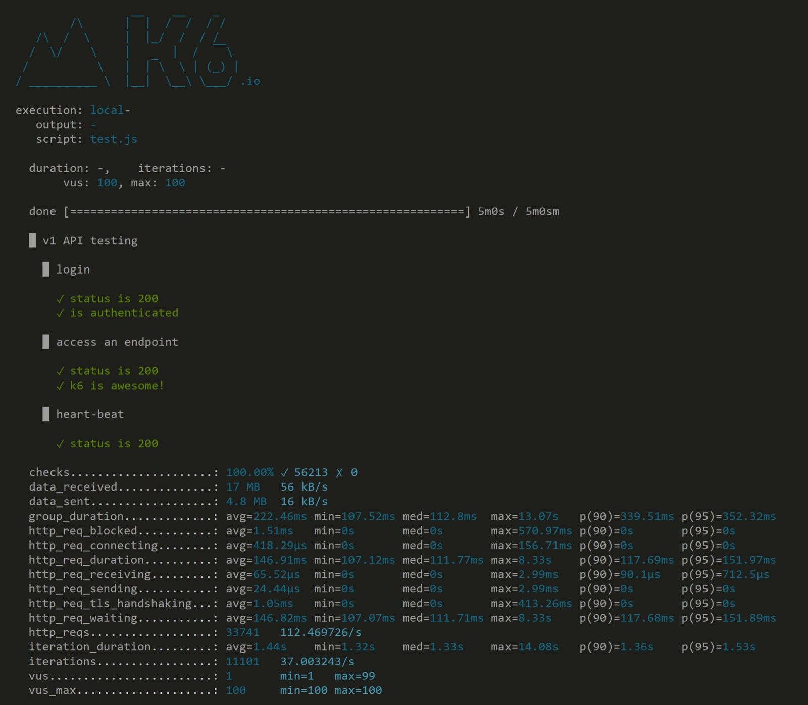

# k6

*Grafana k6 is a free, open-source load-testing tool scripted in JavaScript and run from the command line: virtual users (VUs) execute a script you write, and pass/fail thresholds live in that same script - decided before the run, not read off a graph afterward.*

> Two teams load-test the same checkout endpoint the same week. One team clicks through a GUI, watches
> a live graph, and decides by eye that "it looks fine." The other team's test finishes, prints three
> lines, and exits with a nonzero status code - because a threshold written into the script weeks
> earlier said p95 must stay under 300ms, and this run hit 340ms. Nobody had to be watching. The
> pipeline failed the build automatically, on a rule that was decided before anyone knew what today's
> numbers would be.

> **In real life**
>
> A silk-screen print run. Before a single shirt is pulled, someone burns a stencil once - the exact
> design, fixed, reusable. After that, any operator can pull the squeegee across the same screen a
> thousand times and get the identical image, without redrawing anything by hand between pulls. And
> before the run even starts, the print shop already knows what a REJECT looks like - a smudge, a
> registration off by more than two millimeters - because that standard was written down beforehand,
> not judged shirt-by-shirt after the fact by whoever happens to be looking. k6 works the same way: the
> script is the stencil, written once in JavaScript; virtual users are the identical pulls, run as
> many times and in parallel as needed; and the pass/fail thresholds are the reject standard, fixed
> before the run starts, checked automatically against every pull without a human eyeballing each one.

**k6**: k6 is a free, open-source load-testing tool from Grafana Labs, scripted in JavaScript and run from the command line rather than through a GUI. A test script defines one or more scenarios of virtual users (VUs) that execute the same function repeatedly - typically HTTP requests plus checks (assertions on individual responses). Thresholds are pass/fail conditions written directly into the script's options (for example, 'p(95)<300' on request duration, or 'rate<0.01' on failures) and are evaluated automatically when the run ends, producing a nonzero exit code on failure - which is what lets a load test act as an automated CI gate instead of a report someone has to read.

## Script-first, not click-first

- **The script is the whole test.** A `.js` file defines what a virtual user does each iteration -
  requests, checks, sleeps for pacing - and `options` at the top of that same file define VUs,
  duration or stages, and thresholds. There is no separate GUI tree to assemble; the script IS the
  test plan, versioned in git like any other code.
- **Checks vs thresholds are different jobs.** A `check()` verifies one response (status is 200) and
  contributes to a running pass rate - it never fails the overall run by itself. A threshold judges
  an aggregate metric across the whole run (p95 latency, overall error rate) against a bar decided
  in advance, and IS what fails the run.
- **Running k6 is one command.** `k6 run script.js` - no separate GUI-mode/non-GUI-mode distinction
  to get wrong, because there was never a GUI generating the load in the first place. Output streams
  to the terminal as the run happens and summarizes at the end.
- **Virtual users are cheap and scriptable.** Ramping VUs up and down over time is a few lines in
  `options.stages`, the same script producing 10 VUs or 10,000 - no dragging sliders, just changing
  numbers in version-controlled code.

> **Tip**
>
> Write thresholds for the metrics that actually gate a release - p95 (or p99) request duration and
> overall failure rate are the two nearly every team needs - before the first real run, not after
> looking at a graph and deciding what "looks about right." A threshold decided after seeing the data
> isn't a threshold, it's a rationalization.

> **Common mistake**
>
> Treating `check()` failures as if they fail the whole test the way a threshold does. A check is a
> per-request assertion that shows up in the summary as a pass percentage - a script can finish with
> thousands of failed checks and still exit 0 if no threshold was written against that check rate.
> If a check matters enough to gate a build, wire it into a threshold explicitly (for example,
> `'checks': ['rate>0.99']`), don't assume failing checks alone will stop a pipeline.


*k6 v0.26.2 CLI results output — Mostafamoradian, Wikimedia Commons, CC BY-SA 4.0. [Source](https://commons.wikimedia.org/wiki/File:K6-output.png)*
- **script: test.js - the whole test plan** — There is no separate GUI tree behind this run. This one versioned JavaScript file IS the test - scenario, requests, checks, and thresholds together.
- **vus: 100, max: 100** — Virtual users, set as a number in the script's options - not dragged on a slider. The same script can run this at 10 or 10,000 by changing one value.
- **checks: 100.00% - per-request assertions, not a threshold** — This is the pass rate of individual check() calls. On its own it does not fail the run - only a threshold written against it would.
- **http_req_duration percentiles, computed automatically** — avg/min/med/max plus p(90) and p(95) - the full latency distribution, printed every run without anyone building a report by hand.

**A k6 run, start to finish - press Play**

1. **Write the script once** — Requests, checks, pacing (sleep), and options: VUs/stages plus thresholds - all in one versioned .js file.
2. **k6 run script.js** — One command. No GUI to open, no separate mode to remember - the terminal IS the interface.
3. **VUs execute the script in parallel** — Each virtual user runs the same function repeatedly, exactly as written - identical pulls of the same stencil.
4. **Thresholds evaluate automatically at the end** — p95 latency, error rate, whatever was written into options.thresholds - checked against the bar set before the run, not after.
5. **Nonzero exit code on failure** — A failed threshold can fail a CI pipeline directly - the same run that a human would otherwise have to read a graph to judge.

A toy version of exactly what k6 does automatically at the end of a run - thresholds, written once,
judging two different results:

*Run it - k6-style thresholds-as-code (Python)*

```python
def evaluate(thresholds, metrics):
    results = []
    overall = True
    for name, op, limit in thresholds:
        value = metrics[name]
        passed = (value < limit) if op == "<" else (value > limit)
        overall = overall and passed
        results.append((name, op, limit, value, passed))
    return results, overall

def report(label, thresholds, metrics):
    print(f"=== {label} ===")
    results, overall = evaluate(thresholds, metrics)
    for name, op, limit, value, passed in results:
        status = "PASS" if passed else "FAIL"
        print(f"  {name} {op} {limit}: measured {value} -> {status}")
    print("  RESULT=" + ("PASS" if overall else "FAIL"))
    print()
    return overall

# thresholds are written INTO the script before the run, exactly like k6's \`options.thresholds\`
thresholds = [
    ("p95_ms", "<", 300),
    ("error_rate", "<", 0.01),
    ("checks_rate", ">", 0.99),
]

healthy_run = {"p95_ms": 240, "error_rate": 0.004, "checks_rate": 0.996}
regressed_run = {"p95_ms": 410, "error_rate": 0.031, "checks_rate": 0.968}

report("Run 1 - checkout v1.2 (before a slow deploy)", thresholds, healthy_run)
result2 = report("Run 2 - checkout v1.3 (after the deploy)", thresholds, regressed_run)

print("Lesson: the thresholds never change between runs - they were written once, as code, before either")
print("run happened. Run 2 fails automatically the moment it's over; nobody had to eyeball a graph to")
print("notice p95 crossed 300ms. That automatic PASS/FAIL is what 'thresholds as code' buys over a GUI")
print("listener you have to read by eye after every run.")
if not result2:
    print("CI_EXIT_CODE=1")
```

The identical thresholds in Java - same rule, same two runs, same verdicts:

*Run it - k6-style thresholds-as-code (Java)*

```java
import java.util.LinkedHashMap;
import java.util.Map;

public class Main {

    static class Threshold {
        String name, op;
        double limit;
        Threshold(String name, String op, double limit) { this.name = name; this.op = op; this.limit = limit; }
    }

    static boolean report(String label, Threshold[] thresholds, Map<String, Double> metrics) {
        System.out.println("=== " + label + " ===");
        boolean overall = true;
        for (Threshold t : thresholds) {
            double value = metrics.get(t.name);
            boolean passed = t.op.equals("<") ? (value < t.limit) : (value > t.limit);
            overall = overall && passed;
            String status = passed ? "PASS" : "FAIL";
            System.out.printf("  %s %s %s: measured %s -> %s%n", t.name, t.op, fmt(t.limit), fmt(value), status);
        }
        System.out.println("  RESULT=" + (overall ? "PASS" : "FAIL"));
        System.out.println();
        return overall;
    }

    static String fmt(double v) {
        if (v == Math.floor(v) && !Double.isInfinite(v) && Math.abs(v) < 1000) {
            return String.valueOf((int) v);
        }
        return String.valueOf(v);
    }

    public static void main(String[] args) {
        Threshold[] thresholds = new Threshold[] {
            new Threshold("p95_ms", "<", 300),
            new Threshold("error_rate", "<", 0.01),
            new Threshold("checks_rate", ">", 0.99),
        };

        Map<String, Double> healthyRun = new LinkedHashMap<>();
        healthyRun.put("p95_ms", 240.0);
        healthyRun.put("error_rate", 0.004);
        healthyRun.put("checks_rate", 0.996);

        Map<String, Double> regressedRun = new LinkedHashMap<>();
        regressedRun.put("p95_ms", 410.0);
        regressedRun.put("error_rate", 0.031);
        regressedRun.put("checks_rate", 0.968);

        report("Run 1 - checkout v1.2 (before a slow deploy)", thresholds, healthyRun);
        boolean result2 = report("Run 2 - checkout v1.3 (after the deploy)", thresholds, regressedRun);

        System.out.println("Lesson: the thresholds never change between runs - they were written once, as code, before either");
        System.out.println("run happened. Run 2 fails automatically the moment it's over; nobody had to eyeball a graph to");
        System.out.println("notice p95 crossed 300ms. That automatic PASS/FAIL is what 'thresholds as code' buys over a GUI");
        System.out.println("listener you have to read by eye after every run.");
        if (!result2) System.out.println("CI_EXIT_CODE=1");
    }
}
```

### Your first time: Your mission: script and gate one k6 run

- [ ] Write a script with one HTTP request and one check — Import k6/http, hit a real endpoint you're allowed to test, and check() that status is 200.
- [ ] Add options: a small VU count and a short duration — 5 VUs for 30 seconds is plenty to see how thresholds behave before scaling up.
- [ ] Add a threshold on p95 duration and on error rate — Pick numbers before you've seen the data - that's the whole point of a threshold.
- [ ] Run it and check the exit code — `k6 run script.js; echo $?` - a nonzero code means a threshold failed, exactly like a CI gate would see it.

You now have a test that judges itself against a bar you set in advance, and an exit code any
pipeline can act on without a human reading a graph.

- **Thresholds keep 'failing' on numbers that later turn out to be fine.**
  The threshold was picked after looking at one run's data instead of from a real requirement. Re-derive the bar from what actually matters to users (a documented SLO), not from whatever the first run happened to produce.
- **Raising VUs doesn't raise achieved requests-per-second at all.**
  The machine running k6 may be the bottleneck (CPU, network, file descriptors), not the server under test - the same failure mode JMeter hits running too much load from one box. Check the generator's own resource usage before blaming the server.
- **Results vary wildly between runs with no code changes on either side.**
  Check for missing pacing (`sleep()`) between requests inside the VU loop - a script with zero think-time can behave very differently run to run depending on how requests happen to queue.

### Where to check

- **The end-of-run summary in the terminal** — checks percentage, full `http_req_duration` percentile breakdown, and every threshold's PASS/FAIL, printed automatically.
- **The process's own exit code** — `0` means every threshold passed; nonzero means at least one did not, which is what a CI step actually checks.
- **[[performance-testing/tools-intro/jmeter]]** — the same job, GUI-tree-first instead of script-first.
- **[[performance-testing/metrics/latency-and-throughput]]** — what the `http_req_duration` and `http_reqs` numbers in that summary actually mean and how they relate to each other.

### Worked example: a threshold that caught a regression nobody was watching for

1. A team writes `thresholds: { http_req_duration: ['p(95)<300'], http_req_failed: ['rate<0.01'] }`
   into their checkout script the day they first automate the test - months before any incident.
2. A routine deploy adds a synchronous call to a third-party tax API on the checkout path. Nobody
   flags it as risky; it passes functional tests cleanly.
3. That night's scheduled k6 run finishes in 47 seconds. p95 duration came back at 340ms. The
   threshold fails, the pipeline step exits nonzero, and the deploy is blocked automatically.
4. No one was staring at a dashboard at 2 a.m. The bar was set weeks earlier, in the script itself,
   and it did the job it was written for without anyone deciding in the moment whether 340ms "looked
   okay."

**Quiz.** A k6 script has ten check() calls per iteration but no threshold written against the check rate. Half the checks start failing after a deploy. What happens to the script's exit code?

- [ ] It becomes nonzero automatically once check failures cross 50%
- [x] It stays 0 (success) - checks alone never fail a run, only a threshold does
- [ ] k6 refuses to finish the run and hangs
- [ ] It depends on which specific check failed

*Checks are per-request assertions that roll up into a pass-rate statistic in the summary - they do not, by themselves, affect the process exit code. Only a threshold - an explicit pass/fail rule written into options.thresholds - can fail the run and produce a nonzero exit code. A script can report 50% failing checks and still exit 0 if nothing was written to gate on that rate, which is exactly why a check that matters needs its own threshold.*

- **Virtual user (VU)** — A concurrent execution of the script's function - k6's unit of simulated load, set as a number in code.
- **check()** — A per-request assertion contributing to a pass-rate statistic. Does not fail the run by itself.
- **Threshold** — A pass/fail rule on an aggregate metric (e.g. p95 latency, error rate), written into the script before the run - and what actually fails it.
- **Why k6 has no GUI-mode problem** — There is no GUI generating load in the first place - `k6 run script.js` from the terminal is the only way to run it.
- **Thresholds as code** — The pass/fail bar lives in version control, decided before the data exists - not judged by eye after a graph renders.
- **Exit code as a CI gate** — A failed threshold produces a nonzero exit code, which a pipeline step can act on directly without a human reading a report.

### Challenge

Take the threshold checker above and add a fourth threshold - `("p99_ms", "<", 800)` - to the
`thresholds` list, then add a matching `"p99_ms"` value to both `healthy_run` and `regressed_run`
(pick numbers that make Run 1 still pass and Run 2 still fail). Re-run it and confirm the RESULT
lines still match your prediction before checking the output.

### Ask the community

> My k6 thresholds keep flagging `[metric]` as a failure even though the team doesn't think the run was actually bad. How did you decide where to set a threshold bar so it reflects a real requirement instead of just whatever the first few runs happened to produce?

Asking specifically how someone else DERIVED their threshold number - from an SLO, a support-ticket
pattern, a stakeholder conversation - gets you a defensible bar, instead of just tuning the number
until today's run happens to pass.

- [Grafana k6 — Running k6](https://grafana.com/docs/k6/latest/get-started/running-k6/)
- [Grafana k6 — Thresholds](https://grafana.com/docs/k6/latest/using-k6/thresholds/)
- [Grafana k6 — Checks](https://grafana.com/docs/k6/latest/using-k6/checks/)
- [Basics of load testing with k6 and Grafana in 20 minutes](https://www.youtube.com/watch?v=gvounvDSDGg)

🎬 [Basics of load testing with k6 and Grafana in 20 minutes](https://www.youtube.com/watch?v=gvounvDSDGg) (20 min)

- k6 scripts are the whole test plan - written once in JavaScript, versioned in git, run with one command.
- Checks assert on individual responses and never fail a run by themselves; thresholds judge aggregate metrics and do.
- Thresholds are written before a run happens, turning a load test into an automatic CI gate instead of a graph someone reads.
- A nonzero exit code on threshold failure is what lets a pipeline act on a load test without a human judgment call.
- The machine running k6 can itself become the bottleneck - the same failure mode as an overloaded JMeter box.


## Related notes

- [[Notes/performance-testing/tools-intro/jmeter|JMeter]]
- [[Notes/performance-testing/tools-intro/reading-results|Reading results]]
- [[Notes/performance-testing/metrics/latency-and-throughput|Latency & throughput]]


---
_Source: `packages/curriculum/content/notes/performance-testing/tools-intro/k6.mdx`_
