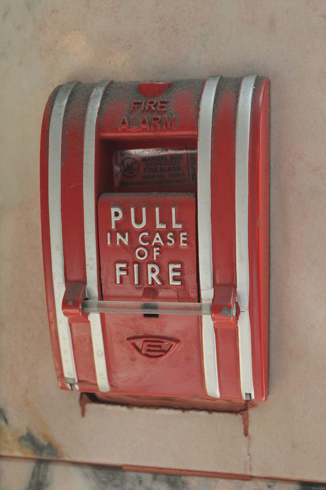

# getByRole / Label / TestId

*Three locator methods, one honest priority order: getByRole (and getByLabel for form fields) first because they describe what a user perceives, getByTestId last as a deliberate, explicit escape hatch.*

> Three different Playwright locator methods can all find the exact same button - `getByRole`,
> `getByLabel`, `getByText`, and `getByTestId` aren't competitors solving the same problem equally
> well, they're a priority order. Reaching for the wrong one first isn't wrong exactly, but it quietly
> gives up resilience the framework was ready to hand you for free.

> **In real life**
>
> A fire alarm pull station carries three completely different kinds of identifying information at
> once: "FIRE ALARM" embossed at the top (what kind of device this is - its role), "PULL IN CASE OF
> FIRE" molded into the handle (the explicit instruction - its label), and a small manufacturer's
> certification plate with an issue number tucked behind the handle, meaningful only to an inspector who
> needs to verify the exact model. A passerby reads the first two. Only someone doing a formal
> inspection ever needs the third.

**getByRole / getByLabel / getByTestId**: getByRole, getByLabel, and getByTestId are three of Playwright's locator methods, meant to be tried in priority order rather than chosen arbitrarily: getByRole (matching accessible role plus name) is the default for interactive elements because it mirrors how a user and assistive technology perceive the page; getByLabel is the equivalent default specifically for form fields, matching an associated <label>; getByTestId matches a data-testid attribute added deliberately to the markup purely for testing, and is the recommended fallback only for elements with no meaningful role, label, or text - an intentional, explicit escape hatch, not a default.

## What each one actually matches, and when to reach for it

- **`getByRole(role, { name })`** — matches an element's accessible role (`button`, `checkbox`,
  `heading`, `link`, ...) plus its accessible name. First choice for interactive elements: buttons,
  links, checkboxes, menu items.
- **`getByLabel(text)`** — matches a form control via its associated `<label>` (by `for`/`id`, or by
  wrapping). First choice specifically for inputs, selects, and textareas - the same association a
  screen reader relies on.
- **`getByTestId(id)`** — matches a `data-testid` attribute added purely for testing, invisible to
  real users and irrelevant to accessibility. Reach for it only when nothing else fits: a decorative
  wrapper `<div>` with no real role, a genuinely ambiguous case two identical-looking elements share,
  or a component your team has deliberately agreed to test-id for stability.

The priority order exists because the first two describe the *product* - what it looks like and does
to a real person. The third describes a decision made purely *for the test suite*, which is exactly
why it should be the deliberate exception, not the reflexive default.

> **Tip**
>
> If you find yourself reaching for `getByTestId` on an interactive element that clearly has a visible
> label anyway, that's usually a sign to use `getByRole` instead - `data-testid` is best spent on
> elements that genuinely have nothing else to identify them by, not as a universal habit.

> **Common mistake**
>
> Sprinkling `data-testid` on every element up front "to be safe," before ever trying `getByRole` or
> `getByLabel`. This quietly opts every one of those elements out of the accessibility signal a
> user-facing locator gives for free, and litters production markup with test-only attributes that add
> no value to real users.


*Fire Alarm Pull Station — Wikimedia Commons, CC BY-SA 3.0 (SamuelDuval). [Source](https://commons.wikimedia.org/wiki/File:Fire_Alarm_Pull_Station.jpg)*
- **"FIRE ALARM" — the role** — States what KIND of device this is, the way an implicit HTML role states what kind of control an element is. This is what getByRole('button'-equivalent) reads first.
- **"PULL IN CASE OF FIRE" — the label/instruction** — The explicit, human-readable instruction molded right onto the handle - exactly the role an associated <label> plays for a form field, which is what getByLabel targets.
- **The small certification plate — the test-id equivalent** — An issue number and UL mark meaningful only to an inspector doing formal verification - present, real, but never meant for a passerby. This is what data-testid is: real, useful, but purely for a specific verification purpose, not for ordinary users.
- **The clear plastic security rod** — A deliberate barrier making this NOT the everyday-use control - reinforcing that this whole device is itself closer to an intentional last-resort mechanism than a first-choice one, the same posture data-testid should have in a locator strategy.

**Choosing a locator, in priority order**

1. **Is it a form field?** — Try getByLabel(text) - matches the same label a screen reader announces.
2. **Is it static content with visible text?** — Try getByText(text) - fine for non-interactive elements a role doesn't fit.
3. **None of the above fit at all?** — Only now: getByTestId(id) - a deliberate, explicit exception, added on purpose.

Picking a locator method is really just walking a priority list and stopping at the first one that
genuinely fits. Here's that same shape as a small, generic simulation.

*Run it - walk a priority list of locator strategies, stop at the first fit (Python)*

```python
elements = [
    {"name": "Submit button", "has_role": True, "has_label": False, "has_text": True},
    {"name": "Email input", "has_role": False, "has_label": True, "has_text": False},
    {"name": "Decorative wrapper div", "has_role": False, "has_label": False, "has_text": False},
]

def choose_strategy(el):
    if el["has_role"]:
        return "getByRole"
    if el["has_label"]:
        return "getByLabel"
    if el["has_text"]:
        return "getByText"
    return "getByTestId (last resort)"

for el in elements:
    print(f"{el['name']}: {choose_strategy(el)}")
```

Same priority-walk logic in Java.

*Run it - walk a priority list of locator strategies, stop at the first fit (Java)*

```java
import java.util.*;

public class Main {
    record Element(String name, boolean hasRole, boolean hasLabel, boolean hasText) {}

    static String chooseStrategy(Element el) {
        if (el.hasRole()) return "getByRole";
        if (el.hasLabel()) return "getByLabel";
        if (el.hasText()) return "getByText";
        return "getByTestId (last resort)";
    }

    public static void main(String[] args) {
        List<Element> elements = List.of(
            new Element("Submit button", true, false, true),
            new Element("Email input", false, true, false),
            new Element("Decorative wrapper div", false, false, false)
        );

        for (Element el : elements) {
            System.out.println(el.name() + ": " + chooseStrategy(el));
        }
    }
}
```

### Your first time: Your mission: classify five real elements by which locator strategy actually fits

- [ ] Pick five interactive or content elements on a real page you use often — Aim for variety: a button, a text input, a link, a heading, and one deliberately awkward element (an icon-only control, a custom widget).
- [ ] For each, inspect its actual accessible role and name in DevTools — Chrome/Firefox DevTools' Accessibility panel shows exactly what getByRole would match against.
- [ ] Assign each element the highest-priority strategy that genuinely fits — Role first, label for form fields, text for static content, test-id only as a last resort.
- [ ] Write the actual Playwright locator call for each of the five — Confirm each one is specific enough to match exactly one element.

You've now practiced the real judgment call this note is about: not memorizing four method names, but
walking the priority order honestly for each specific element.

- **getByRole works for 90% of a page but one custom-built dropdown has no matchable role at all.**
  Check whether the component should have ARIA roles added for real accessibility reasons first (this fixes the app, not just the test) - only fall back to a test-id if the component genuinely can't express a standard role.
- **Two getByTestId locators exist for what looks like the same logical element on different pages.**
  Confirm whether they're actually testing the same reusable component (in which case the test-id should be consistent) or two separate implementations that happen to look similar - test-id drift across a codebase usually means no shared convention was ever agreed on.
- **A getByLabel locator can't find an input that clearly has visible label text next to it.**
  The label text may not be programmatically associated (missing a for attribute matching the input's id, or not wrapping the input) - this is both a test problem and a real accessibility bug worth fixing in the markup.
- **A reviewer asks why a PR added ten new data-testid attributes across a form.**
  A reasonable question - check whether getByLabel would have worked for the form fields and getByRole for the buttons instead, reserving test-id for the one or two elements that genuinely need it.

### Where to check

- **The Accessibility panel in DevTools** — the ground truth for what role and name `getByRole`
  actually matches, independent of what the visible markup looks like it should be.
- **`playwright.config.ts`'s `testIdAttribute` option** — if a codebase uses something other than the
  default `data-testid`, this is where that's configured.
- **A component library's own accessibility documentation**, if one is in use — often states which
  ARIA roles and labels a component exposes by default, saving a manual DevTools check.
- **Existing `data-testid` usage across the codebase** — a quick grep reveals whether a team already
  has (or lacks) a consistent convention worth following.

### Worked example: an icon-only button that legitimately needed a test-id, and one that didn't

1. A settings page has an icon-only "more options" button with no visible text - `getByRole('button')`
   alone matches nothing useful because the accessible name is empty.
2. The correct fix is adding a real `aria-label="More options"` to the button - now
   `getByRole('button', { name: 'More options' })` works AND a screen reader user gets the same
   benefit. No test-id needed.
3. Separately, a drag handle inside a reorderable list has no semantic role that fits at all - it's a
   small decorative grip icon, genuinely not expressible as a standard ARIA role without misleading
   assistive technology.
4. For the drag handle specifically, `data-testid="drag-handle"` is the honest, deliberate choice -
   not a shortcut around doing the accessibility work, but a genuine case where no accessible role
   correctly describes a purely visual drag affordance.

**Quiz.** A button has no visible text, only an icon, and getByRole('button', { name: '...' }) can't match it no matter what name is tried. What's the better fix - adding an aria-label, or switching straight to getByTestId?

- [ ] Switch straight to getByTestId - it's simpler and avoids touching the markup
- [x] Add a real aria-label to the button first - this gives the button an honest accessible name, fixes the test AND the app's real accessibility for screen reader users, and only reach for getByTestId for elements that genuinely have no meaningful role at all
- [ ] Both approaches are equally good and interchangeable in every case
- [ ] Rewrite the button as plain text so getByText works instead

*The note's worked example makes exactly this case: an icon-only button missing an accessible name should get a real aria-label, which fixes the underlying accessibility gap for real users, not just the test. Option one takes the shortcut that skips the actual accessibility fix. Option three is wrong - the note is explicit that data-testid is a deliberate fallback for elements with no meaningful role, not an equally-weighted alternative to fixing a missing label. Option four ignores that this is an interactive control (a button), where a role-based locator is the correct category of tool in the first place.*

- **The priority order for locator methods** — getByRole (interactive elements) and getByLabel (form fields) first, getByText for static content, getByTestId last as a deliberate fallback.
- **Why is getByTestId the fallback, not the default?** — It describes a decision made purely for the test suite, invisible to real users and irrelevant to accessibility - the first three describe the actual product experience.
- **An icon-only button with no accessible name - test-id or aria-label?** — aria-label first - it fixes both the test AND the app's real accessibility. Reserve test-id for elements with genuinely no meaningful role at all.
- **What does a missing getByLabel match usually reveal?** — The label isn't programmatically associated with the input (missing for/id match or wrapping) - a real accessibility bug, not just a test problem.
- **The fire-alarm analogy for role vs label vs test-id** — "FIRE ALARM" embossed = role (what it is); "PULL IN CASE OF FIRE" = label (the instruction); the manufacturer's certification plate = test-id (real, but meaningful only for formal verification, not everyday use).

### Challenge

Audit an existing test file (yours or an open-source project's) for every getByTestId call it
contains. For each one, check the actual element's markup: does it already have a role and accessible
name that getByRole or getByLabel could have used instead? Report how many of the test-ids were
genuinely necessary versus how many could be replaced with a user-facing locator.

### Ask the community

> I'm trying to decide between getByRole/getByLabel and getByTestId for `[describe the element]`. Here's its markup: `[paste it]`.

Pasting the actual markup lets someone spot immediately whether a real accessible role or label
already exists (making a user-facing locator the right call) or whether the element genuinely has
nothing to grab onto without a test-id.

- [Playwright — official Locators docs (priority guidance)](https://playwright.dev/docs/locators)
- [Playwright Solutions — using getByTestId with a custom attribute name](https://playwrightsolutions.com/getbytestid/)

🎬 [Mastering getByTestId() Locator in Playwright — Amod Mahajan](https://www.youtube.com/watch?v=hAEFjHaOnGI) (8 min)

- getByRole and getByLabel are the default choices - interactive elements and form fields respectively - because they describe what a real user perceives.
- getByTestId is a deliberate, explicit fallback for elements with genuinely no meaningful role, label, or text - not a default habit.
- An element missing an accessible name (an icon-only button, for example) usually needs a real aria-label added - fixing both the test and the app's real accessibility at once.
- Sprinkling data-testid everywhere up front opts elements out of the accessibility signal user-facing locators give for free.
- The right question for any element is which is the HIGHEST-priority strategy that genuinely fits - not which one happens to work first.


## Related notes

- [[Notes/playwright/locators-and-fixtures/user-facing-locators|User-facing locators]]
- [[Notes/playwright/locators-and-fixtures/fixtures|Fixtures]]
- [[Notes/playwright/locators-and-fixtures/test-isolation|Test isolation]]


---
_Source: `packages/curriculum/content/notes/playwright/locators-and-fixtures/getbyrole-label-testid.mdx`_
