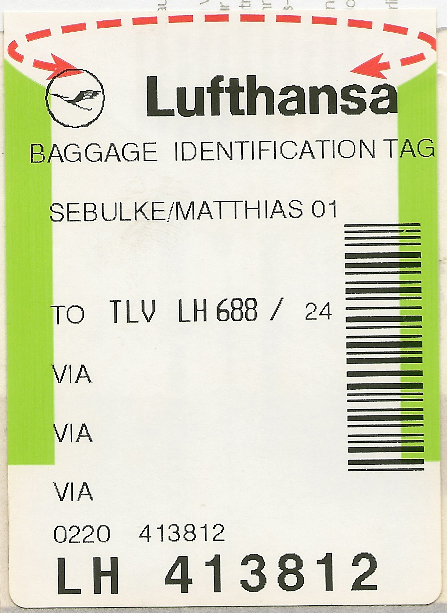

# User-facing locators

*Locating an element the way a real user or a screen reader perceives it - by role, label, or visible text - survives a markup rewrite that would break a CSS class or XPath locator instantly.*

> A locator built from `.css-4kx82j > div:nth-child(3) > span` breaks the moment a designer reorders a
> div for a completely unrelated reason. A locator built from "the button labeled Submit" survives
> that same refactor untouched, because it was never describing the implementation in the first place -
> it was describing what a person sees.

> **In real life**
>
> A Lufthansa baggage tag carries two completely different ways to identify the same bag: a
> human-readable line reading the passenger's name and destination, and a barcode encoding an internal
> tracking number. A gate agent reads the name. A sorting machine scans the barcode. Both work - but if
> the airline silently renumbers its internal tracking system overnight, the human-readable name still
> finds the right bag; a process built only around the old barcode number breaks.

**User-facing locator**: A user-facing locator finds an element the same way a real person (or assistive technology like a screen reader) perceives it - by its accessible role and name (getByRole), its associated label (getByLabel), or its visible text (getByText) - rather than by implementation details like a CSS class, an element's position in the DOM, or an XPath expression. Because a page's visible role, label, and text change far less often than its internal markup and styling, user-facing locators stay correct across refactors that would silently break a structural selector.

## Two ways to find the same button

Given a real "Add to cart" button, both of these locators might find it today:

```
page.locator('.css-4kx82j > div:nth-child(3) > span')   // structural - the barcode
page.getByRole('button', { name: 'Add to cart' })         // user-facing - the printed name
```

The first depends on exact DOM position and a generated class name that a CSS framework or a build
tool can regenerate on every deploy. The second depends only on the button still being a button,
still labeled "Add to cart" - the two things an actual customer (and a screen reader) rely on to find
it too.

- **Role** — what kind of control it is (`button`, `link`, `checkbox`, `heading`) — usually implicit
  from the HTML element, sometimes set explicitly via `role="..."`.
- **Accessible name** — the visible text, or an `aria-label`, or an associated `<label>` — what gets
  read aloud by a screen reader and what a sighted user reads with their eyes.
- **Visible text** — plain page content, useful for non-interactive elements a role locator doesn't
  fit as naturally.

> **Tip**
>
> A locator that only works because it matches an accessible role and name is, as a side effect, also
> verifying the page is accessible enough for that role/name pair to exist at all - user-facing locators
> and basic accessibility checking come nearly for free together.

> **Common mistake**
>
> Reaching for a CSS class or XPath locator as the default, and treating `getByRole`/`getByLabel` as a
> fallback for when the "real" selector doesn't work. Playwright's own guidance inverts that: user-facing
> locators are the first choice, and a structural selector is the fallback for the rare element with no
> meaningful role, label, or text at all.


*Lufthansa baggage identification tag — Wikimedia Commons, public domain. [Source](https://commons.wikimedia.org/wiki/File:Lufthansa_baggage_identification_tag.jpg)*
- **SEBULKE/MATTHIAS — the human-readable name** — Printed plainly, meant to be read by a gate agent at a glance - the passenger's actual identity, not an internal code. This is the getByText/getByRole equivalent.
- **TO TLV LH688/24 — the destination, in plain text** — A person can read this and know exactly where the bag is going, with zero decoding required - the same reason an accessible name like "Add to cart" tells a user (and a test) exactly what a button does.
- **The barcode — machine-only, meaningless to a human glance** — Fast for a scanner, unreadable at a glance for a person - the structural equivalent of a generated CSS class or an XPath position index.
- **LH 413812 — the internal tracking number** — Could be reassigned or reformatted by the airline's internal systems without the passenger's name or destination ever changing - implementation detail, exactly what a user-facing locator deliberately avoids depending on.

**The same markup change, two locator strategies**

1. **Before: a CSS framework regenerates class names on deploy** — '.css-4kx82j' becomes '.css-9f2k1x' overnight - a routine, harmless-looking build change.
2. **Structural locator: breaks immediately** — page.locator('.css-4kx82j ...') now matches nothing. The test fails, but the button still works fine for real users.
3. **The real signal preserved** — A user-facing locator test failure now means the button (or its label) actually changed - a real regression, not build-tool noise.

Choosing a locator strategy is really just: prefer the identifier least likely to change for reasons
unrelated to what you're actually testing. Here's that preference ranking as a small, generic
simulation.

*Run it - rank candidate identifiers by how likely each is to survive an unrelated refactor (Python)*

```python
candidates = [
    {"kind": "css-class (generated)", "survives_refactor": False, "readable_by_human": False},
    {"kind": "xpath (position-based)", "survives_refactor": False, "readable_by_human": False},
    {"kind": "visible text", "survives_refactor": True, "readable_by_human": True},
    {"kind": "accessible role + name", "survives_refactor": True, "readable_by_human": True},
]

def score(c):
    return (2 if c["survives_refactor"] else 0) + (1 if c["readable_by_human"] else 0)

ranked = sorted(candidates, key=score, reverse=True)
for c in ranked:
    print(f"{c['kind']}: score={score(c)}")

print(f"\\nBest choice: {ranked[0]['kind']}")
```

Same ranking logic in Java.

*Run it - rank candidate identifiers by how likely each is to survive an unrelated refactor (Java)*

```java
import java.util.*;

public class Main {
    record Candidate(String kind, boolean survivesRefactor, boolean readableByHuman) {
        int score() {
            return (survivesRefactor ? 2 : 0) + (readableByHuman ? 1 : 0);
        }
    }

    public static void main(String[] args) {
        List<Candidate> candidates = List.of(
            new Candidate("css-class (generated)", false, false),
            new Candidate("xpath (position-based)", false, false),
            new Candidate("visible text", true, true),
            new Candidate("accessible role + name", true, true)
        );

        List<Candidate> ranked = new ArrayList<>(candidates);
        ranked.sort((a, b) -> b.score() - a.score());

        for (Candidate c : ranked) {
            System.out.println(c.kind() + ": score=" + c.score());
        }
        System.out.println("\\nBest choice: " + ranked.get(0).kind());
    }
}
```

### Your first time: Your mission: replace a structural locator with a user-facing one and prove it survives a refactor

- [ ] In a scratch page (or your own project), write a test using a CSS-class-based locator against a real button — Note the exact class name you depended on.
- [ ] Rewrite the same test using getByRole with the button's visible text — Confirm it finds the same element.
- [ ] Simulate a refactor: rename the CSS class in the markup (or in a scratch HTML file) — This mimics what a CSS framework rebuild does routinely.
- [ ] Re-run both tests — Confirm the CSS-class version now fails to locate anything, while the getByRole version still passes unchanged.

You've now seen, directly, why a user-facing locator survives exactly the kind of change that breaks
a structural one.

- **A getByText locator matches multiple elements and Playwright throws a strict-mode violation.**
  This is a genuine signal, not a bug to suppress - the text really does appear more than once. Narrow it with a more specific role, a parent scope, or exact: true rather than reaching for a brittle CSS selector instead.
- **No visible label or role fits a particular element at all (a decorative icon-only button, for example).**
  Add a real aria-label to the markup so the element has an honest accessible name - this improves both the test AND the app's real accessibility, rather than falling back to a structural locator as a workaround.
- **A teammate insists CSS selectors are 'faster' than role locators.**
  Playwright's role-based matching is not meaningfully slower in practice - the real cost difference that matters is maintenance: a CSS selector silently rotting on every unrelated style change versus a role locator staying correct as long as the actual user experience doesn't change.

### Where to check

- **The browser's Accessibility panel in DevTools** — shows the actual computed role and accessible
  name Playwright's `getByRole` would match against, ground truth independent of the visible markup.
- **`npx playwright codegen`** (covered later in this module) — generates role-based locators by
  default when recording real interactions, a good reference for the "user-facing first" convention.
- **A strict-mode violation error** — lists every element a locator matched, useful for seeing exactly
  why a role/text locator needs narrowing.
- **The rendered HTML's implicit roles** — a `<button>` is role `button` for free; a styled `<div
  onclick>` is not, and needs an explicit `role="button"` to be findable the same way.

### Worked example: a locator that survived a redesign nobody warned the test suite about

1. A checkout suite originally locates the "Place Order" button with
   `page.locator('.btn.btn-primary.checkout-cta')`.
2. A design refresh ships six months later: the CSS framework changes, `.btn-primary` becomes
   `.button--primary`, and `.checkout-cta` is dropped entirely as unused-looking legacy naming.
3. The structural-locator test suite goes red across a dozen unrelated tests the same day - not
   because checkout broke, but because none of those class names exist anymore.
4. A parallel test written with `page.getByRole('button', { name: 'Place Order' })` continues passing
   through the entire redesign, because the button is still a button, still labeled "Place Order" -
   the only two things that locator ever depended on.

**Quiz.** Why does Playwright's own guidance recommend user-facing locators (getByRole, getByLabel, getByText) as the default, rather than as a fallback for when CSS or XPath selectors don't work?

- [ ] User-facing locators execute faster than CSS selectors in every case
- [x] They depend on what a real user (or assistive technology) perceives - role, label, visible text - which changes far less often than implementation details like CSS class names or DOM position, so tests stay correct across unrelated refactors
- [ ] CSS and XPath selectors are deprecated and no longer supported by Playwright
- [ ] User-facing locators automatically fix accessibility bugs on the page

*The note is explicit that the reason is durability across unrelated changes, not raw execution speed. Option one isn't the stated rationale anywhere in the note. Option three is false - Playwright still fully supports CSS and XPath locators; they're a legitimate fallback, just not the recommended default. Option four overstates the relationship - a user-facing locator matching successfully is a signal the element has SOME accessible role/name, not a guarantee the page is accessible overall, and it fixes nothing on its own.*

- **What makes a locator "user-facing"?** — It finds an element by what a real person or screen reader perceives - role, label, or visible text - rather than by implementation details like a CSS class or DOM position.
- **Playwright's recommended default vs fallback** — User-facing locators (getByRole, getByLabel, getByText) are the recommended DEFAULT; structural selectors (CSS/XPath) are the fallback for the rare element with no meaningful role, label, or text.
- **Why do structural locators break more often than user-facing ones?** — CSS class names and DOM structure change routinely for reasons unrelated to the feature (framework rebuilds, refactors, redesigns); accessible role and visible label change only when the actual user experience changes.
- **What does a strict-mode violation on getByText usually mean?** — The text genuinely appears more than once on the page - a real signal to narrow the locator (role, scope, exact match), not a bug to suppress.
- **The baggage-tag analogy for user-facing vs structural locators** — The printed passenger name/destination = user-facing (readable, stable); the barcode/internal tracking number = structural (machine-only, can be silently renumbered without the human-readable info changing).

### Challenge

Take a real page you use often and pick three interactive elements on it. For each, write both a
structural locator (CSS class or nth-child) and a user-facing locator (getByRole or getByText).
Inspect the page's actual DOM to judge honestly: which of your six locators would most likely survive
a routine redesign, and which would you bet breaks first? Write one sentence of reasoning per element.

### Ask the community

> I'm trying to locate `[describe the element]` with getByRole/getByLabel but it's not matching. Here's the relevant markup: `[paste it]`.

Pasting the actual rendered markup (not just a description) usually reveals immediately whether the
element's accessible role or name differs from what's visually assumed - the single most common cause
of a getByRole locator not matching.

- [Playwright — official Locators docs](https://playwright.dev/docs/locators)
- [Playwright — official Best Practices guide](https://playwright.dev/docs/best-practices)

🎬 [Playwright Tutorial #8 — getByRole() Locator — Software Testing Mentor](https://www.youtube.com/watch?v=2u9ov_NMPjk) (16 min)

- A user-facing locator finds an element by role, label, or visible text - the same things a real user or screen reader perceives - not by CSS class or DOM position.
- Playwright recommends user-facing locators as the DEFAULT, with structural selectors (CSS/XPath) as a fallback only when no meaningful role, label, or text exists.
- Structural locators break on routine, unrelated changes (CSS framework rebuilds, refactors); user-facing locators only break when the actual user experience changes.
- A strict-mode violation from a text-based locator is a real signal the text appears more than once - narrow it, don't suppress it with a structural selector instead.
- An element with no meaningful accessible name (an icon-only button, for example) should get a real aria-label - that fixes both the test and the app's actual accessibility.


## Related notes

- [[Notes/playwright/locators-and-fixtures/getbyrole-label-testid|getByRole / Label / TestId]]
- [[Notes/playwright/locators-and-fixtures/fixtures|Fixtures]]
- [[Notes/playwright/locators-and-fixtures/test-isolation|Test isolation]]


---
_Source: `packages/curriculum/content/notes/playwright/locators-and-fixtures/user-facing-locators.mdx`_
