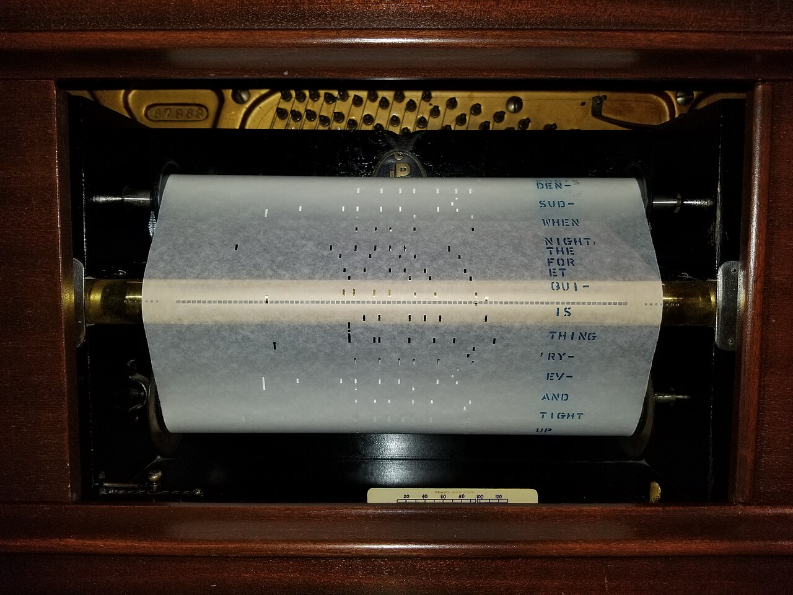

# Codegen

*npx playwright codegen opens a real browser, records real clicks and typing as you perform them, and writes out runnable test code with user-facing locators already chosen for you.*

> Staring at a blank test file and trying to recall the exact locator syntax for a dropdown is a
> genuinely slow way to start. `npx playwright codegen` skips that entirely: open the real page, click
> and type the way an actual user would, and working test code appears in a side panel as you go -
> already using `getByRole` where it can.

> **In real life**
>
> A player piano roll isn't composed by punching holes one at a time from a blank sheet. A performer
> plays the piece once, for real, and the mechanism records exactly what was played - which keys,
> timing, how hard - onto the roll as it happens. Anyone can then feed that roll back in and the piano
> reproduces the performance exactly. Codegen records a real interaction the same way, straight into a
> script that reproduces it.

**Codegen**: Codegen is Playwright's test-recording tool, launched with npx playwright codegen <url>. It opens a real, visible browser alongside a Playwright Inspector panel; every click, fill, and navigation performed in that browser is captured live and written out as working TypeScript test code in the inspector panel, using getByRole/getByLabel/getByText locators where the element supports them. The generated code is a strong starting draft, not a finished test - it typically still needs assertions added and minor cleanup, since codegen records ACTIONS, not the expectations a real test needs to verify.

## What actually happens when you run it

```
npx playwright codegen https://your-app.example
```

- A real browser window opens, pointed at the given URL.
- A separate **Playwright Inspector** window opens alongside it, showing generated code live.
- Every click, text entry, checkbox toggle, and navigation performed in the browser window appears as
  a new line of code in the inspector, in real time.
- Codegen picks a locator for each recorded action using the same priority order covered earlier in
  this module - role and accessible name first, falling back further down the list only when nothing
  better is available.
- A **pick locator** tool in the inspector lets you hover any element and copy just its locator,
  without recording a full action - useful for grabbing a locator to hand-write an assertion around.

What codegen does **not** do: it never generates `expect(...)` assertions on its own, because it has
no way to know what you actually intend to verify. Every recorded script needs assertions added by
hand afterward.

> **Tip**
>
> Use codegen to bootstrap the *shape* of a test - the navigation and interaction sequence - then read
> back through the generated locators critically rather than accepting all of them as-is. Codegen picks
> a reasonable default, but a human reviewing the actual page often finds a better, more specific
> role/name combination than the first one it landed on.

> **Common mistake**
>
> Treating codegen's output as a finished test and committing it unedited. A recorded script with no
> assertions passes trivially every time (it just replays clicks) regardless of whether the feature
> actually works - exactly the "actions with no expect()" mistake covered in the first-test note, just
> arrived at by recording instead of typing.


*Player Piano Roll — Wikimedia Commons, CC BY-SA 4.0 (Draconichiaro). [Source](https://commons.wikimedia.org/wiki/File:PlayerPianoRoll.jpg)*
- **The punched holes — the recorded performance** — Each hole exists because a real key was actually played, at a real moment - the same way each generated line of code exists because a real click or keystroke actually happened in the browser.
- **The printed lyrics alongside the holes** — Human-readable annotation riding along with the machine-readable encoding - close to what a locator's accessible name gives a generated getByRole call: both machine-usable AND readable by a person reviewing it.
- **The brass mechanism above — the inspector translating input to output** — The roll alone does nothing; the mechanism reads it and turns it into piano hammers striking keys. The Playwright Inspector plays the same role, turning recorded browser events into written code in real time.
- **The roll's edge — where the recording actually ends** — The roll only captures what was actually played on it - nothing about how well the piece was played, or whether it was the RIGHT piece. Codegen records actions the same way, with zero judgment about whether the actions produced a correct outcome, which is exactly why assertions still need to be added by hand.

**From a live click to committed test code**

1. **npx playwright codegen <url>** — A real browser and the Inspector panel both open.
2. **A real click happens in the browser** — e.g. clicking the 'Add to cart' button.
3. **The recording is copied into a real test file** — The interaction sequence is now a starting draft.
4. **Assertions are added by hand** — expect(...) calls stating what should actually be true - codegen never writes these itself.

Recording is really just: capture a sequence of real events as they happen, and translate each one
into a reusable instruction. Here's that shape as a small, generic simulation.

*Run it - translate a sequence of recorded UI events into generated code lines (Python)*

```python
recorded_events = [
    {"type": "click", "role": "button", "name": "Add to cart"},
    {"type": "fill", "role": "textbox", "name": "Promo code", "value": "SAVE10"},
    {"type": "click", "role": "button", "name": "Apply"},
]

def to_code_line(event):
    if event["type"] == "click":
        return f"page.get_by_role(\\"{event['role']}\\", name=\\"{event['name']}\\").click()"
    if event["type"] == "fill":
        return f"page.get_by_role(\\"{event['role']}\\", name=\\"{event['name']}\\").fill(\\"{event['value']}\\")"
    return f"# unrecognized event: {event}"

print("--- generated code ---")
for e in recorded_events:
    print(to_code_line(e))
print("\\n# NOTE: no assertions generated - add expect(...) calls by hand")
```

Same event-to-code translation shape in Java.

*Run it - translate a sequence of recorded UI events into generated code lines (Java)*

```java
import java.util.*;

public class Main {
    record UiEvent(String type, String role, String name, String value) {}

    static String toCodeLine(UiEvent e) {
        return switch (e.type()) {
            case "click" -> "page.getByRole(\\"" + e.role() + "\\", new Page.GetByRoleOptions().setName(\\"" + e.name() + "\\")).click();";
            case "fill" -> "page.getByRole(\\"" + e.role() + "\\", new Page.GetByRoleOptions().setName(\\"" + e.name() + "\\")).fill(\\"" + e.value() + "\\");";
            default -> "// unrecognized event: " + e;
        };
    }

    public static void main(String[] args) {
        List<UiEvent> recordedEvents = List.of(
            new UiEvent("click", "button", "Add to cart", null),
            new UiEvent("fill", "textbox", "Promo code", "SAVE10"),
            new UiEvent("click", "button", "Apply", null)
        );

        System.out.println("--- generated code ---");
        for (UiEvent e : recordedEvents) {
            System.out.println(toCodeLine(e));
        }
        System.out.println("\\n// NOTE: no assertions generated - add expect(...) calls by hand");
    }
}
```

### Your first time: Your mission: record a real flow, then finish what codegen deliberately leaves out

- [ ] Run npx playwright codegen against a real site you use often — Perform a small, real multi-step flow: a search, a filter, adding something to a list.
- [ ] Copy the generated code into a real test file — Don't edit it yet - run it once as-is and confirm it replays your actions correctly.
- [ ] Read every generated locator critically — For at least one line, check in DevTools whether a more specific or more honest role/name exists than what codegen picked.
- [ ] Add at least one real expect(...) assertion — State something that should actually be true after the recorded flow completes - this is the part codegen never does for you.

You've now used codegen for what it's actually good at - a fast, accurate starting draft - and done
the part it can't: deciding what the test should actually verify.

- **Codegen generates a locator that looks overly specific or fragile (a long CSS chain).**
  This usually means the target element genuinely has no meaningful role, label, or text - the same case where a manually-added data-testid, covered earlier in this module, is the honest fix, rather than accepting the fragile generated locator as-is.
- **A recorded flow doesn't replay correctly - an action that worked live fails when re-run.**
  Check for anything timing-dependent that recording papered over (a real human naturally pauses between actions in a way auto-waiting doesn't need, but a genuinely slow-loading element between two recorded actions can still expose a real actionability issue on replay).
- **Codegen's browser window and the Inspector panel both closed unexpectedly.**
  Codegen keeps both open only while the process is running in the terminal - closing the terminal, not just the windows, ends the session and discards anything not yet copied out.
- **A teammate committed a fully codegen-recorded test with zero assertions added.**
  Flag it the same way as any action-without-assertion test - it will always report as passed regardless of whether the recorded flow's actual outcome was correct.

### Where to check

- **The Playwright Inspector's generated code panel** — the live, authoritative view of exactly what
  codegen has captured so far during a session.
- **The \"pick locator\" tool** in the inspector — grabs just a locator for a hovered element, without
  recording a full action, useful when writing an assertion by hand.
- **`npx playwright codegen --target=python` (or other language flags)** — confirms/generates code in
  a specific language if a project isn't TypeScript.
- **The actual committed test file**, after recording — the real place to verify assertions were
  actually added, not assumed.

### Worked example: a recorded flow that looked done but wasn't, caught in review

1. A tester runs `npx playwright codegen` against a staging checkout flow, clicks through adding an
   item, applying a promo code, and completing checkout, then copies the generated code into a new
   test file and commits it.
2. A reviewer runs the test and confirms it passes - but notices it has zero `expect(...)` calls
   anywhere in the file.
3. The reviewer deliberately breaks the promo code feature locally (comments out the discount logic)
   and re-runs the exact same committed test.
4. It still reports as passed, because it only replays clicks - nothing in it ever checked that the
   discount was actually applied.
5. The fix: add `await expect(page.getByText('$10.00 off applied')).toBeVisible();` after the promo
   code step, and `await expect(page.getByText('Order confirmed')).toBeVisible();` at the end. Now the
   same deliberately-broken discount logic correctly fails the test.

**Quiz.** A test recorded entirely with codegen and committed unedited continues to pass even after a reviewer deliberately breaks the feature it's supposed to be testing. What's the most likely explanation?

- [ ] Codegen produced buggy locator code that isn't actually clicking the right elements
- [x] The recorded test has no expect() assertions - codegen only records actions, never generates the assertions that would actually verify the feature's outcome
- [ ] The deliberately broken feature needs a page reload to take effect
- [ ] Codegen tests can only be run in headed mode, and the reviewer ran it headless

*The note is explicit that codegen never generates assertions - it records actions only, and a script with actions but no expect() calls passes regardless of the actual outcome, exactly the general 'first test' mistake covered earlier in this module. Option one assumes a codegen bug not indicated anywhere in the scenario - the actions genuinely replay correctly, they just aren't checked. Option three and four are unrelated technical guesses that don't address why an assertion-free test can't detect a broken feature in the first place.*

- **What does npx playwright codegen <url> actually open?** — A real, visible browser window plus a separate Playwright Inspector panel showing generated code live as you interact.
- **What locator strategy does codegen use by default?** — The same priority order as the rest of this module - role and accessible name first, falling back further only when nothing better fits.
- **What does codegen never generate on its own?** — expect(...) assertions - it records actions only, since it has no way to know what a test should actually verify.
- **The "pick locator" tool in the inspector** — Grabs just a locator for a hovered element without recording a full action - useful for writing an assertion by hand afterward.
- **The player-piano-roll analogy for codegen** — A real performance is recorded exactly as played, reproducible afterward - but the roll captures WHAT was played, not whether it was the right piece, the same way codegen records actions but never judges outcomes.

### Challenge

Record a five-step flow on a real site with codegen. Before adding any assertions, deliberately try
to think of three different things that could go subtly wrong in that flow that a pure action-replay
would never catch (a wrong total, an item that doesn't actually get removed, a confirmation message
that doesn't appear). Write one expect(...) assertion for each of the three, and confirm all three
pass against the real, working site.

### Ask the community

> Codegen generated `[paste the locator/line]` for an element that seems overly fragile/wrong to me. Here's the element's actual markup: `[paste it]`.

Pasting both codegen's output and the real markup usually reveals immediately whether a better
role/label/text locator was available, or whether the fragile locator was genuinely the best option
for that specific element.

- [Playwright — official Generating tests (codegen) docs](https://playwright.dev/docs/codegen-intro)
- [Bondar Academy — Playwright Codegen Test Recorder: Full Guide](https://bondaracademy.com/blog/playwright-codegen-test-recorder)

🎬 [How To Record And Play Scripts In Playwright — Playwright Test Generator (Codegen) — Mukesh Otwani](https://www.youtube.com/watch?v=LjPW5PUDImw) (18 min)

- npx playwright codegen <url> opens a real browser plus a live Inspector panel that writes generated test code as you actually interact with the page.
- Codegen picks locators using the same role/label/text priority order as the rest of this module, falling back only when nothing better fits an element.
- Codegen never generates assertions - it records actions only, which means an unedited recorded test can pass regardless of whether the feature it exercises actually works.
- The right workflow is: record the interaction sequence for speed, then critically review the chosen locators AND add real expect(...) assertions by hand.
- The pick-locator tool grabs a single element's locator without recording a full action - useful specifically for writing assertions.


## Related notes

- [[Notes/playwright/tracing-and-debugging/trace-viewer|Trace viewer]]
- [[Notes/playwright/tracing-and-debugging/debugging|Debugging]]
- [[Notes/playwright/tracing-and-debugging/screenshots-and-video|Screenshots & video]]


---
_Source: `packages/curriculum/content/notes/playwright/tracing-and-debugging/codegen.mdx`_
