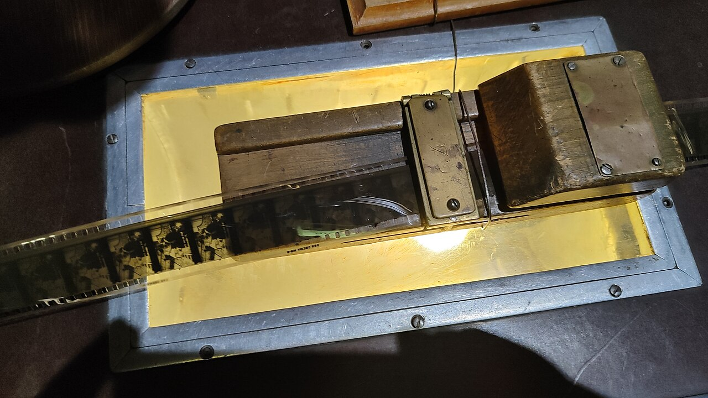

# Debugging

*page.pause() and the --debug flag freeze a running test mid-execution so you can step through it one action at a time, inspecting the real page state at each pause rather than guessing from a final error.*

> Watching a whole test run at full speed and hoping to spot the exact moment something goes wrong is
> like watching a movie reel play by and trying to catch one specific frame. Playwright's debugging
> tools let you stop the reel entirely, hold a single frame under the light, and only advance once
> you've actually looked at it.

> **In real life**
>
> A film editor working with real celluloid doesn't debug a scene by playing the whole reel over and
> over at speed. They pull the strip onto a lit table, stop on one exact frame, and examine it directly
> before deciding whether to cut there. Playwright's Inspector does the same thing to a test: pause
> execution at one exact action, look at the real page state, then decide whether to step forward one
> action or resume at full speed.

**Debugging**: Debugging in Playwright means pausing a running test's execution to inspect the real browser state at that exact moment, rather than only reading a final error message after the fact. The two primary tools are page.pause(), which freezes execution at that specific line and opens the Playwright Inspector, and the --debug CLI flag (or PWDEBUG=1), which opens the Inspector paused at the very first action. The Inspector's toolbar then lets you step forward one action at a time, or resume to full speed, while a live, real browser window shows exactly what the page looks like at each paused moment - distinct from a trace, which replays a past recording rather than pausing a live run.

## Two ways to pause, and what you get once paused

- **`await page.pause();`** — insert this line anywhere in a test. Execution freezes there, a real
  browser window and the Inspector both open, and you can interact with the live page manually before
  choosing to step or resume.
- **`npx playwright test --debug`** (or `PWDEBUG=1`) — runs the whole test suite in debug mode,
  pausing before the very first action of each test automatically, without editing any test file.

Once paused, the Inspector gives you:

- **Step** — advance exactly one action and pause again immediately after it.
- **Resume** — run at full speed until the next `page.pause()` or the test's natural end.
- **A live locator picker** — hover any element in the real browser to see what locator would match
  it, useful for fixing a locator that isn't working without editing and re-running repeatedly.
- **The real DevTools**, available on the paused browser window at the same time - console, network,
  elements, all usable on the actual live page state.

> **Tip**
>
> Placing `await page.pause();` right before the specific line you're actually investigating is almost
> always faster than using `--debug` and stepping through everything from the start - you get to the
> interesting moment immediately instead of clicking Step repeatedly through setup you already trust.

> **Common mistake**
>
> Leaving a `page.pause()` call in a committed test file. In CI (headless, no human present to click
> Resume) this hangs the run until it times out - always remove debugging pauses before committing, the
> same discipline as removing a stray `console.log` or breakpoint.


*35mm film on edit — Wikimedia Commons, CC BY 4.0 (DurbeK82). [Source](https://commons.wikimedia.org/wiki/File:35mm_film_on_edit.jpg)*
- **One frame, held still under the light** — The reel isn't running - it's stopped, deliberately, on one exact frame that can actually be examined. This is page.pause(): execution frozen at one exact line, not sped past.
- **The splicer mechanism** — The physical tool that lets an editor act on this exact, stopped frame - the Inspector's Step and Resume controls, plus the live locator picker, play the same role for a paused test.
- **The backlight itself — illuminating what's actually there** — Not a description of the frame, the frame itself, lit and visible. The paused Inspector shows the REAL browser state at that moment, not a summary of what should be there.
- **Frames still coiled, not yet examined** — The rest of the reel waits, untouched, exactly where it was - the same way every action after a page.pause() line hasn't executed yet and won't until Step or Resume is clicked.

**Pausing a test mid-run**

1. **await page.pause() is reached** — Execution freezes at exactly this line.
2. **A real browser window and the Inspector open** — The live page, as it actually looks right now, is visible and interactive.
3. **Hover elements with the locator picker** — Confirm what locator would actually match something on the real page.
4. **Step — advance one action** — Or Resume, to run at full speed to the next pause or the test's end.
5. **Debugging done — remove the pause before committing** — A left-in page.pause() hangs a headless CI run.

Pausing execution to inspect state is really just: stop at a specific point, expose the current state
for inspection, then choose to advance one step or continue at full speed. Here's that shape as a
small, generic simulation.

*Run it - pause a sequence of steps, inspect state, then step or resume (Python)*

```python
steps = ["navigate", "fill_form", "click_submit", "check_confirmation"]
state = {}

def run_step(name):
    if name == "navigate":
        state["url"] = "/checkout"
    elif name == "fill_form":
        state["form_filled"] = True
    elif name == "click_submit":
        state["submitted"] = True
    elif name == "check_confirmation":
        state["confirmed"] = state.get("submitted", False)
    return state

def debug_run(steps, pause_before):
    for i, step in enumerate(steps):
        if step == pause_before:
            print(f"PAUSED before '{step}' - state so far: {state}")
        run_step(step)
        print(f"after '{step}': {state}")

debug_run(steps, pause_before="click_submit")
```

Same pause-and-inspect shape in Java.

*Run it - pause a sequence of steps, inspect state, then step or resume (Java)*

```java
import java.util.*;

public class Main {
    static Map<String, Object> state = new LinkedHashMap<>();

    static void runStep(String name) {
        switch (name) {
            case "navigate" -> state.put("url", "/checkout");
            case "fill_form" -> state.put("form_filled", true);
            case "click_submit" -> state.put("submitted", true);
            case "check_confirmation" -> state.put("confirmed", state.getOrDefault("submitted", false));
        }
    }

    public static void main(String[] args) {
        List<String> steps = List.of("navigate", "fill_form", "click_submit", "check_confirmation");
        String pauseBefore = "click_submit";

        for (String step : steps) {
            if (step.equals(pauseBefore)) {
                System.out.println("PAUSED before '" + step + "' - state so far: " + state);
            }
            runStep(step);
            System.out.println("after '" + step + "': " + state);
        }
    }
}
```

### Your first time: Your mission: pause a real test and inspect it live

- [ ] Add await page.pause(); to a real test, right after a navigation but before an assertion — Run the test normally with npx playwright test - it should open a browser and the Inspector, then freeze.
- [ ] With the browser paused, open its real DevTools and inspect an element manually — Confirm you can interact with the live page exactly as if you'd opened it yourself.
- [ ] Use the Inspector's locator picker on an element you plan to assert against — Confirm the locator it shows matches what you intended to write in code.
- [ ] Click Step once, then Resume — Observe the difference: Step advances exactly one action; Resume runs to completion (or the next pause).

You've now used live debugging for what it's actually for: inspecting real state at an exact moment,
not guessing from a final error message.

- **npx playwright test --debug doesn't seem to open anything.**
  Confirm the test isn't configured to run headless-only in a way that overrides debug mode, and check that a display is actually available (debug mode needs a real, visible browser window - it won't work over a headless-only CI runner).
- **A page.pause() call was accidentally left in a test that's now hanging in CI.**
  This is expected behavior, not a bug - CI has no human to click Resume. Remove the pause and treat this as a reminder to grep for page.pause( before every commit.
- **The Inspector's locator picker shows a different locator than what a getByRole call in the test file is using.**
  This usually means the picker found a MORE specific or different valid match than the one written in code - worth comparing both to decide honestly which is actually more correct for that element.
- **Stepping through one action at a time is too slow for a long test.**
  Move the page.pause() call to right before the specific action under investigation instead of debugging from the very first line - there's no need to step through setup that's already known to work.

### Where to check

- **The Inspector's toolbar** — Step, Resume, and a running log of already-executed actions, all in
  one place during a paused session.
- **The paused browser's real DevTools** — full Elements/Console/Network access on the actual live
  page, not a snapshot.
- **`grep -rn "page.pause("` across a test directory** — a quick pre-commit check for any pause left
  in by accident.
- **CI job logs for a hung run** — a suspiciously long-running or timed-out job with no other obvious
  cause is a common symptom of exactly this mistake.

### Worked example: a locator bug found in seconds instead of guessed at for an hour

1. A test fails with a generic timeout trying to click a "Confirm" button that clearly exists on the
   page in a screenshot.
2. Rather than guessing at fixes, a `page.pause();` is added right before the failing click line, and
   the test is re-run.
3. With the browser paused on the real page, the Inspector's locator picker is used on the actual
   visible "Confirm" button - it reveals the button's accessible name is really "Confirm order", not
   "Confirm" as the test assumed.
4. The fix is immediate and exactly targeted: update the locator's `name` option to match the real
   accessible name, remove the `page.pause()`, and re-run.
5. Total time from "mysterious timeout" to "test passing" was a few minutes, because the actual page
   state was inspected directly instead of inferred from an error message alone.

**Quiz.** A team's CI pipeline has a test suite that hangs indefinitely on one specific test until it eventually times out, with no other errors reported. What's the most likely cause, based on this note?

- [ ] The test is stuck in an infinite retry loop due to a flaky assertion
- [x] A page.pause() call was accidentally left in the committed test file - in a headless CI environment with no human present to click Resume, execution simply stays frozen until the run times out
- [ ] The CI runner ran out of memory partway through the test
- [ ] The test's trace configuration is set to 'on', slowing it down until it times out

*The note's mistake callout and worked failure mode are explicit about this exact symptom - a page.pause() left in committed code hangs a headless CI run because nothing is present to click Resume, and the run sits frozen until timeout. Option one describes a different failure pattern (repeated retries with visible errors), not a silent hang. Option three would typically show a distinct out-of-memory error rather than an indefinite hang with no other errors reported. Option four would slow a run, not hang it indefinitely with no other symptoms.*

- **Two ways to pause a Playwright test** — await page.pause() at a specific line, or npx playwright test --debug (or PWDEBUG=1) to pause automatically before every test's first action.
- **What can you do with a test paused via page.pause()?** — Interact with the real live browser and its real DevTools, use the Inspector's locator picker, then Step one action at a time or Resume to full speed.
- **Why must page.pause() never ship in a committed test?** — In headless CI with no human present, it hangs the run indefinitely until timeout - there's nothing to click Resume.
- **Debugging vs a trace - what's the core difference?** — Debugging pauses a LIVE run happening right now; a trace replays a PAST recording after the fact. Different tools for 'investigate as it happens' vs 'investigate after it already happened'.
- **The fastest way to debug one specific failing action** — Place page.pause() right before that exact line, rather than using --debug and stepping through everything from the start.

### Challenge

Take a real test that currently passes and deliberately introduce a subtle locator mistake (a slightly
wrong accessible name). Before looking at the error message, add page.pause() right before the broken
line, run it, and use only the Inspector's locator picker on the real page to figure out the correct
locator - without reading the test's failure output at all. Then compare: did the paused inspection
find the fix faster than reading the error would have?

### Ask the community

> I paused my test with page.pause() at `[describe the line]` and the live browser shows `[describe what you see]`, but I'm still not sure why `[describe the actual problem]`.

Describing what the PAUSED, LIVE page actually looks like (not just the original error) usually gets
a faster answer, since it rules out several common causes immediately.

- [Playwright — official Debugging Tests docs](https://playwright.dev/docs/debug)
- [BrowserStack — How to start with Playwright Debugging](https://www.browserstack.com/guide/playwright-debugging)

🎬 [Playwright Inspector Tutorial — How to Debug Tests Step-by-Step — Test Automation 101](https://www.youtube.com/watch?v=AESZ-S2LX0Y) (17 min)

- await page.pause() freezes a test at that exact line and opens a real, live, interactive browser plus the Inspector.
- npx playwright test --debug (or PWDEBUG=1) pauses automatically before every test's first action without editing any file.
- Once paused, Step advances one action at a time; Resume runs at full speed to the next pause or the test's end.
- The Inspector's live locator picker confirms what locator actually matches a real element, faster than repeatedly editing and re-running to guess.
- A page.pause() left in committed code hangs indefinitely in headless CI - always remove it before committing, the same discipline as any other debugging leftover.


## Related notes

- [[Notes/playwright/tracing-and-debugging/trace-viewer|Trace viewer]]
- [[Notes/playwright/tracing-and-debugging/codegen|Codegen]]
- [[Notes/playwright/tracing-and-debugging/screenshots-and-video|Screenshots & video]]


---
_Source: `packages/curriculum/content/notes/playwright/tracing-and-debugging/debugging.mdx`_
