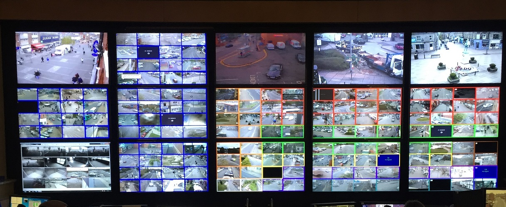

# Screenshots & video

*screenshot: 'only-on-failure' and video: 'retain-on-failure' are the lightweight, always-on visual evidence a trace complements - a still frame and a recording, kept only for the runs that actually failed.*

> A stack trace says a locator "timed out waiting for element to be visible." A single screenshot of
> that exact moment can say, at a glance, that a cookie-consent banner was still covering the whole
> page - the same fact, but instantly obvious instead of inferred. Screenshots and video are the
> simplest visual evidence Playwright can leave behind, and often the fastest thing to look at first.

> **In real life**
>
> A security operations wall doesn't only run continuous video on every camera forever - storage and
> attention are finite, so most systems are built to keep a still frame or a clip specifically from the
> moment something actually triggered an alert, not an unbroken recording of every quiet hour on every
> camera. Playwright's screenshot and video defaults work the same way: capture only what happened
> around an actual failure, not everything, always.

**Screenshots and video**: Playwright's screenshot and video options are lightweight, built-in visual-evidence artifacts distinct from a full trace: screenshot (config values off, on, only-on-failure) captures a single still image of the page, most commonly only-on-failure so evidence exists for exactly the runs worth investigating; video (config values off, on, retain-on-failure, on-first-retry) records a full video of the browser for the duration of a test, with retain-on-failure keeping only the recordings from tests that actually failed and discarding the rest. Both are simpler and cheaper to skim than a full trace, and are commonly used together with tracing rather than as a replacement for it.

## Configuring both, and what each is actually good for

```
use: {
  screenshot: 'only-on-failure',
  video: 'retain-on-failure',
}
```

- **`screenshot: 'only-on-failure'`** — one still image captured at the moment a test fails. Fast to
  open, fast to skim, often enough on its own to spot an obvious visual cause (a covering overlay, an
  unexpected error page, a completely blank screen).
- **`video: 'retain-on-failure'`** — records continuously during the test, but the file is only kept
  if the test actually fails; passing tests' recordings are discarded automatically. Useful for
  failures where the *sequence* of what happened matters, not just the final frame.
- **Manual screenshots** — `await page.screenshot({ path: 'debug.png' })` can be called anywhere in a
  test on demand, independent of the pass/fail-triggered config options.

Screenshots and video are **not** a substitute for a trace - they show what the page *looked like*,
not the DOM state, network activity, or console logs a trace captures alongside the visuals. Most
real configs run screenshots and video for quick visual triage, and reach for the full trace when a
still image or clip alone isn't enough to explain the failure.

> **Tip**
>
> Start debugging a CI failure with the screenshot first - it loads instantly and answers the most
> common question ("was something visually blocking this?") in one glance, before reaching for video or
> a full trace for anything that needs a closer look.

> **Common mistake**
>
> Setting `video: 'on'` for every run without a real reason. Unlike `retain-on-failure`, this keeps a
> video file for every passing test too - real storage cost for artifacts that will almost never be
> watched, since a passing test's video answers no question anyone is actually asking.


*CCTV control room monitor wall — Wikimedia Commons, CC BY-SA 4.0 (Mark Yeomans). [Source](https://commons.wikimedia.org/wiki/File:CCTV_control_room_monitor_wall.jpg)*
- **One large feed, running continuously** — A full, live, ongoing recording of one specific view - the video option, capturing the whole duration rather than a single instant.
- **A grid of dozens of small tiles** — Many individual, simultaneous still-feeling frames rather than one continuous stream - closer to the role a single screenshot plays: fast to scan, one frame per feed, not a full recording.
- **A feed with an on-screen alert label** — Something specifically flagged this view as worth attention - the same reason only-on-failure and retain-on-failure exist: keep evidence for what actually triggered a problem, not for every quiet, uneventful feed.
- **Rows and rows of feeds nobody is actively reviewing** — Most of this wall, most of the time, shows nothing worth keeping - which is exactly the storage/attention cost video: 'on' for every passing test would recreate unnecessarily.

**A failing test, screenshot and video captured automatically**

1. **A test runs normally** — Video records in the background; nothing is kept yet.
2. **An assertion fails** — The test is now marked as failed.
3. **A screenshot is captured at the failure moment** — One still image, saved immediately.
4. **The video recording is retained, not discarded** — Because this test failed, retain-on-failure keeps the full clip instead of deleting it.
5. **Both artifacts land in test-results/** — Ready to open first, before reaching for a full trace if more detail is needed.

Conditionally keeping an artifact only when something actually went wrong is really just: always
capture, but only persist on failure. Here's that shape as a small, generic simulation.

*Run it - capture during a run, but only persist the artifact if the run actually failed (Python)*

```python
def run_test(name, should_fail):
    print(f"running {name}: recording started")
    passed = not should_fail

    if passed:
        print(f"  {name}: PASSED - discarding recording")
        return {"kept": False}
    else:
        print(f"  {name}: FAILED - retaining screenshot and video")
        return {"kept": True, "screenshot": f"{name}.png", "video": f"{name}.webm"}

results = [
    run_test("checkout_flow", should_fail=False),
    run_test("login_flow", should_fail=True),
]

kept = [r for r in results if r["kept"]]
print(f"\\nArtifacts retained: {len(kept)} of {len(results)} test runs")
```

Same retain-only-on-failure logic in Java.

*Run it - capture during a run, but only persist the artifact if the run actually failed (Java)*

```java
import java.util.*;

public class Main {
    record Result(String name, boolean kept) {}

    static Result runTest(String name, boolean shouldFail) {
        System.out.println("running " + name + ": recording started");
        boolean passed = !shouldFail;

        if (passed) {
            System.out.println("  " + name + ": PASSED - discarding recording");
            return new Result(name, false);
        } else {
            System.out.println("  " + name + ": FAILED - retaining screenshot and video");
            return new Result(name, true);
        }
    }

    public static void main(String[] args) {
        List<Result> results = List.of(
            runTest("checkout_flow", false),
            runTest("login_flow", true)
        );

        long kept = results.stream().filter(Result::kept).count();
        System.out.println("\\nArtifacts retained: " + kept + " of " + results.size() + " test runs");
    }
}
```

### Your first time: Your mission: configure both, then diagnose a failure using only the screenshot

- [ ] Write a test that deliberately fails in a visually obvious way — e.g. asserting text that isn't actually on the page.
- [ ] Run it, then open ONLY the screenshot first - not the video, not a trace — Try to diagnose the failure from the still image alone.
- [ ] Now watch the retained video for the same failure — Note what the video reveals that the single screenshot couldn't - specifically anything about the SEQUENCE of what happened, not just the final state.

You've now practiced the real triage order: screenshot first for a fast glance, video next for
sequence, a full trace only if both together still aren't enough.

- **video: 'retain-on-failure' is set but no video file appears after a failing test.**
  Confirm the browser context actually closed normally - Playwright flushes video to disk on context close, so a test that crashes the whole process (rather than failing an assertion cleanly) can sometimes prevent the video from being written.
- **A screenshot on failure shows a completely blank white or black page.**
  This is itself useful information, not a broken screenshot - it usually means the failure happened before the page finished rendering anything at all (a very early navigation failure, for example), which the screenshot correctly captured.
- **CI storage costs grew noticeably after adding video capture.**
  Confirm the config is retain-on-failure, not on - the former discards passing-test video automatically, the latter keeps everything.
- **A screenshot alone doesn't explain a failure that clearly involves a sequence of steps going wrong.**
  This is exactly when to reach for the retained video (to see the sequence) or a full trace (to see DOM/network/console alongside it) rather than staring harder at one still image.

### Where to check

- **`test-results/<test-name>/`** — where screenshots and videos actually land after a run, named per
  test.
- **`playwright.config.ts`'s `use.screenshot` and `use.video`** — confirms exactly which artifacts a
  given run is configured to produce and keep.
- **The HTML report** (`npx playwright show-report`) — embeds both the failure screenshot and video
  inline per test, often faster than hunting through `test-results/` manually.
- **CI's artifact upload configuration** — screenshots and videos, like traces, only survive past a CI
  job if the pipeline is explicitly configured to upload the results directory.

### Worked example: a screenshot that solved a failure in ten seconds, no video or trace needed

1. A CI run reports a login test failed with a generic "element not found" error for the password
   field.
2. The screenshot captured at failure is opened first - it immediately shows a cookie-consent banner
   covering the entire lower half of the login form, including the password field.
3. No video or trace is needed - the single still image already answers the question completely: the
   banner wasn't dismissed before the test tried to interact with a field it was covering.
4. The fix is a one-line addition: dismiss the cookie banner (or handle it in a fixture) before the
   rest of the login flow runs.
5. Total diagnosis time: under a minute, because the fastest, cheapest artifact was checked first
   instead of jumping straight to a full trace for a problem that was visually obvious the whole time.

**Quiz.** A test fails, and the screenshot captured at failure shows the page completely covered by a modal dialog that shouldn't be there. What's the most efficient next step?

- [ ] Immediately open the full trace and dig through DOM snapshots and network requests to confirm what the screenshot already shows clearly
- [x] Investigate why the unexpected modal is appearing - the screenshot already answered 'what does the page look like at failure,' and a trace or video would only be needed if the CAUSE of the modal (not its presence) were still unclear
- [ ] Re-run the test in a loop until it passes by chance
- [ ] Assume the screenshot is misleading and trust only the raw error message text

*The note's worked example makes exactly this point: a screenshot that already visually explains the failure means the investigation should move to the ROOT CAUSE, not to re-confirming the same visual fact with heavier tools. Option one adds unnecessary investigation time for information already in hand. Option three doesn't investigate anything - it just hopes the problem goes away. Option four distrusts the most direct evidence available (what the page actually looked like) in favor of a more abstract, less informative error string.*

- **The recommended default config for screenshot and video** — screenshot: 'only-on-failure', video: 'retain-on-failure' - evidence kept only for runs that actually failed.
- **How is video: 'retain-on-failure' different from video: 'on'?** — retain-on-failure discards passing-test recordings automatically; 'on' keeps every test's video, passing or not - real, usually unnecessary storage cost.
- **What can video show that a single screenshot can't?** — The SEQUENCE of what happened leading up to a failure, not just the final frame - useful when a multi-step interaction is the actual problem.
- **The recommended triage order for a failure** — Screenshot first (fastest to skim) - video next if sequence matters - a full trace if DOM/network/console detail is still needed beyond what the visuals show.
- **A blank white/black failure screenshot - broken capture or real signal?** — Usually a real signal: the failure happened before the page rendered anything, which the screenshot correctly captured as blank.

### Challenge

Configure screenshot: 'only-on-failure' and video: 'retain-on-failure' in a scratch project. Write
three different deliberately-failing tests: one that fails due to a covering element (diagnosable from
the screenshot alone), one that fails due to a multi-step timing issue (needs the video to see the
sequence), and one that fails for a backend reason with no visible symptom (needs a full trace's
network tab). Confirm which artifact actually solves each one fastest.

### Ask the community

> My failing test's screenshot shows `[describe what's visible]` but I'm still not sure why. Video shows `[describe the sequence, if you've watched it]`.

Describing what BOTH the screenshot and (if checked) the video actually show - not just the error
text - lets someone quickly tell you whether you need a full trace or whether the answer is already
visible in what you have.

- [Playwright — official Videos docs](https://playwright.dev/docs/videos)
- [BrowserStack — How to Capture Screenshots & Videos using Playwright](https://www.browserstack.com/guide/playwright-screenshot)

🎬 [Playwright — Capture Screenshots and Record Videos After Test Execution — CommitQuality](https://www.youtube.com/watch?v=HUzCg0o0ScM) (9 min)

- screenshot: 'only-on-failure' and video: 'retain-on-failure' are the recommended defaults - visual evidence kept only for the runs that actually failed.
- A screenshot is the fastest artifact to check first; it often answers 'what did the page look like' in one glance, before reaching for anything heavier.
- Video adds the SEQUENCE of what happened, useful when a single final frame doesn't explain a multi-step failure.
- Neither replaces a full trace - both show visuals only, not the DOM state, network activity, or console logs a trace captures alongside them.
- video: 'on' (versus retain-on-failure) keeps every passing test's recording too - real, usually unnecessary storage cost for artifacts nobody will watch.


## Related notes

- [[Notes/playwright/tracing-and-debugging/trace-viewer|Trace viewer]]
- [[Notes/playwright/tracing-and-debugging/codegen|Codegen]]
- [[Notes/playwright/tracing-and-debugging/debugging|Debugging]]


---
_Source: `packages/curriculum/content/notes/playwright/tracing-and-debugging/screenshots-and-video.mdx`_
