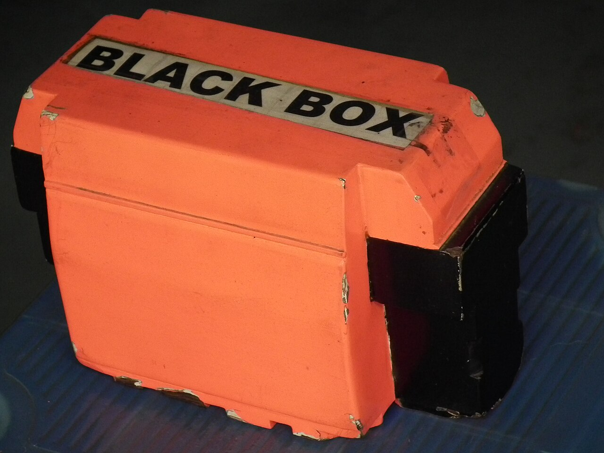

# Trace viewer

*A Playwright trace records every action, DOM snapshot, network request, and console log from a test run, letting a CI failure be replayed and time-traveled through afterward as if it happened locally.*

> A test fails once in CI at 2 AM and never fails again. Without a recording of what actually happened,
> that's a ghost - unreproducible, undebuggable, gone. A Playwright trace turns that same failure into
> something you can open the next morning and step through action by action, exactly as if you'd been
> watching the whole time.

> **In real life**
>
> An aircraft's flight data recorder doesn't prevent an incident - it makes the incident investigable
> afterward. Investigators who weren't in the cockpit can still reconstruct exactly what happened,
> second by second, because every relevant signal was captured continuously regardless of whether
> anything went wrong. A Playwright trace is that recorder for a test run.

**Trace**: A Playwright trace is a recorded file (a .zip, opened with npx playwright show-trace or at trace.playwright.dev) capturing everything about a test's execution - every action, a DOM snapshot before and after each step, network requests and responses, console logs, and screenshots - assembled into an interactive timeline. It lets a test run be replayed and inspected after the fact, action by action, without needing to have watched it happen live, which makes it the primary way to debug a failure that only reproduces in CI.

## What a trace actually captures, and how to get one

Enable tracing in `playwright.config.ts`:

```
use: {
  trace: 'on-first-retry',   // or 'on', 'retain-on-failure', 'off'
}
```

`on-first-retry` is the common default: don't pay the recording cost for tests that pass, but capture
a full trace the moment a test needs to retry - exactly the run most worth investigating.

A trace contains, for every step:

- **A DOM snapshot before and after the action** — the trace viewer lets you click any step and see
  the actual page state at that exact moment, not a description of it.
- **Network activity** — every request and response, with headers and bodies, correlated to the
  action that triggered it.
- **Console logs** — anything the page itself logged during that step.
- **A screenshot**, and optionally full video (the next chapter covers video specifically).

Opening one: `npx playwright show-trace trace.zip`, or drag the zip file directly onto
`trace.playwright.dev` - the whole trace loads and replays in the browser, no server involved.

> **Tip**
>
> `retain-on-failure` keeps a trace for every failed test without needing a retry to trigger it -
> worth using over `on-first-retry` on a suite that doesn't have retries configured at all, so a failure
> still leaves a trace behind the first time.

> **Common mistake**
>
> Setting `trace: 'on'` for every run in CI without considering the cost. Full tracing on every test,
> pass or fail, adds real overhead and storage - `on-first-retry` or `retain-on-failure` capture the
> runs that actually matter (the failing ones) without paying that cost on the overwhelming majority of
> runs that pass cleanly.


*Flight data recorder displayed at HAL Museum — Wikimedia Commons, CC BY-SA 3.0 (Rameshng). [Source](https://commons.wikimedia.org/wiki/File:Flight_data_recorder_displayed_at_HAL_Museum_7893.JPG)*
- **The label — it was recording the whole time** — Regardless of whether the flight was routine or not, the recorder was always running - the same reason on-first-retry or retain-on-failure captures a trace exactly when it turns out to matter, not only when someone remembered to watch live.
- **The orange casing — built to survive to be read later** — Bright, tough, designed specifically to be findable and openable after the fact - a trace.zip file serves the same purpose: durable, self-contained, and readable long after the test run itself is gone.
- **The black recording unit — the actual captured data** — This is where the real signal lives - every action, snapshot, and request a trace captures, not just a single final photo of what went wrong.
- **One box, every relevant channel** — A flight recorder doesn't only capture altitude OR only cockpit audio - it's multiple channels in one unit. A Playwright trace is the same: DOM snapshots, network, console, and screenshots together, correlated to the same timeline.

**From a CI failure to a fully replayed trace**

1. **A test fails once, only in CI** — trace: 'on-first-retry' means this exact run gets recorded.
2. **CI uploads the trace.zip as an artifact** — The recording survives after the CI job itself ends.
3. **npx playwright show-trace trace.zip locally** — The whole run opens in an interactive timeline, hours or days later.
4. **Step through action by action** — DOM snapshot, network, and console for each step, exactly as it happened.
5. **The root cause is visible directly** — No guessing, no reproducing blind - the actual failing state is right there to inspect.

A trace is really just: continuously record structured events with timestamps, then let someone
replay and seek through that record later. Here's that shape as a small, generic simulation.

*Run it - record timestamped events during a run, replay them after the fact (Python)*

```python
events = []

def record(step, kind, detail):
    events.append({"step": step, "kind": kind, "detail": detail})

record(1, "action", "click #submit")
record(1, "network", "POST /api/order -> 500")
record(1, "console", "Uncaught TypeError: order is undefined")

print("--- replaying trace ---")
for e in events:
    print(f"step {e['step']} [{e['kind']}]: {e['detail']}")

failing_step = next(e["step"] for e in events if "500" in e["detail"])
print(f"\\nRoot cause visible at step {failing_step}, without watching it happen live.")
```

Same record-then-replay shape in Java.

*Run it - record timestamped events during a run, replay them after the fact (Java)*

```java
import java.util.*;

public class Main {
    record Event(int step, String kind, String detail) {}

    public static void main(String[] args) {
        List<Event> events = new ArrayList<>();
        events.add(new Event(1, "action", "click #submit"));
        events.add(new Event(1, "network", "POST /api/order -> 500"));
        events.add(new Event(1, "console", "Uncaught TypeError: order is undefined"));

        System.out.println("--- replaying trace ---");
        for (Event e : events) {
            System.out.println("step " + e.step() + " [" + e.kind() + "]: " + e.detail());
        }

        int failingStep = events.stream()
            .filter(e -> e.detail().contains("500"))
            .findFirst().get().step();
        System.out.println("\\nRoot cause visible at step " + failingStep + ", without watching it happen live.");
    }
}
```

### Your first time: Your mission: capture a real trace and replay a failure

- [ ] Set trace: 'on' in your scratch project's playwright.config.ts temporarily — For this exercise, capture every run, not just failures.
- [ ] Write a test that deliberately fails (a wrong assertion is fine) — Run it once with npx playwright test.
- [ ] Find the generated trace.zip (usually under test-results/) — Open it with npx playwright show-trace <path-to-trace.zip>.
- [ ] Click through several steps in the timeline — Inspect the DOM snapshot, network tab, and console tab for the specific step nearest your deliberate failure.

You've now replayed a failure exactly the way you'd debug a real CI-only failure days after it
happened.

- **No trace.zip exists after a failed CI run.**
  Check both the trace config value (retain-on-failure or on-first-retry require an actual retry or failure to trigger) and whether CI is configured to upload the test-results/ directory as a build artifact - the trace has to survive past the job ending.
- **The trace viewer opens but the DOM snapshot for a step looks blank or broken.**
  This can happen if the page navigated away or the snapshot was taken during a transition - check the network and console panels for that same step, which usually still show useful information even when the visual snapshot is imperfect.
- **A trace.zip file downloaded from a teammate won't open with npx playwright show-trace.**
  Confirm the local Playwright version is compatible with the version that recorded the trace - trace format can gain features across versions. trace.playwright.dev often opens older traces more forgivingly than a mismatched local CLI.
- **Tracing is enabled but CI runs got noticeably slower.**
  Confirm the config is on-first-retry or retain-on-failure, not on for every run - full tracing on every passing test is real, avoidable overhead.

### Where to check

- **`playwright.config.ts`'s `use.trace` setting** — confirms exactly when a trace gets captured.
- **CI's build artifacts for a failed job** — where an uploaded trace.zip should actually live; if
  it's missing, the artifact upload step (not tracing itself) is usually the gap.
- **`trace.playwright.dev`** — opens a trace entirely client-side in the browser, no install needed,
  good for a quick check on a machine without the project set up.
- **The trace viewer's Network and Console tabs**, specifically — often diagnose a failure faster than
  the visual DOM snapshot alone, especially for backend-caused failures.

### Worked example: a CI-only failure solved without ever reproducing it live

1. A checkout test fails in CI roughly once a week, always passes when re-run manually on a laptop -
   textbook unreproducible flake.
2. With `trace: 'on-first-retry'` already configured, the next CI failure leaves a `trace.zip`
   attached to the build.
3. Opening it with `npx playwright show-trace` and stepping through the failing action shows the
   Network tab: a `POST /api/checkout` request that took 4.8 seconds to respond - well past what the
   assertion's default timeout allowed for.
4. The DOM snapshot for that step confirms the loading spinner was still showing when Playwright's
   assertion gave up - not a broken UI, a slow backend response under specific load.
5. The fix targets the actual cause (a slow endpoint under certain conditions, addressed with the
   backend team) instead of a guessed "add a longer timeout" patch that would have hidden the real
   problem.

**Quiz.** Why is trace: 'on-first-retry' commonly preferred over trace: 'on' for a CI configuration?

- [ ] 'on-first-retry' produces a different, more detailed kind of trace than 'on'
- [x] 'on' would record tracing overhead for every test including the vast majority that pass cleanly, while 'on-first-retry' captures a full trace only for the runs that actually need investigating - a test that needs to retry
- [ ] 'on' only works in local development, not in CI environments
- [ ] 'on-first-retry' is required for the trace viewer to be able to open the file at all

*The note is explicit that the difference is about cost, not trace quality - both settings produce the same kind of trace, the setting only controls WHEN one gets recorded. Option one is false; the trace format itself doesn't change based on this setting. Option three is false - 'on' works identically in CI and locally, it's just less efficient to use for every run. Option four is false - a trace produced under any of the config's settings (on, on-first-retry, retain-on-failure) opens the same way in the viewer.*

- **What does a Playwright trace capture, per step?** — A DOM snapshot before/after, network requests and responses, console logs, and a screenshot - correlated to the same timeline.
- **The commonly recommended trace config default** — on-first-retry - records only when a test actually needs to retry, avoiding overhead on the majority of runs that pass cleanly.
- **How do you open a trace file?** — npx playwright show-trace trace.zip locally, or drag the zip onto trace.playwright.dev - both load and replay it entirely client-side.
- **Why is a trace especially valuable for CI failures?** — It lets a failure that only reproduces in CI (and never locally) be replayed and inspected after the fact, without needing to have watched it happen live.
- **The flight-data-recorder analogy for a trace** — It records continuously regardless of whether anything goes wrong, so an incident can be reconstructed afterward by someone who wasn't there to watch it happen.

### Challenge

Find (or deliberately cause) a test failure in a scratch project with trace: 'on-first-retry'
configured and at least one retry set. After the trace is captured, open it and write down, in your
own words, the exact sequence of events the Network and Console tabs reveal - without re-running the
test live to confirm your read. Then run it live once to check whether your trace-only diagnosis was
correct.

### Ask the community

> I have a trace.zip from a CI failure showing `[what the trace viewer shows]` at the failing step. Here's what I can see in the Network/Console tabs: `[describe it]`.

Describing exactly what the trace viewer's Network and Console panels show for the failing step
(not just the final error message) is usually enough for someone to help pinpoint the actual cause.

- [Playwright — official Trace viewer docs](https://playwright.dev/docs/trace-viewer)
- [Playwright — trace.playwright.dev, open any trace in-browser](https://trace.playwright.dev/)

🎬 [Playwright Trace Viewer Explained — Best Feature for Debugging Failures — MasterQAAutomation](https://www.youtube.com/watch?v=267pBzbvSgQ) (5 min)

- A trace captures every action, DOM snapshot, network request, console log, and screenshot from a test run into one replayable timeline.
- trace: 'on-first-retry' (or retain-on-failure without retries configured) is the common default - full recording cost paid only for runs that actually need investigating.
- npx playwright show-trace or dragging the zip onto trace.playwright.dev opens a trace entirely client-side - no server, no re-running the test.
- A trace is the primary way to debug a failure that only reproduces in CI and never locally - it removes the need to have watched it happen live.
- The Network and Console tabs often diagnose a failure faster than the DOM snapshot alone, especially for backend-caused issues.


## Related notes

- [[Notes/playwright/tracing-and-debugging/codegen|Codegen]]
- [[Notes/playwright/tracing-and-debugging/debugging|Debugging]]
- [[Notes/playwright/tracing-and-debugging/screenshots-and-video|Screenshots & video]]


---
_Source: `packages/curriculum/content/notes/playwright/tracing-and-debugging/trace-viewer.mdx`_
