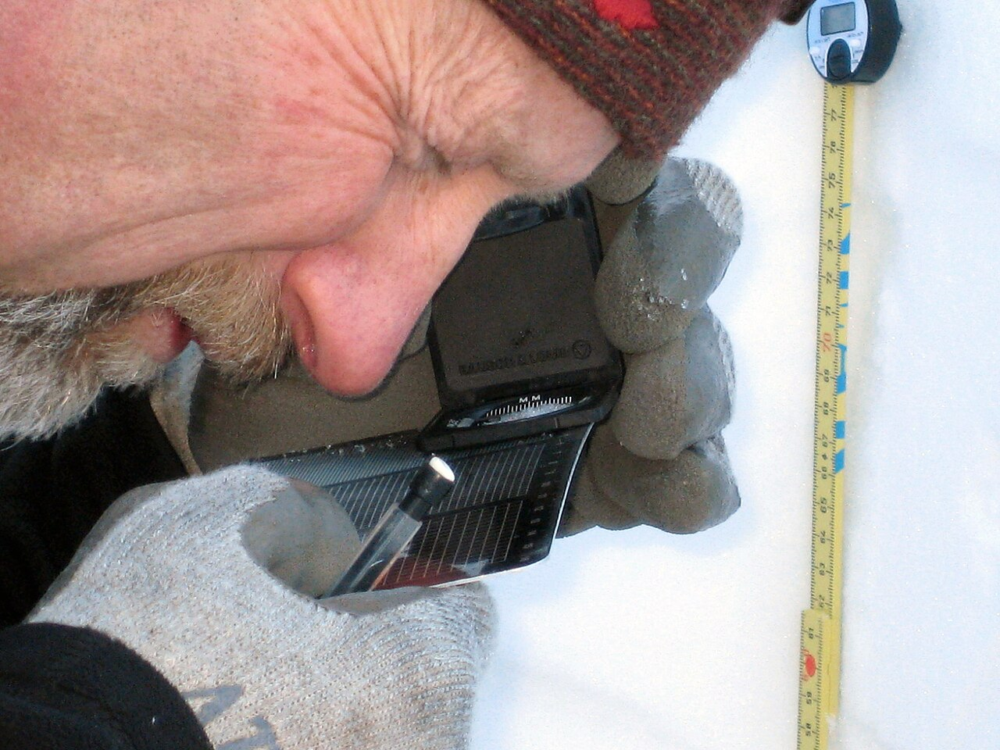

# Pixel vs AI diffing

*A raw pixel diff flags every changed pixel with zero understanding of what it's looking at - a font rendering one shade differently fails the same way a genuinely broken layout does. Perceptual/AI diffing tells the two apart.*

> A screenshot comparison that fails every time a font renders one sub-pixel differently between OS
> updates isn't catching bugs - it's crying wolf until nobody trusts it anymore. The difference between
> a visual testing tool people actually rely on and one that gets silenced or ignored usually comes down
> to exactly this: whether the diffing engine understands what it's looking at, or just counts changed
> pixels.

> **In real life**
>
> A scientist examining a snow crystal through a hand lens reads an exact millimeter scale at the same
> time as forming an overall judgment about the crystal's shape and condition. The ruler gives an exact
> number - useful, but blind to meaning: it can't tell a genuine structural change from an artifact of
> how the light happened to hit the ice that moment. The trained eye, looking at the same crystal,
> knows which measurements matter and which are noise. Both are real information; they answer different
> questions.

**Pixel diffing vs AI/perceptual diffing**: Pixel diffing compares two images byte-for-byte (or pixel-for-pixel), flagging any difference above a raw threshold with no understanding of what changed - a font rendering one shade differently, a single anti-aliased edge, or a genuinely broken layout all register the same way: some percentage of pixels differ. AI (or perceptual) diffing instead models what a human viewer would actually notice and care about - understanding layout structure, text versus image regions, and typical rendering noise - so it can flag a real regression (a misaligned button, missing content, broken layout) while ignoring sub-pixel rendering differences that carry no real meaning.

## Why the same 0.3% pixel difference can mean two completely different things

- **Pixel diffing** — mathematically simple and fast: overlay two images, count differing pixels
  (optionally with a tolerance threshold), fail if the count or percentage exceeds it. It has zero
  concept of *what* a pixel belongs to - a button, a background, an anti-aliased font edge - only that
  its color value changed.
- **Common, meaningless sources of pixel difference** — font anti-aliasing rendering slightly
  differently across OS versions or GPU drivers, animation timing capturing a frame mid-transition, a
  cursor blinking in or out of a text field, dynamic content like a timestamp or ad.
- **AI/perceptual diffing** — trained to recognize these categories and largely ignore them,
  surfacing instead the differences a human reviewer would actually flag: a shifted layout, a missing
  element, a broken color, unreadable contrast.
- **Neither is strictly "better" in isolation** — pixel diffing is exact and free, appropriate when a
  team controls rendering conditions tightly (fixed CI environment, deterministic fonts); AI diffing
  costs more (often a paid service) but scales to teams whose baseline noise otherwise buries real
  regressions under false alarms.

> **Tip**
>
> Before reaching for an AI-powered visual testing service, try tightening a plain pixel diff's own
> conditions first - a consistent CI environment, disabled animations, masked dynamic regions (see
> "Taming false positives," later this chapter). A surprising amount of "pixel diffing is too noisy"
> turns out to be "pixel diffing was run against inconsistent conditions."

> **Common mistake**
>
> Assuming AI/perceptual diffing means "it just knows" and never needs any configuration or review. Even
> a well-trained perceptual model can miss a real, subtle regression it wasn't trained to weight heavily
> (a slightly wrong shade of a brand color, for instance) - visual diffing of any kind still benefits
> from a human actually looking at flagged changes, not blind trust in either approach.


*Examining facetted crystals through a loupe — Wikimedia Commons, CC BY 2.0 (Ruth Hartnup). [Source](https://commons.wikimedia.org/wiki/File:Examining_facetted_crystals_through_a_loupe_(3217296447).jpg)*
- **The millimeter scale on the loupe itself** — An exact, unambiguous number - no interpretation involved. This is pixel diffing: precise, objective, and blind to whether the exact reading actually matters.
- **The tape measure's precise markings** — A second, independent exact scale nearby - reinforcing that raw measurement is genuinely useful information, just not the whole picture on its own.
- **The eye, pressed close, actually looking** — A trained observer forming a real judgment about what's significant - the role AI/perceptual diffing plays: understanding what the numbers mean, not just what they are.
- **The gloved hands, steadying the whole setup** — Context and stability around the measurement - the equivalent of a consistent test environment (fixed viewport, disabled animations) that makes either kind of diffing actually trustworthy.

**The same visual change, through two different diffing engines**

1. **A deploy ships two real changes at once** — A genuinely broken button layout, AND an unrelated OS font-rendering shift.
2. **Pixel diffing flags BOTH** — Every differing pixel counted equally - the real bug and the meaningless font shift look identical in the report.
3. **A human has to manually sort real from noise** — Every single run, indefinitely, or the noise gets silenced along with real signal.
4. **AI/perceptual diffing flags only the layout break** — The font-rendering shift is recognized as within normal rendering variance and not surfaced.
5. **The team trusts every flagged diff again** — Because most flags are now real, not noise to routinely dismiss.

Deciding whether a detected difference is meaningful or just noise is really just: apply some
tolerance or understanding of what's "normal," and only flag what falls outside it. Here's that shape
as a small, generic simulation.

*Run it - flag only differences outside a tolerance for normal rendering noise (Python)*

```python
import random

def pixel_diff_percent(baseline, current):
    # Simulated: returns a percentage of differing pixels
    return abs(baseline - current)

changes = [
    {"name": "font anti-aliasing shift", "diff_percent": 0.3},
    {"name": "button moved 40px left", "diff_percent": 2.1},
    {"name": "cursor blink mid-capture", "diff_percent": 0.1},
    {"name": "entire header missing", "diff_percent": 8.4},
]

NOISE_TOLERANCE = 0.5  # anything below this is treated as normal rendering variance

for change in changes:
    flagged = change["diff_percent"] > NOISE_TOLERANCE
    label = "FLAGGED - review" if flagged else "ignored - within noise tolerance"
    print(f"{change['name']}: {change['diff_percent']}% -> {label}")
```

Same tolerance-based flagging shape in Java.

*Run it - flag only differences outside a tolerance for normal rendering noise (Java)*

```java
import java.util.*;

public class Main {
    record Change(String name, double diffPercent) {}

    public static void main(String[] args) {
        List<Change> changes = List.of(
            new Change("font anti-aliasing shift", 0.3),
            new Change("button moved 40px left", 2.1),
            new Change("cursor blink mid-capture", 0.1),
            new Change("entire header missing", 8.4)
        );

        double noiseTolerance = 0.5; // anything below this is treated as normal rendering variance

        for (Change change : changes) {
            boolean flagged = change.diffPercent() > noiseTolerance;
            String label = flagged ? "FLAGGED - review" : "ignored - within noise tolerance";
            System.out.println(change.name() + ": " + change.diffPercent() + "% -> " + label);
        }
    }
}
```

### Your first time: Your mission: cause a false positive on purpose, then watch it get filtered out

- [ ] Take two screenshots of the same real page a few seconds apart, with a cursor blinking in a text field — Compare them with any basic pixel-diff tool or even an image editor's difference blend mode.
- [ ] Note exactly which pixels differ and why — Confirm they're meaningless (the cursor state), not a real change.
- [ ] If you have access to a perceptual/AI diffing tool (Percy, Applitools, or similar - next chapter's topic), run the same comparison through it — Confirm whether it correctly ignores the cursor-blink difference.
- [ ] Write one sentence describing the actual RULE a naive pixel diff would need to encode to handle this specific case correctly — This is what perceptual diffing is doing under the hood, generalized across many such rules.

You've now seen a real false positive form, and understood concretely what smarter diffing is
actually filtering out.

- **A pixel-diff-based visual test suite has become so noisy that failures are routinely dismissed without review.**
  This is the exact failure mode this note describes - the fix is either tightening rendering conditions (fixed environment, disabled animations, masked dynamic regions) or moving to perceptual/AI diffing, not lowering the tolerance so much that real regressions also get missed.
- **AI/perceptual diffing missed an actual, real visual regression.**
  No diffing approach is infallible - report it if the tool supports feedback, and consider whether a targeted pixel-diff check (with a tight threshold) on that specific region would catch it more reliably alongside the broader perceptual check.
- **Team members disagree about whether a flagged visual diff is 'real' or noise.**
  This disagreement is itself useful signal - if trained humans can't agree quickly, the change is probably genuinely ambiguous and worth a design/product decision, not just a diffing-tool setting.
- **Switching from pixel to AI diffing didn't reduce false positives as much as expected.**
  Check whether the underlying rendering conditions (OS, browser version, viewport) are still inconsistent between baseline and current captures - AI diffing reduces noise from ANTI-ALIASING specifically, not from genuinely different rendering environments.

### Where to check

- **A visual diff tool's own documentation on its comparison algorithm** — confirms whether it's doing
  raw pixel comparison, a perceptual model, or a hybrid, and what's actually configurable.
- **CI environment consistency** (OS, browser version, fonts installed) between baseline capture and
  comparison runs — the single most common source of "false" pixel diffs regardless of algorithm.
- **A specific flagged diff's actual pixel region**, zoomed in — often immediately reveals whether it's
  a font-rendering artifact, an animation frame, or a genuine layout issue.
- **Historical flag rate over time**, if tracked — a rising false-positive rate over weeks/months
  often points to environment drift, not a sudden change in the app itself.

### Worked example: a real regression that pixel diffing would have missed, and perceptual diffing caught

1. A design update swaps a button's brand color from one very close shade of blue to another,
   deliberately, as an approved rebrand.
2. Elsewhere on the same page, completely unrelated to the rebrand, a CSS regression accidentally
   shifts a sidebar's width by 15 pixels, overlapping a small amount of body text.
3. A raw pixel diff flags BOTH changes as roughly similar-sized differences - the approved color
   change and the real layout bug look statistically alike in "percent of pixels differing."
4. A perceptual diffing pass recognizes the color change as a coherent, intentional-looking palette
   shift across a bounded UI element, while flagging the sidebar's structural shift and the resulting
   text overlap as the kind of layout anomaly worth a human's attention.
5. The reviewer's time goes to the actual bug first, instead of manually re-confirming that the
   approved color change was, in fact, approved and expected.

**Quiz.** A pixel-diff-based visual test suite flags a font-rendering difference (anti-aliasing shifted slightly after an OS update) with the exact same severity as a genuinely broken layout elsewhere on the same page. What does this reveal about pixel diffing specifically?

- [ ] Pixel diffing is fundamentally broken and should never be used
- [x] Pixel diffing has no concept of WHAT changed, only THAT pixels changed - it treats a meaningless rendering artifact and a real structural regression identically unless a tolerance or perceptual layer is added to distinguish them
- [ ] The OS update itself is the bug and needs to be reverted
- [ ] This only happens with poorly configured pixel-diff tools, not as an inherent property of the approach

*The note is explicit that pixel diffing's core limitation is a lack of understanding of what a pixel belongs to - this is inherent to the approach itself, not a misconfiguration. Option one overstates the case; pixel diffing remains useful and appropriate in tightly-controlled environments, as the note's tip notes. Option three misdiagnoses the OS update as the actual bug when it's a normal, expected source of rendering variance. Option four is contradicted directly by the note, which describes this as pixel diffing's inherent behavior, present even in a well-configured setup, unless a tolerance or perceptual layer is deliberately added.*

- **What does pixel diffing actually compare?** — Raw pixel values between two images, with zero understanding of what any given pixel represents - a font edge and a broken button look the same kind of 'different.'
- **What does AI/perceptual diffing add on top of pixel diffing?** — An understanding of layout structure and typical rendering noise, so it can flag real regressions while ignoring anti-aliasing, animation timing, and similar meaningless differences.
- **Common sources of meaningless pixel difference** — Font anti-aliasing across OS/GPU differences, animation captured mid-frame, a blinking cursor, dynamic content like timestamps.
- **Is AI diffing always the better choice?** — Not necessarily - tightening rendering conditions (fixed environment, disabled animations) can make plain pixel diffing reliable and free; AI diffing costs more but scales better to noisier, less-controlled environments.
- **The loupe-and-ruler analogy** — The exact millimeter scale = pixel diffing (precise, meaning-blind); the trained eye's judgment = AI/perceptual diffing (understands significance, not just magnitude).

### Challenge

Take two screenshots of the same real page, once with animations/transitions allowed to run naturally
and once with them disabled (most browsers support a reduced-motion or animation-disable setting).
Run a basic pixel diff between the two "disabled" captures (should be near-identical) and separately
between two "animated" captures taken moments apart (likely to show meaningless differences). Write
down exactly what caused each flagged difference.

### Ask the community

> My visual diff flagged `[describe the flagged difference]` between two screenshots that should be identical. Environment: `[OS/browser/CI details]`.

Sharing the specific environment details (OS, browser version, whether CI or local) is usually enough
for someone to tell you immediately whether this is a known rendering-noise pattern or a real
difference worth investigating.

- [BugBug — Visual Regression Testing: Catch Bugs Tests Miss](https://bugbug.io/blog/software-testing/visual-regression-testing/)
- [OverlayQA — AI Visual Testing: The Complete Guide](https://overlayqa.com/blog/ai-visual-testing/)

🎬 [Percy Visual Testing — How AI Cuts UI Review Time by 3x — Automation Testing with Joe Colantonio](https://www.youtube.com/watch?v=68b3kGUCX-4) (11 min)

- Pixel diffing compares raw pixel values with zero understanding of meaning - a font-rendering shift and a real layout break look identically 'different.'
- AI/perceptual diffing recognizes common rendering noise (anti-aliasing, animation timing, cursor state) and filters it, surfacing genuine regressions instead.
- Neither approach is universally better - tight rendering conditions can make plain pixel diffing reliable and free; AI diffing costs more but scales to noisier environments.
- A noisy pixel-diff suite that gets routinely dismissed has lost its value - the fix is tightening conditions or adding a perceptual layer, not ignoring failures.
- No diffing approach replaces human review entirely - both still benefit from someone actually looking at what gets flagged.


## Related notes

- [[Notes/playwright/visual-regression-testing/playwright-snapshots|Playwright snapshots]]
- [[Notes/playwright/visual-regression-testing/percy-applitools-backstopjs|Percy / Applitools / BackstopJS]]
- [[Notes/playwright/visual-regression-testing/taming-false-positives|Taming false positives]]


---
_Source: `packages/curriculum/content/notes/playwright/visual-regression-testing/pixel-vs-ai-diffing.mdx`_
