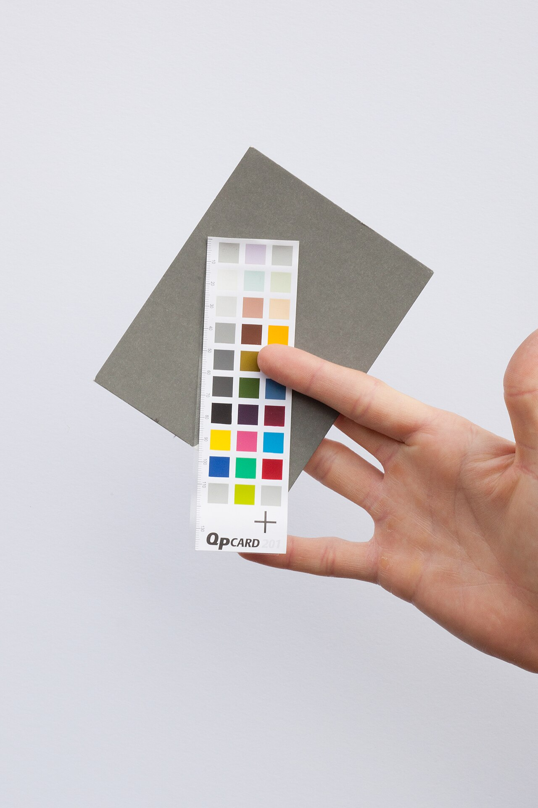

# Playwright snapshots

*toHaveScreenshot() waits for the page to stabilize, captures it, and compares against a committed baseline image - generating that baseline automatically the first time, per OS, so future runs have a known-good reference to check against.*

> Playwright doesn't require a third-party service to catch a visual regression. `await
> expect(page).toHaveScreenshot()` is a single built-in assertion that captures the page, compares it
> against a stored reference image, and fails with a visual diff if they don't match - no external
> account, no extra dependency.

> **In real life**
>
> A photographic color reference card carries fixed, known color values, printed once and never
> changing. A photographer includes it in a test shot specifically so any later comparison - a
> different camera, different lighting, a different day - has something certain to check against. The
> card itself doesn't judge whether today's photo looks good; it just holds the one fact that never
> moves, so every future comparison has a real baseline instead of a guess.

**Playwright snapshots**: Playwright snapshots are the framework's built-in visual comparison feature, centered on the toHaveScreenshot() assertion. It waits for the page to stabilize (no pending network requests, no running CSS animations or JavaScript), captures a screenshot, and compares it pixel-by-pixel (via the pixelmatch library) against a baseline image stored in the repository. Running with --update-snapshots generates or refreshes that baseline. Because rendering differs slightly by operating system, baselines are automatically namespaced per OS/browser combination, so a Linux CI baseline and a macOS developer's local baseline don't get compared against each other incorrectly.

## What toHaveScreenshot() actually does, step by step

```
await expect(page).toHaveScreenshot('homepage.png', {
  maxDiffPixels: 100,
  mask: [page.locator('.timestamp')],
});
```

- **Waits for stability** — checks for no in-flight network requests, no running CSS animations, no
  ongoing JavaScript, retrying the capture until the page settles or a timeout is reached.
- **Captures** — a full PNG of the viewport, or a specific element/locator if scoped.
- **Compares** — against the stored baseline PNG for that test, using pixel-level comparison with
  configurable tolerance (`maxDiffPixels`, `threshold`).
- **First run: no baseline exists yet** — the test fails, but writes a new baseline image. Running
  `npx playwright test --update-snapshots` explicitly (re)generates baselines going forward.
- **Baselines are OS/browser-specific by filename** — `homepage-chromium-darwin.png` vs
  `homepage-chromium-linux.png` are different files, because rendering genuinely differs slightly
  between platforms even for identical markup.

> **Tip**
>
> Generate and commit baselines from the SAME environment CI actually runs in (commonly Linux in
> Docker), not from a developer's local macOS or Windows machine - a baseline generated locally and
> compared in CI will show font-rendering differences as false failures on every single run.

> **Common mistake**
>
> Running `--update-snapshots` reflexively every time a visual test fails, without looking at the diff
> first. That silently accepts whatever changed as the new "correct" state - including a genuine
> regression - defeating the entire purpose of having a baseline in the first place.


*Photographic colour chart and greycard — Wikimedia Commons, CC BY-SA 3.0 (Lewis Ronald). [Source](https://commons.wikimedia.org/wiki/File:Photographic_colour_chart_and_greycard.jpg)*
- **The color patches — fixed, known values** — Printed once, never changing - this IS the baseline. Every future photo gets checked against these exact values, the same role a committed baseline PNG plays for toHaveScreenshot().
- **The ruler scale along the edge** — An exact reference measurement alongside the color reference - close to maxDiffPixels/threshold: a precise, numeric tolerance for how much deviation from the baseline is still acceptable.
- **The plain grey card behind it** — A neutral, controlled backdrop specifically so the comparison isn't contaminated by an inconsistent environment - the same reason baselines are namespaced per OS/browser rather than compared across mismatched platforms.
- **The hand holding it steady** — Deliberate, controlled presentation - a stabilized, intentional capture, not a rushed snapshot. toHaveScreenshot() waiting for the page to fully stabilize before capturing plays the same role.

**From first run to a caught regression**

1. **First run: no baseline exists** — toHaveScreenshot() fails, but writes homepage-chromium-linux.png as the new baseline.
2. **Baseline gets reviewed and committed** — A human confirms it actually looks correct before it becomes the reference.
3. **Future runs capture and compare** — Each new screenshot is checked against the committed baseline, pixel by pixel.
4. **A real regression ships** — A button's color changes unintentionally in a later commit.
5. **The test fails with a visual diff** — Showing exactly what changed, before it reaches production.

Comparing a fresh capture against a trusted, previously-approved reference is really just: check
whether one exists yet, create it if not, and compare against it if it does. Here's that shape as a
small, generic simulation.

*Run it - compare a fresh capture against a stored baseline, creating one if none exists (Python)*

```python
baselines = {}  # simulates the repo's stored baseline files

def to_have_screenshot(name, current_capture, update=False):
    if name not in baselines or update:
        baselines[name] = current_capture
        print(f"{name}: baseline written ({current_capture})")
        return "baseline created"
    if baselines[name] == current_capture:
        print(f"{name}: matches baseline - PASS")
        return "pass"
    else:
        print(f"{name}: DIFFERS from baseline ('{baselines[name]}' vs '{current_capture}') - FAIL")
        return "fail"

to_have_screenshot("homepage", "layout-v1")
to_have_screenshot("homepage", "layout-v1")   # unchanged - passes
to_have_screenshot("homepage", "layout-v2")   # a real change - fails
```

Same create-or-compare logic in Java.

*Run it - compare a fresh capture against a stored baseline, creating one if none exists (Java)*

```java
import java.util.*;

public class Main {
    static Map<String, String> baselines = new HashMap<>();

    static String toHaveScreenshot(String name, String currentCapture) {
        if (!baselines.containsKey(name)) {
            baselines.put(name, currentCapture);
            System.out.println(name + ": baseline written (" + currentCapture + ")");
            return "baseline created";
        }
        if (baselines.get(name).equals(currentCapture)) {
            System.out.println(name + ": matches baseline - PASS");
            return "pass";
        } else {
            System.out.println(name + ": DIFFERS from baseline ('" + baselines.get(name)
                + "' vs '" + currentCapture + "') - FAIL");
            return "fail";
        }
    }

    public static void main(String[] args) {
        toHaveScreenshot("homepage", "layout-v1");
        toHaveScreenshot("homepage", "layout-v1"); // unchanged - passes
        toHaveScreenshot("homepage", "layout-v2"); // a real change - fails
    }
}
```

### Your first time: Your mission: generate a baseline, then catch a real regression against it

- [ ] Write a test with await expect(page).toHaveScreenshot() against a real page in your scratch project — Run it once - it should fail on first run and write a new baseline PNG.
- [ ] Open the generated baseline image and confirm it actually looks correct — This human check matters - a bad baseline becomes the wrong 'correct' reference for every future run.
- [ ] Run the exact same test again with no changes — Confirm it now passes cleanly against the baseline you just approved.
- [ ] Make a real, visible change to the page (edit a color or move an element) and run the test once more — Confirm it fails, and open the diff image it generates to see exactly what changed.

You've now generated a real baseline, approved it deliberately, and watched it catch a genuine visual
change.

- **A visual test fails in CI but passes locally with an identical baseline committed.**
  This is almost always an OS/font rendering difference - confirm the baseline was actually generated in (or matches) the same environment CI runs in, not a developer's local OS.
- **toHaveScreenshot() times out waiting for the page to stabilize.**
  Something is preventing the page from ever reaching a quiet state - check for a looping animation, a polling network request, or a live-updating timestamp/clock element that never stops changing; mask or disable it rather than extending the timeout indefinitely.
- **A baseline needs to be intentionally updated after an approved design change.**
  Run --update-snapshots specifically for the affected test(s), review the new baseline image by eye to confirm it's correct, then commit it deliberately - not as a reflexive fix for any failing visual test.
- **Baselines are enormous and bloating the repository.**
  Scope screenshots to specific elements/components rather than full pages where reasonable, and consider whether every visual test genuinely needs a full-viewport capture versus a smaller, targeted region.

### Where to check

- **The `__screenshots__` (or configured snapshot) directory** — where committed baseline images
  actually live, one per test/OS/browser combination.
- **A failed visual test's diff output** — shows the baseline, the actual capture, and a highlighted
  diff image side by side, the fastest way to see exactly what changed.
- **`playwright.config.ts`'s snapshot-related options** (`expect.toHaveScreenshot` defaults like
  `maxDiffPixels`, `threshold`) — confirms the tolerance actually configured project-wide.
- **CI logs for the environment that generated a baseline** — confirms whether it matches the
  environment comparisons are actually run against.

### Worked example: a real regression caught by a baseline nobody had to manually inspect that day

1. A CSS refactor accidentally removes a `box-shadow` from every card component sitewide - subtle
   enough that nobody notices it by eye during review.
2. `npx playwright test` runs the existing visual suite, and three unrelated-looking tests (each
   capturing a page with card components) fail with small, consistent diffs.
3. Opening one diff image shows exactly the missing shadow, highlighted precisely where it should be.
4. The fix restores the `box-shadow` rule; re-running the suite shows all three tests passing again
   against their original, unchanged baselines.
5. The regression was caught and precisely located without anyone having had to notice a subtle visual
   difference by eye across three separate pages.

**Quiz.** A team runs npx playwright test --update-snapshots every time a visual test fails, as their standard fix. What's the risk in doing this reflexively, based on this note?

- [ ] There's no risk - updating the baseline is always the correct response to a failing visual test
- [x] It silently accepts whatever changed as the new correct baseline, including a genuine visual regression - defeating the purpose of having a baseline, since nothing is ever actually verified as correct before being approved
- [ ] --update-snapshots only works once per test file and will start failing after the first use
- [ ] It requires deleting the old baseline manually first, which the team is likely forgetting to do

*The note's mistake callout addresses this exact pattern - reflexively updating snapshots without reviewing the diff first means a real regression gets silently baked in as the new 'correct' reference. Option one contradicts the note directly. Option three is a fabricated technical limitation not mentioned anywhere. Option four is false - --update-snapshots handles baseline replacement itself; no manual deletion step is required or implied.*

- **What does toHaveScreenshot() do before capturing?** — Waits for the page to stabilize - no pending network requests, no running CSS animations, no ongoing JavaScript - retrying until settled or timing out.
- **What happens on the very first run of a new visual test?** — It fails, but writes a new baseline image - there was nothing to compare against yet.
- **Why are baselines namespaced per OS/browser?** — Rendering genuinely differs slightly across platforms even for identical markup - comparing a macOS-generated baseline against Linux CI captures would produce constant false failures.
- **Why is reflexively running --update-snapshots on every failure risky?** — It accepts whatever changed as newly 'correct' without review, including real regressions - the diff should be looked at first.
- **The color-reference-card analogy for a baseline** — Fixed, known values printed once - not judging today's photo, just providing the one certain thing every future comparison checks against.

### Challenge

Set up a visual test with toHaveScreenshot() against a real page. Generate and review its baseline.
Then deliberately introduce three different kinds of changes on separate runs: a trivial one (move an
element by 1px), a moderate one (change a color), and a major one (remove a whole section). Compare
how the diff image looks and how large maxDiffPixels would need to be to hide each one - and decide
honestly which of the three should ever be tolerated by a real threshold.

### Ask the community

> My toHaveScreenshot() test fails in CI but passes locally. Baseline generated on `[your OS]`, CI runs on `[CI's OS/environment]`. Here's the diff: `[describe or paste it]`.

Naming both environments explicitly usually reveals immediately whether this is the common
OS/font-rendering mismatch or a genuine difference worth investigating further.

- [Playwright — official Visual comparisons docs](https://playwright.dev/docs/test-snapshots)
- [Playwright — official SnapshotAssertions API reference](https://playwright.dev/docs/api/class-snapshotassertions)

🎬 [Playwright: Visual testing — JoanMedia](https://www.youtube.com/watch?v=tVTHx8p0ssc) (9 min)

- toHaveScreenshot() waits for the page to stabilize, captures it, and compares pixel-by-pixel against a committed baseline image.
- The first run of a new visual test writes a baseline rather than comparing against one - review it by eye before trusting it.
- Baselines are namespaced per OS/browser because rendering genuinely differs across platforms - generate them in the same environment CI actually runs in.
- --update-snapshots should be a deliberate, reviewed action after confirming a change is intentional, not a reflexive fix for any failing visual test.
- maxDiffPixels and threshold configure how much deviation from the baseline is tolerated before a real failure is reported.


## Related notes

- [[Notes/playwright/visual-regression-testing/pixel-vs-ai-diffing|Pixel vs AI diffing]]
- [[Notes/playwright/visual-regression-testing/percy-applitools-backstopjs|Percy / Applitools / BackstopJS]]
- [[Notes/playwright/visual-regression-testing/taming-false-positives|Taming false positives]]


---
_Source: `packages/curriculum/content/notes/playwright/visual-regression-testing/playwright-snapshots.mdx`_
