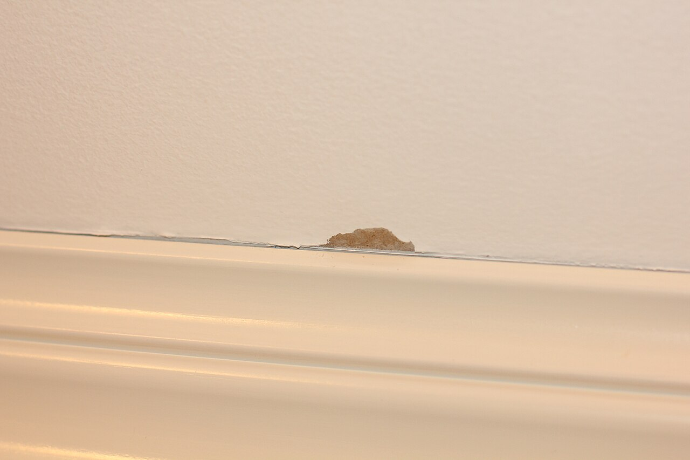

# Taming false positives

*Masking dynamic regions, disabling animations, and controlling the rendering environment eliminate most visual-test noise at the source - the same discipline that makes a pixel diff (or any diff) actually trustworthy.*

> A visual test suite that fails on a live timestamp, a rotating carousel, and a loading spinner every
> single run isn't testing the app - it's testing the clock. The fix for most visual-test flakiness
> isn't a smarter diffing algorithm at all. It's controlling the handful of specific things that make a
> page render differently between two otherwise-identical runs.

> **In real life**
>
> A crisp painted line along a baseboard doesn't happen by accident - a strip of masking tape is applied
> first, precisely covering the exact region that shouldn't be touched, so the roller can move freely
> everywhere else without a second thought. The tape doesn't make the painter more careful; it makes
> carefulness unnecessary in that one spot. Masking a timestamp or a carousel in a visual test does
> exactly the same job: exclude the one region guaranteed to differ, so the comparison across everything
> else can be trusted without constant manual review.

**Taming false positives**: Taming false positives means proactively eliminating the specific, well-known sources of visual-test flakiness before they ever produce a noisy diff - primarily: masking dynamic regions (timestamps, ads, carousels, user avatars) with the mask option so they're excluded from comparison entirely; disabling CSS animations and transitions (animations: 'disabled') so a mid-transition frame is never captured; and controlling the rendering environment (consistent OS/browser/viewport, blocked third-party scripts) so the same markup reliably produces the same pixels. This is largely independent of which diffing algorithm (pixel or AI) is used - a well-masked, animation-disabled, environment-controlled test is dramatically more trustworthy under either approach.

## The three levers that eliminate most visual-test noise

```
await expect(page).toHaveScreenshot('dashboard.png', {
  mask: [page.locator('.timestamp'), page.locator('.ad-banner')],
  animations: 'disabled',
});
```

- **Mask dynamic regions** — `mask: [locator, locator, ...]` replaces the matched elements with a
  solid color box before comparison, excluding them entirely rather than trying to tolerate their
  variability. The single highest-leverage fix for most real-world flakiness (timestamps, live feeds,
  ads, avatars, carousels).
- **Disable animations** — `animations: 'disabled'` stops CSS animations and transitions and
  fast-forwards finite ones to completion, so a screenshot is never accidentally captured mid-motion.
- **Control the environment** — generate and compare baselines in a consistent OS/browser/Docker
  setup, and block third-party scripts (analytics, tag managers) that have no business affecting what
  the test is actually checking.
- **What NOT to do**: raise the diff tolerance (`maxDiffPixels`/`threshold`) as a first response.
  A high tolerance doesn't fix the actual source of noise - it just as easily hides a real regression
  that happens to be a similar size to the noise it's tolerating.

> **Tip**
>
> Build a small, reusable list of "always mask these" locators for a project (timestamps, ads, live
> counters) and apply it as a shared default across every visual test, rather than remembering to add
> masking ad hoc to each new test as flakiness is discovered one painful failure at a time.

> **Common mistake**
>
> Reaching for a higher `maxDiffPixels` threshold as the default fix for a noisy test, instead of
> identifying and masking the actual dynamic element causing it. A loose tolerance doesn't distinguish
> "this specific known-noisy timestamp region" from "an unrelated area that just happens to change by a
> similar amount" - it makes the whole test less sensitive everywhere, not just where the noise
> actually is.


*After use of masking tape — Wikimedia Commons, CC0 (Øyvind Holmstad). [Source](https://commons.wikimedia.org/wiki/File:After_use_of_masking_tape.JPG)*
- **The clean, crisp line — a masked region working as intended** — This stretch was protected before the paint ever went on - excluded from the process entirely, the same way a masked timestamp locator is excluded from comparison entirely, not just tolerated.
- **The small flaw — a spot where masking wasn't quite complete** — Real, honest evidence that masking isn't automatically perfect - a locator selector that's slightly too narrow, or a dynamic element added after masks were configured, can leave a genuine gap.
- **The large, untouched wall surface above** — Free to be painted (compared) without any special care, precisely because the one region that needed protection was handled separately first.
- **The trim itself, entirely unaffected** — Everything on the masked side of the line stayed exactly as it was, completely unaffected by what happened on the other side - the literal definition of a masked region being excluded from a comparison.

**A noisy visual test, fixed at the source**

1. **A dashboard screenshot test fails almost every run** — The diff highlights a live "Last updated: 2 seconds ago" timestamp, every time.
2. **Wrong fix: raise maxDiffPixels** — The test stops failing on the timestamp - but now also tolerates a similarly-sized REAL layout bug elsewhere.
3. **Right fix: mask the timestamp locator specifically** — mask: [page.locator('.last-updated')] excludes exactly that region.
4. **Also disable animations on this page** — A loading spinner near the timestamp was occasionally caught mid-frame too.
5. **The test now fails only on real changes** — Precisely targeted, not broadly desensitized.

Eliminating a known, specific source of noise at its source - rather than broadly tolerating noise
everywhere - is really just: identify what's expected to vary, exclude exactly that, and compare
everything else at full sensitivity. Here's that shape as a small, generic simulation.

*Run it - mask known-dynamic regions instead of loosening tolerance everywhere (Python)*

```python
page_regions = {
    "header": "stable",
    "timestamp": "changes every second",
    "main_content": "stable",
    "ad_banner": "rotates randomly",
    "footer": "stable",
}

DYNAMIC_REGIONS = {"timestamp", "ad_banner"}

def compare(baseline, current, masked_regions):
    diffs = []
    for region, value in current.items():
        if region in masked_regions:
            continue  # excluded entirely, not compared at all
        if baseline[region] != value:
            diffs.append(region)
    return diffs

baseline = dict(page_regions)
current = dict(page_regions)
current["timestamp"] = "changed"
current["ad_banner"] = "changed"
current["main_content"] = "ACCIDENTALLY BROKEN"  # a real regression

diffs = compare(baseline, current, masked_regions=DYNAMIC_REGIONS)
print(f"Flagged differences (masking applied): {diffs}")
```

Same masked-region comparison shape in Java.

*Run it - mask known-dynamic regions instead of loosening tolerance everywhere (Java)*

```java
import java.util.*;

public class Main {
    public static void main(String[] args) {
        Map<String, String> baseline = new LinkedHashMap<>();
        baseline.put("header", "stable");
        baseline.put("timestamp", "stable");
        baseline.put("main_content", "stable");
        baseline.put("ad_banner", "stable");
        baseline.put("footer", "stable");

        Map<String, String> current = new LinkedHashMap<>(baseline);
        current.put("timestamp", "changed");
        current.put("ad_banner", "changed");
        current.put("main_content", "ACCIDENTALLY BROKEN"); // a real regression

        Set<String> maskedRegions = Set.of("timestamp", "ad_banner");

        List<String> diffs = new ArrayList<>();
        for (String region : current.keySet()) {
            if (maskedRegions.contains(region)) continue; // excluded entirely
            if (!baseline.get(region).equals(current.get(region))) {
                diffs.add(region);
            }
        }

        System.out.println("Flagged differences (masking applied): " + diffs);
    }
}
```

### Your first time: Your mission: cause real noise, then eliminate it at the source

- [ ] Find (or build) a real page with a live-updating element - a timestamp, a view counter, an animated loading indicator — Write a toHaveScreenshot() test against it.
- [ ] Run the test twice, a few seconds apart, with no masking configured — Confirm it fails on the second run due to the dynamic element.
- [ ] Add mask: [locator] targeting specifically that element — Re-run twice more and confirm it now passes consistently.
- [ ] If the page has any animation, add animations: 'disabled' as well — Confirm the test's behavior with and without this option on a page that actually animates.

You've now eliminated real, reproducible noise at its actual source instead of loosening a tolerance
to paper over it.

- **A masked element still occasionally causes a visual diff.**
  Check whether the mask locator is actually matching the full element - a selector that's slightly too narrow (matching only part of a dynamic region) leaves a real gap, similar to the small flaw visible at the edge of even a carefully masked line.
- **animations: 'disabled' doesn't seem to stop a specific visual glitch.**
  Confirm the moving element is actually a CSS animation/transition and not, for example, a video, canvas-based animation, or JavaScript-driven layout thrash - those need separate handling (pausing video, freezing a canvas frame) beyond the animations option.
- **A test is stable locally but still noisy in CI even with masking and animations disabled.**
  This usually points to a remaining environment difference (OS font rendering, GPU differences) rather than a masking gap - confirm baselines are generated in the same environment CI actually runs comparisons in.
- **A teammate keeps raising maxDiffPixels whenever a new source of noise appears.**
  Redirect toward identifying and masking the actual new dynamic element instead - a rising tolerance value over time is a strong signal that noise is being tolerated rather than eliminated, and real regressions are increasingly likely to slip through unnoticed.

### Where to check

- **A failing visual diff's highlighted region** — usually points directly at which specific element
  needs masking, rather than requiring guesswork.
- **`playwright.config.ts`'s `expect.toHaveScreenshot` defaults** — confirms whether animations and a
  project-wide mask list are already configured as sensible defaults, or left to each test.
- **The page's actual CSS/JS for anything with a timer, interval, or `setInterval`-driven update** —
  the direct source of most "changes every run" flakiness.
- **A history of `maxDiffPixels` changes in version control** — a value that's crept upward over time
  is a strong signal that masking, not tolerance, should have been the fix along the way.

### Worked example: a dashboard test that went from failing nine runs in ten to failing only on real changes

1. A dashboard visual test fails roughly nine runs out of ten, always with a small, inconsistent diff
   somewhere near the top of the page.
2. Instead of raising `maxDiffPixels` to make the failures stop (which had been the team's habit for
   months), a reviewer opens several recent diff images and notices the exact same region flagged
   every time: a "3 users online now" live counter.
3. `mask: [page.locator('[data-testid="online-count"]')]` is added specifically for that element.
4. The test's failure rate drops to roughly zero over the following weeks of normal development,
   while `maxDiffPixels` is simultaneously lowered back toward a tight, meaningful value (since it's
   no longer compensating for the live counter).
5. Two weeks later, a real regression - a broken button color - is caught immediately, something the
   previous loose tolerance would very likely have let through unnoticed.

**Quiz.** A team has been gradually raising maxDiffPixels over several months every time a new visual test starts failing intermittently, rather than investigating each failure's actual cause. What's the most likely consequence of this pattern, based on this note?

- [ ] None - a higher tolerance is a normal, healthy way to reduce noise in a maturing test suite
- [x] The suite becomes progressively less able to catch real regressions, because a loosening tolerance doesn't distinguish specific, known-noisy regions from genuinely broken ones - it desensitizes the whole comparison, not just the noisy part
- [ ] Playwright will eventually reject an excessively high maxDiffPixels value and force a fix
- [ ] This only affects test run time, not what the test is actually able to detect

*The note's worked example demonstrates exactly this: a rising tolerance compensates for a specific known source of noise (a live counter) by desensitizing the ENTIRE comparison, which is why a real regression later slips through more easily until the actual source is masked and the tolerance brought back down. Option one contradicts the note's explicit guidance that masking, not tolerance, is the correct first response. Option three describes a safeguard Playwright doesn't actually implement - there's no automatic ceiling forcing a fix. Option four understates the real consequence - the note is specific that broad tolerance directly reduces the test's ability to catch real, similarly-sized regressions, not just its speed.*

- **The three main levers for taming visual-test false positives** — Masking dynamic regions, disabling animations, and controlling the rendering environment (consistent OS/browser, blocked third-party scripts).
- **What does the mask option actually do?** — Replaces matched elements with a solid color box before comparison, excluding them entirely - not tolerating their variation, removing it from consideration.
- **Why is raising maxDiffPixels usually the wrong first response to noise?** — It desensitizes the WHOLE comparison rather than targeting the specific known-noisy region, making a real regression of similar size more likely to slip through unnoticed.
- **What does animations: 'disabled' actually do?** — Stops CSS animations/transitions and fast-forwards finite ones to completion, so a screenshot is never accidentally captured mid-motion.
- **The masking-tape analogy for the mask option** — Tape applied precisely over the one region that shouldn't be touched, so the rest can be handled at full confidence without special care - excluding, not tolerating, the variable part.

### Challenge

Audit a real visual test suite (yours or an open-source project's) for its current maxDiffPixels or
threshold value and its git history. If the tolerance has risen over time, try to identify - from
old diff images or commit messages if available - what specific dynamic element each increase was
probably compensating for. Write down what mask configuration would likely have solved each one
without raising the tolerance at all.

### Ask the community

> My visual test keeps failing on `[describe the flagged region]` even though nothing in that area should have actually changed. Here's the relevant markup: `[paste it]`.

Pasting the actual markup for the flagged region is usually enough for someone to spot immediately
whether it's a masking gap, a missed animation, or a genuine environment inconsistency.

- [Playwright — official PageAssertions API reference (mask, animations options)](https://playwright.dev/docs/api/class-pageassertions)
- [Houseful — Fixing flaky Playwright visual regression tests](https://www.houseful.blog/posts/2023/fix-flaky-playwright-visual-regression-tests/)

🎬 [How to mask dynamic elements in Playwright screenshots — Checkly](https://www.youtube.com/watch?v=f_u8PZvmYUo) (3 min)

- Most visual-test flakiness comes from a small, well-known set of sources: dynamic content, running animations, and inconsistent rendering environments.
- mask excludes a known-dynamic region from comparison entirely - the highest-leverage single fix for most real-world noise.
- animations: 'disabled' stops CSS animations/transitions so a screenshot is never captured mid-motion by accident.
- Raising maxDiffPixels as a default fix desensitizes the WHOLE comparison, making real regressions of similar size more likely to slip through - mask the specific source instead.
- Consistent baseline-generation and comparison environments (same OS/browser, blocked third-party scripts) remove noise that no amount of masking alone can fix.


## Related notes

- [[Notes/playwright/visual-regression-testing/pixel-vs-ai-diffing|Pixel vs AI diffing]]
- [[Notes/playwright/visual-regression-testing/playwright-snapshots|Playwright snapshots]]
- [[Notes/playwright/visual-regression-testing/percy-applitools-backstopjs|Percy / Applitools / BackstopJS]]


---
_Source: `packages/curriculum/content/notes/playwright/visual-regression-testing/taming-false-positives.mdx`_
