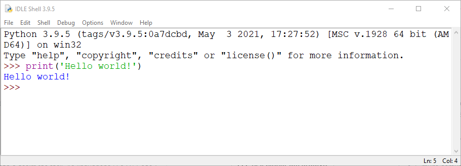

# Printing output

*`print()` is the first line of code everyone writes, and it stays your most-used debugging tool for a whole career. But printing hides two traps a tester must know: the value in memory is not the text on screen, and stdout and stderr are two separate output channels, not one.*

> The very first program in every language on earth prints two words: **Hello, world**. It is
> a rite of passage, and it looks too simple to be worth a second thought. But `print` is not
> simple. It is the tool you will reach for ten thousand more times — to see what a variable
> actually holds, to trace which branch ran, to prove a bug is real. Developers call this
> "printf debugging," and every senior engineer alive still does it. Learn to print *well* now
> and you have learned the debugging technique you will use most for the rest of your life.

> **In real life**
>
> Think of a program as a person working alone in a locked room. You cannot see their thoughts.
> The **only** way you know what they are doing is what they say out loud — and `print` is them
> saying it out loud. A program with no output is a person working in total silence: it might
> be doing brilliant work, or nothing at all, and you have no way to tell. Every `print` you
> add is you asking the worker, "what have you got right now?" and getting an honest answer.
> That is the entire craft of debugging, compressed into one function.

## What actually happens when you print

Printing feels like it shows you "the value." It does not. It shows you a **text
representation** of the value, written to a **stream** — a channel of characters flowing out
of your program. Two ideas hide inside that sentence, and both cause real bugs:

**1. The screen text is not the value.** `print` runs the value through a formatter first.
`print(0.1 + 0.2)` shows `0.3` in some contexts and `0.30000000000000004` in others — same
number in memory, different text on screen. The number you *see* and the number that *is* are
different objects, and confusing them is where the longest debugging sessions begin.

**2. There are two output channels, not one.** Every program has **stdout** (normal output)
and **stderr** (errors and diagnostics). They look identical in your terminal because both
land on the same screen — but they are separate pipes, and tools tell them apart. A test
runner that captures stdout and ignores stderr will silently swallow your error messages.


*Python 3.9.5 IDLE Shell on Windows — Wikimedia Commons, PSF licence. [Source](https://commons.wikimedia.org/wiki/File:Python_IDLE_Shell.png)*
- **The prompt: `>>>` means 'your turn'** — Those three chevrons are the interactive prompt. The shell is waiting for you to type one line, which it will run the instant you press Enter. This is the fastest laboratory you own — no file to save, no program to compile. Type an expression, see its value. Every language this track teaches has one (Python's `>>>`, and `jshell` for Java).
- **`print('Hello world!')` — the call** — `print` is a function; the thing in the parentheses is the argument you hand it. The quotes mark where the text starts and ends — they are syntax, not part of the message. This is the single most-typed line in all of programming, and you will type your own version of it within the minute.
- **`Hello world!` — the output, no quotes** — Notice the printed line has NO quotation marks. The quotes told the language 'this is text'; once printed, their job is done and they vanish. If you ever see quotes in your OUTPUT, you printed the wrong thing — you printed a representation of the string (with its quotes) instead of the string itself. That distinction returns constantly.
- **`>>>` returns — the call is finished** — The prompt comes back, ready for the next line. `print` did its job and handed control back. It returned nothing useful (in Python, literally `None`) — you call it for its EFFECT, not its value. Printing is a side effect: it changes the world (the screen) rather than computing an answer.
- **`Python 3.9.5 ... on win32` — always read the banner** — The header names the exact version and platform. When you file a bug, this line is the first thing anyone asks for, because behaviour differs between versions. A tester reads the banner before touching the keyboard — it is free evidence about the environment you are testing in.

**Where does your text actually go? — press Play**

1. **You call `print('hi')`** — You hand the function a string. In your mind it 'appears on screen', but the screen is the very last stop on a longer journey, and knowing the journey is what lets you redirect, capture and test output later.
2. **The value becomes text** — The language converts your argument to characters. A string is already text; a number, a list, an object each get run through a formatter first. This step is why `print(myObject)` sometimes shows something useful and sometimes shows `<object at 0x7f3a...>` — the formatter had nothing better to say.
3. **The text is written to stdout** — Not to 'the screen' directly — to a stream named standard output. By default that stream is connected to your terminal, which is why you see it. But it's a pipe, and pipes can be pointed elsewhere: into a file, into another program, into a test's capture buffer.
4. **A newline is added (or not)** — `print` in Python and `println` in Java add a line break at the end, so the next output starts on a fresh line. Their siblings — Python's `end=''` and Java's `print` — do NOT. Miss this and your output all runs together on one line, or spreads across lines you didn't intend.
5. **The terminal draws it** — The terminal reads the stream and paints characters onto the window. Only now do you 'see' it. Every stage before this was invisible — which is exactly why redirecting output (`> log.txt`) works: you're catching the stream before this final drawing step.

*Run it — printing in Python*

```python
# 1. The classic
print("Hello, world!")

# 2. print adds a newline; each call starts a fresh line
print("line one")
print("line two")

# 3. ...unless you tell it not to, with end=
print("no newline here", end=" -> ")
print("so this joins on")

# 4. print takes MANY arguments, joined by a space (the sep)
print("a", "b", "c")
print("a", "b", "c", sep="-")

# 5. The screen text is NOT the value
print(0.1 + 0.2)              # looks like 0.3-ish
print(repr(0.1 + 0.2))        # repr() shows the TRUE stored value
print("the string:", "42", "| the number:", 42)  # look identical, are not

# 6. Two separate channels: stdout and stderr
import sys
print("this goes to stdout (normal output)")
print("this goes to stderr (errors/diagnostics)", file=sys.stderr)
```

Now the same ideas in Java. The mechanics differ — `System.out.println` versus `print`, and
Java forces you to think about the stream (`System.out`) by name every single time:

*Run it — printing in Java (note println vs print)*

```java
public class Main {
    public static void main(String[] args) {
        // 1. The classic. println = "print line" = adds a newline.
        System.out.println("Hello, world!");

        // 2. println starts a fresh line each time
        System.out.println("line one");
        System.out.println("line two");

        // 3. print (no -ln) does NOT add a newline
        System.out.print("no newline here -> ");
        System.out.println("so this joins on");

        // 4. Join values with + (string concatenation)
        System.out.println("a" + "-" + "b" + "-" + "c");

        // 5. The screen text is not the value
        System.out.println(0.1 + 0.2);   // 0.30000000000000004 -- Java shows it raw
        System.out.println("42");         // the text 42
        System.out.println(42);           // the number 42 -- look identical, are not

        // 6. stdout vs stderr are two named streams here
        System.out.println("this goes to stdout");
        System.err.println("this goes to stderr");
    }
}
```

 out.txt\`) or feed it into another program (\`program | grep error\`) without changing a line of code. Understanding that output goes to a redirectable stream — not 'to the screen' — is what lets you capture, log and test a program's output.`}>stdout

 out.txt\` leaves stderr visible), or the reverse. This separation matters enormously in testing — a test harness that captures stdout but forgets stderr will silently lose every warning and error the program emitted, and you'll swear the program 'said nothing' when it was shouting the whole time on the other channel.`}>stderr

> **Tip**
>
> When you print to debug, **print a label with the value**, never the value alone. `print(x)`
> shows `7` and leaves you guessing which of your six prints produced it. `print("x after loop:", x)`
> tells you *what* and *where* in the same line. Better still, print the *type* too when a value
> surprises you: Python's `print(type(x), repr(x))`, Java's `System.out.println(x.getClass() + " " + x)`.
> Nine debugging mysteries in ten dissolve the instant you can see that the `42` on screen was
> actually the string `"42"`.

### Your first time: Your mission: make the machine talk

- [ ] Say hello — In the Python playground, run `print("Hello, world!")`. You have now joined every programmer who ever lived. It never stops being satisfying.
- [ ] Feel the newline — Run two `print` calls in a row — separate lines. Now add `end=" "` to the first. Watch them join. That trailing newline was always there; you just made it visible by removing it.
- [ ] Catch the liar — Print `0.1 + 0.2`, then print `repr(0.1 + 0.2)`. Same value, two different texts. The pretty one is lying to you, kindly. Remember this the next time a number 'looks right' but a test fails.
- [ ] Tell the string from the number — Print `"42"` and `42` on separate lines. Identical on screen. Now print `type("42")` and `type(42)`. THIS is the difference the screen hid — and it is the source of a huge share of beginner bugs.
- [ ] Split the channels — In Java, run one `System.out.println` and one `System.err.println`. They both show. Now imagine a test that only reads `System.out` — the error line just vanished. That's a real class of missed bug.

You have met printing's two lies — the text is not the value, and one screen is really two channels — in about five minutes.

- **All my output comes out on one line, jammed together.**
  You used the no-newline variant. In Python that's `print(..., end="")`; in Java it's `System.out.print` instead of `println`. Either switch to the newline version, or add the line break yourself. The opposite bug — too many blank lines — is usually a stray `println()` with nothing in it, or a string that already ends in a newline that you then print with another.
- **Two values print identically but the program treats them differently.**
  They're probably different TYPES that share a text form. The string `"42"` and the integer `42` both print as `42` but behave nothing alike — `"42" + "1"` is `"421"`, `42 + 1` is `43`. Print the type alongside the value (`type(x)` in Python, `x.getClass()` in Java) and the mystery ends.
- **My error messages disappear when I run the program through a tool or pipe.**
  The tool is capturing stdout and ignoring stderr (or vice versa). Errors go to stderr on purpose. When you redirect, be explicit: `program > out.txt 2>&1` merges stderr into stdout so nothing is lost. In a test harness, make sure it captures BOTH streams, or you'll lose every warning.
- **Nothing prints at all, even though the code clearly runs.**
  Two usual causes. First, buffering: output sits in a buffer and isn't flushed before the program exits or crashes — force it with Python's `print(..., flush=True)` or Java's `System.out.flush()`. Second, you printed to a stream that's redirected away. When output vanishes, suspect the stream and the buffer before you suspect the logic.

### Where to check

Output problems live in the gap between "what the program computed" and "what you saw." Close it:

- **`repr()` in Python, `Double.toString` / `Arrays.toString` in Java** — the true value, not the display-rounded or address-only one.
- **`type(x)` / `x.getClass()`** — when two things print alike but act differently, the type is the answer.
- **Redirect on purpose** — `program > out.txt` (stdout only), `2> err.txt` (stderr only), `> all.txt 2>&1` (both). Knowing which stream carried the message is half the diagnosis.
- **`flush=True` / `System.out.flush()`** — when a print seems to be missing right before a crash, it's usually still sitting in the buffer.
- **A label on every debug print** — `print("here A:", x)` so you can tell your six prints apart. Delete them before you commit; a codebase full of stray `print` is a code smell reviewers flag.

Tester's habit: **when output surprises you, distrust the display before the logic.** The
computation is usually correct; the *representation* of it — rounded, retyped, on the wrong
channel, or still in a buffer — is what fooled you.

### Worked example: the warning nobody saw

1. **The report:** "The nightly data import says it succeeded, but half the records are missing. The log file is clean — no errors at all."
2. **The developer is baffled.** The log genuinely shows a tidy run: "Started", "Processing", "Done. Success." Not one error line.
3. **A tester looks at HOW the log is produced.** The import runs as `python import.py > nightly.log` — redirecting stdout to the file. The "Success" messages are `print(...)`: stdout. They land in the log.
4. **But the warnings are `print(..., file=sys.stderr)`.** Stderr. The redirect only captured stdout, so every "row 8814 skipped: bad date" warning went to a terminal nobody was watching, and never reached the file.
5. **The proof:** run it as `python import.py > nightly.log 2>&1` — merging stderr into the same file. Suddenly the log has 4,000 warning lines the team never knew existed. The import wasn't silent; the logging was deaf in one ear.
6. **Why it hid for months.** stdout and stderr look identical on a live terminal, so in manual testing everything "printed fine." The separation only bit once the output was redirected — which only happened in the automated nightly job, which nobody watched live.
7. **The fix is two parts.** Capture both streams in the job (`2>&1`, or better, a real logging library that writes both to the file with levels). And add a test that runs the import against a file with known-bad rows and asserts the warning count is non-zero — proving the warnings actually reach the log.
8. **The lesson for a tester.** "No errors in the log" is not the same as "no errors." It means "no errors *on the channel the log happened to capture*." A tester asks which streams exist and where each one was pointed — because the most dangerous error is the one that was reported perfectly, on a channel no one was listening to.

> **Common mistake**
>
> Leaving `print` statements scattered through code you commit. Printf-debugging is a superb
> *tool* and a terrible *artifact*: a hundred stray `print("here")` lines clutter output, leak
> information, slow tight loops, and mark you as someone who didn't clean up. The professional
> pattern is to reach for `print` freely while hunting a bug, then delete every one before you
> commit — or, for output you genuinely want to keep, replace it with a real **logging** call
> that has levels (debug/info/warning/error) you can switch off. `print` is your scratch paper,
> not your ink.

**Quiz.** In Python, print('42') and print(42) produce the exact same line on screen. What is the real difference?

- [ ] There is no difference; the quotes are optional in Python
- [x] One prints a string (text) and the other prints an integer (a number). They share a text representation but are different types, and behave differently: `'42' + '1'` is `'421'` while `42 + 1` is `43`. The screen hides the type; only `type()` reveals it.
- [ ] `print(42)` is faster because numbers are simpler
- [ ] `print('42')` will cause an error because 42 is not really text

*This is one of the most common beginner bugs, and it survives precisely because printing conceals it. A form field gives you the string '42'; you assume it's the number 42; you 'add' the next value and get '4210' instead of '52'. The output looked fine at every step because both types print identically. The fix — and the habit — is to print the TYPE when a value surprises you: `print(type(x), repr(x))`. A tester who does this reflexively finds type-confusion bugs in minutes that developers chase for hours.*

- **What does `print` actually do?** — Converts a value to text and writes it to the stdout stream (which is connected to your terminal by default). It's a side effect — you call it for the effect, not a return value.
- **println vs print in Java** — `println` adds a trailing newline (next output on a fresh line); `print` does not. In Python the equivalents are default `print` vs `print(..., end="")`.
- **stdout vs stderr** — Two separate output streams. stdout = normal output, stderr = errors/diagnostics. They share the screen but are different pipes — redirect one without the other, and a capture that ignores stderr loses every warning.
- **Why does a number look right but fail a test?** — The printed text is a rounded representation, not the stored value. Print `repr(x)` (Python) or `Double.toString(x)` (Java) to see the truth.
- **Two values print identically but behave differently — why?** — Different types sharing a text form, e.g. `"42"` (string) vs `42` (int). Print the type to reveal it.
- **Where did my last print go before a crash?** — Probably still in the output buffer, un-flushed. Force it: `print(..., flush=True)` / `System.out.flush()`.
- **print vs logging** — `print` is scratch paper for debugging — delete before committing. Logging (with levels) is the permanent, switchable record you keep.

### Challenge

In the Python playground, print `10 / 3` and then `repr(10 / 3)`. Count the digits the pretty
version hides. Now print the string `"10"` and the number `10` on two lines, confirm they look
identical, then print `type("10")` and `type(10)` to expose the difference the screen concealed.
Finally, in the Java playground, send one message with `System.out.println` and one with
`System.err.println`, and write down in one sentence why a test that captures only `System.out`
would let a real error slip through completely unnoticed.

### Ask the community

> Printing/output problem: I expected `[X]` on screen but got `[Y]`. Language: `[Java/Python]`. Raw value via repr()/Double.toString: `[paste]`. Type of the value: `[paste type(x) / x.getClass()]`. Which stream: `[stdout / stderr]`. Redirected or piped: `[yes/no — how]`.

Ninety percent of output puzzles are answered by two lines you probably left out: the raw
value (not the pretty-printed one) and the type. Paste those and the surprise usually explains
itself before anyone even replies.

- [Python docs — print(): sep, end, file and flush explained](https://docs.python.org/3/library/functions.html#print)
- [Java tutorial — I/O streams (stdout, stderr and the rest)](https://docs.oracle.com/javase/tutorial/essential/io/streams.html)
- [Standard streams — stdin, stdout, stderr (the shared foundation)](https://en.wikipedia.org/wiki/Standard_streams)
- [Real Python — a deep, practical guide to print()](https://realpython.com/python-print/)

🎬 [stdout, stderr and redirection, explained simply](https://www.youtube.com/watch?v=x3JN2Gm4a5Q) (9 min)

- `print` converts a value to text and writes it to the stdout stream — the text on screen is a representation, not the value itself. Print `repr()` / `Double.toString` to see the truth.
- `println` (Java) and default `print` (Python) add a newline; `print` (Java) and `print(..., end="")` (Python) do not. Missing this jams your output onto one line.
- Every program has TWO output channels: stdout for results, stderr for errors. They share the screen but are separate pipes — a capture that ignores stderr silently loses every warning.
- Two values that print identically can be different types (`"42"` vs `42`). Print the type when a value surprises you; type-confusion is a top beginner bug the screen hides.
- `print` is scratch paper for debugging — the most-used debugging tool there is — but delete stray prints before committing, or replace them with real logging.


---
_Source: `packages/curriculum/content/notes/programming-basics/input-and-output/printing-output.mdx`_
