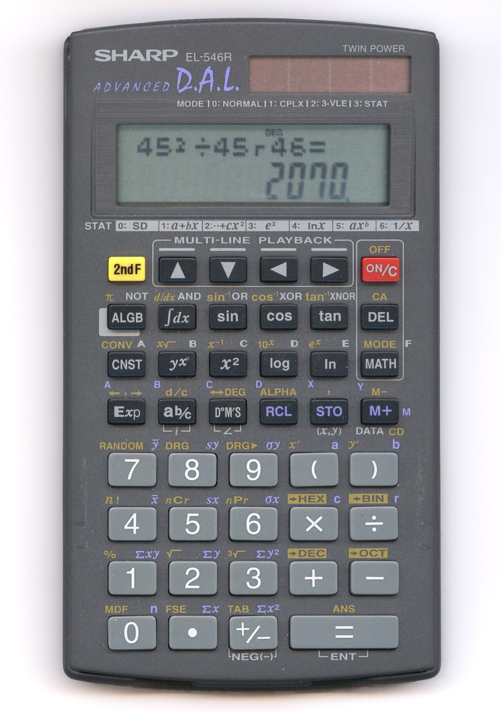

# Expressions

*An expression is anything that computes to a value. Precedence decides the order, and the order is not the order you read in — which is why `2 + 3 * 4` is 14, and why one missing pair of brackets has crashed spacecraft.*

> `2 + 3 * 4`. You already know it's 14, not 20, because multiplication comes first — you
> learned that at school and never questioned it again. Now: `if (a || b && c)`. Does the
> `&&` bind tighter than the `||`, or the other way round? If you hesitated, you've found the
> problem. **You carry a precedence table for arithmetic in your bones and none at all for
> logic**, so the second expression is a coin-flip you didn't know you were making. The
> computer isn't flipping a coin. It has the table, and it will follow it exactly, whether or
> not it's the table you meant.

> **In real life**
>
> Precedence is **the grammar rule that "old red brick" means an old brick that is red, not a
> brick that is old-red.** English has an ordering for adjectives so deep you'd flinch at "red
> old brick" without being able to say why. Programming languages have the same thing for
> operators: an invisible, absolute ordering that decides what binds to what. The difference
> is that with code you can *see* the ordering, write it down, and — when in doubt — override
> it with parentheses. Brackets are you saying "no, I meant it *this* way," out loud, to the
> machine and to the next human.

## What an expression is, and what precedence does to it

An **expression** is any piece of code that produces a value: `3`, `x + 1`, `user.getName()`,
`a > b && c < d`. If you can imagine printing its result, it's an expression. Statements
*do* things (`if`, `for`, an assignment); expressions *compute* things, and statements are
built out of them.

**Precedence** is the fixed order in which operators bind when you don't use brackets. A
rough ranking, tightest-binding first, and it's nearly identical in Java and Python:

1. `()` — brackets, always first
2. `!` / `not`, unary minus
3. `*` `/` `%` — multiplicative
4. `+` `-` — additive
5. `<` `>` `<=` `>=` `==` `!=` — comparison
6. `&&` / `and`
7. `||` / `or`
8. `=` — assignment, always last

The two lines worth memorising because they cause real bugs: **comparison binds tighter than
`&&` and `||`** (so `a > b && c > d` groups the way you'd hope), and **`&&` binds tighter
than `||`** (so `a || b && c` means `a || (b && c)`, which is very often *not* what the
author pictured).


*Sharp scientific calculator — Wikimedia Commons, CC BY-SA 2.0. [Source](https://commons.wikimedia.org/wiki/File:Sharp_Scientific_Calculator.jpg)*
- **× and ÷ bind before + and −** — `2 + 3 * 4` is 14, because `*` is evaluated first: `2 + (3 * 4)`. Every calculator, every language, agrees. This is the one precedence rule everybody already trusts completely — the goal of this note is to make you trust the *rest* of the table as little, and reach for brackets instead.
- **The calculator has no `&&` key — but code does** — Arithmetic precedence is universal and you never think about it. Logical precedence — where `&&` binds tighter than `||` — is exactly as real and exactly as fixed, but nobody drilled it into you, so mixed logic is where precedence bugs actually live.
- **The display shows the final value** — An expression collapses to one value, no matter how many operators it contains. That value then flows into an `if`, an assignment, or another expression. Precedence decides the shape of the calculation that produced it — and the display never shows you the shape, only the answer.
- **The bracket keys — your override** — `( )` beat everything. When you are unsure of precedence, you do not look it up and feel clever; you add brackets and make the grouping impossible to misread. `a || (b && c)` and `(a || b) && c` are different values, and the parentheses are you refusing to leave it to a table the next reader also hasn't memorised.
- **= is evaluated LAST** — In `total = price * qty`, the whole right side computes first, then the single result is assigned. Assignment has the lowest precedence of all, which is why you almost never bracket it — but it's also why `a = b == c` assigns a *boolean* to `a`, a classic surprise.

**How `a || b && c` is really grouped — press Play**

1. **You write `if (a || b && c)`** — In your head, most people read left to right: 'a or b, and c'. That grouping would be `(a || b) && c` — the whole thing only true when c is true. It feels like the natural reading because that's the order the words appear on the line.
2. **The language reads precedence, not left-to-right** — `&&` binds tighter than `||`, exactly as `*` binds tighter than `+`. So the machine groups the `&&` first: `b && c` becomes a single unit before the `||` is considered. Your eyes read left to right; the compiler reads by binding strength.
3. **The real grouping is `a || (b && c)`** — 'a, OR (b and c together)'. This is true whenever `a` is true — regardless of `b` and `c`. That is a completely different condition from `(a || b) && c`, which requires c. Same seven characters, two different programs.
4. **Concretely: a=true, b=false, c=false** — Your intended `(a || b) && c` = `(true) && false` = **false**. The actual `a || (b && c)` = `true || (false)` = **true**. The `if` fires when you expected it not to. No error, no warning — just the wrong branch, on specific inputs.
5. **The fix is not memorising the table** — The fix is brackets. Write `(a || b) && c` or `a || (b && c)` — whichever you meant — and the ambiguity is gone for the compiler and for every human who reads it after you. Precedence you have to remember is precedence someone will eventually get wrong.

*Run it — watch precedence change the answer*

```python
a, b, c = True, False, False

# The SAME three variables, two different bracketings:
intended = (a or b) and c      # what many people THINK 'a or b and c' means
actual   = a or (b and c)      # what it ACTUALLY means (and binds tighter than or)

print("a, b, c =", a, b, c)
print("(a or b) and c  ->", intended, "  <- 'a or b, then and c'")
print("a or (b and c)  ->", actual,   "  <- what Python actually does")
print("a or b and c    ->", a or b and c, "  <- same as the line above")
print()

# Arithmetic, the one everyone already trusts:
print("2 + 3 * 4       ->", 2 + 3 * 4,   "  (* binds first)")
print("(2 + 3) * 4     ->", (2 + 3) * 4, "  (brackets override)")
print()

# The assignment surprise: = is evaluated LAST, so the right side is a boolean
x = 5
result = x == 5
print("result = x == 5 ->", result, "  <- assigns the BOOLEAN (x == 5), not 5")
print()

# A real-world trap: comparison chained with logic
age = 25
# 'is age between 18 and 65' -- comparison binds tighter than 'and', so this works:
ok = 18 <= age and age <= 65
print("18 <= age and age <= 65 ->", ok, "  (comparisons bind before 'and')")
print()
print("The rule to LIVE by: when logic and arithmetic mix, add brackets.")
print("Brackets you didn't need cost nothing. Precedence you misremembered costs a bug.")
```

Java follows the same precedence — with one extra trap Python doesn't have, string `+`:

*Run it — Java precedence, and the string-concatenation surprise*

```java
public class Main {
    public static void main(String[] args) {
        boolean a = true, b = false, c = false;

        System.out.println("a || b && c   -> " + (a || b && c) + "   (&& binds first: a || (b && c))");
        System.out.println("(a || b) && c -> " + ((a || b) && c) + "  (brackets force the other grouping)");
        System.out.println();

        System.out.println("2 + 3 * 4   -> " + (2 + 3 * 4));
        System.out.println("(2 + 3) * 4 -> " + ((2 + 3) * 4));
        System.out.println();

        // THE Java-specific trap: + is both 'add' and 'concatenate', same precedence,
        // evaluated left to right. Mixing them inside a println bites constantly.
        System.out.println("sum: "  + 2 + 3);   // "sum: " + 2 = "sum: 2", then + 3 = "sum: 23"
        System.out.println("sum: "  + (2 + 3));  // brackets first -> 5
        System.out.println(2 + 3 + " total");    // 2 + 3 = 5 first (both ints), then + string
        System.out.println();
        System.out.println("The first line prints 23, not 5. String + is left-to-right,");
        System.out.println("same precedence as numeric +. Bracket the arithmetic.");
    }
}
```

operator precedence

> **Tip**
>
> You do not need to memorise the precedence table. You need one habit: **when an expression
> mixes different kinds of operator — arithmetic with logic, `&&` with `||`, anything with
> string `+` in Java — add parentheses even if you're confident.** The parentheses you didn't
> strictly need are invisible to the compiler and a gift to every human who reads the line,
> including you in six months. The rule that separates people who ship precedence bugs from
> people who don't is not "know the table"; it's "bracket when in doubt, and be in doubt often."

### Your first time: Your mission: make precedence change the answer

- [ ] Run the Python playground — Watch `(a or b) and c` and `a or (b and c)` give DIFFERENT answers for the same a, b, c. Then confirm `a or b and c` matches the second one — that's precedence choosing for you.
- [ ] Find the flip point — Change a, b, c until the two bracketings disagree. `True, False, False` does it. That disagreement, on specific inputs, is exactly how a precedence bug hides — it's fine until the inputs line up.
- [ ] Hit the Java string-+ trap — In the Java playground, `"sum: " + 2 + 3` prints `sum: 23`, not `sum: 5`. Add brackets: `"sum: " + (2 + 3)`. One pair of parentheses, completely different output.
- [ ] Prove brackets cost nothing — Wrap a bit of arithmetic you're SURE about in parentheses. Same answer. Now the reader never has to know the table to trust your line. That's the whole trade.
- [ ] Write the ambiguous condition both ways — Type `a || b && c` and then both bracketed forms. Decide which you actually meant. If you had to think about it, so will the next person — so bracket it.

You've now seen the same expression produce two different values depending on invisible grouping — which is the entire reason parentheses exist.

- **A condition mixing `&&` and `||` fires when it shouldn't (or doesn't when it should).**
  Precedence. `&&` binds tighter than `||`, so `a || b && c` is `a || (b && c)` — not `(a || b) && c`. These are different conditions and differ on specific inputs. Add the parentheses you meant. This is the single most common precedence bug in real code, because everyone drilled arithmetic precedence and nobody drilled logical.
- **Java: a log line prints a number that's been mashed together, like `Total: 23` instead of 5.**
  String `+` and numeric `+` share the same precedence and evaluate left to right. `"Total: " + 2 + 3` does `"Total: " + 2` = `"Total: 2"` first, then `+ 3` = `"Total: 23"`. Bracket the arithmetic: `"Total: " + (2 + 3)`. Conversely `2 + 3 + " total"` gives `5 total` because the ints add before the string appears.
- **`if (a = b)` compiles in Java and behaves strangely.**
  You wrote assignment `=` where you meant comparison `==`. Assignment has the lowest precedence and evaluates to the assigned value; if that value is a boolean, the `if` uses it. Java only allows this when the type is boolean, which is exactly when it's most dangerous. This is why some style guides put the constant first (`if (CONSTANT == x)`) — a typo'd `=` then won't compile.
- **An arithmetic result is wrong and the formula looks right.**
  Check the grouping before you check the formula. `a + b / c` is `a + (b / c)`, not `(a + b) / c`. `-x ** 2` in Python is `-(x ** 2)` = negative, because exponent binds tighter than unary minus. When the math is wrong, print the sub-expressions separately to see where the grouping diverged from your intent — the operators are usually right and the binding is wrong.

### Where to check

Precedence is resolved before runtime, so it never throws — you have to read for it:

- **Every expression mixing `&&` and `||`** — is the grouping bracketed, or left to a table? Bracket it.
- **Every Java `+` near a string and a number** — left-to-right concatenation is probably not what you meant. Bracket the arithmetic.
- **Every `=` inside an `if`** (Java) — did you mean `==`? Assignment is the lowest-precedence trap.
- **Mixed arithmetic and comparison** — `a + b > c` is `(a + b) > c`; confirm that's intended.
- **Print the sub-expressions** — when a value is wrong, evaluate the pieces separately to find where the grouping diverged.

Tester's habit: **an unbracketed expression that mixes operator kinds is a question the
author answered from memory.** Sometimes they remembered right. Your job is to notice the
places where the answer *matters* — where two plausible groupings give different results —
and check that the code takes the one the requirement wanted. That's a code review skill you
can apply before a single test runs.

### Worked example: the discount that applied to the wrong customers

1. **The requirement:** give a discount to customers who are *either* premium members *or*
   have spent over £100 **and** are in a promo region. (Read that twice — the English is
   already ambiguous, which is the first clue.)
2. **The code:**
   ```java
   if (isPremium || total > 100 && inPromoRegion) {
       applyDiscount();
   }
   ```
3. **It ships.** In testing, every premium customer got the discount and every non-premium
   big-spender in a promo region got it. Looks correct.
4. **Finance notices margin is off.** Premium customers *outside* promo regions, spending
   nothing, are getting the discount too.
5. **A tester reads the grouping, not the formula.** `&&` binds tighter than `||`, so the
   compiler sees:
   ```java
   if (isPremium || (total > 100 && inPromoRegion))
   ```
   'Premium — OR — (big spender in a promo region).' Any premium member qualifies on their
   own, region and spend irrelevant.
6. **But re-read the requirement.** "Either premium or over £100, **and** in a promo region"
   was *meant* as `(isPremium || total > 100) && inPromoRegion` — the promo region applies to
   both paths. The author's mental grouping and the language's grouping were different, and
   both are defensible readings of the English sentence.
7. **The fix is one pair of brackets:**
   ```java
   if ((isPremium || total > 100) && inPromoRegion) {
   ```
8. **Why testing nearly missed it.** The happy-path cases — premium-in-region, bigspender-in-region — pass under *both* groupings. The only inputs that reveal the bug are premium customers *outside* a promo region, which nobody wrote a case for because the requirement didn't picture them. The bug lived exclusively in the combination the two groupings disagree on.
9. **The tester's move, and it's a review move, not a runtime one.** When a condition mixes `&&` and `||` without brackets, don't just test it — *re-derive its grouping from precedence and compare it against the requirement's intent.* The mismatch is visible in the source, before any test runs, to anyone who knows that `&&` binds tighter than `||`. And then: write the case for the input where the two readings diverge.

> **Common mistake**
>
> Trusting your left-to-right reading of a mixed condition. `a || b && c` reads, in English
> word order, as 'a or b, and c' — and means `a || (b && c)`, which is a different thing. Your
> eye scans left to right; the compiler groups by precedence. The two agree for pure arithmetic
> (because you internalised that table as a child) and diverge for logic (because nobody taught
> you that one). The cost of being wrong is a condition that silently qualifies or rejects the
> wrong inputs, with no error ever raised. The cost of the fix is two characters. Bracket every
> mixed condition, and never make the next reader reconstruct a precedence table you were too
> confident to write down.

**Quiz.** In both Java and Python, how does the computer group `a || b && c`?

- [ ] `(a || b) && c` — left to right, in reading order
- [x] `a || (b && c)` — because `&&`/`and` binds tighter than `||`/`or`, exactly as `*` binds tighter than `+`. The two groupings give different results on inputs like a=true, b=false, c=false, and the language always picks this one.
- [ ] It's undefined and depends on the compiler
- [ ] Both groupings always give the same answer, so it doesn't matter

*`&&` (and Python's `and`) sits higher in the precedence table than `||`/`or`, the same way multiplication sits above addition — so `b && c` binds into a single unit before the `||` is considered, giving `a || (b && c)`. Option 1 is the intuitive left-to-right reading, and it's wrong: it would require c to be true, whereas the real grouping is satisfied by a alone. Option 4 is the dangerous belief — the groupings agree on most inputs and differ on exactly the ones nobody tests. The language is never ambiguous here; your memory of the table is. Add brackets and the question disappears.*

- **Expression vs statement** — An expression computes a value (`x + 1`, `a && b`). A statement does something (`if`, a loop, an assignment). Statements are built from expressions.
- **Precedence, roughly** — () → ! / not → * / % → + - → comparisons → && / and → || / or → =. Multiplicative before additive; comparison before logic; && before ||.
- **`a || b && c` groups as…** — `a || (b && c)`. `&&` binds tighter than `||`, just as `*` binds tighter than `+`. NOT `(a || b) && c`.
- **The one habit that beats the table** — Bracket every expression that mixes operator kinds — arithmetic with logic, && with ||, string + with numbers. Even when you're sure.
- **Java string + trap** — `"sum: " + 2 + 3` = `"sum: 23"` (left to right, same precedence). Bracket the arithmetic: `"sum: " + (2 + 3)`.
- **`if (a = b)` in Java** — Assignment, not comparison. Lowest precedence, evaluates to the assigned value. Compiles when the value is boolean — the most dangerous case.
- **Python `-x ** 2`** — `-(x ** 2)` — exponent binds tighter than unary minus, so the result is negative. A classic precedence surprise.
- **The tester's precedence move** — It's a code-review skill, not a runtime one. Re-derive an unbracketed mixed condition's grouping and compare it to the requirement — the bug is visible in the source.

### Challenge

In the Java playground, print `"Total: " + 2 + 3` and watch it produce `Total: 23`. Fix it
with one pair of brackets. Then build the discount condition from the worked example both
ways — `isPremium || total > 100 && inPromoRegion` and `(isPremium || total > 100) &&
inPromoRegion` — and find the single input (a premium customer outside a promo region) where
they disagree. You'll have reproduced a real margin-leaking bug and fixed it with two
characters, and you'll never read a mixed `&&`/`||` condition the same way again.

### Ask the community

> Precedence question: `[expression]` gives `[result]`, I expected `[other]`. Language: `[Java/Python]`. The operators mixed: `[arithmetic / && with || / string + with numbers]`. My intended grouping, in brackets: `[write it out]`. The input where it goes wrong: `[values]`.

Writing out your *intended* grouping in brackets is what turns this from a puzzle into a
one-line answer — the responder just compares your brackets against what precedence actually
does and points at the gap. And naming the input where it fails proves you've found the exact
combination the two groupings disagree on, which is the whole bug.

- [Java — the full operator precedence table](https://docs.oracle.com/javase/tutorial/java/nutsandbolts/operators.html)
- [Python docs — operator precedence, highest to lowest](https://docs.python.org/3/reference/expressions.html#operator-precedence)
- [Order of operations — the maths idea every language inherits](https://en.wikipedia.org/wiki/Order_of_operations)

🎬 [Operator precedence, and why brackets are free](https://www.youtube.com/watch?v=rQD2A2Vk9SU) (8 min)

- An expression computes a value; a statement does something. Statements are assembled from expressions.
- Precedence is a fixed, language-wide order resolved before runtime — so it never errors, it only groups differently than you may have meant.
- `&&` binds tighter than `||`, so `a || b && c` is `a || (b && c)`. You know arithmetic precedence cold and logical precedence not at all — that gap is where the bugs are.
- In Java, `+` is addition and concatenation at one precedence, left to right: `"sum: " + 2 + 3` is `"sum: 23"`. Bracket the arithmetic.
- Don't memorise the table — bracket every expression that mixes operator kinds. The parentheses are free and they save the next reader from a table they also never learned.


---
_Source: `packages/curriculum/content/notes/programming-basics/operators-and-expressions/expressions.mdx`_
