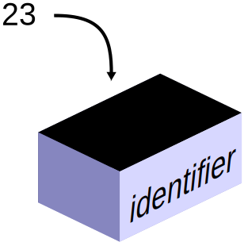

# Naming

*You name every variable you create — and good names are the cheapest, highest-value documentation in all of code. Why 'total_price' beats 'x', the conventions Python and Java each use, and the rules you can't break.*

> Here's a task you'll do thousands of times without thinking: naming things. Every variable,
> every function, gets a name you choose. It sounds like the boring part, and it's secretly one
> of the highest-leverage skills in programming — because six months from now, `x` and `d` and
> `temp` will mean nothing to you, while `total_price` and `days_left` will read like plain
> English. Good names are documentation you get for free, written into the code itself. Bad names
> are a tax every future reader (including you) pays forever. This note makes you someone whose
> code others can actually read — a genuinely underrated superpower, especially for a tester who
> reads far more code than they write.

> **In real life**
>
> A variable name is **the label on a moving box.** When you pack boxes and label them "kitchen —
> plates" versus leaving them blank or writing "stuff", you're not helping the movers — you're
> helping *future you*, standing in a new house, trying to find a plate. Code is the same: the
> name is the only thing a reader sees from the outside; they can't peek inside to see the value.
> So a box labelled `total` tells them exactly what's inside, while one labelled `x` forces them to
> open it and trace the whole program to find out. The technical word for a name you give something
> in code is an **identifier**: The name a programmer gives to a variable, function, or other thing in code — like total_price or checkIn. Chosen by you, following the language's rules and conventions, to say what the thing is.,
> and choosing good ones is packing your code so future-you can find the plates.

## Good names vs bad names: the cheapest documentation there is

The difference is stark and immediate. Compare:

```python
# Bad -- what does this even do?
x = 100
y = 0.2
z = x - x * y
print(z)

# Good -- reads like a sentence
price = 100
discount_rate = 0.2
final_price = price - price * discount_rate
print(final_price)
```

Both compute the same number. But the second one *documents itself* — anyone can see it's applying
a discount to a price, no comments needed. The first is a puzzle you have to solve. And here's the
kicker: the good names cost nothing extra — you type them once and they explain the code forever.
Names are the cheapest documentation in existence: no separate file, never out of date, right there
where you need them. Professional programmers judge code partly by its names, and a tester reading
unfamiliar code silently blesses or curses whoever named the variables.


*Diagram: a variable as a labelled box — Wikimedia Commons, CC0. [Source](https://commons.wikimedia.org/wiki/File:CPT-programming-variable.svg)*
- **'identifier' — the NAME, and the whole point** — This label is the identifier — the name you choose for the box. It's the ONLY part a reader sees in the code; they can't look inside for the value. So the name has to carry the meaning: 'total_price' tells them everything, 'x' tells them nothing. Naming well means making this label say exactly what's inside.
- **'23' — the value the reader can't see** — The actual value (23) lives inside the box, invisible from the outside in the code. Whoever reads your program sees the NAME, not the value. That's precisely why the name must describe the contents — it's the reader's only clue about what this box holds and why.
- **The arrow — the value goes INTO the named box** — The value is stored into the box (the '=' as arrow, from the variables note). Naming happens at exactly this moment: as you create the box and put something in it, you choose its label. A good name chosen here saves every future reader — including you — from guesswork.
- **The box — same container, YOUR label** — Every variable is a box like this; what makes one clear and another cryptic is entirely the label you write on it. The container is identical; the name is your contribution to whether the code reads like English or like a puzzle. It's a small choice you make constantly, with a large cumulative effect.
- **You can't see inside — so the label must tell** — The top is closed; from the outside you know the box only by its label. This is the reader's whole experience of your variable. 'days_remaining' and 'd' hold the same kind of thing, but only one lets a reader understand the code without opening every box. Name so they never have to.

## The conventions: snake_case (Python) and camelCase (Java)

Beyond "make names meaningful," each language has a *style* for writing multi-word names — because
`totalprice` is hard to read and names can't contain spaces. The two you'll use:

- **Python uses `snake_case`** — lowercase words joined by underscores: `total_price`, `days_left`,
  `is_logged_in`. It reads like words with underscores for spaces.
- **Java uses `camelCase`** — first word lowercase, each following word Capitalized, no spaces:
  `totalPrice`, `daysLeft`, `isLoggedIn`. The "humps" of capitals give it the name.

These aren't rules the computer enforces (either style *runs* fine in either language), but *strong
conventions* the community follows so code looks consistent and familiar. Writing Python in camelCase
or Java in snake_case works but marks you as an outsider and clashes with everything around it — like
wearing a swimsuit to a business meeting. Follow the local convention: `snake_case` in Python,
`camelCase` in Java. (There's also `CONSTANT_CASE` for values that never change, and `PascalCase` for
class names — you'll meet those naturally.)

**From a cryptic name to a self-documenting one — press Play**

1. **🤔 'd = 7' — what is d?** — A single letter tells the reader nothing. Days? Distance? A discount? They have to hunt through the whole program to find out what 'd' means. Every cryptic name is a small debt the reader pays. Multiply by a hundred variables and the code becomes unreadable.
2. **💡 Ask: what does it HOLD?** — The fix starts with a question: what is actually in this box? Here, say it's the number of days until a deadline. The name should answer that question directly, so no one ever has to ask it. Naming is just describing the contents honestly.
3. **✍️ 'days_left = 7' (Python)** — Now the name says exactly what it is: days remaining. A reader understands instantly, no hunting. In Python we write it snake_case — lowercase words joined by underscores. The code just got documentation, for free, by choosing a better label.
4. **☕ 'daysLeft = 7' (Java)** — The SAME meaningful name, in Java's camelCase style: first word lowercase, next word capitalized, no underscore. Same clarity, the local convention. Meaningful name + the right style for the language = code that reads like English and fits in.
5. **🎯 Future-you says thank you** — Six months later, 'd' would be a mystery you'd have to re-derive; 'days_left' reads instantly. Good names are a gift to future-you and every teammate — the cheapest, most durable documentation there is. Named once, clear forever.

*Try it — feel the difference good names make (Python). Press Run.*

```python
# Read this FIRST version and try to say what it does. Hard, right?
a = 8.5
b = 40
c = a * b
print(c)

print("---")

# Now the SAME calculation with real names -- it explains itself:
hourly_rate = 8.5
hours_worked = 40
weekly_pay = hourly_rate * hours_worked
print("Weekly pay:", weekly_pay)

# snake_case: lowercase words, underscores for spaces. Python's convention.
# Notice you didn't need a single comment to understand the second version --
# the NAMES did the documenting. That's the whole point of this note.

# A boolean reads best as a yes/no question:
is_overtime = hours_worked > 38
print("Overtime this week?", is_overtime)
```

Here's the same idea in **Java**, using its `camelCase` convention — identical meaning, the humps
instead of underscores:

*Run it — the same names in Java's camelCase convention*

```java
public class Main {
    public static void main(String[] args) {
        double hourlyRate = 8.5;        // camelCase: hourlyRate, not hourly_rate
        int hoursWorked = 40;
        double weeklyPay = hourlyRate * hoursWorked;
        System.out.println("Weekly pay: " + weeklyPay);

        boolean isOvertime = hoursWorked > 38;   // booleans read as a yes/no question
        System.out.println("Overtime? " + isOvertime);
    }
}
```

Same meaningful names, Java's style. `hourly_rate` (Python) and `hourlyRate` (Java) mean the same
thing — the difference is purely the local dialect for joining words. Match the convention of
whichever language you're in and your code looks like it belongs.

> **Tip**
>
> When you can't think of a good name, that's often a signal — not just about the name, but that you're
> not fully sure what the value IS or does. Naming forces clarity: if you can't describe a variable in a
> word or two, you may not understand your own code yet, which is worth noticing. Practical rules of thumb:
> name it after what it HOLDS, not how it's used ('price', not 'temp'); make booleans read as yes/no
> questions ('is_ready', 'has_paid'); avoid single letters except for tiny throwaway loop counters ('i');
> and prefer a slightly longer clear name over a short cryptic one — 'remaining_attempts' beats 'ra' every
> time. You type a name once; it's read many times. Optimize for the reader.

### Your first time: First time? Practice naming — it's a real skill

- [ ] Run the Python example and feel the difference — Read the 'a, b, c' version and try to guess what it computes, then read the named version. Notice how the second one needs no explanation. That feeling — puzzle vs plain English — is why naming matters.
- [ ] Rename three bad names — Take x = 5 (a person's age), y = 'Priya' (a name), z = True (whether they're a member). Rename them to something meaningful: age, name, is_member. Instant readability. That's the whole move — describe what's inside.
- [ ] Write a name in both conventions — Take 'number of items' and write it Python-style (num_items or number_of_items, snake_case) and Java-style (numItems or numberOfItems, camelCase). Same meaning, two dialects. Match the language you're in.
- [ ] Make a boolean read as a question — Name a true/false variable so it reads like a yes/no question: is_logged_in, has_discount, can_edit. When you later write 'if is_logged_in:', it reads like English. Good boolean names make decisions readable.
- [ ] Break a naming rule on purpose — Try a variable named '2fast' or 'my name' (with a space) and run it. You'll get an error — names can't start with a digit or contain spaces. Now you know the hard rules the computer enforces (vs the conventions it merely prefers).

Ten minutes and you name like someone whose code others thank them for — a small habit with a large,
compounding payoff.

- **“'SyntaxError: invalid syntax' — and it's pointing at my variable name.”**
  You broke one of the HARD rules (the ones the computer enforces, not just conventions). Names can't start with a digit ('2cool' is illegal — use 'cool2' or 'second_item'), can't contain spaces ('my name' must be 'my_name'), and can't use most symbols (no 'total$'). Letters, digits, and underscores only, not starting with a digit. Rename it to follow those and the error clears. These are rules; snake_case vs camelCase are conventions (style, not enforced).
- **“I named my variable 'list' (or 'str', 'type', 'print') and things got weird.”**
  You used a name that already means something to the language — a built-in or reserved word. Naming your variable 'list' or 'str' can shadow (hide) the real one, causing confusing errors later ('list' is no longer the list type, it's your variable). Some words ('for', 'if', 'class', 'return') are outright reserved and error immediately. Fix: pick a different name — 'items' instead of 'list', 'text' instead of 'str', 'user_type' instead of 'type'. When in doubt, a slightly more specific name avoids the collision.
- **“My teammate says my Python names are 'wrong' but the code runs fine.”**
  It runs, so you didn't break a rule — you broke a CONVENTION. If you wrote Python in camelCase ('totalPrice') where the community uses snake_case ('total_price'), the code works but looks foreign and clashes with everything around it. Conventions exist so a whole codebase reads consistently. Adopt the local style: snake_case in Python, camelCase in Java. It's not about right/wrong logic; it's about fitting in and being readable to the people who'll maintain the code.
- **“I can't tell what my own code does when I come back to it later.”**
  The clearest sign of poor naming (and the reason this note exists). If 'x', 'temp', 'data', 'thing', and 'foo' litter your code, future-you has to re-derive everything. The fix is retroactive and forward: rename cryptic variables to say what they hold ('x' → 'user_age'), and going forward, name for the reader. Well-named code is often self-explanatory without comments — which is exactly the goal. Your future self is the teammate you help most by naming well now.

### Where to check

Judging and choosing names:

- **Does the name say what it HOLDS?** 'total_price' yes, 'x' or 'temp' no. A reader should understand the variable without tracing the program. That's the test of a good name.
- **Right convention for the language?** snake_case in Python (total_price), camelCase in Java (totalPrice). Runs either way, but match the local style.
- **Booleans as yes/no questions** — 'is_ready', 'has_paid', 'can_edit'. Makes 'if is_ready:' read like English.
- **Hard rules obeyed?** Letters/digits/underscores only, not starting with a digit, no spaces, no reserved words (for, if, class…). These the computer enforces; breaking them errors.
- **Avoid built-in names** — don't call a variable 'list', 'str', 'type', 'print'. It shadows the real one and causes confusing bugs. Pick something more specific.

### Worked example: turning unreadable code into self-documenting code, by renaming alone

Here's a real-feeling snippet that 'works' but is a puzzle. We'll fix it using ONLY better names — no
logic changes:

```python
# Before -- what on earth does this do?
d = {"p": 100, "q": 3}
t = d["p"] * d["q"]
s = 10
f = t - s
print(f)
```

1. **Trace it to understand:** d holds a price (p=100) and a quantity (q=3). t is price times quantity
   (300). s is 10. f is t minus s (290). It's a cart total with a discount. But you had to DECODE that —
   the names hid it.
2. **Rename d and its keys** to say what they hold: an item with a price and quantity.
3. **Rename t** to 'subtotal' (price × quantity). **Rename s** to 'discount'. **Rename f** to 'total'.
4. **After -- same logic, now readable:**
   ```python
   item = {"price": 100, "quantity": 3}
   subtotal = item["price"] * item["quantity"]
   discount = 10
   total = subtotal - discount
   print(total)
   ```
5. **What changed:** not one calculation — only the names. Yet the second version explains itself: item,
   subtotal, discount, total. Anyone can read it without decoding. The comment 'what does this do?' is
   unnecessary now, because the names ARE the documentation.
6. **The lesson:** naming is not cosmetic. The exact same program went from a puzzle to plain English by
   renaming alone. This is why experienced programmers and testers care so much about names — readable
   code is faster to understand, safer to change, and easier to test, and it costs nothing but a moment's
   thought per variable.

> **Common mistake**
>
> Using throwaway names — 'x', 'temp', 'data', 'thing', 'foo', 'a1' — for values that stick around and
> matter. It feels faster in the moment ('I'll just call it x'), and it's a debt future-you pays with
> interest every time you (or a teammate, or a tester) has to read the code and re-derive what 'x' means.
> Cryptic names are the number-one reason code becomes unreadable, and unreadable code is where bugs hide
> and changes go wrong. The fix is a tiny habit with an enormous payoff: name every variable after what it
> actually holds, the moment you create it. It costs a few extra keystrokes once and saves minutes of
> confusion every time the code is read — and code is read far more often than it's written. Single letters
> are fine ONLY for the tiniest throwaway loop counters ('i'); everything else deserves a real name. The
> programmer who names well writes code others can actually work with, which is a large part of being good
> at this — and a gift to the tester who inherits it.

**Quiz.** What's the main reason to name a variable 'total_price' instead of 'x'?

- [ ] 'total_price' makes the program run faster
- [x] The name is the only thing a reader sees, so 'total_price' documents what the variable holds — making the code self-explanatory — while 'x' forces them to trace the whole program to find out
- [ ] 'x' is not allowed by the language
- [ ] Longer names use less memory

*A variable name is the reader's only window into what a box holds — they can't see the value, only the label — so a descriptive name like 'total_price' turns code into something self-documenting, readable at a glance, while 'x' hides the meaning and forces anyone (including future-you) to trace the program to understand it. It has nothing to do with speed or memory (names don't affect either), and 'x' is perfectly legal — it's just unhelpful. Good names are the cheapest, most durable documentation in code: written once, never out of date, right where they're needed. It's why experienced programmers judge code by its names, and why a tester silently thanks or curses whoever named the variables.*

- **Why naming matters** — The name is the only thing a reader sees — they can't peek inside the box. A good name (total_price) documents the code for free; a bad one (x) forces tracing. Cheapest documentation there is.
- **Identifier** — The technical word for a name you give a variable, function, or class in code (like total_price or checkIn). Chosen by you, following the language's rules and conventions.
- **snake_case vs camelCase** — Python convention: snake_case (total_price — lowercase, underscores). Java convention: camelCase (totalPrice — humps, no underscore). Both run either way; match the local style.
- **Name after what it HOLDS** — 'price' not 'temp'; 'days_left' not 'd'. Booleans as yes/no questions: 'is_ready', 'has_paid'. Avoid single letters except tiny loop counters. Prefer clear-and-longer over short-and-cryptic.
- **Hard rules (enforced)** — Letters/digits/underscores only, can't start with a digit, no spaces, no reserved words (for, if, class). Breaking these errors. (snake/camel case are conventions, not rules.)
- **Don't shadow built-ins** — Avoid naming variables 'list', 'str', 'type', 'print' — it hides the real one and causes confusing bugs. Pick something more specific ('items', 'text', 'user_type').

### Challenge

Become a good namer. (1) Run the example and feel the a/b/c version vs the named version. (2) Take the
unreadable snippet from the worked example and rename it yourself before reading the solution — turn d, t,
s, f into meaningful names. (3) Write the name 'number of days left' in both snake_case and camelCase. (4)
Name three booleans as yes/no questions. (5) Deliberately break a hard rule (a name with a space or
starting with a digit) and read the error. Then write one sentence: why is a good name the cheapest
documentation you can write? If your answer mentions that the name is all a reader sees, you've understood
the quiet superpower that separates readable code from write-only code.

### Ask the community

> Naming question: I named [variable] as [name] and [it errored / a teammate said it's wrong style / I can't decide between two names]. I'm using [Python/Java]. The value holds [what]. What should I call it and why?

Say what the variable actually HOLDS and which language you're in — 'it holds the number of remaining
attempts, in Python' leads straight to 'remaining_attempts (snake_case)', because good naming is just
describing the contents in the local convention.

- [GCFGlobal — programming concepts (readable code)](https://edu.gcfglobal.org/en/computer-science/programming-concepts/1/)
- [PEP 8 — Python's official naming conventions](https://peps.python.org/pep-0008/#naming-conventions)
- [Variables & naming in Python — Programming with Mosh](https://www.youtube.com/watch?v=cQT33yu9pY8)

🎬 [Variables and naming them well](https://www.youtube.com/watch?v=cQT33yu9pY8) (6 min)

- A variable's name is the only thing a reader sees — so a descriptive name (total_price) is self-documenting, while a cryptic one (x) forces them to trace the whole program. Good names are the cheapest documentation there is.
- Name after what the value HOLDS: 'price' not 'temp', 'days_left' not 'd', and booleans as yes/no questions ('is_ready'). Prefer clear-and-longer over short-and-cryptic.
- Conventions: snake_case in Python (total_price), camelCase in Java (totalPrice). Both run either way, but match the local style so code looks consistent.
- Hard rules the computer enforces: letters/digits/underscores only, can't start with a digit, no spaces, no reserved words. Breaking these errors; case styles are conventions, not rules.
- Avoid throwaway names for values that matter and don't shadow built-ins (list, str, type) — well-named code reads like English, needs fewer comments, and is easier to test and change.


---
_Source: `packages/curriculum/content/notes/programming-basics/variables-and-data-types/naming.mdx`_
