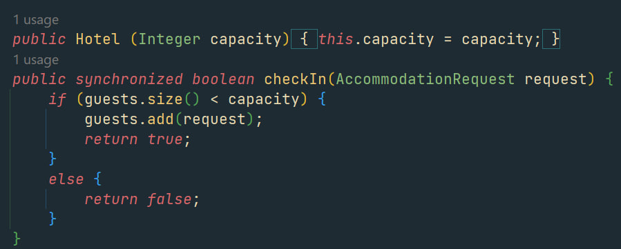

# Types in Java & Python

*Java makes you declare a value's type and checks it before running; Python figures it out as it goes. This one difference — static vs dynamic typing — shapes how each language feels and when your bugs appear.*

> Same three types last note — numbers, text, booleans — but Java and Python handle them in
> opposite ways, and this is the single biggest difference between the two languages you'll feel
> every day. Java demands you *declare* what kind each box holds and refuses to run if the kinds
> don't match. Python just watches what you put in and figures it out, complaining only if
> something goes wrong while running. That contrast — checked-early vs figured-out-as-you-go — has
> a name, real trade-offs, and a direct consequence for testing: it changes *when* your type bugs
> show up. Worth understanding properly, because it explains a lot of "why does Java nag me so
> much?" and "why did my Python only break in production?"

> **In real life**
>
> The two approaches are **a form with labelled boxes vs a blank notebook.** Java is the official
> form: every box is pre-labelled ("DATE — numbers only", "NAME — letters only"), and if you write
> letters in the numbers box, the form is rejected *before* it's processed. Python is the blank
> notebook: write anything anywhere, and nobody checks until someone actually tries to *use* what
> you wrote and finds it doesn't make sense. Java's way is called
> **static typing**: A language checks every value's type before the program runs (at compile time) and rejects mismatches early. Java is statically typed; you declare types and errors surface before running.;
> Python's is dynamic typing. Neither is "right" — the form catches mistakes early but is more
> work to fill in; the notebook is quick but lets errors hide until you hit them. This note is
> that trade, and why it matters to a tester.

## Declare-first (Java) vs figure-it-out (Python)

The difference shows up the instant you make a variable:

**Python (dynamic):** you don't say the type; Python infers it, and it can even change:
```python
x = 5          # Python sees a number
x = "hello"    # ...now x holds text. Python allows it -- x's type changed.
```

**Java (static):** you declare the type, and it's locked; the wrong kind is rejected:
```java
int x = 5;         // x is declared to hold whole numbers, forever
x = "hello";       // COMPILE ERROR -- Java refuses; x can only hold int
```

In Python, a variable is a label you can stick on any kind of value, swapping freely. In Java, a
variable is a typed box — once it's an `int` box, only whole numbers go in, and Java checks this
*before the program runs* and rejects the whole thing if you break the rule. That "before it runs"
is the crux, and the next section is why it matters.


*Screenshot: Java source code (Ilyaaaaa) — Wikimedia Commons, CC BY-SA 4.0. [Source](https://commons.wikimedia.org/wiki/File:Java_code_demonstrating_source-code_abilities.jpg)*
- **'Integer capacity' — the type is DECLARED** — Java writes the type (Integer) right before the name. This is static typing in one glance: you state, up front, that capacity holds a whole number. From now on Java KNOWS capacity is a number and will reject any attempt to put text in it — checked before the program ever runs. Python would just write 'capacity' with no type.
- **'boolean checkIn(...)' — return type declared too** — Not just variables — methods declare what type they hand back ('boolean' = true/false) and what types they take in. Java knows the type of EVERYTHING before running. That total knowledge is what lets the compiler catch type mistakes early, and it's why Java feels strict: nothing is left unstated.
- **'this.capacity = capacity' — locked to its type** — Once capacity is declared a whole number, it can only ever hold whole numbers. Assigning text here would be a compile error. The box is welded to its type. Python's boxes are never welded — the same name can hold a number now and text later, which is flexible and occasionally dangerous.
- **'return true;' — the type matches the declaration** — The method said it returns a boolean, and it returns true (a boolean). Java verifies this consistency before running — if a method declared 'boolean' but tried to return a number, Java rejects it at compile time. This constant early checking is the safety net static typing provides.
- **Every type here is checked BEFORE running** — The whole point: Java reads all these declared types and verifies they fit together during compilation — before a single line executes. A type mistake stops the build. Python has none of this pre-check; it only discovers a type problem if and when it actually runs the offending line. That timing difference is this note's core.

## The real difference: WHEN your type bugs appear

This is the part that matters for real work, and for testing. Because Java checks types before
running and Python checks them while running, the same mistake surfaces at completely different
times:

- **Java (static): mistakes caught at compile time — before the program ever runs.** Put text in a
  number box and Java refuses to build. You find the bug immediately, at your desk, before any user
  sees it. The cost: more upfront declaring, and the compiler nagging you.
- **Python (dynamic): mistakes caught at run time — only when that line actually executes.** Put text
  where a number is needed and Python happily runs until it *reaches* that line — which might be a rare
  branch that only triggers for one unlucky user, in production, on a Friday. The benefit: less
  ceremony, faster to write; the risk: type bugs can hide until exactly the wrong moment.

For a tester this is huge. In Python, a type bug in a code path your tests never exercised will sit
silent until a real user walks into it. So Python testing leans hard on actually *running* every
path (and tools that scan for type issues), because the language won't warn you. Java hands you a
category of bugs for free at compile time — but you still test everything else. Knowing *when* each
language reveals type errors tells you *where* to point your testing effort.

**The same type mistake, in two languages, at two different times — press Play**

1. **✍️ You write a type mistake** — In both languages you accidentally put text where a number belongs -- say, using a string '25' in a calculation. The mistake is identical. What differs is WHEN each language notices.
2. **☕ Java: caught at COMPILE time** — Before the program runs, Java's compiler checks every type, sees the mismatch, and refuses to build: 'incompatible types'. You get the error instantly, at your desk. It never runs, so no user ever hits it. The bug is caught the moment you try to build.
3. **🐍 Python: build? there is no build** — Python doesn't pre-check. It just starts running, top to bottom. The mistake sits there, undetected, as long as the program doesn't reach that line. Everything LOOKS fine -- it started up, other features work. The bug is hiding, not gone.
4. **💥 Python: caught at RUN time -- eventually** — The instant execution reaches the bad line -- which might be a rare feature, days later, for one user -- Python throws a TypeError and stops. Same bug as Java's, discovered much later and possibly in front of a real person. Timing is everything.
5. **🧪 The testing lesson** — Java gives you type bugs free at compile time; Python makes you FIND them by running every path. That's why Python projects test coverage hard and use type-checkers -- the language won't warn you. Knowing when each reveals type errors tells a tester where the risk lives.

*Try it — Python's dynamic typing: a variable that changes type (runs fine). Press Run.*

```python
# In Python, a variable is just a label -- it can hold any type, and change:
x = 5
print("x is", x, "-- a", type(x).__name__)     # int

x = "hello"
print("x is now", x, "-- a", type(x).__name__)  # str -- Python allowed the change!

x = True
print("x is now", x, "-- a", type(x).__name__)  # bool

# Python figured out the type each time, with no declaration. Flexible.
# The risk: a type mistake isn't caught until the line actually RUNS.
price = "40"                      # oops -- text, maybe from input
# The next line only fails IF and WHEN it runs:
try:
    total = price + 10            # str + int -> TypeError, at RUN time
except TypeError as e:
    print("Run-time error only reached here:", e)

print()
print("Python didn't warn us earlier -- it discovered the type bug while running.")
print("Java would have refused to compile the same mistake, before running at all.")
```

Here's the **Java side (static typing)** — it runs valid typed code, and the comment shows the line
Java would *reject at compile time*. That rejection-before-running is the whole point of static typing:

*Run it — the Java side (static typing catches the bug before it runs)*

```java
public class Main {
    public static void main(String[] args) {
        int x = 5;                 // x is declared int -- whole numbers only
        System.out.println("x is " + x);

        // x = "hello";            // UNCOMMENT this and Java REFUSES TO COMPILE:
        //                         "incompatible types: String cannot be converted to int"
        //                         The type bug is caught BEFORE the program runs.

        String name = "Priya";     // a String box -- text only
        boolean ok = true;         // a boolean box -- true/false only
        System.out.println(name + " / " + ok);

        // Because every type is declared and checked, Java catches mismatches
        // at compile time -- at your desk, not in production.
    }
}
```

> **Tip**
>
> If you write Python, get a type-checker — it hands you Java-style early warnings without leaving
> Python. Tools like `mypy` (and the type hints you can add, `age: int = 25`) scan your code and flag
> type mismatches *before* you run, catching the run-time surprises the language itself won't. Many
> professional Python teams and testers use exactly this, precisely because dynamic typing lets type
> bugs hide. It's the best of both: Python's flexibility while writing, plus a static check before
> shipping. If you take one practical thing from this note, it's that "Python is dynamically typed"
> doesn't have to mean "type bugs surprise me in production" — a checker closes that gap.

### Your first time: First time? Feel static vs dynamic for yourself

- [ ] Run the Python example above — Watch x hold a number, then text, then a boolean — all under one name, no complaints. That's dynamic typing: the variable's type follows whatever you put in it. Flexible, and Python didn't stop you.
- [ ] See the run-time-only error — Notice the price + 10 error only appeared when that line RAN — Python had no problem loading the program. Sit with that: the bug existed the whole time and was only discovered on execution. That's the risk of dynamic typing.
- [ ] Read the Java version's key comment — Find the commented 'x = "hello"' line and its note: Java would refuse to COMPILE it. Same mistake as Python's, but caught before running. That timing — compile time vs run time — is the entire difference, in one line.
- [ ] State which catches bugs earlier — Say it out loud: Java (static) catches type mistakes at compile time, before running; Python (dynamic) catches them at run time, only when the line executes. If you can say that, you understand static vs dynamic typing.
- [ ] Connect it to testing — Ask yourself: if Python won't warn me about a type bug in a rarely-run feature, how do I find it before a user does? Answer: run every path (tests) and/or use a type-checker. You just reasoned like a tester about a language design choice.

Ten minutes and the biggest Python-vs-Java difference — and its real consequence for when bugs
appear — is yours.

- **“Java won't compile — 'incompatible types: String cannot be converted to int'.”**
  Static typing catching a real mistake, exactly as designed: you tried to put text (a String) into a box declared for numbers (int), or pass the wrong type to a method. This is a GOOD failure — Java stopped you before running, at your desk. Fix: use the matching type ('String x' for text) or convert ('Integer.parseInt("5")' to make text into a number). Don't fight the error; it just saved you from a bug that would've reached a user in a dynamically-typed language.
- **“My Python program ran fine for ages, then suddenly threw a TypeError in production.”**
  The signature risk of dynamic typing: the type bug was there all along, but Python only discovered it when execution finally reached that line — a rare code path, an unusual input, a Friday. Nothing warned you earlier because Python doesn't pre-check types. Fix the immediate bug (usually a value that's the wrong kind, often unconverted input), then prevent the class of it: add a type-checker (mypy) and type hints, and make sure your tests actually run that path. This is precisely why Python testing emphasizes coverage.
- **“Why does Java make me declare types everywhere? Python doesn't and it's less typing.”**
  Because Java's declarations are what let it check types before running — the trade is more upfront writing in exchange for catching a whole category of bugs early (and better tooling/autocomplete, since the editor knows every type). Python trades that away for speed and flexibility while writing. Neither is wrong; they're different points on the same trade-off. As a tester you'll work with both and value each for what it gives: Java's early safety, Python's quick iteration.
- **“In Python I reused a variable name for a different type and got confusing bugs.”**
  Dynamic typing lets you do this — x can be a number then a string then a list — but just because you CAN doesn't mean you should. Reusing one name for different types across a program makes it hard to reason about and easy to hit a type mismatch. Good practice even in Python: let a variable hold one KIND of thing throughout, use clear names, and consider type hints to document intent. The flexibility is a tool, not a license for chaos.

### Where to check

Working across the two typing worlds:

- **Java: read the declared type** — `int`, `String`, `boolean` right before the name tells you exactly what a box or method holds/returns. The compiler enforces it, so it's trustworthy.
- **Python: check the actual type** — no declaration, so use `print(type(x))` or read what's been assigned. The type is whatever was last put in.
- **When does the bug appear?** Java: compile time (before running) — a failed build. Python: run time (only when the line executes) — a TypeError mid-run. This tells you where to look.
- **Python safety net** — add type hints (`age: int`) and run a type-checker (mypy) to get early, Java-style warnings without leaving Python. Highly recommended for anything important.
- **Testing implication** — Python won't warn about type bugs in un-run paths, so test coverage and type-checkers matter more; Java hands you compile-time type safety but you still test the logic.

### Worked example: the same bug, two languages, two very different days

A function is supposed to add a quantity (a number) to a running total, but somewhere a quantity
arrives as text. Watch how each language treats it:

1. **In Java, at the developer's desk (compile time):** the moment they write code that passes a
   `String` where an `int` is required, the compiler refuses: 'incompatible types'. The build fails.
   They fix it in thirty seconds, before lunch, and no user ever sees anything. The bug lived for
   less than a minute.
2. **In Python, the same mistake, weeks later (run time):** the code runs fine in every test and demo,
   because those never exercised the one branch where the text-quantity meets the number. It ships.
3. **Then a specific user triggers that branch** — an unusual order, a rare option — and Python hits
   `"3" + 40`, throws a TypeError, and the feature crashes for them, in production, unpredictably.
4. **The debugging is harder too:** the developer must reproduce the exact path, trace where the value
   became text (probably unconverted input), and only then fix it — versus Java's compiler pointing at
   the exact line instantly.
5. **What would have caught it in Python earlier:** a type-checker (mypy) scanning before running would
   have flagged the mismatch like Java's compiler; and a test that actually exercised that branch would
   have hit the TypeError in CI instead of production. Both are the standard answers to dynamic typing's
   gap.
6. **The lesson:** static vs dynamic typing isn't abstract — it decides whether a type bug costs you
   thirty seconds at your desk or a production incident. It's why Python teams lean on type-checkers and
   coverage, and why understanding *when* a language reveals type errors is genuinely a testing skill.

> **Common mistake**
>
> Thinking "Python has no types, so I don't need to worry about them." Python absolutely has types
> (numbers, strings, booleans, and more) — it just doesn't make you DECLARE them or check them before
> running. That's dynamic typing, not the absence of types, and the difference is dangerous to
> misunderstand: type bugs are just as real in Python, they simply stay hidden until a line runs, then
> surface as run-time TypeErrors — often later, in less convenient places, than Java's compile-time
> errors. Treating Python as "typeless" leads to sloppy code where a variable is a number here and text
> there and nobody's sure, until it breaks for a user. Respect Python's types even though it doesn't force
> you to: keep each variable to one kind, convert input deliberately, add type hints, and run a type-checker
> for anything that matters. Dynamic typing is flexibility, not permission to ignore types — and the
> programmers (and testers) who remember that ship far fewer 3 a.m. TypeErrors.

**Quiz.** You write code that puts text into a variable meant for numbers. When is this mistake caught in Java vs Python?

- [ ] Both catch it at exactly the same time
- [x] Java catches it at compile time (before the program runs); Python catches it at run time (only when that line actually executes) — so Python's can hide until a user hits it
- [ ] Neither language catches type mistakes
- [ ] Python catches it earlier than Java

*This is the heart of static vs dynamic typing. Java is statically typed: it checks all declared types during compilation and rejects a String-into-int mistake BEFORE the program runs — you see it at your desk, instantly. Python is dynamically typed: it doesn't pre-check, so the same mistake sits undetected until execution actually reaches that line, then throws a run-time TypeError — which might be days later, in a rare code path, in production. Neither is typeless (both have types), and Python catches it later, not earlier. This timing difference is why Python projects rely on type-checkers (mypy) and thorough test coverage to surface type bugs early, and it's a genuine consideration when deciding where to focus testing.*

- **Static typing (Java)** — You declare each value's type (int x = 5;) and the language checks all types BEFORE running (compile time), rejecting mismatches. Catches type bugs early, at your desk.
- **Dynamic typing (Python)** — You don't declare types; the language infers them and only checks WHILE running (run time). A variable can even change type. Flexible, but type bugs hide until the line executes.
- **The core difference: WHEN** — Java catches type mistakes at compile time (before running); Python at run time (only when that line runs). Same bug, discovered at very different moments.
- **Why it matters for testing** — Python won't warn about type bugs in un-run paths, so they can reach production. Test coverage and type-checkers matter more; Java gives compile-time type safety for free.
- **Python type-checker** — Tools like mypy + type hints (age: int) give Python early, Java-style type warnings before running — closing dynamic typing's gap. Standard on serious Python projects.
- **'Python has no types' is wrong** — Python HAS types; it just doesn't declare or pre-check them. Type bugs are real, they just surface later as run-time TypeErrors. Respect types even when not forced to.

### Challenge

Prove the timing difference to yourself. (1) Run the Python example and confirm x changed type freely, and
that the price + 10 error only appeared when that line RAN. (2) In the Java block, mentally uncomment the
'x = "hello"' line and state what happens (compile error, before running). (3) Write one sentence each for
static and dynamic typing, mentioning WHEN each catches a type bug. (4) Answer as a tester: if Python won't
warn you about a type bug in a rarely-used feature, what two things find it before a user does? (Coverage
that runs the path; a type-checker.) If your answers pin the difference to compile-time vs run-time, you've
understood the deepest and most practical contrast between your two languages.

### Ask the community

> Typing question: in [Java/Python] I hit [a compile error / a run-time TypeError / confusion about declaring types]. The value involved is [what], declared/inferred as [type], and the error was [paste it]. What's the right way to handle types here?

Say whether the error appeared at COMPILE time (Java, before running) or RUN time (Python, mid-execution) —
that single fact frames the whole answer, because it's the defining difference between how the two languages
handle types.

- [Real Python — type checking & hints (mypy)](https://realpython.com/python-type-checking/)
- [GeeksforGeeks — static vs dynamic typing](https://www.geeksforgeeks.org/blogs/static-vs-dynamic-typing/)
- [Python vs Java — typing and the differences](https://www.youtube.com/watch?v=EjCsowTW420)

🎬 [Python vs Java — typing and where they differ](https://www.youtube.com/watch?v=EjCsowTW420) (8 min)

- Java is statically typed: you declare each type and it's checked before the program runs (compile time), so type mismatches are caught early, at your desk.
- Python is dynamically typed: types are inferred and only checked while running (run time); a variable can even change type. Flexible, but type bugs hide until the line executes.
- The core difference is WHEN a type bug appears — Java before running, Python only when the bad line runs — which can mean production, for one unlucky user, much later.
- For testing, dynamic typing means type bugs in un-run paths stay silent, so coverage and type-checkers (mypy + hints) matter more; Java hands you compile-time type safety.
- 'Python has no types' is a dangerous myth — it has types, it just doesn't force you to declare or pre-check them. Respect types even when not required to.


---
_Source: `packages/curriculum/content/notes/programming-basics/variables-and-data-types/types-in-java-and-python.mdx`_
