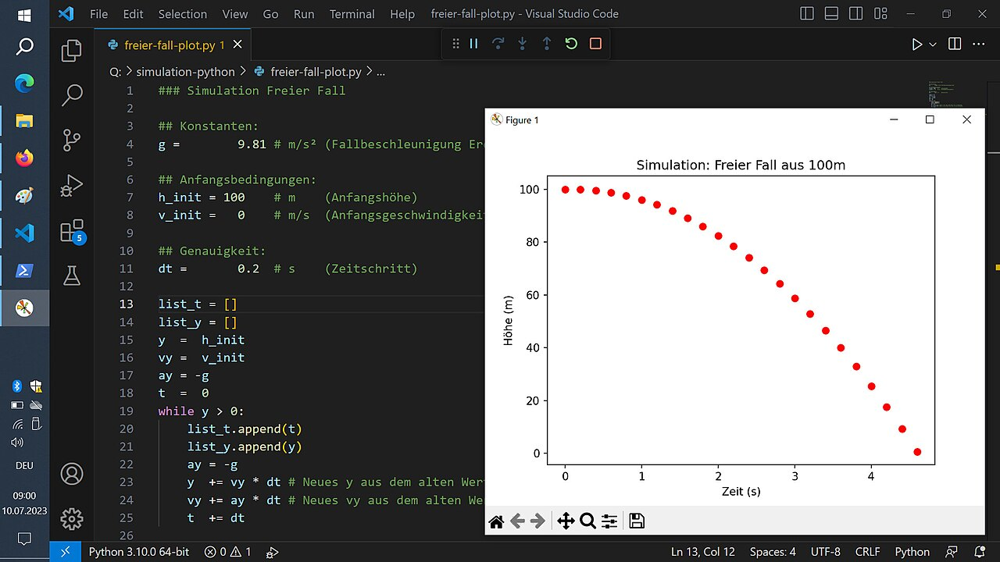

# Variables

*A variable is a named box that holds a value your program can use and change later. The single most-used idea in all of programming — here's what it is, how to make one, and the mistakes beginners hit.*

> If code is instructions, variables are its memory. Almost every useful program needs to
> *remember* things — a total, a name, a score, whether the user is logged in — and change
> them as it runs. A variable is how it remembers: a named box you put a value into and can
> open, use, and refill later. You already met a few in the last chapter without us naming
> them (`a = 5`). This note names the idea properly, because you will write variables in
> literally every program you ever make. Master this one small thing and a surprising amount
> of programming suddenly reads like plain sense.

> **In real life**
>
> A variable is a **labelled box.** You write a name on the box ("price"), put something inside
> (the number 100), and from then on you can refer to it by its label instead of remembering
> the contents: "give me what's in the price box." Later you can open the box and swap the
> contents for something else — the label stays the same, the value changes. That's the whole
> idea. A **variable**: A named container that holds a value in a program. You give it a name, assign it a value with =, and can read or change that value later. The most-used building block in programming.
> is that labelled box: a name your program uses to store and retrieve a value. Programs are
> mostly boxes with labels, having their contents shuffled around in a careful order.

## Making a variable: name, equals, value

Creating one is a single line, and it has three parts — the same in Python and Java:

**Python:**
```python
price = 100
```

**Java:**
```java
int price = 100;
```

Read it right-to-left in meaning: take the value `100`, and store it in a box labelled
`price`. The `=` is the crucial, slightly-confusing part: in programming it does **not**
mean "is equal to" (that's a comparison, later). It means **"put the value on the right into
the box named on the left."** It's an arrow, not a scale: `price = 100` means `price ← 100`.
(Java adds `int` to declare the box will hold a whole number, and a semicolon to end the
statement — the ceremony from the last chapter. Python figures out the type itself.)

Once the box exists, you use its label anywhere you'd use the value:

```python
price = 100
tax = 20
total = price + tax          # use the two boxes; store the result in a new box
print("Total is:", total)    # -> Total is: 120
```


*Screenshot: Python in an editor (MikeRun) — Wikimedia Commons, CC BY-SA 4.0. [Source](https://commons.wikimedia.org/wiki/File:Screen-python-code-matplotlib-physics-simulation.jpg)*
- **'g = 9.81' — a variable being created** — A name on the left (g), an equals sign, a value on the right (9.81). This line makes a box labelled g and puts 9.81 in it. From here on, writing g anywhere means 'the value in the g box'. This is the exact pattern of every variable you'll ever create: name = value.
- **'h_init = 100' — YOU choose the name** — The programmer named this box 'h_init' (initial height). You pick names that describe what the box holds, so the code reads clearly. 'h_init' is more helpful than 'x'. Good variable names are a real skill — there's a whole note on naming coming up.
- **'y = h_init' — a box filled from another box** — The value on the right can itself be a variable: this copies whatever is in h_init into a new box called y. The computer looks up h_init's value (100) and stores it in y. Variables can be built from other variables — which is how programs compute step by step.
- **Order matters — create before you use** — A box must be filled before you can read it. If a line used 'y' before the line 'y = h_init' ran, the program would error ('y is not defined'). Variables follow the top-to-bottom rule from the first note: you can't open a box you haven't put anything in yet.
- **'y += vy * dt' — the value CHANGES** — This is why they're called VARIABLES — the value varies. '+=' means 'add to what's already in the box': take y's current value, add vy*dt, and store the result back in y. The label stays 'y'; the contents update. Boxes whose contents change over time are what let programs count, accumulate, and simulate.
- **'list_t = []' — boxes hold more than numbers** — A variable can hold text, a true/false, or even a whole list (that's what the empty brackets start here). The box doesn't care what kind of value it holds — the next note covers the different KINDS of values. For now: a variable can store just about anything, under a name you chose.

## Variables change — that's the whole point

The word *variable* is a promise: the value can vary. You can put a new value in the same box
at any time, and the old one is simply replaced:

```python
score = 0            # box 'score' holds 0
score = 10           # now it holds 10 (the 0 is gone)
score = score + 5    # read score (10), add 5, put 15 back in score
print(score)         # -> 15
```

That third line trips up every beginner, and it's worth staring at: `score = score + 5` looks
like nonsense as maths ("score equals score plus 5"?!), but as an *arrow* it's simple: **take
whatever is currently in score, add 5, and put the result back into score.** The right side is
calculated first (using the old value), then stored in the box on the left. This "read the box,
change it, put it back" pattern is how programs count, total things up, and keep running tallies —
you'll write it constantly.

**A variable's life: create, use, change — press Play**

1. **📦 Create: 'score = 0'** — A box labelled 'score' comes into existence with the value 0 inside. The name goes on the left of the equals, the starting value on the right. The box now exists and holds 0. Nothing is printed — creating a variable is silent.
2. **👀 Use: 'print(score)'** — You refer to the box by its label. The computer looks inside, finds 0, and uses it — here, prints it. Using a variable NEVER empties or changes it; you're just reading what's in the box. You can read it as many times as you like.
3. **🔄 Change: 'score = 10'** — Put a new value in the same box. The old value (0) is replaced by 10 — gone, overwritten. The label 'score' is unchanged; only the contents differ. This is the 'variable' in action: same name, new value.
4. **➕ Update using itself: 'score = score + 5'** — The tricky, powerful one. The right side runs first: read score's CURRENT value (10), add 5, get 15. THEN store 15 back into score. It's an arrow (score ← 15), not an equation. This 'read-modify-write' is how tallies and counters work.
5. **🎯 The box now holds 15** — Through create → use → change → update, one box carried a value that evolved as the program ran. That evolving memory is what makes programs more than fixed lists of output. Variables are how code remembers and updates — the beating heart of almost every program.

*Try it — create, use, and change variables (Python). Press Run.*

```python
# Create some boxes (variables) and put values in them:
name = "Priya"
age = 25
price = 100

# Use them by their names:
print(name, "is", age, "years old.")

# Change a value -- the old one is replaced:
age = 26
print("After a birthday,", name, "is", age)

# Update a variable using its OWN current value (read, change, put back):
price = price + 50        # read 100, add 50, store 150 back in price
print("Price after increase:", price)

# A running total -- the classic use of a changing variable:
total = 0
total = total + 10        # 10
total = total + 20        # 30
total = total + 5         # 35
print("Running total:", total)

print()
print("Same three boxes, values shuffled around in order. That's most of programming.")
```

Here is the **same idea in Java** — identical logic, with types declared and semicolons. Notice
`price = price + 50` works exactly the same way (arrow, not equation), and Java's `int` just
promises each box holds a whole number:

```java
public class Main {
    public static void main(String[] args) {
        String name = "Priya";
        int age = 25;
        int price = 100;

        System.out.println(name + " is " + age + " years old.");

        age = 26;                       // change: replace the value
        price = price + 50;             // update using its own value: 100 + 50 = 150
        System.out.println("Price after increase: " + price);
    }
}
```

> **Tip**
>
> Read `=` as a left-pointing arrow, always: `x = 5` is "x ← 5" ("put 5 into x"), never "x equals 5".
> This one mental switch clears up the single most common beginner confusion. When you later meet
> `==` (double equals), THAT is the one that asks "are these equal?" — a question, used in decisions.
> Single `=` stores; double `==` compares. Beginners mix them up for a week and then never again. Say
> it now: single equals is an arrow that fills a box; double equals asks a question.

### Your first time: First time? Make boxes and move values around

- [ ] Run the Python example above — Watch the variables get created, used, and changed. Follow each print and confirm the value is what you'd expect from the lines above it. You're tracing the contents of boxes as the program runs — the core skill.
- [ ] Create your own variable — Add a line like 'city = "Kathmandu"' and then 'print("I live in", city)'. Run it. You made a box, labelled it city, filled it with text, and read it back. That's a variable, start to finish.
- [ ] Change a value and re-print — Set a variable, print it, then set it to something new and print again. See the SAME name show a DIFFERENT value. That's the 'variable' promise made concrete — the value varied.
- [ ] Build a running total — Start 'count = 0', then add to it a few times ('count = count + 1'), printing after each. Watch it climb. You just wrote a counter — one of the most common patterns in all of programming.
- [ ] Trigger the 'not defined' error — Try to print a variable you never created ('print(mystery)'). You'll get an error — you can't read a box you never filled. Now define it above and re-run. Order matters: create before use.

Ten minutes and you've created, read, changed, and accumulated variables — the operations behind
nearly every program ever written.

- **“I get 'NameError: name X is not defined' (or Java: 'cannot find symbol').”**
  You're trying to use a variable that was never created, or created below where you're using it. Boxes must be filled before they're read. Check: did you spell the name exactly the same (variables are case-sensitive — 'Price' and 'price' are DIFFERENT boxes)? Did the line creating it run before the line using it? This is one of the most common beginner errors and almost always a typo in the name or an order problem.
- **“'score = score + 5' looks like it should be impossible — how can score equal score plus 5?”**
  Because '=' isn't 'equals' — it's an arrow. The right side is calculated FIRST using the current value, then the result is stored back in the box. So if score holds 10, 'score = score + 5' computes 10 + 5 = 15, then puts 15 into score. Read every '=' as '←' (put-into) and it stops looking paradoxical. This is THE conceptual hurdle of variables; once it clicks, it stays clicked.
- **“My variable has the old value even though I changed it.”**
  Usually an order problem: you printed (or used) the variable BEFORE the line that changed it ran, since code runs top to bottom. Trace it line by line: at the exact point you read the variable, what was the last value put into it? Also check you didn't accidentally create a second box with a slightly different name (a typo), leaving the original unchanged. The computer is literal — it shows the value that was actually in the box at that moment.
- **“In Java it won't let me put text in a variable I made for numbers.”**
  That's Java's type system doing its job — you declared 'int price' (a whole-number box), so it refuses to hold text ('int price = "hello"' is an error). Python would allow it (it doesn't lock a box to one kind of value), which is the flexibility-vs-safety trade from the last chapter. In Java, use the right type of box for the value: 'String' for text, 'int' for whole numbers. The next note is all about these kinds.

### Where to check

When a variable misbehaves:

- **Was it created before it was used?** Code runs top to bottom; you can't read a box you haven't filled. 'Not defined' errors are almost always this or a typo.
- **Exact spelling and case** — 'total', 'Total', and 'totl' are three different boxes. Variables are case-sensitive; a typo silently makes a NEW box.
- **Read `=` as an arrow** — 'x = x + 1' means 'put (current x plus 1) into x'. The right side runs first with the old value, then stores into the left.
- **Trace the value at the point of use** — at the exact line you read the variable, what was the last thing stored in it? The computer shows what's actually in the box then.
- **(Java) the right type of box** — 'int' holds whole numbers, 'String' holds text. Putting the wrong kind in errors; Python is looser here (next note).

### Worked example: tracing a shopping cart total, box by box

Here's a tiny cart program. Let's trace every variable's contents as it runs — the essential skill:

```python
total = 0
apple = 30
bread = 25

total = total + apple      # add the apple
total = total + bread       # add the bread
discount = 10
total = total - discount    # apply a discount
print("You pay:", total)
```

1. **`total = 0`** → box `total` holds 0.
2. **`apple = 30`** → box `apple` holds 30. **`bread = 25`** → box `bread` holds 25. Three boxes now.
3. **`total = total + apple`** → right side first: current total (0) + apple (30) = 30. Store 30 back
   in total. Box `total` now holds 30.
4. **`total = total + bread`** → 30 + 25 = 55. Store 55 in total. Now total holds 55.
5. **`discount = 10`** → new box holds 10. **`total = total - discount`** → 55 − 10 = 45. total now holds 45.
6. **`print("You pay:", total)`** → reads total (45) and shows: `You pay: 45`.
7. **The skill you just used:** at every line, you tracked what was in each box. When a program does
   the wrong thing, this is exactly how you find the bug — trace the variables and find the line where a
   box got a value you didn't expect. Testers and programmers do this constantly; it's called tracing,
   and variables are what you're tracing.

> **Common mistake**
>
> Reading `=` as "equals" instead of "gets" (put-into). This one misreading is behind most early
> confusion with variables. `total = total + 10` is not a false equation — it's an instruction: compute
> the right side using the current value, then store the result in the box on the left. If you keep hearing
> "total EQUALS total plus 10" your brain rejects it; if you hear "total GETS total-plus-10" (an arrow, `←`),
> it's obvious. The equals sign was a poor choice of symbol decades ago and we're stuck with it, so do the
> translation in your head: single `=` means "store into", and the thing being stored (the right side) is
> worked out first. Get this one habit and variables stop being mysterious. (Later, `==` will be the symbol
> that actually asks "are these equal?" — a completely different job.)

**Quiz.** After these lines run, what does 'count' hold?  count = 5   /   count = count + 3   /   count = count * 2

- [ ] 5 — the first value wins
- [x] 16 — read 5, add 3 to get 8, then multiply by 2 to get 16
- [ ] 10 — 5 times 2
- [ ] It's an error — you can't set count using count

*Trace it as arrows, top to bottom. 'count = 5' puts 5 in the box. 'count = count + 3' reads the current value (5), adds 3 → 8, stores 8 back. 'count = count * 2' reads the current value (8), multiplies by 2 → 16, stores 16. So count holds 16. It's not the first value (variables change), not 10 (that would ignore the +3 step), and definitely not an error — setting a variable using its own current value is one of the most common and useful things you'll do (counters, totals). The key is that each line runs in order and each '=' stores the freshly-computed right side into the box.*

- **Variable** — A named box that holds a value. You create it with name = value, read it by its name, and can change its value later. The most-used building block in programming.
- **= means 'put into', not 'equals'** — 'x = 5' is an arrow: put 5 into the box x (x ← 5). The right side is computed first, then stored in the left. Later, '==' is the one that asks 'are these equal?'.
- **x = x + 1 (read-modify-write)** — Read the current value of x, add 1, store the result back in x. Not a paradox — an instruction. This pattern powers counters and running totals.
- **Create before you use** — A box must be filled before it's read (code runs top to bottom). Using a variable before it's defined gives a 'not defined' error. Order matters.
- **Case-sensitive names** — 'total', 'Total', and 'totl' are three DIFFERENT variables. A typo silently creates a new box instead of updating the one you meant — a common, sneaky bug.
- **Python vs Java variables** — Python: 'price = 100' (type inferred, no semicolon). Java: 'int price = 100;' (declare the type, end with semicolon). Same idea, Java's ceremony.

### Challenge

Trace and build. (1) Run the shopping-cart example and predict `total` at each step before checking. (2)
Write your own three variables (a name, an age, a favorite number) and print a sentence using all three.
(3) Make a counter: start at 0 and add 1 four times, printing after each — watch it climb 0→1→2→3→4. (4)
Deliberately cause a 'not defined' error by using a variable before creating it, read the message, then fix
the order. Write one sentence explaining, in your own words, why `x = x + 1` is not a contradiction. If your
sentence uses the word 'arrow' or 'put into', you've mastered the one idea that makes variables click.

### Ask the community

> Variables question: I wrote [paste code], expected [variable] to be [X] but it was [Y]. I'm using [Python/Java]. I think the issue is around line [N] where [what you tried]. What's happening?

Trace the variable yourself first and include what value you think it holds at each line — 'I expected total
to be 45 but it printed 30' plus your line-by-line guess makes the bug obvious, because variable bugs are
almost always one line where a box got an unexpected value.

- [LearnPython — variables (interactive)](https://www.learnpython.org/en/Variables_and_Types)
- [GCFGlobal — core programming concepts](https://edu.gcfglobal.org/en/computer-science/programming-concepts/1/)
- [Python variables explained — Programming with Mosh](https://www.youtube.com/watch?v=cQT33yu9pY8)

🎬 [Variables in Python, explained](https://www.youtube.com/watch?v=cQT33yu9pY8) (6 min)

- A variable is a named box that holds a value: create it with name = value, read it by its name, change it whenever you like. It's how programs remember.
- The '=' sign means 'put the right-hand value into the left-hand box' (an arrow, ←), NOT 'is equal to'. Reading it that way clears up the main beginner confusion.
- 'x = x + 1' reads the box's current value, changes it, and stores the result back — the read-modify-write pattern behind counters and running totals.
- Variables must be created before use (code runs top to bottom), and names are case-sensitive — a typo silently makes a new box.
- Python infers the box's type (price = 100); Java declares it (int price = 100;). Same idea, different ceremony — and Java's types are the next note.


---
_Source: `packages/curriculum/content/notes/programming-basics/variables-and-data-types/variables.mdx`_
