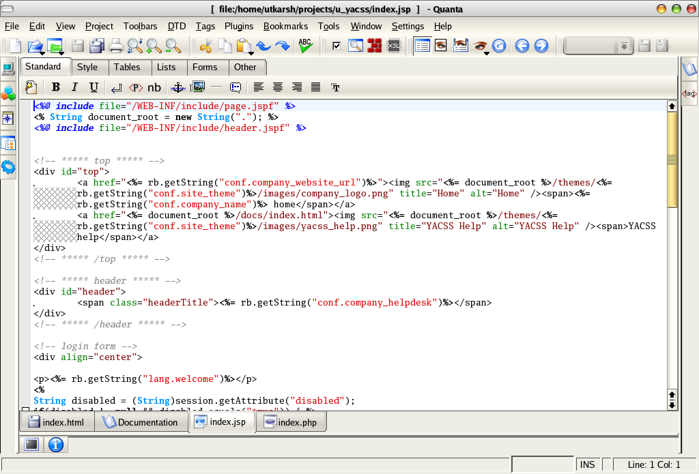

# Languages overview

*Why there are hundreds of programming languages, what actually differs between them, and why they're more like dialects than foreign tongues. A beginner's map — and where Python and Java sit on it.*

> Beginners hit an early, discouraging wall: there are *hundreds* of programming languages,
> everyone online argues about which is best, and it feels like you have to pick right or waste
> years. Good news, and it's the whole point of this note: they're not hundreds of unrelated
> foreign languages you'd have to learn from scratch. They're dialects of the same handful of
> ideas. Learn to think in one, and the next comes far faster — because you're not relearning
> programming, just its spelling. Let's map the landscape so it stops looking like a wall and
> starts looking like a choice that barely matters at the start.

> **In real life**
>
> Programming languages are **dialects and accents, not different species.** Someone who speaks
> one dialect of a language can understand another with a little effort — the grammar rhymes,
> the ideas transfer, only the pronunciation and a few words change. Programming is the same:
> "remember a value", "repeat this", "if this then that" exist in *every* language; what changes
> is how you spell them. A **programming language**: A specific set of words, symbols, and rules for writing instructions a computer can run. Each has its own 'spelling' (syntax) but they share the same underlying ideas.
> is one such dialect. So the terrifying 'which of 500 languages do I learn?' is really 'which
> accent do I start with?' — and for a beginner, almost any reasonable choice is fine, because
> the thinking transfers.

## Why there are so many (and why it's fine)

Languages multiplied for sensible reasons: different jobs, different eras, different trade-offs.
A few you'll hear about, in plain terms:

- **Python** — reads almost like English, forgiving, hugely popular for beginners, data, automation,
  and testing. One of the two this track teaches. Famous for being easy to start.
- **Java** — more formal and structured, runs almost everywhere, dominant in big companies and
  Android apps. The other language this track teaches. Famous for being everywhere and for
  making you spell things out fully.
- **JavaScript** — the language of web pages; it runs in your browser and makes sites interactive.
  (Confusingly, it is NOT related to Java despite the name — a historical accident.)
- **C / C++** — older, fast, low-level; powers operating systems, games, and things that must be
  quick. More demanding; you manage more details yourself.
- **and many more** — SQL for databases, Swift for iPhones, Go, Rust, and so on. Each earned its
  place solving something.

The reassuring truth: you do not choose "correctly" and you are not locked in. Programmers routinely
use several languages across a career, picking up new ones in weeks once they understand the shared
ideas. Your first language is just where you learn to *think* in code — and this track picked Python
and Java deliberately, for reasons the next note explains.


*Screenshot: Quanta Plus code editor — Wikimedia Commons, GPL. [Source](https://commons.wikimedia.org/wiki/File:QuantaPlus.png)*
- **Syntax — a language's spelling and grammar** — Every language has its own rules for how instructions are written: where the brackets go, how you end a line, what words mean what. That's SYNTAX. Different languages have different syntax — the same idea, spelled differently — which is most of what 'learning a new language' actually involves once you can already think in code.
- **Colored words — the editor helping you read** — The colors (syntax highlighting) aren't part of the code — the editor adds them to show the ROLE of each part: keywords one color, text another, comments another. It's a reading aid, and every editor does it. When you glance at code and instantly see the structure, this coloring is doing the work.
- **Tabs — different files, often different languages** — These tabs show separate files, and real projects mix languages — one file might be one language, another file another, each doing the job it's best at. You don't pick ONE language for life; you use the right one for each part. Multi-language projects are the norm, not the exception.
- **The editor — a tool for any language** — This program is just where you type code — like a word processor built for programmers, with line numbers, coloring, and error-flagging. The same editor can write Python, Java, and more. The editor is the kitchen; the language is the recipe's dialect. Don't confuse the tool with the language.
- **It's still just instructions** — Strip away the coloring and syntax and every language here is doing the same fundamental thing from the last note: instructions, run in order, to produce a result. The vocabulary differs; the nature of code does not. That shared core is why skills transfer between languages.

## Compiled vs interpreted — the one difference worth knowing early

You'll hear languages called "compiled" or "interpreted." It sounds technical; the idea is simple,
and it's the main reason Python and Java *feel* different to use:

- **Interpreted (like Python):** a program reads your code and runs it directly, line by line, right
  now. Write a line, run it, see the result immediately. Fast to experiment, forgiving, great for
  learning — which is why the runnable examples in this track are Python.
- **Compiled (like Java):** your code is first translated, all at once, into a form the machine runs
  — a step called compiling — and *then* it runs. Slightly more ceremony up front (you compile, then
  run), in exchange for speed and catching some mistakes before the program ever runs.

That's the honest core of the distinction. You don't need more than this yet: Python runs your words
more or less immediately; Java translates them first, then runs. Both end up doing the same thing —
following your instructions — they just take a slightly different path to get there. The next note
compares them head-to-head for a beginner.

**Two paths from code to running — interpreted vs compiled — press Play**

1. **⌨️ You write the same code** — Either way, you start by typing instructions as plain text — the recipe. At this point Python and Java look equally inert: just words in a file. The difference is entirely in what happens NEXT to turn those words into actions.
2. **🐍 Python: interpreter reads & runs it directly** — The interpreted path (Python). A program called the interpreter reads your code and carries out each line right away, top to bottom. No separate build step — write a line, run, see the result. That immediacy is why Python feels fast to learn and experiment with.
3. **☕ Java: compiler translates it ALL first** — The compiled path (Java). A program called the compiler translates your entire file at once into a machine-ready form — and while doing so, catches some mistakes before anything runs. This is the extra up-front step: you compile, THEN you have something to run.
4. **▶️ …then Java runs the translated version** — Only after compiling does the program actually execute. So Java is a two-step trip (translate, then run) versus Python's one step (just run). More ceremony now, in exchange for speed and some errors caught early. Same destination, different route.
5. **🎯 Both arrive at the same place: your instructions run** — Interpreted or compiled, the end result is identical — the computer follows your instructions and produces output. The path differs; the nature of code does not. Knowing which path a language takes just tells you how it will FEEL to write and run.

*Try it — the SAME idea, and how a language reads almost like English (Python)*

```python
# Python is famous for reading close to plain English. Watch:

languages = ["Python", "Java", "JavaScript", "C", "Go"]

print("There are hundreds of programming languages. A few you'll hear about:")
for name in languages:
    print("  -", name)

print()
print("But here is the secret this note is about:")
print("they all share the same ideas -- remember a value, repeat, decide.")
print("This little program just 'repeated' (the for-loop) over", len(languages), "names.")
print("Every language can do that. Only the spelling changes.")
```

Here's that same "list some names and print each one" idea in **Java** — notice it expresses the
identical logic (a list, a loop, printing each item) with more structure and different spelling:

```java
import java.util.List;

public class Main {
    public static void main(String[] args) {
        List<String> languages = List.of("Python", "Java", "JavaScript", "C", "Go");

        System.out.println("A few programming languages:");
        for (String name : languages) {
            System.out.println("  - " + name);
        }
        System.out.println("Same idea as Python: a list, a loop, printing each item.");
    }
}
```

Look past the punctuation and the two are the same thought: *make a list, go through it, print each
one.* Python needs no wrapping and reads almost like a sentence; Java wraps it in a `class` and
`main` and spells out the types (`List`). Different accents, one idea. Once you can see that,
new languages stop being scary — you're just learning where THIS one puts its brackets.

> **Tip**
>
> Don't agonize over "which language should I learn first" — it's the most over-argued, least important
> early decision. The thinking transfers, so any reasonable first language is a good first language, and
> this track chose two solid ones for you (Python and Java). Spend the energy you'd waste comparing
> languages on actually writing a little code in ONE of them. A beginner who's written a hundred lines
> of Python is far ahead of one who's read a hundred forum arguments about Python vs everything else.
> Pick the one in front of you and start; you'll meet the others soon enough, and faster than you expect.

### Your first time: First time? Get oriented without overwhelm

- [ ] Run the Python example above — Watch it loop over the language names. Notice how close to English it reads — 'for name in languages, print name'. That readability is why Python is a favorite first language.
- [ ] Read the Java version beside it — Don't run it yet. Find the same three ideas: the list, the loop, the print. See that it's the same thought with more scaffolding. Recognizing the shared idea across two spellings is the whole skill of this note.
- [ ] Notice syntax highlighting — In any code you look at, see how the editor colors keywords, text, and comments differently. That coloring is a reading aid you'll come to rely on — it shows structure at a glance, in any language.
- [ ] Resist the 'best language' rabbit hole — If you catch yourself googling 'is Python better than Java', stop — it's a trap that replaces doing with debating. Both are excellent; this track uses both. The best language to learn is the one you'll actually practice.
- [ ] Name the one real difference you learned — Interpreted (Python: runs your lines more or less immediately) vs compiled (Java: translates first, then runs). If you can say that, you understand the main way your two languages will FEEL different to use.

Ten minutes and the intimidating wall of 'hundreds of languages' becomes a simple map: dialects of
shared ideas, and you're learning two good ones.

- **“Everyone online says a DIFFERENT language is the one I must learn. Who's right?”**
  Nobody and everybody — it's the most over-argued question in programming, and the honest answer is that for a beginner it barely matters. The core ideas transfer, so the 'best first language' is mostly the one you'll stick with. This track chose Python (gentle, readable) and Java (structured, everywhere) for good reasons; trust that and start. You can and will learn others later, faster than the first. The forum arguments are people defending their own choices, not universal truth.
- **“I copied JavaScript code into a Python file (or vice versa) and it errored everywhere.”**
  Expected — each language only understands ITS OWN syntax. Python can't run Java, Java can't run JavaScript; they're different dialects with different rules and different programs that run them. Make sure the code matches the language of the file and the tool running it. This is a genuinely common beginner mix-up, and the fix is simply: one language per file, and run it with that language's tool.
- **“Is JavaScript just Java for the web? The names are almost the same.”**
  No, and this trips up nearly everyone — they are UNRELATED languages that happen to share a name for historical marketing reasons (JavaScript was named to ride Java's popularity in the 1990s). Java and JavaScript are as different as 'car' and 'carpet'. Java is this track's structured, compiled language; JavaScript is the browser's language. Don't assume knowing one teaches you the other. The naming is a decades-old accident, not a relationship.
- **“Do I have to learn all these languages to get a job?”**
  No. Most roles need one or two languages well, plus the ability to pick up others as needed — which is easy once you can think in code. Depth in one beats a shallow tour of ten. For QA/testing specifically, Python and Java (this track's two) plus some SQL cover a huge amount of the field. Learn to program properly in one language; the rest become 'learn the new spelling', not 'learn programming again'.

### Where to check

Getting oriented among languages, as a beginner:

- **Is it a dialect or a whole new thing?** Almost always a dialect — the ideas (remember, repeat, decide) transfer. Look for those familiar ideas under the unfamiliar syntax.
- **Interpreted or compiled?** Does it run your lines directly (Python-like, immediate) or translate first then run (Java-like)? This shapes how it feels to use.
- **What's it FOR?** Web page interactivity (JavaScript), data/automation/testing (Python), big structured apps and Android (Java), speed and systems (C/C++). Fit the tool to the job.
- **Right language for the file/tool?** Code only runs in its own language's tool; mixing them errors. One language per file.
- **Don't over-optimize the first choice** — the thinking transfers, so start with the one in front of you and actually write some.

### Worked example: one idea, three dialects — seeing the shared skeleton

Here's the SAME instruction — 'print a greeting three times' — in three languages. Read them as
three accents of one sentence, not three things to learn:

**Python** (interpreted, minimal):
```python
for i in range(3):
    print("Hello!")
```

**Java** (compiled, structured):
```java
for (int i = 0; i < 3; i++) {
    System.out.println("Hello!");
}
```

**JavaScript** (the browser's language):
```javascript
for (let i = 0; i < 3; i++) {
    console.log("Hello!");
}
```

1. **All three do the identical thing:** repeat a step three times, printing "Hello!" each time. Run
   any of them and you get three lines of Hello.
2. **The IDEA is one:** a loop that counts to three and prints inside. If you understand that sentence,
   you understand all three — you're just reading three spellings of it.
3. **The differences are cosmetic to a beginner:** Python uses `range(3)` and indentation; Java and
   JavaScript use `(i = 0; i < 3; i++)` and curly braces; Python says `print`, Java `System.out.println`,
   JavaScript `console.log`. Punctuation and vocabulary — not different concepts.
4. **This is why the second language is easy.** Learn what a loop IS, once, in Python, and reading the
   Java or JavaScript loop is just 'oh, that's how THEY spell a loop'. You're never relearning loops —
   only their accent.
5. **The takeaway:** the wall of 'hundreds of languages' is an illusion created by focusing on spelling.
   Focus on the shared ideas, and the languages line up as dialects. Learn to think in code once; collect
   the accents as you need them.

> **Common mistake**
>
> Language-shopping instead of learning — spending weeks comparing languages, reading 'X vs Y' articles,
> and switching your 'first language' repeatedly, all without writing much actual code. It feels like
> progress and it's the opposite: you learn to program by programming, in ONE language, long enough to
> internalize the shared ideas. The specific first language matters far less than sticking with it past
> the awkward beginning. Every hour spent deciding is an hour not spent doing, and the ideas you'd gain by
> doing are exactly the ones that make the 'which language' question stop mattering. This track removed the
> decision for you on purpose — Python and Java, both excellent — precisely so you can skip the shopping
> and start. Commit to the one in front of you and write code; the perfect-first-language hunt is a
> procrastination trap wearing a productive costume.

**Quiz.** You've learned to write loops and make decisions in Python. How much of that transfers when you start Java?

- [ ] Almost none — Java is a completely different, unrelated skill
- [x] Most of it — the underlying ideas (loops, decisions, remembering values) are the same; you mainly learn Java's different syntax for expressing them
- [ ] Only the print statements transfer
- [ ] You have to forget Python before you can learn Java

*Programming languages are dialects of shared ideas, so the thinking transfers and only the spelling changes. Once you understand what a loop IS and what a decision IS in Python, learning Java is largely learning where Java puts its brackets and semicolons to express the same concepts — 'oh, that's how they spell a loop'. That's exactly why a second language comes far faster than the first: you're not relearning programming, just its accent. You don't forget the first language (they coexist fine), it's not an unrelated skill, and far more than the print statements carry over — the whole conceptual foundation does. This transfer is the entire reason 'which language first' matters so little.*

- **Programming language** — A specific set of words, symbols, and rules for writing runnable instructions. Its own 'spelling' (syntax), but the same underlying ideas as every other language.
- **Languages are dialects** — Loops, decisions, remembering values exist in ALL languages; only the syntax differs. Learn to think in one and the rest are 'learn the new spelling', not 'learn programming again'.
- **Syntax** — A language's rules for how instructions are written — brackets, line endings, keywords. Most of what 'learning a new language' means once you can already think in code.
- **Interpreted vs compiled** — Interpreted (Python): a program runs your code directly, line by line, immediately. Compiled (Java): your code is translated all at once first, THEN runs — more up-front ceremony, more speed.
- **Java ≠ JavaScript** — Unrelated languages that share a name by 1990s marketing accident. Java = this track's structured compiled language; JavaScript = the browser's language. As different as car and carpet.
- **The first-language trap** — Don't language-shop. The thinking transfers, so the best first language is the one you'll actually practice. This track chose Python + Java so you can skip the debate and start.

### Challenge

Prove the 'dialects' idea to yourself. (1) Run the Python loop example above. (2) Read the Java and
JavaScript versions in the worked example and, for each, point to the loop, the count, and the print —
the same three ideas in three spellings. (3) In the Python playground, change `range(3)` to `range(5)`
and predict the output before running. (4) Write one sentence explaining, in your own words, why
learning your SECOND programming language is easier than your first. If your sentence mentions that the
ideas transfer and only the syntax changes, you've internalized the single most reassuring fact in all of
programming — and you'll never fear a new language again.

### Ask the community

> Beginner languages question: I'm trying to [decide which language / understand a difference between two / figure out why code from one didn't run in another]. Specifically: [your situation]. I've written code in [language(s) so far]. What should I know?

Say which language(s) you've actually written code in, not just read about — 'I've written some Python'
versus 'I've only watched videos' changes the advice completely, because the whole point is that doing
in one language teaches you most of the next.

- [GCFGlobal — programming languages, gently explained](https://edu.gcfglobal.org/en/computer-science/programming-languages/1/)
- [BBC Bitesize — high-level vs low-level languages](https://www.bbc.co.uk/bitesize/guides/z4cg87h/revision/1)
- [10 programming languages in 15 minutes](https://www.youtube.com/watch?v=7bE2mI4ePeU)

🎬 [A quick tour of 10 programming languages](https://www.youtube.com/watch?v=7bE2mI4ePeU) (15 min)

- There are hundreds of languages, but they're dialects of the same ideas (remember a value, repeat, decide), not hundreds of unrelated skills. The thinking transfers.
- Syntax — a language's spelling and grammar — is most of what differs. Learn to think in code once, and new languages become 'learn the new spelling'.
- Interpreted languages (Python) run your code directly and immediately; compiled languages (Java) translate it first, then run. This shapes how each feels to use.
- Java and JavaScript are unrelated despite the name; each language fits certain jobs (web, data, big apps, systems). Use the right tool per task.
- Don't language-shop — the first-language choice matters far less than practicing one. This track picked Python and Java so you can skip the debate and start.


---
_Source: `packages/curriculum/content/notes/programming-basics/what-is-code-and-a-program/languages-overview.mdx`_
