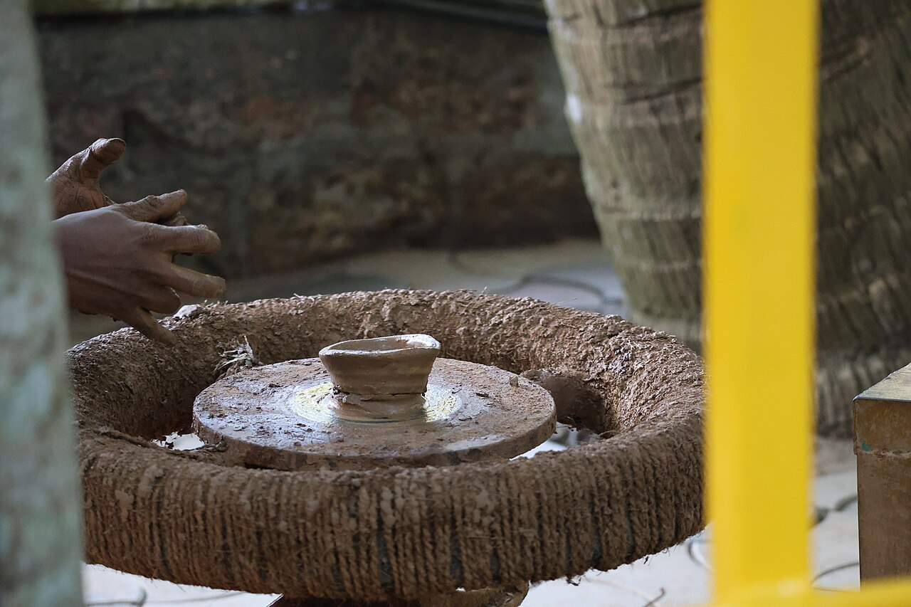

# Agile model

*The 2001 manifesto's four values, word for word, plus the scrum mechanics a tester actually lives in - sprints, standups, Definition of Done - and why quality becomes the whole team's job.*

> Somebody in your next standup is going to say "we're agile" the way people say "I'm a foodie" -
> as an identity, not a description of anything they actually do. Actual agile is a specific,
> short, seventeen-person document from a ski resort in 2001, and a specific set of mechanics
> (sprints, standups, a Definition of Done) that either exist in your team or don't. Learn the real
> manifesto values word for word, the scrum rhythm a tester actually lives inside, and why "whole-team
> quality" is the load-bearing idea underneath all of it - and you'll be able to tell, inside one
> standup, whether a team is agile or just informal.

> **In real life**
>
> Waterfall is an orchestra playing from a fixed score, top to bottom, no improvising - every note
> decided months before the concert. Agile is a jazz quartet: there's still structure (a chord
> sequence, a tempo, a key), but the band listens to each other bar by bar and adjusts. Nobody
> throws out the chord sequence - that would just be noise - and nobody refuses to react to what the
> drummer just played, either. The skill is playing WITHIN a structure that expects change, and
> that's the whole difference between agile and chaos: agile still has a plan, a rhythm, and a
> Definition of Done for "that solo landed." It just doesn't write the whole set list in January and
> refuse to touch it in June.

**Definition of Done (DoD)**: A shared, team-owned checklist of conditions a piece of work must meet before it counts as finished - not just 'the code compiles' but things like 'unit tests pass, code is reviewed, acceptance criteria are met, and it's been tested.' Every team's Definition of Done is different, but a real one is written down, agreed by the WHOLE team including testers, and applied the same way to every single item - a story isn't 'done', it's either done or it isn't.

## The manifesto, word for word

In February 2001, seventeen software practitioners met at a ski resort in Snowbird, Utah, and wrote
the Manifesto for Agile Software Development. It is four short lines, and it is worth knowing them
EXACTLY, because most people who say "agile" have never read them:

"Individuals and interactions over processes and tools.
Working software over comprehensive documentation.
Customer collaboration over contract negotiation.
Responding to change over following a plan."

And the sentence right after those four lines is the part almost everyone forgets: "That is, while
there is value in the items on the right, we value the items on the left more." Processes, tools,
documentation, contracts, and plans are not thrown out - they're just not the priority when they
conflict with a person, a working system, a customer conversation, or a needed change. Twelve
supporting principles were published alongside the four values, expanding on things like delivering
working software frequently and welcoming changing requirements "even late in development." Scrum,
Kanban, and Extreme Programming are all agile FRAMEWORKS that came before or after the manifesto and
were retroactively (or actively) aligned with these values - the manifesto itself describes no
ceremonies at all.

## Scrum mechanics a tester actually meets

Scrum is the most common way teams operationalize agile values, and it hands a tester a specific,
recurring rhythm. Work is planned into a **sprint** - a fixed, short timebox, commonly two weeks -
during **sprint planning**, where the team pulls items from a prioritized backlog and commits to
what's achievable. Every working day opens with a **daily standup**: each person answers, briefly,
what they did, what they're doing next, and what's blocking them - it is a sync, not a status
report to a manager, and a tester's blocker ("I can't verify story 214 until the API mock is fixed")
belongs in that three-sentence slot exactly like a developer's does. The sprint closes with a
**sprint review** (showing finished work to stakeholders) and a **retrospective** (the team asking
itself what to keep, drop, or change next sprint) - and everything that ships during the sprint is
measured against the team's **Definition of Done**, the one shared bar that decides whether "done"
means done or just "coded."

## Whole-team quality and the tester's new role

The biggest shift agile makes for testers isn't the sprint calendar - it's who owns quality. In a
strict waterfall shop, testing is a phase, and by extension a TEAM, that receives finished work and
judges it. In agile, quality is explicitly a whole-team responsibility: developers write unit tests,
product owners write acceptance criteria that ARE test conditions, and testers are embedded IN the
squad from planning onward, not waiting downstream for a handoff. A tester in a squad typically does
three things continuously rather than sequentially: shapes acceptance criteria during backlog
refinement (before a line of code exists), pairs with developers on exploratory and edge-case
testing DURING the sprint (not after), and maintains or extends automated regression suites so
yesterday's testing keeps protecting tomorrow's changes. "Continuous testing" is the technical term
for this - testing activities spread across the whole sprint, overlapping with development, instead
of stacked at the end of it.


*Potter shaping clay on a traditional wheel, India — Wikimedia Commons, CC BY-SA 4.0*
- **Each turn of the wheel = a sprint: short, fixed, repeating** — Unlike a waterfall requirements document meant to cover the whole project, this list covers roughly two weeks - small enough that the team can credibly commit to finishing all of it, and short enough to re-plan honestly every sprint.
- **The hands riding the clay = the Definition of Done applied continuously** — The one shared bar every story is measured against before it counts as finished - tested, reviewed, meeting acceptance criteria. Without a written, team-agreed DoD, 'done' quietly means something different to every person on the board.
- **A wobble felt THIS rotation = a blocked card at today's standup** — A card stuck in one column is exactly what the daily standup exists to surface fast, in under a minute, rather than let it sit silently until the sprint review reveals it too late to fix.
- **Shaping while it spins = testers working stories still in progress** — In a whole-team-quality setup this is normal, not a bottleneck - the tester is working the story alongside the developer during the sprint, not waiting for a separate testing phase after the column reaches 'done'.
- **Adjusting grip after each pass = the retrospective, applied not filed** — Concrete evidence the team actually adapts - a real retro produces specific changes for the NEXT sprint, not vague encouragement. If the same complaint reappears retro after retro, the retro itself isn't working.

**One scrum sprint, start to finish - press Play**

1. **Sprint planning** — The team pulls prioritized items from the backlog and commits to what's realistically achievable in the timebox. Testers help shape acceptance criteria here - BEFORE any code exists, which is the cheapest possible moment to catch an ambiguous requirement.
2. **Daily standups, all sprint long** — Every working day: what I did, what I'm doing next, what's blocking me. Continuous testing happens in parallel with development all week - not as a separate phase waiting for the end.
3. **Sprint review** — The team demos finished, DONE work to stakeholders - only work that met the Definition of Done counts as finished here, which is exactly why a real DoD matters more than a friendly definition of 'basically working'.
4. **Retrospective** — The team asks itself what to keep, stop, or change - including testing-specific friction, like 'the API mocks were stale again' or 'acceptance criteria arrived too late to write test cases against.'
5. **Next sprint planning** — Whatever the retro surfaced gets a chance to actually change something, immediately, in the very next short cycle - the adaptation loop Royce's waterfall paper wanted but that scrum builds in structurally.

Here's a simplified simulation in Python comparing WHEN defects get discovered across a sprint
(agile, continuous testing) versus across a whole project (waterfall-style, all testing stacked at
the end) - same total number of defects, very different discovery timing:

*Run it - defect discovery timing, sprint vs phase (Python)*

```python
total_defects = 12
project_days = 20   # a rough two-sprint stretch, for comparison

# AGILE / CONTINUOUS TESTING -- defects found spread across every day,
# because testing runs ALONGSIDE development the whole sprint
agile_found_per_day = [1, 1, 0, 1, 1, 0, 1, 1, 1, 0, 1, 1, 0, 1, 1, 0, 1, 0, 0, 0]

# WATERFALL-STYLE -- almost nothing found until the dedicated testing phase
# near the end, then everything surfaces at once
waterfall_found_per_day = [0] * 15 + [3, 3, 3, 2, 1]

print("Day  Agile-found  Waterfall-found")
for day in range(project_days):
    print(str(day + 1).rjust(3), " ", agile_found_per_day[day], "           ", waterfall_found_per_day[day])

print()
print("Total found, agile timing:    ", sum(agile_found_per_day))
print("Total found, waterfall timing:", sum(waterfall_found_per_day))

# The point isn't the total -- it's how early the team KNOWS about a problem
agile_first_hit = next(d for d, n in enumerate(agile_found_per_day) if n > 0) + 1
waterfall_first_hit = next(d for d, n in enumerate(waterfall_found_per_day) if n > 0) + 1
print()
print("First defect surfaces on day", agile_first_hit, "(agile) vs day", waterfall_first_hit, "(waterfall)")
print("Same number of bugs -- wildly different amount of time the team spent NOT knowing about them.")
```

The same simulation in Java:

*Run it - defect discovery timing, sprint vs phase (Java)*

```java
import java.util.*;

public class Main {
    public static void main(String[] args) {
        int[] agileFoundPerDay = {1, 1, 0, 1, 1, 0, 1, 1, 1, 0, 1, 1, 0, 1, 1, 0, 1, 0, 0, 0};
        int[] waterfallFoundPerDay = {0, 0, 0, 0, 0, 0, 0, 0, 0, 0, 0, 0, 0, 0, 0, 3, 3, 3, 2, 1};

        System.out.println("Day  Agile-found  Waterfall-found");
        int agileTotal = 0, waterfallTotal = 0;
        for (int day = 0; day < agileFoundPerDay.length; day++) {
            agileTotal += agileFoundPerDay[day];
            waterfallTotal += waterfallFoundPerDay[day];
            System.out.println((day + 1) + "    " + agileFoundPerDay[day] + "            " + waterfallFoundPerDay[day]);
        }

        System.out.println();
        System.out.println("Total found, agile timing:     " + agileTotal);
        System.out.println("Total found, waterfall timing: " + waterfallTotal);

        int agileFirstHit = -1, waterfallFirstHit = -1;
        for (int day = 0; day < agileFoundPerDay.length; day++) {
            if (agileFirstHit == -1 && agileFoundPerDay[day] > 0) agileFirstHit = day + 1;
            if (waterfallFirstHit == -1 && waterfallFoundPerDay[day] > 0) waterfallFirstHit = day + 1;
        }
        System.out.println();
        System.out.println("First defect surfaces on day " + agileFirstHit + " (agile) vs day " + waterfallFirstHit + " (waterfall)");
        System.out.println("Same number of bugs -- wildly different amount of time the team spent NOT knowing about them.");
    }
}
```

> **Tip**
>
> When you join a new squad, skip the deck and go straight to two artifacts: the Definition of Done
> and the last retrospective's action items. The DoD tells you what "finished" actually requires on
> THIS team, which varies wildly even between teams that both call themselves agile. The last retro's
> action items tell you whether the adaptation loop is real or theater - if the same complaint has
> appeared three retros running with no change, the ceremonies are happening but the manifesto's
> actual value (responding to change) isn't.

### Your first time: Your mission: watch discovery timing shift

- [ ] Run both playgrounds — Compare the day each first defect surfaces - agile's should be very early, waterfall-style very late, for the exact same total defect count.
- [ ] Recite the four values from memory — Cover the Resources section and try to write the four manifesto lines yourself, in order. Then check them against the exact wording above - 'over,' not 'instead of,' is the key word each line hinges on.
- [ ] Change the agile distribution — Edit `agile_found_per_day` so every defect is found on day one - unrealistic, but notice it doesn't change the model's point, it exaggerates it. Continuous testing's advantage is EARLY signal, not zero signal.
- [ ] Write your own Definition of Done — For a small, real feature you've used recently (a login form, a search box), write three concrete DoD conditions a story would need to meet. Compare with a teammate's - the gaps are usually where 'done' quietly means different things.
- [ ] Sit in on a standup, or imagine one — Notice whether a tester's blocker gets the same three-sentence treatment a developer's does. If testers report status TO the standup rather than blockers IN it, that's a whole-team-quality gap worth naming.

You've now watched defect-discovery timing shift from 'all at once, late' to 'spread out, early' -
the practical payoff behind every agile ceremony, and quoted the manifesto's four values exactly as
written in 2001.

- **The team says 'we're agile' but there's no Definition of Done, and 'done' means something different to every developer.**
  Ceremonies without a shared finish line aren't agile, they're just short waterfall phases with more meetings. Get the whole team - including testers and the product owner - in one room to write a concrete, checkable Definition of Done, and apply it to every story without exceptions. This is a process gap, not a testing gap, and it needs a team conversation, not a QA memo.
- **Standups turn into fifteen-minute status reports to the manager, and blockers never actually get unblocked.**
  The manifesto values individuals and interactions - a standup is a peer sync, not a report-up ritual. If blockers are raised but nobody owns unsticking them before the next standup, add an explicit follow-up owner per blocker, or move detailed problem-solving to a smaller side conversation right after standup, keeping the main standup fast.
- **Acceptance criteria arrive mid-sprint, after developers already started coding, so testers can't write test cases early.**
  This is the continuous-testing loop breaking at its earliest point. Push acceptance criteria authoring into backlog refinement, BEFORE sprint planning commits the story - a tester who helps write acceptance criteria a sprint ahead gets test cases ready before code exists, restoring the early-signal advantage agile is supposed to provide.
- **Retrospectives raise the same complaint sprint after sprint with no visible change.**
  A retro that produces no action, or produces action nobody follows up on, breaks 'responding to change' at the team's own feedback loop. Assign an owner and a check-in date to every retro action item, and open the NEXT retro by reviewing whether last sprint's actions actually happened - visibly, so the team can see the loop closing.

### Where to check

In a scrum-run project, a tester's checkpoints are spread across the sprint rather than clustered
at the end of it:

- **Backlog refinement** - are acceptance criteria specific and testable, or vague enough that three
  people would write three different test cases from them? Push for concrete examples here, before
  planning locks the story in.
- **Sprint planning** - is testing time actually budgeted into the story's estimate, or silently
  assumed to be free and squeezed in after coding? An estimate with no testing time baked in is a
  Definition of Done that's already broken on day one.
- **Daily standups** - do testers' blockers get the same airtime and follow-through as developers',
  or does testing quietly become "whatever's left over" when the sprint runs long?
- **The Definition of Done itself, read literally** - does it actually require testing, or does it
  just say "code complete"? A DoD without a testing condition isn't protecting the team from
  anything.
- **The sprint review demo** - is what's shown genuinely done per the DoD, or has "done" quietly
  drifted to "works on my machine, mostly"? A review is the cheapest place to catch that drift before
  it reaches a release.

Tester's habit in scrum: **push your involvement as early in the sprint as the ceremonies allow.**
Refinement and planning are where continuous testing either gets built in or gets silently
squeezed out - by the time a story hits the board's "in review" column, most of that decision has
already been made.

### Worked example: the sprint that shipped a story with no tests, on time

1. **The report:** A squad proudly hits its sprint commitment - every story moved to "done" - but
   two sprints later, a support ticket reveals a shipped checkout feature silently double-charges
   customers under a specific coupon-and-refund combination.
2. **The tester investigates the sprint board history** and finds the story was marked done the
   moment the code merged and passed a quick manual click-through - no automated test was written,
   and the acceptance criteria never mentioned the coupon-plus-refund case at all.
3. **The Definition of Done gets checked next**, and it turns out to say only "code reviewed and
   merged" - there is no line requiring a passing test, automated or otherwise, before a story counts
   as finished. The team has scrum's ceremonies but not its safety net.
4. **The root cause is a DoD gap, not a person's mistake.** Every individual followed the written
   rules exactly; the rules themselves didn't require what "quality" actually needs.
5. **The retrospective becomes the fix's real venue.** The team rewrites its Definition of Done to
   require, at minimum, a passing automated test for the changed behavior and explicit sign-off from
   whoever's testing the story that sprint - not a separate QA phase, just a checked box nobody can
   skip.
6. **A regression test for the exact coupon-plus-refund path is added immediately**, closing the
   specific hole, while the DoD change closes the general one.
7. **The tester's angle.** "On time" and "done" had quietly become the same word on this team's
   board - the DoD rewrite is what forces them back apart, by making "done" mean something checkable
   again instead of "the column changed."
8. **The lesson for a tester.** A sprint that hits its commitment isn't proof of quality by itself;
   it's proof the team met whatever its Definition of Done actually says. If that document has a
   hole, a fast, on-time sprint will ship straight through it - the fix lives in the DoD, not in
   asking people to try harder.

> **Common mistake**
>
> Confusing the SCHEDULE (two-week sprints, daily standups) with the VALUES (individuals and
> interactions, working software, customer collaboration, responding to change). A team can run
> picture-perfect ceremonies - standups on time, sprints closed on schedule, a burndown chart that
> looks great - while still writing a rigid, comprehensive requirements document nobody's allowed to
> touch mid-sprint, testing only at the very end of the sprint anyway, and treating the retro as a
> formality. That's waterfall wearing a scrum costume. The ceremonies are supposed to be in SERVICE
> of the values, not a substitute for them - a tester's job is to notice when the schedule is agile but
> the actual behavior underneath it isn't.

**Quiz.** Which of these is the closest, most accurate quote of a value from the 2001 Agile Manifesto?

- [x] Working software over comprehensive documentation
- [ ] No documentation, ever, under any circumstances
- [ ] Individuals over interactions, and tools over processes
- [ ] Following a plan over responding to change

*The manifesto's exact four values are: individuals and interactions OVER processes and tools; working software OVER comprehensive documentation; customer collaboration OVER contract negotiation; responding to change OVER following a plan. Notice the word is always 'over,' not 'instead of' - the manifesto explicitly says there IS value in the items on the right (documentation, plans, tools, contracts), just less than the items on the left. The other three options either invert a value's order, claim documentation is banned outright (it isn't), or reverse the actual pairing entirely.*

- **The Agile Manifesto - who, when, where** — Seventeen software practitioners, February 2001, Snowbird, Utah. Four short values plus twelve supporting principles.
- **The four manifesto values, exactly** — Individuals and interactions OVER processes and tools. Working software OVER comprehensive documentation. Customer collaboration OVER contract negotiation. Responding to change OVER following a plan.
- **The sentence right after the four values** — 'While there is value in the items on the right, we value the items on the left more.' The right-hand items aren't discarded, just deprioritized when they conflict with the left.
- **Definition of Done (DoD)** — A team-agreed, written checklist a story must meet to count as finished - e.g. tests pass, code reviewed, acceptance criteria met. Without one, 'done' means something different to everyone on the board.
- **Continuous testing** — Testing spread across the whole sprint, overlapping with development - shaping acceptance criteria early, exploratory testing during the sprint, maintaining automation - instead of stacked into one phase at the end.
- **Whole-team quality** — Quality is everyone's job - developers write unit tests, product owners write testable acceptance criteria, testers embed in the squad from planning onward rather than receiving finished work downstream.

### Challenge

In the Python playground: (1) change `waterfall_found_per_day` to spread the same 12 defects
across only the final 3 days instead of 5, and re-run - watch how much later and more concentrated
discovery becomes. (2) Write your team's (real or imagined) Definition of Done as a Python list of
strings and print it. (3) Finish with two sentences: one naming a ceremony you've seen become
theater (done in form, not substance), and one naming what would make it real again.

### Ask the community

> Scrum question: our team's Definition of Done says `[what it currently says]`, and I'm trying to get `[testing requirement you want added]` into it. Pushback so far has been `[what people are saying]`. Has anyone successfully changed a DoD mid-project, and how did you frame the ask?

Most DoD fights are really scope-vs-safety-net negotiations - the pushback is usually "that'll slow
us down," and the honest answer is "yes, slightly, and here's the bug class it would have caught."
Bring a specific, real incident the missing DoD line would have prevented; abstract arguments about
quality rarely move a sprint-focused team, a concrete near-miss almost always does.

- [The Agile Manifesto - the original four values and twelve principles, in full](https://agilemanifesto.org/)
- [The Scrum Guide - the official, current definition of scrum's roles, events, and artifacts](https://scrumguides.org/)
- [ISTQB - foundation-level syllabus, including agile testing coverage](https://www.istqb.org/)
- [What is Agile? — Codecademy](https://www.youtube.com/watch?v=GzzkpAOxHXs)

🎬 [What is Agile? — Codecademy](https://www.youtube.com/watch?v=GzzkpAOxHXs) (6 min)

- The 2001 Agile Manifesto has four exact values - individuals and interactions, working software, customer collaboration, responding to change - each valued OVER (not instead of) its right-hand counterpart.
- Scrum operationalizes agile values into a rhythm a tester lives inside: sprint planning, daily standups, sprint review, retrospective, all measured against a shared Definition of Done.
- Quality becomes a whole-team responsibility - developers test, product owners write testable acceptance criteria, testers embed in the squad from planning onward rather than receiving handoffs downstream.
- Continuous testing spreads discovery across the whole sprint instead of stacking it at the end, surfacing the same defects far earlier - the practical payoff behind every ceremony.
- A team can run agile's schedule perfectly while missing its values entirely - the ceremonies exist to serve individuals, working software, collaboration, and adaptability, not to replace them.


---
_Source: `packages/curriculum/content/notes/qa-foundations/models/agile.mdx`_
