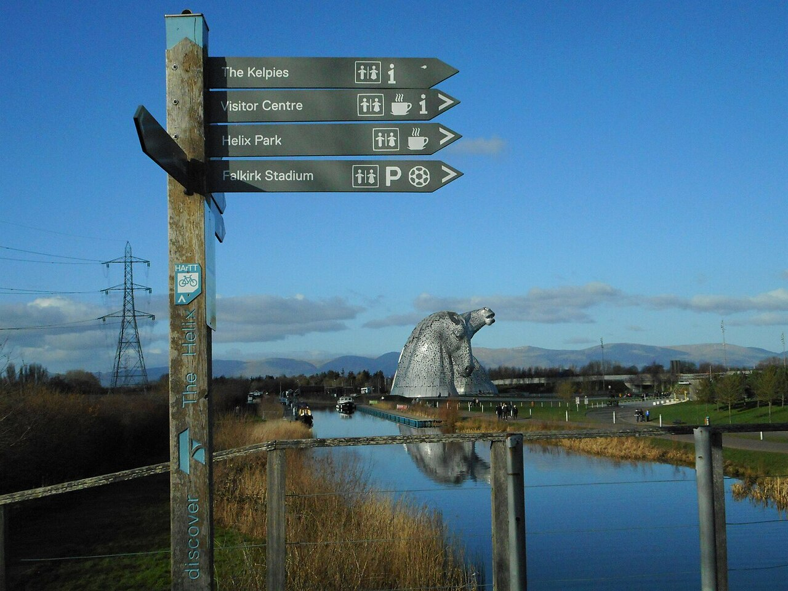

# Choosing a model: there's no silver bullet

*Waterfall, V-model, and agile aren't a ranked list from worst to best - the right choice depends on team size, regulation, requirement stability, and release cadence, and most real teams run a hybrid anyway.*

> Ask five different teams which development model is "the right one" and you'll get five confident,
> contradictory answers - and every single one of them will be correct, for their own project. A team
> building pacemaker firmware under FDA oversight and a five-person startup shipping a to-do app
> twice a day are not making a values judgment when they land on different models. They're solving
> different problems. One has requirements that cannot change once submitted to a regulator; the
> other has requirements that might change before lunch. Picking a model isn't picking a winner from
> a ranked list - it's matching a shape to a context, and the same shape that saves one team will
> quietly wreck the other.

> **In real life**
>
> Choosing a vehicle. A freight company hauling steel beams across the country needs a heavy, rigid,
> slow-to-turn truck - agility would be a liability, because the whole point is carrying an enormous,
> fixed load predictably from A to B. A courier weaving through city traffic to deliver documents
> needs a bicycle - light, able to change direction in an instant, useless for the steel beams but
> perfect for its job. Nobody sanely argues "trucks are better than bicycles" or vice versa in the
> abstract; the argument only makes sense once you know what's being hauled, how fast it has to move,
> and how often the route changes. Development models are the same: waterfall is the truck, agile is
> the bicycle, and asking which one is "better" without naming the cargo is the wrong question
> entirely.

## The four questions that actually decide it

Underneath the branded methodology names, choosing a model comes down to honestly answering four
context questions, and letting the answers point you toward a shape rather than a name.

**Team size and structure.** A five-person team sitting in the same room can coordinate constantly,
informally, and cheaply - short feedback loops cost them almost nothing, which is exactly what agile
assumes and rewards. A two-hundred-person program spread across four vendor companies and three time
zones cannot hold a fifteen-minute daily standup that actually includes everyone; coordination
overhead at that scale makes big, well-defined, infrequently-renegotiated phases (waterfall's whole
premise) genuinely cheaper to run than constant re-negotiation would be.

**Regulation and required documentation.** Some domains - medical devices, aviation software,
financial settlement systems - are legally required to produce traceable documentation connecting
every requirement to a design decision to a test case to a sign-off, often audited by an outside
body. That paper trail is exactly what heavier, phase-gated models (waterfall, the V-model) produce
naturally as a byproduct of how they work. A regulator does not accept "we're agile, we don't
document that way" as an answer, so in these domains, model choice is partly a legal constraint,
not purely a technical preference.

**Requirement stability.** If what's being built is well-understood and unlikely to change - a
government tax form processor implementing a fixed, published tax code - locking requirements early
and building against them in sequence loses little, because there's little for the requirements to
change INTO. If what's being built is genuinely unknown - a new consumer product where user
reaction will reshape the roadmap - locking requirements early is actively dangerous, because you'll
build the wrong thing with high confidence and find out only after it's built. Stable requirements
favor waterfall-shaped models; volatile, discovery-driven requirements favor agile-shaped ones.

**Release cadence.** A team that can and does ship every day has a fast, cheap feedback loop already
built into its process - mistakes get caught and corrected in near real time, which is the entire
engine that makes agile's short iterations valuable. A team that ships once a year, into hardware
that then can't be patched (firmware burned onto a satellite, say) has no such loop; correctness has
to be front-loaded before release because there's no fast "ship a fix tomorrow" option waiting on
the other side of a mistake.

Context-driven model selection

## The hybrid is the real world, not a compromise

Textbooks present waterfall, V-model, and agile as three distinct, mutually exclusive boxes, but
most real organizations run something that doesn't fit cleanly in any one box - and that's not a
failure to commit, it's usually the correct engineering response to having genuinely mixed
constraints. The most common real-world hybrid has a name, half-joking and entirely accurate: water-
scrum-fall. The front of the project (requirements gathering, budget approval, a fixed release date
set months out, sometimes a regulatory filing) runs in a waterfall shape, because those things
genuinely need to be locked and approved before work starts. The middle of the project (the actual
building) runs in agile sprints, because that's where requirement discovery and iteration add real
value. The back of the project (a hardened release process, a change-approval board, a formal sign-
off before it reaches customers) runs in another waterfall shape again, because production release
in a regulated or high-stakes environment still needs that rigor.

Recognizing water-scrum-fall for what it is - not a failed agile transformation, but a deliberate
(or half-accidental) match to an organization with mixed constraints - changes how a tester should
react to it. Instead of complaining "we're not really agile" or "we're not really waterfall," the
useful move is asking which SEGMENT of the current project is in which mode right now, and adapting
test strategy to match: heavier, document-driven test planning during the waterfall-shaped ends,
and lighter, fast-iterating exploratory and automated testing during the agile-shaped middle.


*Fingerpost at the Helix, Falkirk — geograph.org.uk, CC BY-SA 2.0*
- **The top arm = the heavy-governance route: sequential, documented, auditable** — Points toward waterfall or V-model shaped phases -- coordination overhead and audit/traceability requirements both favor well-documented, sequential gates over constant informal re-negotiation.
- **The second arm = the volatile-requirements route: iterate, ship, learn** — Points toward agile -- short feedback loops are cheap to run at this size, and locking requirements early would mean confidently building the wrong thing.
- **The third arm = stable-and-infrequent: sequential still earns its keep** — Even a smaller team can lean waterfall-shaped here -- if what's being built is well understood and won't change, and there's no fast patch cycle after release, front-loading correctness makes sense.
- **Four arms, one post = mixed answers; most real teams travel a hybrid** — The most common real outcome -- large regulated org, but building something with real requirement uncertainty in the middle. This is exactly where water-scrum-fall lives: different segments of the same project answering the four questions differently.
- **The Kelpies on the horizon = the destination never moved — only the route differs** — There's no arrow labeled 'best model' in the center, because there isn't one -- every path through the tree is context-dependent, not quality-ranked.

**How the same tester adapts across three segments of a water-scrum-fall project - press Play**

1. **Front of the project: waterfall-shaped requirements gathering** — A fixed release date and a regulatory filing are already set months out. The tester's job here: draft acceptance criteria for every requirement NOW, V-model style, because this phase won't be revisited casually once locked.
2. **Middle of the project: agile-shaped sprints** — The actual building happens in two-week sprints with a product owner re-prioritizing based on user feedback. The tester's job shifts: exploratory testing each sprint's slice, fast automated regression, tight feedback to developers within the same sprint.
3. **A sprint discovers the original requirement was wrong** — User testing in sprint four reveals a workflow assumption from the original waterfall-shaped requirements doesn't match how real users behave. The agile middle absorbs this - the backlog gets re-prioritized, unlike a pure waterfall project where this would mean re-opening a closed phase.
4. **Back of the project: waterfall-shaped release hardening** — As the regulatory deadline approaches, the process shifts back to a heavier gate: a formal change-approval board, a full regression pass, a documented sign-off trail connecting requirements to test evidence - because this is the segment where audit and stability matter most.
5. **The tester's adaptation, named honestly** — None of this is 'not really agile' or 'a failed transformation' - it's a team correctly running different segments of one project in the process shape that segment's actual constraints call for, and a good tester adjusts test strategy per segment instead of insisting on one approach throughout.

Matching context to a model shape is exactly the kind of decision that benefits from being made
explicit instead of left as a vibe. Here's a small scoring function that takes the four context
questions and produces a leaning - not a verdict, a leaning, because real projects (as the flow
above shows) often score toward a hybrid rather than a single pure answer.

*Run it - a model-chooser scoring function (Python)*

```python
# Score each factor from -2 (strongly favors agile) to +2 (strongly favors
# waterfall/V-model). Sum the scores to get a leaning, not a verdict.
def score_project(team_size, regulated, requirements_stable, release_cadence_days):
    scores = {}

    # Larger teams favor more structured, phase-gated coordination
    scores["team_size"] = 2 if team_size > 50 else (1 if team_size > 15 else -1)

    # Regulation strongly favors documentation-heavy, traceable models
    scores["regulation"] = 2 if regulated else -1

    # Stable requirements favor locking early; volatile requirements favor agile
    scores["requirements_stability"] = 2 if requirements_stable else -2

    # Slow release cadence favors front-loading correctness; fast cadence favors iteration
    scores["release_cadence"] = 2 if release_cadence_days > 90 else (-2 if release_cadence_days <= 14 else 0)

    total = sum(scores.values())
    return scores, total

def leaning(total):
    if total >= 4:
        return "Strong lean toward waterfall / V-model"
    if total <= -4:
        return "Strong lean toward agile"
    return "Mixed signals -- likely candidate for a hybrid (water-scrum-fall)"

projects = [
    ("5-person startup, no regulation, volatile requirements, ships daily",
     score_project(team_size=5, regulated=False, requirements_stable=False, release_cadence_days=1)),
    ("200-person medical device program, regulated, stable spec, ships yearly",
     score_project(team_size=200, regulated=True, requirements_stable=True, release_cadence_days=365)),
    ("40-person enterprise team, regulated filing, volatile mid-project requirements, ships monthly",
     score_project(team_size=40, regulated=True, requirements_stable=False, release_cadence_days=30)),
]

for name, (scores, total) in projects:
    print(name)
    for factor, s in scores.items():
        print(f"  {factor:<24} {s:+d}")
    print(f"  TOTAL: {total:+d} -> {leaning(total)}")
    print()
```

The same scoring function in Java, since the enterprise, regulated projects that most often need
this exact hybrid conversation are frequently the ones running large Java systems:

*Run it - a model-chooser scoring function (Java)*

```java
import java.util.*;

public class Main {
    record ScoreResult(Map<String, Integer> scores, int total) {}

    static ScoreResult scoreProject(int teamSize, boolean regulated, boolean requirementsStable, int releaseCadenceDays) {
        Map<String, Integer> scores = new LinkedHashMap<>();

        scores.put("team_size", teamSize > 50 ? 2 : (teamSize > 15 ? 1 : -1));
        scores.put("regulation", regulated ? 2 : -1);
        scores.put("requirements_stability", requirementsStable ? 2 : -2);
        scores.put("release_cadence", releaseCadenceDays > 90 ? 2 : (releaseCadenceDays <= 14 ? -2 : 0));

        int total = scores.values().stream().mapToInt(Integer::intValue).sum();
        return new ScoreResult(scores, total);
    }

    static String leaning(int total) {
        if (total >= 4) return "Strong lean toward waterfall / V-model";
        if (total <= -4) return "Strong lean toward agile";
        return "Mixed signals -- likely candidate for a hybrid (water-scrum-fall)";
    }

    public static void main(String[] args) {
        record Project(String name, ScoreResult result) {}

        List<Project> projects = List.of(
            new Project("5-person startup, no regulation, volatile requirements, ships daily",
                scoreProject(5, false, false, 1)),
            new Project("200-person medical device program, regulated, stable spec, ships yearly",
                scoreProject(200, true, true, 365)),
            new Project("40-person enterprise team, regulated filing, volatile mid-project requirements, ships monthly",
                scoreProject(40, true, false, 30))
        );

        for (Project p : projects) {
            System.out.println(p.name());
            for (Map.Entry<String, Integer> e : p.result().scores().entrySet()) {
                System.out.printf("  %-24s %+d%n", e.getKey(), e.getValue());
            }
            System.out.printf("  TOTAL: %+d -> %s%n%n", p.result().total(), leaning(p.result().total()));
        }
    }
}
```

> **Tip**
>
> When a team argues in the abstract about "agile versus waterfall" as if one is simply more modern
> or more professional, the scoring exercise reframes the whole conversation: run your ACTUAL
> project's team size, regulatory status, requirement stability, and release cadence through it, out
> loud, and let the number - not a methodology's marketing - produce the leaning. Most real
> arguments about "which model is right" dissolve the moment the four factors get named explicitly,
> because the disagreement was usually about an unstated context assumption, not about which
> methodology is inherently better.

### Your first time: Your mission: score your own project's context

- [ ] Run the Python scoring function as-is — Read all three example projects' scores and leanings. Notice the enterprise example lands in 'mixed signals' territory - that's the hybrid case, not a bug in the scoring.
- [ ] Score a real project you know — Fill in your own team's actual team size, regulation status, requirement stability, and release cadence into the function and run it. Does the leaning match how your team actually works today?
- [ ] Find the factor pulling against the others — For your scored project, identify which single factor scored in the OPPOSITE direction from the rest - that's usually the exact factor driving whichever hybrid adaptations your team already informally does.
- [ ] Name your project's water-scrum-fall segments — If your project mixes signals, write one sentence naming which part of your actual process is waterfall-shaped (fixed, gated) and which part is agile-shaped (iterative) right now.
- [ ] Compare Python and Java output — Confirm both produce the same scores and leaning for the same inputs. The reasoning is the point, not the language running it.

You've now turned "which model should we use" from an abstract debate into a scored, honest
reading of your own project's actual constraints.

- **A team adopts agile because it's considered the modern default, despite building safety-critical firmware for hardware that ships once a year with no patch mechanism.**
  Re-run the four context questions honestly: release cadence here is effectively infinite between releases, and there's no fast-feedback loop to correct mistakes after shipping. This context calls for front-loaded correctness (waterfall/V-model shaped), regardless of what's currently fashionable.
- **A large regulated program insists on pure waterfall throughout, including for a genuinely novel feature where user needs are still being discovered.**
  Separate the segments: the regulatory filing and release process can stay waterfall-shaped, but the discovery-heavy feature development can run agile sprints inside that outer structure - this is exactly the water-scrum-fall pattern, and it doesn't require abandoning the regulatory rigor elsewhere.
- **A tester complains 'we're not really agile' about a team that runs sprints in the middle but has fixed requirements and a hard release date on both ends.**
  Reframe: this is water-scrum-fall, a legitimate, common hybrid, not a failed agile transformation. The useful question isn't 'are we pure agile' but 'is each segment of this project running in the process shape that segment's actual constraints call for.'
- **Model choice gets argued as a matter of team identity or preference ('we're an agile team') rather than project context.**
  Run the scoring exercise on the CURRENT project specifically, not on the team's self-image. Team size, regulation, requirement stability, and release cadence can differ from project to project even within the same team, and the model choice should follow the project's actual constraints each time.

### Where to check

Context-driven model choice shows up as a concrete decision at these moments:

- **Project kickoff** - before adopting a methodology by default, name the team size, regulatory
  status, requirement stability, and release cadence explicitly, in the room, out loud.
- **Vendor or multi-team programs** - coordination overhead scales with team count; check whether
  the chosen model still fits once the actual number of separately-coordinating groups is counted.
- **Mid-project pivots** - if requirement stability changes (a stable spec suddenly becomes
  contested, or a volatile area suddenly locks down for a regulatory filing), the right process
  shape for that segment may need to change too.
- **Test strategy planning** - the CURRENT segment's shape (waterfall-like gate versus agile-like
  sprint) should drive whether test planning is heavy and document-led or light and fast-iterating,
  right now, not based on the project's label.
- **Retrospectives that blame "the methodology"** - check whether the actual problem was a mismatch
  between the model in use and the real context, rather than a flaw in the model itself.

Tester's habit: **before criticizing a process as "not real agile" or "too rigid," name the four
context factors for the CURRENT segment of work first** - the criticism often dissolves once the
actual constraints are on the table.

### Worked example: the payments team that ran three models in one project

1. **The setup:** A 60-person team builds a new payments feature for a bank. The bank is heavily
   regulated, the release date for the core ledger change is fixed by a compliance deadline eight
   months out, and the customer-facing payment UI is still being shaped by ongoing user research.
2. **The front:** the ledger requirements - what the compliance filing legally requires - are locked
   early, documented in detail, and paired with acceptance tests drafted immediately (V-model style),
   because a regulator will audit this exact chain months later.
3. **The middle:** the customer-facing UI is built in two-week sprints, with user testing after each
   sprint reshaping the next one - because how customers actually want to review and confirm a
   payment turns out to need real iteration, not a locked-in guess made eight months early.
4. **The back:** as the compliance deadline nears, the process shifts again - a formal change-
   approval board reviews the final release, a full regression suite runs against the locked ledger
   requirements, and a documented sign-off trail gets produced for the auditor.
5. **What a tester who insisted on one model throughout would have gotten wrong:** demanding pure
   agile everywhere would have meant re-negotiating the ledger's regulatory requirements sprint by
   sprint, which the compliance filing does not allow. Demanding pure waterfall everywhere would have
   meant locking the customer UI's design eight months early, based on guesses that user research
   later proved wrong.
6. **What actually happened:** three different process shapes, in three different segments of one
   project, each matched to that segment's real constraints - and the tester's strategy shifted with
   it, heavy and document-led on the ledger side, fast and exploratory on the UI side.
7. **The lesson for a tester:** the question was never "which model is this project," it was "which
   model shape fits each part of this project," and a tester who can answer that per-segment is more
   useful than one holding out for a single pure methodology to apply everywhere.

> **Common mistake**
>
> Treating model choice as a values statement - "we believe in agile" or "we're a disciplined
> waterfall shop" - instead of an engineering decision driven by actual project constraints. A model
> is a tool matched to a context, not an identity to defend. The moment a team starts justifying a
> process choice by appeal to what kind of team they consider themselves, rather than by the team
> size, regulation, requirement stability, and release cadence actually in front of them, the model
> has stopped serving the project and started serving the team's self-image instead.

**Quiz.** A tester joins a project that runs fixed, document-heavy requirements and a formal release sign-off, but builds features inside two-week sprints in the middle, with a product owner re-prioritizing based on user feedback. How should this setup be understood?

- [ ] As a failed agile transformation that should be fixed by removing the fixed requirements and sign-off steps entirely
- [x] As water-scrum-fall, a common and often deliberate hybrid where different segments of the project (front, middle, back) are each run in the process shape that segment's actual constraints call for
- [ ] As a sign the team doesn't understand either waterfall or agile and needs to pick one methodology and commit to it fully
- [ ] As pure waterfall, since any fixed requirements or formal sign-off step disqualifies a project from being considered agile at all

*This setup is the textbook shape of water-scrum-fall: fixed, document-heavy requirements and a formal sign-off at the front and back of a project, with iterative, feedback-driven sprints in the middle. It's frequently the correct engineering response to a project with mixed constraints -- for example, a regulatory filing that must be locked early alongside a customer-facing feature that genuinely needs iterative discovery. Option A wrongly assumes any non-pure-agile element is a failure; option C assumes methodology purity is inherently better than a matched hybrid; option D wrongly treats any fixed element as disqualifying, when in practice most large real-world projects run exactly this kind of mixed shape without it being a contradiction.*

- **The four context questions for choosing a model** — Team size and structure, regulation and required documentation, requirement stability, and release cadence -- the answers point toward a model shape, not a name.
- **Why large teams often favor waterfall-shaped phases** — Coordination overhead scales with team size -- constant informal re-negotiation (agile's core mechanism) becomes expensive across hundreds of people and multiple companies, while well-defined, infrequently-renegotiated phases become cheaper by comparison.
- **Why regulation favors waterfall or V-model shapes** — Regulated domains often legally require traceable documentation connecting requirements to design to test evidence to sign-off -- a byproduct that phase-gated, document-heavy models produce naturally as part of how they work.
- **Water-scrum-fall, defined** — A common real-world hybrid where a project's front (requirements, budget, regulatory filing) and back (release hardening, sign-off) run in a waterfall shape, while the middle (actual building) runs in agile sprints -- a deliberate match to mixed constraints, not a failed transformation.
- **How a tester adapts across a hybrid project's segments** — Heavier, document-driven test planning during the waterfall-shaped front and back; lighter, fast-iterating exploratory and automated testing during the agile-shaped middle -- matching strategy to the current segment, not to the project's label.
- **The core mistake in model choice** — Treating model choice as a values statement or team identity ('we believe in agile') instead of an engineering decision driven by actual project constraints -- there is no universally 'better' model, only a better-matched one.

### Challenge

Take a real project you know (or invent one). Run its team size, regulatory status, requirement
stability, and release cadence through the Python or Java scoring function with your own values.
Then write two sentences: one stating the leaning the score produced, and one stating whether your
project actually already runs a hybrid that the single leaning doesn't fully capture - and if so,
which segment is shaped differently from the overall score.

### Ask the community

> Model choice question: my project currently runs `[pure agile / pure waterfall / an unnamed mix]`, but I think the real constraints (`[team size / regulation / requirement stability / release cadence]`) actually call for something different, at least in one segment. Has anyone successfully introduced a deliberate water-scrum-fall split on a team that previously insisted on one pure methodology, and how did you name it so it didn't read as 'giving up' on agile or on rigor?

The pattern worth sharing back: naming the hybrid explicitly (water-scrum-fall, or just "front and
back are gated, middle is iterative") tends to defuse the identity argument faster than any abstract
case for either pure methodology does.

- [Agile software development - overview, contrasted with plan-driven models](https://en.wikipedia.org/wiki/Agile_software_development)
- [Waterfall model - background on the original sequential model](https://en.wikipedia.org/wiki/Waterfall_model)
- [Ministry of Testing - community discussion on hybrid and water-scrum-fall processes](https://www.ministryoftesting.com/)
- [Agile vs waterfall: which is right for your project? — KodeKloud](https://www.youtube.com/watch?v=7vBPfGIg2EY)

🎬 [Agile vs waterfall: which is right for your project? — KodeKloud](https://www.youtube.com/watch?v=7vBPfGIg2EY) (9 min)

- There is no universally 'best' development model -- waterfall, V-model, and agile each fit different contexts, not a ranked quality scale.
- Four questions decide the fit: team size and structure, regulation and required documentation, requirement stability, and release cadence.
- Large teams and regulated domains often favor waterfall-or-V-model-shaped phases; small teams and volatile requirements often favor agile-shaped iteration.
- Water-scrum-fall -- fixed requirements and sign-off at the front and back, agile sprints in the middle -- is a common, often deliberate hybrid, not a failed agile transformation.
- A good tester adapts strategy per segment of the current project (heavy and document-led versus light and fast-iterating) rather than insisting the whole project fit one pure methodology.


---
_Source: `packages/curriculum/content/notes/qa-foundations/models/choosing-a-model.mdx`_
