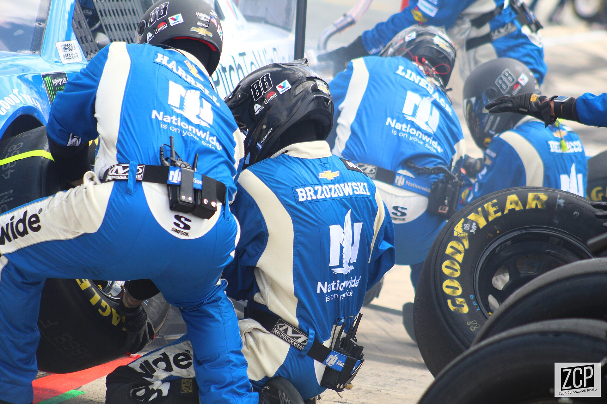

# Roles on a team

*QA engineer, SDET, test lead, developer-in-test - what each role actually does versus what the job ad claims, how testers fit inside agile squads, why devs, POs, and support are all secretly doing QA, and whole-team quality versus the QA-as-gatekeeper trap.*

> Job boards will happily sell you five different names for what looks like one job: QA engineer,
> SDET, test analyst, quality coach, automation engineer. Meanwhile your uncle still thinks you
> "check if the buttons work". Here's what's actually going on: the industry runs several genuinely
> distinct quality roles — different daily work, different skills, different pay bands — but slaps
> titles on them almost at random. An "SDET" role at one company is manual regression with a
> sprinkle of scripts; a "QA engineer" role at another is building test infrastructure in Java all
> day. Learn the *roles* (not the titles) and two things happen: you stop applying to jobs that
> secretly aren't what you want, and you stop believing the most career-limiting myth in this field —
> that quality is one team's job. On a healthy team, the developer, the product owner, and the
> support agent are all doing QA. On an unhealthy one, they're all waiting for you to catch what
> they threw.

> **In real life**
>
> A football team defending a corner kick. The goalkeeper is the *specialist* — trained reflexes,
> dedicated gloves, the last line. But watch what actually happens: defenders mark attackers,
> midfielders block the short pass, the striker drops back to cover the edge of the box. **Defense
> is the whole team's job; the keeper is simply the person who specializes in it.** Now imagine the
> dysfunctional version: ten players who sprint upfield the moment they lose the ball, shrugging
> "defending is the keeper's job". Every goal conceded becomes "how did the keeper miss that?" —
> while the keeper faces six attackers alone, every match. That team leaks goals *and* burns out its
> keeper. Swap "defense" for "quality" and "keeper" for "QA" and you have the two models this note
> is about: whole-team quality (everyone defends, the specialist leads the craft) versus
> QA-as-gatekeeper (throw it over the wall and blame the catcher). Same specialist, wildly different
> team — and you'll be able to smell which one you're interviewing with by the questions they ask.

**SDET**: Software Development Engineer in Test - a role popularized at Microsoft in the 2000s (Google ran the sibling role 'Software Engineer in Test', later folded into 'Software Engineer, Tools and Infrastructure'). An SDET is a software engineer whose PRODUCT is testability: test frameworks, automation infrastructure, CI integration, test-data tooling - code that helps the whole team test, rather than primarily executing tests by hand. Contrast with a QA engineer, whose center of gravity is the testing itself: risk analysis, test design, exploratory sessions, defect investigation, often plus automation. Warning from the wild: titles drift constantly - always read the duties, because plenty of 'SDET' ads describe manual testing jobs and plenty of 'QA engineer' ads want a framework builder.

## The cast: four roles, one craft

**QA engineer / tester** — the core role and probably your first one. Center of gravity: the
testing itself. You analyze risk ("what could hurt users most?"), design tests worth running,
explore the product beyond the script, investigate weirdness until it becomes a reproducible
defect report, and automate the checks worth repeating. **SDET / developer-in-test** — a software
engineer whose product is *testability*: the framework other testers write tests in, the CI
pipeline that runs thousands of checks per commit, the tooling that spins up realistic test data.
The role was popularized at Microsoft in the 2000s; Google ran its own flavor (Software Engineer
in Test, later reshaped into Software Engineer, Tools and Infrastructure). The honest difference:
a QA engineer's best day ends with a nasty bug found; an SDET's best day ends with a tool that
helps twenty people find bugs faster.

**Test lead / test manager** — the multiplier role. Leads own strategy (what we test, what we
consciously don't, and why), estimation, hiring, coaching, and the political work: negotiating
quality risk with product and engineering managers in language executives act on. In agile
organizations the title often softens to *quality coach* — less commanding a test team, more
raising the testing skill of every squad. And **developer-in-test** in the broader everyday
sense — the embedded engineer who rotates into quality work, hardens flaky suites, or pairs with
testers on automation — exists on many teams without ever appearing on an org chart.

Here's the plot twist the org chart hides: **people with none of these titles do QA constantly.**
The developer writing unit tests and reviewing a colleague's pull request is doing quality control
on work products. The product owner writing precise acceptance criteria is doing defect
*prevention* — ambiguity is where bugs breed. The support agent who notices "that's the fourth
customer this week with a broken invoice" is doing production defect detection and triage. On an
agile squad this isn't an accident, it's the design: the *three amigos* practice (a name coined by
agile coach George Dinwiddie) puts a developer, a tester, and a product person in one conversation
before coding starts, precisely so three kinds of quality thinking hit the story while defects are
still cheap.


*Alex Bowman's no. 88 pit crew mid-stop — photo by Zach Catanzareti, Wikimedia Commons, CC BY 2.0*
- **The names on the suits = specialists with clear accountability** — BRZOZOWSKI, HARRELL, LINEBACK - every crew member has a NAME and exactly one job: jackman, tire carrier, fueler. 'The whole team owns quality' never means roles blur; it means each specialist's craft is visible and accountable. A squad works the same way: the tester's specialism doesn't dissolve into the team - it's a named position on it.
- **The crew working ON the car DURING the race = embedded, not downstream** — Nobody here waits in a separate garage for the race to finish so they can inspect the car. The crew is part of the race itself - the same lap the driver is running. That's the embedded tester: in refinement, in planning, in the sprint - quality work happening DURING development, not as an inspection gate bolted on after.
- **The tires staged and waiting = prevention, decided before arrival** — Those Goodyears were selected, pressure-checked, and positioned BEFORE the car appeared - the whole stop is choreographed in advance. That's acceptance criteria written at refinement: every decision made before the work arrives is a defect that never gets the chance to exist. The cheapest QA in racing and in software is the preparation nobody sees.
- **The radios on every belt = the communication mesh** — Every crew member wears a radio: the spotter's view of the track, the crew chief's strategy, the driver's report of a vibration - live production feedback flowing into the stop as it happens. That's support tickets and monitoring feeding test strategy: the fourth identical complaint from the track is a regression gap wearing a driver's voice.
- **The simultaneous swarm = the anti-gatekeeper** — Five specialists work the car AT ONCE - twelve seconds, everyone in parallel. If each waited for the previous to finish, the stop would take three minutes and lose the race: that's the waterfall wall rebuilt inside a sprint, cards piling in one person's 'in test' column. Whole-team quality looks like this photo: parallel, coordinated, and nobody standing behind a gate.

**One user story's quality journey - who touches it, and when**

1. **Refinement - the three amigos strike first** — Developer, tester, and product owner examine the story together (the 'three amigos' - term coined by George Dinwiddie). The tester asks the awkward questions: what happens at zero items? Who is allowed to do this? How would we know it works? Every ambiguity fixed here is a defect prevented for free - the highest-leverage QA minute of the sprint.
2. **Development - the developer runs the first test lap** — Unit tests are written with the code, a peer reviews the pull request, static analysis runs on commit. This is genuine quality work done by people with no tester title. In the gatekeeper model this layer gets lazy - 'QA will catch it' - which is how the specialist downstream ends up drowning in bugs a unit test would have caught in seconds.
3. **Continuous checks - the SDET's invisible hand** — The commit triggers the pipeline: build, thousands of automated checks, a deploy to a test environment - infrastructure an SDET built so that regression feedback arrives in minutes, not at end-of-sprint. Nobody manually ran anything, yet a safety net just executed. This is what 'engineer whose product is testability' means in practice.
4. **Exploration - the QA engineer hunts what scripts cannot** — With the build stable, the tester runs exploratory sessions: probing edge cases, chaining features, attacking assumptions the automation encodes and therefore cannot question. Automation checks what the team EXPECTED; exploration finds what nobody expected. This is the specialist skill the whole-team model exists to protect, not replace.
5. **Production - support closes the loop** — The story ships. Support fields real-user friction, tags patterns, and recurring themes flow back into next sprint's test strategy and the regression suite. Quality work did not end at release - the team's cheapest source of test ideas is a support queue read with a tester's eyes. The loop, not any single role, is the quality system.

Here's the gatekeeper-versus-whole-team difference as arithmetic — one quality layer versus five,
same defects going in:

*Run it - one heroic gate vs layered defense, same 100 defects (Python)*

```python
# 100 defects enter a sprint. Each layer catches a share of what REACHES it.
DEFECTS = 100.0

def run(model_name, layers):
    remaining = DEFECTS
    print(model_name)
    for name, catch_rate in layers:
        caught = remaining * catch_rate
        remaining -= caught
        print("  " + name.ljust(30) +
              " catches " + str(round(caught, 1)).rjust(5) +
              ", " + str(round(remaining, 1)).rjust(5) + " left")
    print("  ESCAPED TO PRODUCTION: " + str(round(remaining, 1)))
    print()

# Gatekeeper: everything rides on one heroic 85 percent effective gate.
run("GATEKEEPER MODEL", [("end-of-sprint QA gate", 0.85)])

# Whole-team: five ordinary layers, nobody heroic.
run("WHOLE-TEAM MODEL", [
    ("three amigos / criteria review", 0.30),
    ("dev unit tests + code review",   0.40),
    ("CI automated regression",        0.35),
    ("tester exploratory sessions",    0.50),
    ("support/monitoring feedback",    0.30),
])

# Output:
# GATEKEEPER MODEL
#   end-of-sprint QA gate           catches  85.0,  15.0 left
#   ESCAPED TO PRODUCTION: 15.0
#
# WHOLE-TEAM MODEL
#   three amigos / criteria review  catches  30.0,  70.0 left
#   dev unit tests + code review    catches  28.0,  42.0 left
#   CI automated regression         catches  14.7,  27.3 left
#   tester exploratory sessions     catches  13.7,  13.7 left
#   support/monitoring feedback     catches   4.1,   9.6 left
#   ESCAPED TO PRODUCTION: 9.6
# Five ordinary layers beat one heroic gate - and nobody burned out.
```

And the roles themselves in Java — one story flowing past four specialists, each contributing a
different kind of quality work:

*Run it - four roles, four different contributions to one story (Java)*

```java
import java.util.*;

public class Main {
    interface Role { String contribute(String story); }

    public static void main(String[] args) {
        Map<String, Role> team = new LinkedHashMap<>();
        team.put("QA engineer", s ->
            "designs risk-based tests + explores '" + s
            + "' beyond the script -> finds 2 edge-case defects");
        team.put("SDET", s ->
            "extends the framework so '" + s
            + "' gets automated checks on every commit -> feedback in 4 min");
        team.put("Test lead", s ->
            "decides '" + s + "' is high-risk (payments!) -> assigns "
            + "deeper coverage, negotiates 2 extra days with the PO");
        team.put("Developer (doing QA too)", s ->
            "writes 14 unit tests + reviews the PR for '" + s
            + "' -> kills the cheap bugs before any tester sees them");

        String story = "split-payment checkout";
        System.out.println("Story: " + story);
        for (var entry : team.entrySet())
            System.out.println("  " + entry.getKey() + ": "
                + entry.getValue().contribute(story));

        System.out.println("Four job descriptions, one shared outcome:");
        System.out.println("quality work distributed across the whole team.");
    }
}
// Output:
// Story: split-payment checkout
//   QA engineer: designs risk-based tests + explores 'split-payment
//     checkout' beyond the script -> finds 2 edge-case defects
//   SDET: extends the framework so 'split-payment checkout' gets
//     automated checks on every commit -> feedback in 4 min
//   Test lead: decides 'split-payment checkout' is high-risk (payments!)
//     -> assigns deeper coverage, negotiates 2 extra days with the PO
//   Developer (doing QA too): writes 14 unit tests + reviews the PR for
//     'split-payment checkout' -> kills the cheap bugs before any tester sees them
// Four job descriptions, one shared outcome:
// quality work distributed across the whole team.
```

> **Tip**
>
> Decode job ads by verbs, not titles. Circle every verb in the responsibilities section: *execute,
> verify, document, regress* means a testing-heavy role; *build, design, architect, maintain
> (frameworks, pipelines)* means an SDET-shaped role; *define, coordinate, mentor, report* means
> lead territory. Then in the interview, ask the one question that exposes the team model instantly:
> **"Walk me through the last bug that reached production — what happened next?"** Whole-team squads
> tell you about the retro, the missing test that got added, the process tweak. Gatekeeper shops
> tell you — sometimes with a straight face — how QA missed it. You're not just being assessed in
> that room; you're choosing which football team to defend corners for.

### Your first time: Your mission: measure the gatekeeper tax yourself

- [ ] Run the Python model and compare the two escape numbers — One 85-percent-effective heroic gate leaks 15 defects; five ordinary layers (none better than 50 percent) leak 9.6. Layered defense wins without any single layer being heroic - that arithmetic is the entire engineering case for whole-team quality.
- [ ] Make the gatekeeper superhuman and watch it still lose — Raise the gate to 0.90, even 0.93. It takes a 0.905+ catch rate - a fantasy for one exhausted human reviewing a whole sprint in two days - just to TIE the five ordinary layers. Now you have a number to hand anyone who says 'we don't need devs to test, that's QA's job'.
- [ ] Delete a layer and find the cheapest defense — Remove 'three amigos / criteria review' and re-run: escapes jump from 9.6 to 13.7. The cheapest layer (a 30-minute conversation before coding) was carrying real weight. Prevention layers look free to cut because their catches are invisible - the model makes the cost visible.
- [ ] Run the Java team and add the missing role — Add a 'Product owner' entry to the map whose contribution is writing unambiguous acceptance criteria, and a 'Support agent' who feeds production themes back. If you can phrase what they do, you have internalized the note's core claim: QA is an activity many roles perform, not a badge one role wears.
- [ ] Autopsy three real job ads — Find one ad each for 'QA Engineer', 'SDET', and 'Test Lead'. Circle the verbs, label each ad with the role it ACTUALLY describes, and note any title/duties mismatch. You will likely find at least one - and you have just saved your future self a bad interview.

You've now seen why quality is a team sport with specialists - and you can prove it with arithmetic instead of vibes.

- **Every production escape triggers the same question in the postmortem: 'how did QA miss this?' - and never 'how did the team miss this?'**
  That question is the gatekeeper model talking. Redirect it with data, not defensiveness: trace where the defect was introduced (requirements? code? config?) and which layers COULD have caught it - unit tests, code review, criteria review, automation, exploration. Usually three or four layers had a shot and only the last one gets named. Propose the postmortem question be rephrased to 'which layer is cheapest to strengthen so this class cannot escape again?' - it converts blame into engineering, and it quietly teaches the whole-team model one incident at a time.
- **You were hired as an SDET but spend 90 percent of your time executing manual regression scripts - or hired as a QA engineer and are expected to architect a framework alone.**
  Title/duties drift claimed another victim. First, clarify expectations explicitly with your lead: 'the role was advertised as X, the work is Y - is that temporary or the actual job?' Sometimes it is a short-term crunch; sometimes the ad was fiction. If it is the actual job and not the one you want, negotiate a ramp (for example: 20 percent framework time growing per quarter) with concrete deliverables. And going forward, interview the duties, not the title: ask 'describe my typical Tuesday' and 'what did the last person in this role build or test?'
- **Developers on your squad treat testing as beneath them: no unit tests, PRs rubber-stamped, everything flung over the wall to you.**
  Do not absorb the extra load silently - that rewards the behavior and cements the gatekeeper model. Make the layered cost visible: track for two sprints how many of your findings were unit-test-catchable (wrong calculation, null handling, broken validation) versus genuinely integrative. Present the split at the retro: 'these 14 defects each cost a full report-fix-retest loop; a unit test catches each in seconds.' Then make it easy - offer to pair on the first tests, propose a definition-of-done line requiring tests with code. Team habits change through visible cost plus a low-friction alternative, not through lectures.
- **Your company announces 'whole-team quality' and management concludes dedicated testers are no longer needed at all.**
  That is the model misread as a headcount strategy. Whole-team quality distributes quality WORK across roles; it does not distribute away the specialist SKILL - risk analysis, test design, exploration, and defect investigation are crafts, exactly as 'everyone defends' never meant 'sell the goalkeeper'. Point to what disappears without the specialist: exploratory findings automation cannot make (automation checks expectations; it cannot question them), test strategy, coverage judgment. Agile Testing (Lisa Crispin and Janet Gregory, 2009) - the book that popularized the whole-team approach - argues FOR embedded testers, not for their removal; it is the citation to hand upward.

### Where to check

Team quality models leave fingerprints everywhere — you can diagnose a squad in an afternoon:

- **The sprint board's column structure** — a fat "in test" column owned by one person is a wall; stories flowing with testing activity spread across their whole life is whole-team quality operating.
- **The definition of done** — does it require unit tests and reviewed code (developers doing QA, codified) or just "QA sign-off" (gatekeeper, codified)?
- **Refinement meeting invites** — are testers in the room before coding starts? The three-amigos conversation either exists on the calendar or exists nowhere.
- **The CI pipeline config** — who wrote the test stages and who fixes them when they break? If the answer is "one SDET, alone, forever", the team has a bus-factor problem wearing an automation costume.
- **Postmortem documents** — search for the phrase "QA missed". Its frequency is a direct measurement of gatekeeper culture; healthy postmortems name layers and process gaps, not scapegoats.
- **Support ticket routing** — do recurring production themes ever reach the people writing tests? If support and QA have never met, the team's best production sensor is unplugged.

Tester's habit: in your first week on any team, read the last three postmortems and the definition
of done before you read any test cases. They tell you which game this team is playing — and
therefore what your real job will be.

### Worked example: the squad that turned its gatekeeper into a goalkeeper

1. **The starting state:** a payments squad — five developers, one tester (Rina), a PO. The workflow: devs code for eight days, everything lands on Rina in a two-day "QA window" before release. Sound familiar? It's the waterfall wall rebuilt inside a sprint, and it's the single most common dysfunction new testers inherit.
2. **The symptoms:** releases slip whenever Rina finds anything serious (no time to fix AND retest), devs idle at sprint-end while she drowns, and the postmortem template literally contains the field "Why QA did not catch it". Rina's bug counts are high — management reads that as her doing great. She reads it as the process being on fire, and she's right.
3. **The measurement move:** instead of complaining, Rina tags every defect she finds for two sprints with the *earliest layer that could have caught it*: ambiguous-requirement, unit-testable, review-catchable, integration, or genuinely-exploratory. Result: 61 percent of her findings were catchable before the code ever reached her.
4. **The retro pitch:** she presents one slide — the layered-defense arithmetic (the same model as the Python playground above). One gate at 85 percent leaks more than five ordinary layers. Nobody argues with arithmetic; three changes are agreed as an experiment.
5. **Change one — three amigos:** every story gets a 20-minute dev+tester+PO conversation at refinement. Rina asks her testing questions *before* coding: boundaries, permissions, failure modes. Ambiguity bugs — a third of her old findings — start dying before they're born.
6. **Change two — definition of done grows teeth:** "unit tests written, PR reviewed by a second dev" becomes mandatory. The unit-testable defect class stops reaching her almost completely. Devs grumble for exactly one sprint, then start catching each other's bugs in review and quietly taking pride in it.
7. **Change three — Rina's freed time goes to the specialist work:** exploratory sessions on the riskiest flows (it's payments — risk lives everywhere) and automating the smoke checks that used to eat her mornings. Her *bug count drops* — and this time management is coached to read that correctly: fewer defects are being created, and her remaining finds are the deep, expensive kind nothing else could have caught.
8. **The lesson:** nobody was hired, nobody was fired, and the tester didn't work harder — the team just redistributed quality work to the layers where it's cheapest. The gatekeeper became a goalkeeper: still the specialist, still the last line, but finally playing behind ten defenders instead of in front of zero.

> **Common mistake**
>
> Hearing "quality is everyone's responsibility" and nodding along as if it were self-executing.
> Said without structure, that sentence has a famous failure mode — often summarized as *when
> quality is everyone's responsibility, it becomes no one's*: devs assume testers will catch it,
> testers assume devs tested it, and the defect sails through the gap wearing a party hat. The
> whole-team model only works when responsibility is made *specific*: the definition of done names
> what developers verify, refinement puts the tester's questions before the code, the pipeline owns
> regression, support themes have a route back to the squad. "Everyone" must decompose into named
> layers with named owners — otherwise it's not a quality model, it's a diffusion of blame with
> good PR.

**Quiz.** A squad ships a payments bug. The postmortem asks only 'how did QA miss this?' The tester's records show the defect was a wrong currency-rounding calculation, unit-testable in seconds. Which response best reflects the whole-team quality model?

- [ ] Accept the finding - the tester is the last line of defense, so escapes are ultimately QA's accountability
- [x] Show which layers could have caught it earliest and cheapest, and propose strengthening the unit-test layer for calculation code
- [ ] Demand the developers be named in the postmortem instead, since they wrote the defective rounding logic
- [ ] Recommend doubling the length of the end-of-sprint QA window so the tester has time to catch this class next time

*Whole-team quality treats an escape as a LAYERS problem, not a person problem: the question is which layer could have caught this class earliest and cheapest, and how to strengthen it. A rounding calculation is textbook unit-test territory - seconds to catch at the dev layer, a full report-fix-retest loop at the tester layer, an incident in production. Option one is the gatekeeper model internalized: testing provides information about quality and can never guarantee it (exhaustive testing is impossible), so 'last line of defense = accountable for all escapes' just burns out testers without preventing anything. Option three keeps the blame frame and merely re-aims it - swapping scapegoats is not a quality model. Option four doubles down on the most expensive layer: making the late gate longer instead of making earlier layers stronger is exactly the arithmetic the layered-defense model shows losing.*

- **QA engineer - center of gravity** — The testing itself: risk analysis (what could hurt users most), test design, exploratory sessions, defect investigation and reporting, plus automating checks worth repeating. Best day: a nasty bug found before users found it.
- **SDET - definition and origin** — Software Development Engineer in Test - popularized at Microsoft in the 2000s; Google's sibling role Software Engineer in Test was later folded into Software Engineer, Tools and Infrastructure. A software engineer whose PRODUCT is testability: frameworks, CI test infrastructure, test-data tooling. Builds things that help the whole team test.
- **Test lead / test manager - what they own** — Strategy (what gets tested, what consciously does not, and why), estimation, hiring, coaching, and negotiating quality risk with management. In agile orgs often reshaped as 'quality coach' - raising every squad's testing skill rather than commanding a separate test team.
- **Who does QA without a QA title?** — Developers (unit tests, code review - quality control on work products), product owners (precise acceptance criteria - defect prevention), support (production defect detection and triage). The three amigos practice - term coined by George Dinwiddie - designs this in: dev + tester + product person examine a story together before coding.
- **Whole-team quality vs QA-as-gatekeeper** — Gatekeeper: quality work concentrated in one late inspection gate; escapes blamed on the gate; testers burn out. Whole-team (popularized by Crispin and Gregory's Agile Testing, 2009): quality work distributed across layers - criteria review, unit tests, CI, exploration, support feedback - with the tester as embedded specialist, not sole owner. Layered defense beats one heroic gate arithmetically.
- **How to read a quality job ad honestly** — Ignore the title, circle the verbs: execute/verify/regress = testing-heavy; build/design/maintain frameworks = SDET-shaped; define/coordinate/mentor = lead. In interviews ask 'walk me through the last production bug - what happened next?' Blame stories reveal gatekeeper culture; layer-and-retro stories reveal whole-team culture.

### Challenge

Map a real team — your current one, a past one, or an open-source project you can observe. Draw its
quality layers: who reviews requirements, who writes unit tests, what CI checks run, who explores,
where production feedback goes. Mark each layer strong, weak, or missing. Then run the Python
model with YOUR estimated catch rates per layer and see what the arithmetic says escapes. Next,
write the two-line pitch you'd make at that team's retro to strengthen the single cheapest weak
layer. Finally, the career half: write your own one-sentence answer to "are you more drawn to the
QA engineer path or the SDET path, and what evidence from your own study habits supports that?" —
you'll be asked a version of this in interviews, and "I don't mind either" is the only wrong
answer.

### Ask the community

> Role reality-check: my team is `[squad size and shape - e.g. 6 devs, 1 tester, no SDET]`, and quality work is distributed like `[describe - e.g. everything lands on me in the last 2 days / devs write tests but nobody explores / we have automation nobody trusts]`. The friction: `[what keeps going wrong - blame, burnout, escapes, title vs duties mismatch]`. What I am considering: `[your idea - e.g. pitching three amigos, tagging defects by earliest catchable layer]`. Has anyone made this exact shift work, and what broke first when you tried?

Almost every tester serves time on a gatekeeper team, and the escape routes are well-mapped:
measure where your findings could have been caught earliest, make the layered arithmetic visible
at a retro, and change one layer at a time. Describe your team's shape and where the pile-up
happens, and the community can usually tell you which first move worked for them — and which
well-intentioned pitch got someone's automation budget cancelled instead.

- [Agile Testing - Lisa Crispin and Janet Gregory, the book behind whole-team quality](https://agiletester.ca/)
- [Google Testing Blog - how a tooling-heavy engineering culture structures test roles](https://testing.googleblog.com/)
- [Ministry of Testing - community threads on real QA/SDET/lead role differences and career paths](https://www.ministryoftesting.com/)
- [Roles and responsibilities of a software test lead](https://www.youtube.com/watch?v=uPomarXHOIo)

🎬 [QA engineer vs analyst vs SDET - the roles explained by someone who has hired for all three](https://www.youtube.com/watch?v=STRpakwm00k) (8 min)

- Four distinct roles hide behind interchangeable titles: QA engineer (the testing craft - risk, design, exploration, investigation), SDET (engineer whose product is testability - popularized at Microsoft in the 2000s), test lead/manager (strategy, coaching, and negotiating risk upward), and the embedded developer-in-test. Read duties and verbs, never titles.
- Quality work is performed by people with no Q in their title: developers (unit tests, code review), product owners (unambiguous acceptance criteria - prevention), and support (production defect detection). The three amigos practice (George Dinwiddie's term) designs that in before coding starts.
- Whole-team quality beats QA-as-gatekeeper by arithmetic, not ideology: five ordinary defense layers leak fewer defects than one heroic late gate - and no one burns out carrying the team alone.
- Whole-team does NOT mean testers are obsolete: distribution of quality work is not distribution of specialist skill. Exploration, test strategy, and coverage judgment remain crafts - 'everyone defends' never meant 'sell the goalkeeper' (see Crispin and Gregory's Agile Testing, 2009).
- Diagnose any team fast: read the definition of done, the board's 'in test' column, and the last three postmortems. 'How did QA miss this?' as a standing question is the gatekeeper model confessing - counter it by naming which layer could have caught the defect earliest and cheapest.


---
_Source: `packages/curriculum/content/notes/qa-foundations/what-is-qa/roles-on-a-team.mdx`_
