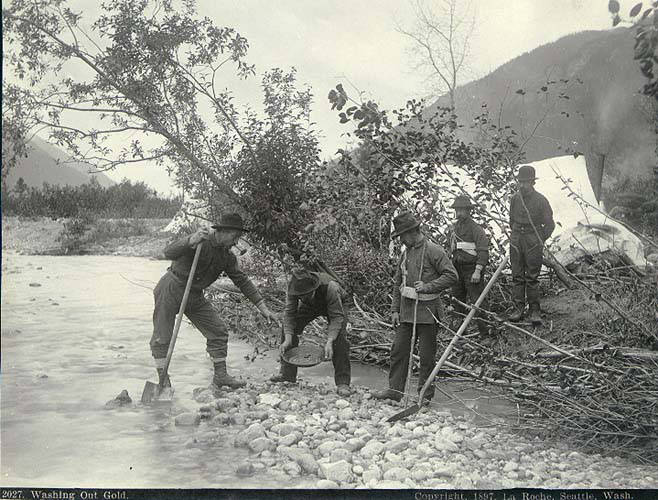

# When to stop testing

*Exhaustive testing is impossible, so exit criteria - not exhaustion - decide when to ship. Coverage isn't confidence, diminishing returns are real, and 'good enough' is a professional call, not a shrug.*

> A tester on their fourth straight day of testing the same login form gets asked "are we done yet?"
> and the honest answer is: they could keep going forever. There's always one more browser, one more
> screen size, one more timezone, one more network condition, one more username with an emoji in it.
> Nobody ever finishes testing something - they stop. The question that actually matters isn't "have
> we tested everything," because the answer to that is always no. It's "have we tested enough of the
> right things to responsibly ship," and answering that on purpose, with a real argument, is one of
> the most underrated skills in the entire craft.

> **In real life**
>
> Proofreading a novel. You could read it once and catch the obvious typos. Read it again and catch
> subtler ones. Read it a tenth time and you'll still find something - a stray comma, an inconsistent
> character detail three hundred pages apart. At some point, continuing to proofread stops being
> about quality and starts being about diminishing returns: the hundredth read catches far less than
> the second read did, while costing exactly as much time. A professional editor doesn't proofread
> until the manuscript is flawless - flawless never arrives. They proofread until the remaining
> errors are rare and minor enough that shipping the book is the right call. That's not laziness,
> that's editorial judgment. Testing software works the same way.

## Exhaustive testing is not a stretch goal, it's a mathematical wall

It's tempting to imagine that with enough time, money, and testers, a team COULD test every
possible input, path, and state combination - that "complete testing" is just an expensive version
of what's already being done. It isn't. Even a trivially small piece of software has an
astronomically large space of possible inputs, states, and orderings; a form with ten fields,
each accepting a handful of value types, already has more realistic combinations than a team could
run in a lifetime, before even considering timing, concurrency, or the operating environment. This
isn't a budget problem that more headcount solves - it's a combinatorial wall that no amount of
resources gets you past. Accepting that fully is the first honest step toward answering "when do we
stop," because it rules out the one answer that sounds responsible but is actually a fantasy:
"we'll stop when we've tested everything."

Once "everything" is off the table, the real question becomes: what's the smallest, smartest set
of tests that gives the team justified confidence to ship? That's where exit criteria come in -
a written-down, agreed-in-advance definition of "done," instead of a vague feeling that arrives
(or doesn't) somewhere around the deadline.

Exit criteria

## Coverage is not confidence

A dangerously common mistake is treating a coverage number - "we hit 95% code coverage" or "we ran
every test case in the suite" - as if it were the same thing as confidence that the software works.
It isn't. Coverage tells you what got exercised; it says nothing about whether the RIGHT things got
exercised, or whether the assertions checking them were any good. A test suite can touch 95% of the
code and still miss the one uncovered 5% that happens to be the refund calculation, or worse,
"cover" the refund calculation with a test that runs the code but never actually checks the output
is correct. High coverage with weak assertions is a false confidence machine - it looks rigorous on
a dashboard and catches almost nothing in reality.

Confidence, the thing that actually matters, comes from a different question: has testing covered
the areas where failure would be likely and costly (see the risk-based testing note for exactly how
to score that), with tests that would actually FAIL if the software were broken? A team with 60%
coverage that deliberately targeted every high-risk path, with sharp assertions, can ship with more
genuine confidence than a team with 95% coverage padded out by low-risk, low-assertion tests. Number
go up is not the same as risk go down - conflating the two is how teams end up surprised by
production incidents despite a beautiful test report.


*'Washing Out Gold', Alaska, 1897, photograph by La Roche — Wikimedia Commons, Public domain*
- **The pan in the water = one testing session** — Every swirl of the pan is a test cycle: scoop material, work it, see what shakes out. The first pans at a fresh creek come up glittering - just like the first hours on a new feature find bugs fast, the obvious ones anyone would trip over. This is the steep, cheap, high-yield part of the curve.
- **The man shovelling fresh gravel = feeding the next cycle** — New material keeps the yield up for a while - new test data, new paths, new browsers. But the same claim, re-dug, pays less each time. When your 'new' test cases are really re-arrangements of old ones, you're washing washed gravel and calling it coverage.
- **The man leaning on his shovel = the knee of the curve** — He's doing the professional's job: watching yield-per-pan drop and asking whether the next hour of digging is worth more here or at the next creek. Teams should ask this question AT the knee - when new-bugs-per-hour visibly slumps - not three days later when the calendar asks it for them.
- **The men standing idle = hours spent past the point of value** — Three of the five prospectors are watching one pan. That's the long flat tail of the curve: hours ten through fifty of testing that surface one obscure bug between them. Still real value - just expensive value, paid at the same hourly rate as the cheap kind. Exit criteria exist so this crowd goes and works a different creek.
- **The caption '2027. Washing Out Gold.' = the record that makes stopping defensible** — The photographer logged the claim, the date, the place. Your equivalent is the exit report: what was tested, what was found, what risks remain OPEN at the stop point. 'We stopped because the exit criteria were met and here's the residual risk' is a professional decision. 'We stopped because Friday' is a confession. The creek still has gold in it when you leave - the point is knowing that, and leaving on purpose.

**How a team decides to stop testing a release - press Play**

1. **Exit criteria agreed before testing starts** — Before the sprint begins: all high-risk test cases must pass, zero open critical or high-severity defects, at least 80% of planned test cases executed. Written down, agreed by the team and the business, not improvised later.
2. **Testing runs, bugs get found and fixed** — Day by day, defects get logged, triaged by risk, and fixed. The bug-find rate is high early (see the diminishing-returns curve) and naturally slows as testing continues.
3. **Coverage and pass-rate numbers climb** — The dashboard fills in: 70% of planned cases run, then 85%, then 95%. This number alone still says nothing about confidence - it's tracked, but it's not the decision.
4. **Exit criteria checked against reality, not vibes** — The team checks the SPECIFIC agreed conditions: are there open criticals? Is planned coverage at or above the target? Not 'does it feel done' - does it meet what was written down.
5. **Ship, with a documented remaining-risk statement** — If exit criteria are met, ship - and write down what WASN'T tested (the long tail) so it's a known, accepted risk, not a silent one. 'Good enough' becomes a documented decision, not a shrug.

The diminishing-returns curve above isn't just a metaphor - it's something you can simulate. Below
is a small model of exactly that pattern: bugs found per hour of testing, starting high and
flattening out, so the shape of "when do additional hours stop paying for themselves" becomes
arithmetic instead of a feeling.

*Run it - a diminishing-returns simulation of bugs found per test hour (Python)*

```python
# A simple model: bugs remaining decays each hour as testing finds a fraction
# of what's left, so the FIND RATE naturally slows -- diminishing returns.
bugs_remaining = 40
find_rate = 0.25   # each hour finds 25% of the currently-remaining bugs
hours = 12
cumulative_found = 0

print(f"{'Hour':<6}{'Found this hour':>17}{'Remaining':>12}{'Cumulative':>13}")
for hour in range(1, hours + 1):
    found_this_hour = round(bugs_remaining * find_rate)
    bugs_remaining -= found_this_hour
    cumulative_found += found_this_hour
    print(f"{hour:<6}{found_this_hour:>17}{bugs_remaining:>12}{cumulative_found:>13}")

print()
print("Total bugs found after", hours, "hours:", cumulative_found)
print("Bugs still remaining, undiscovered:", bugs_remaining)

# Where's the "knee" -- the hour where find-rate drops below a useful threshold?
bugs_remaining = 40
useful_threshold = 2  # once an hour finds fewer than this many bugs, value has dropped a lot
for hour in range(1, hours + 1):
    found_this_hour = round(bugs_remaining * find_rate)
    bugs_remaining -= found_this_hour
    if found_this_hour < useful_threshold:
        print(f"\\nKnee of the curve: hour {hour}, only {found_this_hour} bugs found that hour")
        break

# Note: bugs_remaining never hits exactly zero in this model -- that's the point.
# There is always a theoretical "one more bug" out there.
```

The same diminishing-returns model in Java, for teams whose test-management reporting already
lives in the JVM ecosystem:

*Run it - a diminishing-returns simulation of bugs found per test hour (Java)*

```java
public class Main {
    public static void main(String[] args) {
        double bugsRemaining = 40;
        double findRate = 0.25; // each hour finds 25% of what's currently remaining
        int hours = 12;
        int cumulativeFound = 0;

        System.out.printf("%-6s%17s%12s%13s%n", "Hour", "Found this hour", "Remaining", "Cumulative");
        for (int hour = 1; hour <= hours; hour++) {
            int foundThisHour = (int) Math.round(bugsRemaining * findRate);
            bugsRemaining -= foundThisHour;
            cumulativeFound += foundThisHour;
            System.out.printf("%-6d%17d%12.0f%13d%n", hour, foundThisHour, bugsRemaining, cumulativeFound);
        }

        System.out.println();
        System.out.println("Total bugs found after " + hours + " hours: " + cumulativeFound);
        System.out.println("Bugs still remaining, undiscovered: " + Math.round(bugsRemaining));

        // Find the "knee" of the curve
        bugsRemaining = 40;
        int usefulThreshold = 2;
        for (int hour = 1; hour <= hours; hour++) {
            int foundThisHour = (int) Math.round(bugsRemaining * findRate);
            bugsRemaining -= foundThisHour;
            if (foundThisHour < usefulThreshold) {
                System.out.println();
                System.out.println("Knee of the curve: hour " + hour + ", only " + foundThisHour + " bugs found that hour");
                break;
            }
        }

        // bugsRemaining never reaches exactly zero in this model -- there is
        // always a theoretical "one more bug" left to find.
    }
}
```

> **Tip**
>
> When a manager asks "why are we stopping testing when we haven't found every bug," the diminishing-
> returns simulation is the answer in one sentence: "the last few hours of testing are finding a lot
> fewer bugs than the first few did, and the ones still hiding are progressively rarer and less
> likely to matter - the exit criteria we agreed on up front are met, and continuing past that point
> spends time for shrinking returns." That's a professional judgment call, backed by a curve, not a
> guess dressed up as one.

### Your first time: Your mission: find the knee of the curve yourself

- [ ] Run the Python simulation as-is — Read the hour-by-hour table. Notice how quickly the 'found this hour' column shrinks, even though 'bugs remaining' never technically reaches zero.
- [ ] Change the find rate — Lower find_rate from 0.25 to 0.10, simulating a harder-to-test system, and re-run. Notice the knee of the curve arrives later - more hours are needed before returns visibly diminish.
- [ ] Set your own exit criteria first, then check the numbers against it — Before looking at the output, write down a rule like 'stop once an hour finds fewer than 2 bugs.' Then run the simulation and check which hour actually satisfies your own rule - this is exit criteria in miniature.
- [ ] Try a much higher bugs_remaining starting value — Set bugs_remaining to 200 and re-run. Confirm the SHAPE of the curve (fast early finds, flattening tail) holds regardless of the starting count - that shape is the real lesson, not the specific numbers.
- [ ] Write the one-sentence justification — Using your own exit-criteria rule and the hour it was satisfied, write the sentence you'd say in a release meeting to justify stopping testing at that point.

You've now practiced turning "are we done yet" from a feeling into a rule you set in advance and a
number you can point to when the rule is satisfied.

- **A team keeps testing past the release date because 'we might still find something,' with no defined stopping point.**
  Introduce exit criteria before the NEXT testing cycle starts, in writing, agreed with stakeholders: target pass rate, maximum open-defect severity, minimum planned coverage. Testing without a predefined 'done' will always expand to fill the time available.
- **Leadership treats a high code-coverage percentage as proof the release is safe to ship.**
  Show the difference between coverage (what got exercised) and confidence (whether the exercised code was checked with assertions strong enough to catch real failures, in the areas that matter most). Ask what percentage of HIGH-RISK areas are covered, not just what percentage of all code is.
- **A tester feels guilty or unprofessional shipping with known, un-fixed minor bugs still open.**
  Reframe: shipping with a documented list of known, accepted, low-severity issues is a normal, professional exit criterion being met, not a failure. The failure mode is shipping with UNDOCUMENTED risk, not with a written-down, deliberately-accepted one.
- **'Good enough' gets used as an excuse to stop testing early with no analysis at all, just schedule pressure.**
  Separate the two: 'good enough' as a lazy shrug skips the risk analysis entirely. 'Good enough' as a professional judgment call means the exit criteria were actually checked against real risk coverage before stopping - same phrase, very different rigor underneath.

### Where to check

The "when to stop" decision shows up as a concrete checkpoint, not a vague feeling, at these
moments:

- **Sprint or release planning** - exit criteria get written down here, before testing starts, so
  "are we done" has a predefined answer to check against later.
- **Daily standups during a test cycle** - track progress against the AGREED criteria (open
  criticals, planned coverage), not against a general sense of how much testing "feels" done.
- **Go/no-go release meetings** - this is where exit criteria get checked explicitly against
  reality, and any gap gets a documented, accepted-risk decision, not a silent skip.
- **Regression suite reviews** - ask whether continuing to run a slow, low-yield suite is still
  worth the hours, using the same diminishing-returns logic applied to maintenance, not just to a
  single release.
- **Post-release retrospectives** - if a bug slipped through, ask whether the exit criteria were
  wrong (too loose) or whether they were right but skipped under pressure - those are different
  problems with different fixes.

Tester's habit: **write exit criteria down BEFORE testing starts, not while arguing about whether
to ship** - the moment "are we done" first gets asked out loud in a deadline crunch is the moment
the decision has already gotten too political to be purely technical.

### Worked example: the release that shipped with a known list

1. **The setup:** A team is a day from a planned release. Exit criteria, agreed two weeks earlier,
   were: 90% of planned test cases executed, zero open critical or high-severity defects, and a
   documented list of any open medium/low-severity issues.
2. **Where things stand:** 92% of planned cases executed. Zero open criticals or highs. Three open
   medium-severity bugs remain: a slightly-misaligned icon on one screen size, a slow-loading
   secondary report, and an edge-case validation message that's technically correct but oddly
   worded.
3. **The instinct to fight:** one team member wants to delay the release to fix all three, arguing
   "we should ship polished, not just passing."
4. **The professional judgment call:** the tester checks the three bugs against the agreed exit
   criteria, not against a feeling of polish. All three are medium or lower severity, none touch the
   high-risk areas identified during risk-based planning, and the criteria explicitly allowed for a
   documented list of exactly this kind of issue.
5. **What actually happens:** the release ships on schedule, with the three known issues logged,
   prioritized for the next sprint, and visible to the support team so they're not surprised by a
   customer report.
6. **Why this isn't "settling":** the decision followed a rule set in advance, under no time
   pressure, by people thinking clearly - which is exactly the opposite of a rushed, undocumented
   shortcut made in a panic the night before a deadline.
7. **The lesson for a tester:** "good enough" is not the absence of standards, it's standards that
   were set in advance and then actually honored when the moment to apply them arrived - which
   takes more discipline, not less, than testing until the clock runs out.

> **Common mistake**
>
> Treating "we're out of time" as the same thing as "we're done testing." Running out of time is a
> scheduling fact; being done is a judgment about whether the exit criteria (set based on actual
> risk) have been met. A team that stops testing purely because the calendar says so, without
> checking those criteria, isn't making a professional call - it's gambling and hoping the gap
> between "time's up" and "actually tested enough" doesn't contain anything expensive.

**Quiz.** A release has hit 95% code coverage and the test suite is all green, but the exit criteria haven't been formally checked. What's the most accurate statement about whether it's safe to ship?

- [ ] 95% coverage with a green suite is sufficient proof the release is safe to ship - coverage that high effectively substitutes for exit criteria
- [x] Coverage and pass rate describe what was exercised and whether it passed, not whether the exercised areas were the highest-risk ones or whether assertions were strong enough - exit criteria still need to be checked explicitly before deciding to ship
- [ ] The release should never ship, because 95% coverage means 5% was never tested at all
- [ ] Coverage numbers are meaningless and should be ignored entirely in favor of gut feeling

*Coverage and a green test suite are useful signals but they measure what got exercised, not whether the RIGHT (highest-risk) areas were covered with meaningful assertions. A high coverage number can coexist with weak tests that never actually check outputs, or with the uncovered 5% happening to be the most dangerous code path. The professional move is checking coverage against the agreed exit criteria and against risk analysis, not treating a dashboard percentage as a stand-in for that check. Option A overtrusts the number, option C treats any gap as disqualifying (which would make shipping anything impossible, since exhaustive testing doesn't exist), and option D throws away a genuinely useful signal.*

- **Why exhaustive testing is impossible** — The combinatorial space of inputs, states, and timings for even simple software vastly exceeds what any team can run in available time -- it's a mathematical wall, not a budget problem.
- **Exit criteria, defined** — A predefined, agreed-in-advance set of conditions (pass rate, max open-defect severity, minimum coverage, time boundary) that determine when testing is considered complete -- decided before testing starts, not judged in the moment.
- **Coverage versus confidence** — Coverage measures what was exercised; confidence depends on whether the exercised areas were the highest-risk ones and whether the assertions checking them were strong enough to actually catch failures. High coverage with weak assertions is false confidence.
- **Diminishing returns in testing** — Early testing hours find bugs fast; later hours find progressively fewer, rarer, and less impactful ones. The curve flattens but never reaches zero -- there's always a theoretical 'one more bug.'
- **'Good enough' as a professional judgment call** — Good enough means exit criteria were set in advance based on real risk analysis, then honestly checked and met -- not a shrug made under deadline pressure with no analysis behind it.
- **The real question when deciding to stop testing** — Not 'have we tested everything' (always no) but 'have we tested enough of the highest-risk things, against criteria we agreed on before we started, to responsibly ship.'

### Challenge

Write a set of exit criteria for a real or imagined release - at minimum a target pass rate, a
maximum allowed open-defect severity, and a coverage target for the highest-risk area. Then run the
Python or Java diminishing-returns simulation with your own bugs_remaining and find_rate values, and
write one sentence stating at which hour your simulated testing would have satisfied your own exit
criteria.

### Ask the community

> Exit criteria question: my team currently decides `[when to stop testing / when a release is ready]` based on `[the calendar / a gut feeling / whoever is most nervous in the room]`. I want to introduce written exit criteria covering `[pass rate / defect severity / coverage of high-risk areas]`. Has anyone successfully introduced this on a team that previously had none, and what pushback did you get?

The pattern worth sharing back: teams that resist written exit criteria are often really resisting
having a stopping decision be visible and attributable - which is exactly the discomfort that makes
writing them down worthwhile.

- [Software testing overview - coverage, exit criteria, and the limits of exhaustive testing](https://en.wikipedia.org/wiki/Software_testing)
- [ISO/IEC/IEEE 29119 - software testing standard covering test completion and exit criteria](https://www.iso.org/standard/81291.html)
- [Ministry of Testing - community discussion on coverage versus confidence](https://www.ministryoftesting.com/)
- [When you should stop testing (critical flows lens) — The Testing Academy](https://www.youtube.com/watch?v=F6kfRxyAO2A)

🎬 [When do you stop testing? - SDET Unicorns answers the interview classic with real exit criteria](https://www.youtube.com/watch?v=jQ9ncEut2gk) (6 min)

- Exhaustive testing is mathematically impossible for any real system -- the combinatorial space of inputs and states is too large, no matter the budget or headcount.
- Exit criteria, written and agreed BEFORE testing starts, replace 'test until it feels done' with a specific, checkable definition of 'done.'
- Coverage is not confidence -- it measures what got exercised, not whether the highest-risk areas were covered with assertions strong enough to catch real failures.
- Testing hours follow a diminishing-returns curve: early hours find bugs fast, later hours find fewer and rarer ones, and the curve never technically reaches zero.
- 'Good enough' is a professional judgment call when it's backed by pre-agreed exit criteria honestly checked against real risk -- it's a shrug when it's just the calendar running out.


---
_Source: `packages/curriculum/content/notes/qa-foundations/why-testing-matters/when-to-stop.mdx`_
