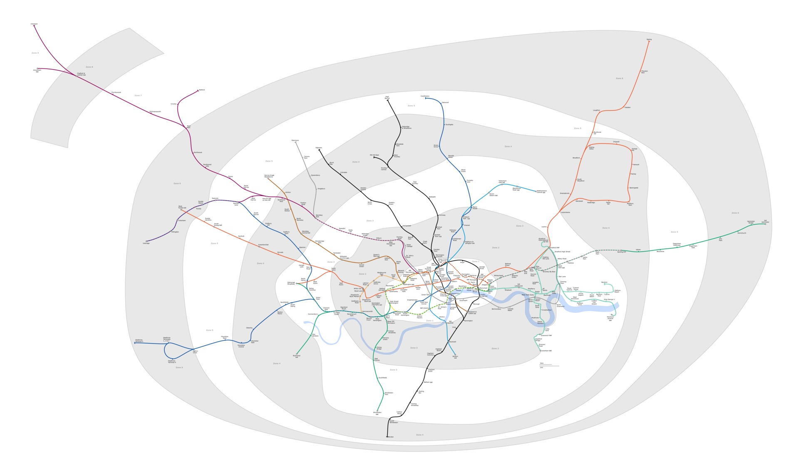

# Reading EXPLAIN & execution plans

*Execution plans are trees of estimates and measured work, not oracle poems. Learn PostgreSQL scan and join nodes, rows-times-loops arithmetic, BUFFERS, and safe EXPLAIN ANALYZE use.*

> A plan is a tree, not a horoscope. If your diagnosis starts with "Seq Scan bad" and ends before actual rows, loops, and buffers, the database deserves a second opinion.

> **In real life**
>
> A transit map shows how passengers flow through stations. PostgreSQL plan leaves produce rows, parent nodes transform them, and repeated loops multiply work—the crowded interchange matters more than the color of one line.

**execution plan**: EXPLAIN displays the plan PostgreSQL's optimizer chooses, including estimated cost and row counts. EXPLAIN ANALYZE actually executes the statement and adds measured rows, loops, and timing; BUFFERS reports shared, local, and temporary block activity, and machine-readable JSON is preferable for automation.

## Read bottom-up, then test the estimates

- Leaf scans produce raw rows: sequential, index, bitmap, or other sources.
- Parent nodes join, sort, aggregate, limit, and filter their children.
- Estimated `cost=startup..total` uses planner cost units, not milliseconds.
- Compare estimated rows with actual rows at each node; large divergence often misleads later choices.
- Multiply per-loop actual rows/time by loops to understand repeated work.
- `EXPLAIN ANALYZE` executes writes too; wrap experiments in a transaction and roll back when appropriate.

> **Tip**
>
> For automated comparison use `FORMAT JSON`; text is compact for humans but brittle for parsers.

> **Common mistake**
>
> Comparing elapsed time from one warm-cache run. Plans need row estimates, loop counts, and buffers across representative parameters and repeated conditions.


*London Underground full geographic map — Ed g2s and DavidCane, Wikimedia Commons, CC BY-SA 3.0. [Source](https://commons.wikimedia.org/wiki/File:London_Underground_full_map.png)*
- **Leaf routes** — Scan nodes introduce rows from tables and indexes into the plan tree.
- **Busy interchange** — Join and aggregate nodes combine child flows; row-estimate mistakes amplify here.
- **Repeated branch** — Loops can make a cheap-looking inner node execute thousands of times.

**A disciplined plan read**

1. **Confirm query and parameters** — Different values can produce different cardinalities and plans.
2. **Start at leaf scans** — Identify access method, conditions, filters, and rows removed.
3. **Walk upward through the tree** — Track rows through joins, sorts, aggregates, and limits.
4. **Compare estimates with actuals** — Find the earliest major cardinality error rather than blaming the final node.
5. **Read loops and buffers** — Quantify repeated work and I/O before proposing a change.

*Run it — find plan-estimate errors (Python)*

```python
nodes = [
    {"name": "Index Scan tickets_status_idx", "estimated": 10, "actual": 950, "loops": 1},
    {"name": "Nested Loop", "estimated": 10, "actual": 950, "loops": 1},
    {"name": "Index Scan users_pkey", "estimated": 1, "actual": 1, "loops": 950},
]
for node in nodes:
    ratio = node["actual"] / max(node["estimated"], 1)
    total_rows = node["actual"] * node["loops"]
    print(f"{node['name']}: estimate error {ratio:.0f}x, total rows across loops {total_rows}")

# Index Scan tickets_status_idx: estimate error 95x, total rows across loops 950
# Nested Loop: estimate error 95x, total rows across loops 950
# Index Scan users_pkey: estimate error 1x, total rows across loops 950
```

*Run it — calculate repeated node work (Java)*

```java
import java.util.*;
public class Main {
  record Node(String name, long estimated, long actual, long loops) {}
  public static void main(String[] args) {
    var nodes = List.of(new Node("Bitmap Heap Scan", 100, 120, 1), new Node("Index Scan inner", 1, 1, 120));
    for (Node n : nodes) {
      double ratio = (double)n.actual() / Math.max(n.estimated(), 1);
      System.out.printf("%s: %.1fx estimate, %d total rows%n", n.name(), ratio, n.actual() * n.loops());
    }
  }
}
/* Bitmap Heap Scan: 1.2x estimate, 120 total rows
   Index Scan inner: 1.0x estimate, 120 total rows */
```

### Your first time: Your mission: narrate one plan tree

- [ ] Capture EXPLAIN ANALYZE BUFFERS FORMAT JSON — Use a read-only representative query first.
- [ ] Draw the tree bottom-up — Name scans, joins, filters, sorts, and aggregates.
- [ ] Mark first estimate divergence — Compute actual/estimated row ratio at every node.
- [ ] Account for loops and buffers — State total repeated work and cache/disk evidence.

You can now explain the plan without worshipping its indentation.

- **Actual rows differ wildly from estimates.**
  Refresh statistics and investigate skew, correlation, expressions, or cross-column dependencies before adding an index.
- **EXPLAIN ANALYZE changed data.**
  It executes the statement; test writes inside BEGIN/ROLLBACK or use plain EXPLAIN when execution is unsafe.
- **A node time looks tiny but query is slow.**
  Multiply by loops and inspect child work and buffers; per-loop values can hide aggregate cost.

### Where to check

- Scan `Index Cond`, `Filter`, and rows removed.
- Estimated versus actual rows at the earliest divergence.
- Loops, buffer hits/reads, temp blocks, and spills.
- Planning and execution settings/statistics for reproducibility.

### Worked example: the nested loop blamed for somebody else's estimate

1. Statistics estimate 10 open tickets for a project; actual data has 950.
2. The planner chooses a nested loop expecting ten user lookups.
3. The inner lookup runs 950 times and dominates buffers.
4. Replacing the join blindly treats the symptom.
5. Correcting stale/skewed cardinality information changes the upstream estimate and lets the planner compare joins honestly.

**Quiz.** What does EXPLAIN ANALYZE do that plain EXPLAIN does not?

- [ ] Only changes output color
- [x] Actually executes the statement and reports measured rows/timing
- [ ] Always creates an index
- [ ] Returns result rows to the client

*ANALYZE runs the statement to collect actual execution statistics; data-modifying side effects therefore happen unless rolled back.*

- **Planner cost** — Arbitrary comparative cost units, not elapsed milliseconds.
- **Cardinality error** — Difference between estimated and actual row counts; it can distort downstream plan choices.
- **BUFFERS hit vs read** — Hit avoided a read because block was cached; read required fetching a block.

### Challenge

Find one plan with at least three nodes. Calculate actual/estimated ratio and rows times loops for each, then identify the first node where the plan's model diverges from reality.

### Ask the community

> Plan JSON for `[query]` first diverges at `[node]`: estimated `[n]`, actual `[n]`, loops `[n]`, buffers `[values]`. Which statistic or predicate assumption should I test next?

Share representative parameters and data distribution.

- [PostgreSQL — Using EXPLAIN](https://www.postgresql.org/docs/current/using-explain.html)
- [PostgreSQL — EXPLAIN command](https://www.postgresql.org/docs/current/sql-explain.html)

🎬 [Database Indexing Explained with PostgreSQL — Hussein Nasser](https://www.youtube.com/watch?v=-qNSXK7s7_w) (18 min)

- Plans are trees: scans produce rows and parent nodes transform them.
- Estimated cost units are not milliseconds.
- Compare estimated and actual cardinality before blaming a node type.
- Multiply actual work by loops and inspect buffers.
- EXPLAIN ANALYZE executes statements, including writes.


## Related notes

- [[Notes/relational-databases-engineer-level/indexes-and-performance/how-an-index-works|How an index works]]
- [[Notes/relational-databases-engineer-level/indexes-and-performance/query-tuning-and-over-indexing-writes|Query tuning & over-indexing writes]]
- [[Notes/relational-databases-engineer-level/transactions-and-concurrency/acid-properly|ACID, properly]]


---
_Source: `packages/curriculum/content/notes/relational-databases-engineer-level/indexes-and-performance/reading-explain-and-execution-plans.mdx`_
