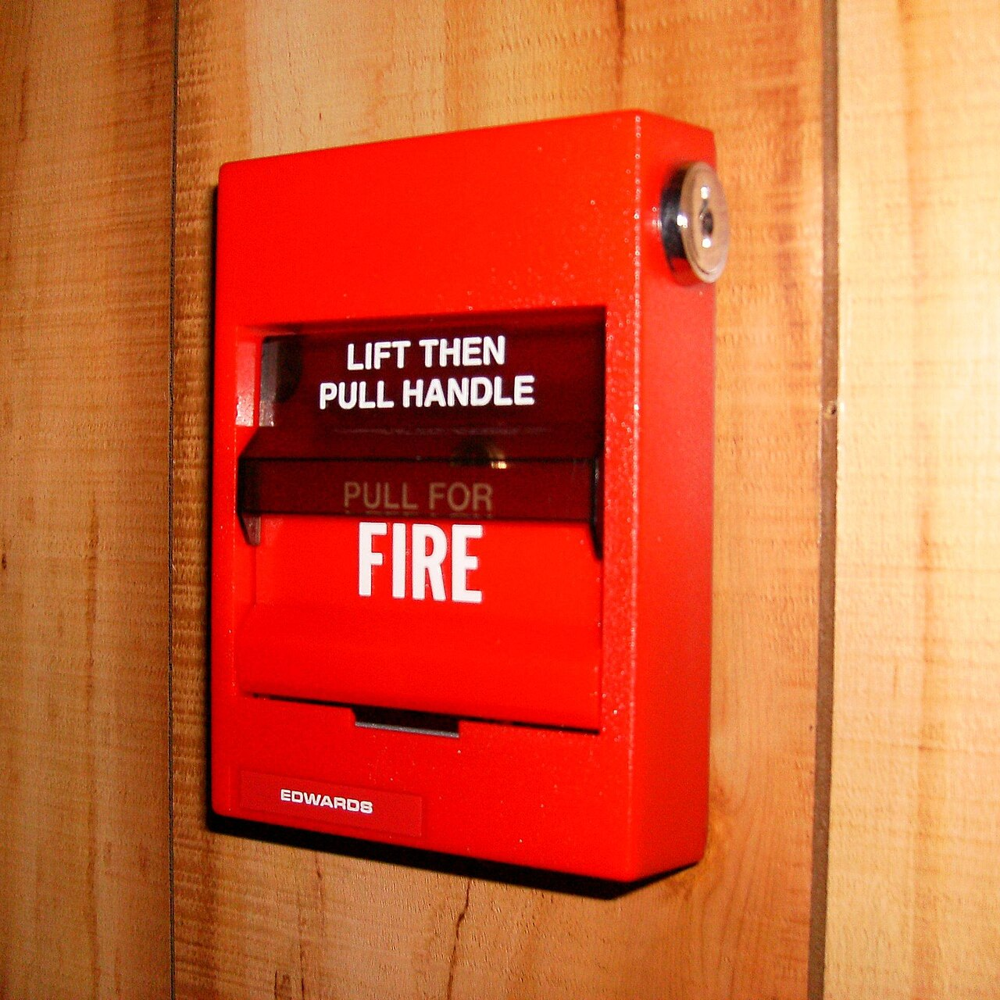

# Error Handling in SQL

*Test PostgreSQL failures by SQLSTATE and diagnostics while proving that exception paths preserve atomicity.*

> Error text is written for humans and may change; an error contract needs machine-stable evidence. In PostgreSQL that starts with SQLSTATE, then constraint and object diagnostics, then the state left behind.

> **In real life**
>
> An error handler is a fire alarm system. The code identifies the class of incident, diagnostics locate it, rollback contains it, and logs help responders. Painting over the alarm message fixes nothing.

## Assert the failure contract

PostgreSQL assigns five-character **SQLSTATE**: A machine-readable five-character code that classifies a database outcome or error. codes. The first two characters identify a class, such as `23` for integrity constraint violations. In PL/pgSQL, an `EXCEPTION` block can catch by condition name or SQLSTATE, and `GET STACKED DIAGNOSTICS` can retrieve fields such as constraint name and message detail.


*Photo: Edwardsalarms — Wikimedia Commons, public domain. [Source](https://commons.wikimedia.org/wiki/File:Fire_Alarm_Pull_Station.JPG)*
- **Detector** — The database detects a violated condition and emits a SQLSTATE.
- **Control logic** — A narrow handler maps known codes to retry, reject, compensate, or rethrow.
- **Evidence** — Constraint, table, detail, and transaction outcome make the incident diagnosable.

> **Tip**
>
> Assert SQLSTATE and, when relevant, `CONSTRAINT_NAME`. Do not parse localized message text to decide application behavior.

> **Common mistake**
>
> Catching `OTHERS` and returning success. It destroys the original signal and can make callers trust a partially completed business operation.

**Failure becomes a decision**

1. **Operation fails** — PostgreSQL emits a code and aborts the current statement or transaction context.
2. **Classify** — Match a narrow expected condition such as unique_violation.
3. **Inspect** — Capture structured diagnostics and determine whether state is safe.
4. **Respond** — Reject, retry only transient cases, compensate, or rethrow with context.

*Classify SQLSTATE without parsing messages*

```python
def decision(code):
    if code == "23505":
        return "reject duplicate"
    if code == "40001":
        return "retry whole transaction"
    if code.startswith("23"):
        return "reject integrity violation"
    return "rethrow and investigate"

for state in ["23505", "23503", "40001", "XX000"]:
    print(state, "->", decision(state))
```

*Route errors by SQLSTATE in Java*

```java
import java.util.*;
class Main {
  static String decision(String sqlState) {
    if (sqlState.equals("23505")) return "reject duplicate";
    if (sqlState.equals("40001")) return "retry whole transaction";
    if (sqlState.startsWith("23")) return "reject integrity violation";
    return "rethrow and investigate";
  }
  public static void main(String[] args) {
    for (String code : List.of("23505", "23503", "40001", "XX000"))
      System.out.println(code + " -> " + decision(code));
  }
}
```

### Your first time: Test one error path

- [ ] Force one specific condition — Use a minimal fixture that can fail for only the intended reason.
- [ ] Capture structured diagnostics — Record SQLSTATE and named constraint or object fields.
- [ ] Assert state containment — Verify every table touched by the failed unit, including audit or outbox rows.
- [ ] Test caller recovery — Confirm reject, retry, or rethrow behavior without parsing message text.

- **Tests fail after a server upgrade or locale change.**
  Replace message-string assertions with SQLSTATE and structured diagnostic fields.
- **A handler logs the error but callers see success.**
  Rethrow unexpected conditions and make failure explicit in the routine contract.
- **Retries repeat permanent failures.**
  Retry only documented transient classes and rerun the whole transaction with a bound.

### Where to check

Inspect client exception fields, SQLSTATE, constraint/table/column diagnostics, PL/pgSQL context, server logs, and `current transaction is aborted` follow-on errors. The first failure is the cause; later ones may be fallout.

### Worked example: Duplicate order reference

Insert order reference `R-7`, then submit it again. Assert SQLSTATE `23505`, the expected unique constraint name, no second order, and no orphan payment/outbox row. The API maps this known conflict to a deterministic response while unexpected codes are rethrown.

**Quiz.** What is the most stable basis for branching on a PostgreSQL error?

- [ ] English message text
- [x] SQLSTATE and structured diagnostics
- [ ] Timestamp
- [ ] Stack-trace length

*SQLSTATE is designed for machine-readable classification; diagnostics add object-specific evidence.*

- **SQLSTATE** — A five-character code; its first two characters identify the error class.
- **Class 23** — Integrity constraint violation, including unique and foreign-key failures.
- **GET STACKED DIAGNOSTICS** — PL/pgSQL command for structured fields from the currently handled exception.

### Challenge

For four failures in your system, record SQLSTATE, structured fields, expected state after failure, caller action, and whether retry is safe. Remove every message-text branch.

### Ask the community

> Operation: [SQL/routine]. SQLSTATE: [code]. Diagnostics: [constraint/table/detail]. State after failure: [diff]. Handler action: [behavior]. Is this recovery safe?

Redact values, but preserve codes, object names, and transaction sequence.

- [PostgreSQL — Error Codes](https://www.postgresql.org/docs/current/errcodes-appendix.html)
- [PostgreSQL — PL/pgSQL Errors and Messages](https://www.postgresql.org/docs/current/plpgsql-control-structures.html)

🎬 [Learn PostgreSQL — Full Course for Beginners](https://www.youtube.com/watch?v=qw--VYLpxG4) (260 min)

- Assert SQLSTATE and structured fields instead of message text.
- A failure test must prove atomicity across every touched table.
- Catch narrowly; rethrow unexpected conditions with context.
- Retry only transient errors and rerun the complete transaction safely.


## Related notes

- [[Notes/relational-databases-engineer-level/programmable-objects/testing-procedures|Testing procedures]]
- [[Notes/relational-databases-engineer-level/data-integrity-at-scale/constraints-and-referential-integrity|Constraints & referential integrity]]
- [[Notes/relational-databases-engineer-level/programmable-objects/triggers|Triggers]]


---
_Source: `packages/curriculum/content/notes/relational-databases-engineer-level/programmable-objects/error-handling-in-sql.mdx`_
