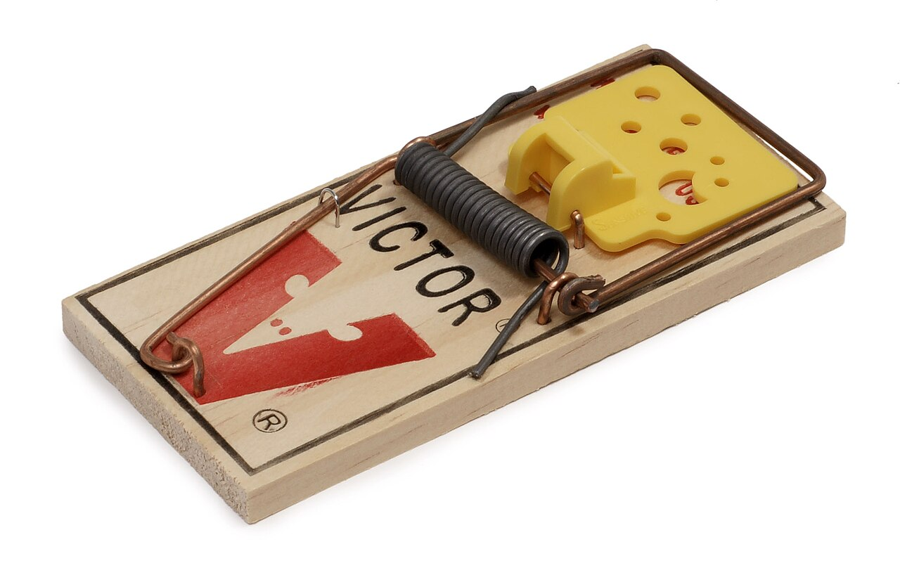

# Triggers

*Test PostgreSQL triggers as hidden event handlers, including timing, row scope, recursion, and audit side effects.*

> Triggers make a statement do more than it says. That hidden work is useful—and exactly why a test must observe timing, scope, ordering, and side effects instead of trusting the visible SQL.

> **In real life**
>
> A **trigger**: Database code fired automatically for a declared event, timing, and scope. is a mousetrap: a defined event releases a mechanism. Test what sets it off, what it changes, whether it fires once or per row, and whether resetting it causes another snap.

## Map event to effect

A PostgreSQL trigger function takes no ordinary arguments and returns `trigger`. Its context includes `NEW`, `OLD`, `TG_OP`, and `TG_LEVEL`. A `BEFORE` row trigger may replace `NEW` or return null to skip the row; an `AFTER` trigger observes the final effect, and its return value is ignored.


*Photo: Evan-Amos — Wikimedia Commons, public domain. [Source](https://commons.wikimedia.org/wiki/File:Victor-Mousetrap.jpg)*
- **Event** — INSERT, UPDATE, DELETE, or TRUNCATE is the pressure that starts the mechanism.
- **Condition and timing** — BEFORE, AFTER, INSTEAD OF, and WHEN decide whether and when it moves.
- **Effect** — The trigger may rewrite a row, reject it, or emit an audit record—possibly once per affected row.

> **Tip**
>
> Query `pg_trigger` and use `pg_get_triggerdef(oid)` before testing. The active definition—not a migration file you remember—is the executable truth.

> **Common mistake**
>
> Testing a one-row UPDATE when production statements update thousands. A row trigger fires per row; a statement trigger fires once. Your fixture must distinguish the two.

**A row-trigger lifecycle**

1. **Statement arrives** — An INSERT, UPDATE, or DELETE targets one or more rows.
2. **BEFORE** — Row code can validate, modify NEW, or suppress the operation.
3. **Row changes** — Constraints and the physical operation determine the final stored row.
4. **AFTER** — Downstream work such as audit emission sees the completed change.

*Count row-level trigger effects*

```python
rows = [{"id": 1}, {"id": 2}, {"id": 3}]
audit = []
for row in rows:
    row["status"] = "READY"          # BEFORE-row effect
    audit.append(("UPDATE", row["id"]))  # AFTER-row effect

assert len(audit) == len(rows)
print(rows)
print("audit events:", audit)
```

*Simulate trigger timing in Java*

```java
import java.util.*;
class Main {
  static Map<String, String> beforeInsert(Map<String, String> row) {
    Map<String, String> copy = new HashMap<>(row);
    copy.put("status", copy.getOrDefault("status", "PENDING").toUpperCase());
    return copy;
  }
  public static void main(String[] args) {
    List<String> audit = new ArrayList<>();
    Map<String, String> stored = beforeInsert(Map.of("id", "42", "status", "pending"));
    audit.add("INSERT id=" + stored.get("id") + " status=" + stored.get("status"));
    System.out.println(stored);
    System.out.println(audit);
  }
}
```

### Your first time: Expose a hidden trigger

- [ ] Inventory active triggers — Record event, timing, level, WHEN clause, function, and enabled state.
- [ ] Test each operation — INSERT, UPDATE, and DELETE can expose different NEW/OLD behavior.
- [ ] Use a multi-row statement — Count both business rows and side effects to reveal row-versus-statement errors.
- [ ] Assert rollback — Force a failure and confirm the base change and trigger side effects roll back together.

- **One UPDATE creates hundreds of audit rows.**
  Check FOR EACH ROW versus FOR EACH STATEMENT and decide which scope the contract requires.
- **A trigger silently changes submitted values.**
  Compare requested values with RETURNING output and stored rows; inspect BEFORE trigger assignments to NEW.
- **Updates recurse until an error.**
  Trace trigger-written tables and columns; add a narrow WHEN condition or redesign the cycle rather than masking depth.

### Where to check

Inspect `pg_trigger`, `pg_get_triggerdef`, the trigger function source, server logs, and exact base/audit row diffs. Check disabled or replica-only state when environments disagree.

### Worked example: An updated_at trigger under a no-op update

Arrange one row with a known timestamp. Update a business field and assert `updated_at` advances. Run a no-op assignment and decide from the contract whether it should advance. Update three rows in one statement and assert exactly three timestamps—not one, not six.

**Quiz.** Which trigger test best reveals row-versus-statement scope?

- [ ] SELECT one row
- [x] UPDATE several rows with one statement and count side effects
- [ ] Read the function name
- [ ] Run VACUUM

*One statement affecting multiple rows makes the two trigger levels observably different.*

- **NEW / OLD** — Trigger context records for the proposed new row and prior row, depending on operation.
- **BEFORE row trigger** — Can return a modified NEW row or null to suppress that row operation.
- **AFTER trigger** — Runs after the change; its return value is ignored.

### Challenge

Build a trigger matrix with rows for INSERT/UPDATE/DELETE and columns for one row, many rows, rejected row, rollback, and retry. Add expected base and side-effect counts.

### Ask the community

> Trigger definition: [event/timing/level]. Statement: [SQL]. Base-row diff: [evidence]. Side-effect diff: [evidence]. Why did it fire this many times?

Share the rendered trigger definition and PostgreSQL version, not only the function body.

- [PostgreSQL — Trigger Functions](https://www.postgresql.org/docs/current/plpgsql-trigger.html)
- [PostgreSQL — Overview of Trigger Behavior](https://www.postgresql.org/docs/current/trigger-definition.html)

🎬 [Learn PostgreSQL — Full Course for Beginners](https://www.youtube.com/watch?v=qw--VYLpxG4) (260 min)

- A trigger test starts with event, timing, level, condition, and enabled state.
- BEFORE row triggers can alter or suppress a row; AFTER return values are ignored.
- Multi-row statements expose firing-count mistakes.
- Assert base changes and trigger side effects across rollback and retry.


## Related notes

- [[Notes/relational-databases-engineer-level/programmable-objects/stored-procedures-and-functions|Stored procedures & functions]]
- [[Notes/relational-databases-engineer-level/programmable-objects/testing-procedures|Testing procedures]]
- [[Notes/relational-databases-engineer-level/data-integrity-at-scale/auditing-data-changes|Auditing data changes]]


---
_Source: `packages/curriculum/content/notes/relational-databases-engineer-level/programmable-objects/triggers.mdx`_
