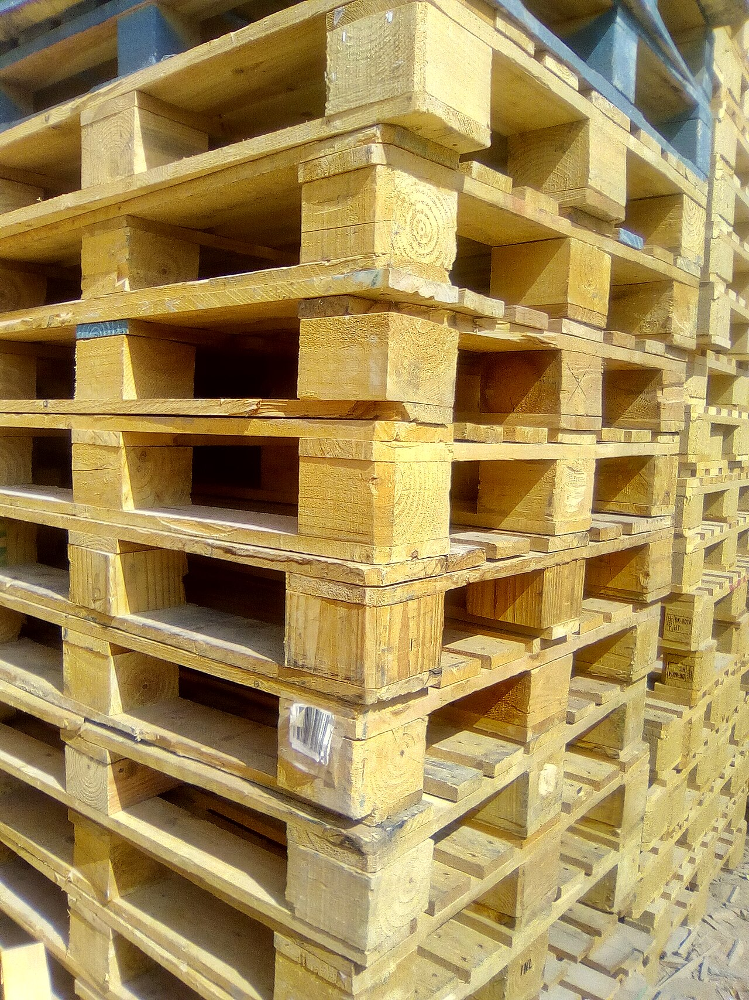

# When to denormalize

*Denormalize only for a measured read bottleneck with explicit ownership, refresh, staleness, reconciliation, and rollback rules; duplication without operations is just two truths entering a cage match.*

> Denormalization trades join cost for synchronization cost. If nobody wrote down who pays the synchronization bill, production will choose someone during an incident.

> **In real life**
>
> Pre-stacked pallets speed dispatch because common bundles are ready. They also require inventory rules when the source boxes change. Denormalized data is the same operational bargain.

**denormalization**: Denormalization deliberately stores derived or duplicated data to optimize a measured workload. It requires a canonical source, update/refresh mechanism, acceptable staleness, reconciliation checks, and a rollback path.

## Earn the duplicate

Candidates include stored summaries, materialized views, search documents, and duplicated display
fields. PostgreSQL materialized views persist query results and can be faster to read, but are not
always current; `REFRESH MATERIALIZED VIEW` regenerates their data.

> **Tip**
>
> Write a staleness budget in time and business impact: “dashboard may lag five minutes,” not “eventually consistent-ish.”

> **Common mistake**
>
> Denormalizing before measuring. A missing index or bad query then survives beneath a new consistency problem.


*Wood pallets — Nadeem55, Wikimedia Commons, CC BY-SA 4.0. [Source](https://commons.wikimedia.org/wiki/File:Wood_pallets.jpg)*
- **Canonical boxes** — Normalized source facts remain authoritative.
- **Prebuilt bundle** — A read-optimized copy answers a measured access pattern.
- **Reconciliation** — Checks detect missing, stale, or conflicting copies.

**Make denormalization an engineered trade**

1. **Measure bottleneck** — Capture latency, throughput, plan, and load.
2. **Try simpler fixes** — Query shape, indexes, caching, or partitioning.
3. **Define canonical owner** — One source remains authoritative.
4. **Set refresh and staleness** — Document timing, retries, and failure behavior.
5. **Reconcile and rollback** — Continuously compare and retain an exit path.

*Run it — detect a stale summary (Python)*

```python
orders = [40, 35, 25]
canonical_total = sum(orders)
summary_total = 75
print("canonical:", canonical_total)
print("summary:", summary_total)
print("drift:", canonical_total - summary_total)
print("refresh required:", canonical_total != summary_total)

# canonical: 100
# summary: 75
# drift: 25
# refresh required: True
```

*Run it — detect a stale summary (Java)*

```java
import java.util.*;
public class Main {
  public static void main(String[] args){
    int canonical=List.of(40,35,25).stream().mapToInt(Integer::intValue).sum();
    int summary=75;
    System.out.println("canonical: "+canonical); System.out.println("summary: "+summary);
    System.out.println("drift: "+(canonical-summary)); System.out.println("refresh required: "+(canonical!=summary));
  }
}

/* canonical: 100
   summary: 75
   drift: 25
   refresh required: true */
```

### Your first time: Your mission: write a denormalization contract

- [ ] Capture baseline plan and latency — Use representative volume and concurrency.
- [ ] Name canonical and derived stores — Every duplicated field has one owner.
- [ ] Define refresh and failure policy — Include retries, backfill, ordering, and idempotency.
- [ ] Automate reconciliation and rollback — Compare counts/sums/keys and prove the derived path can be disabled.

- **Derived data is stale beyond budget.**
  Alert on refresh age, inspect failed updates, and fall back to canonical reads where required.
- **Refresh blocks readers.**
  Evaluate concurrent refresh requirements, unique indexes, scheduling, and alternative update architecture.
- **Two stores disagree with no owner.**
  Stop bidirectional updates; declare canonical truth and rebuild the derivative from it.

### Where to check

- Baseline and post-change query plans and latency percentiles.
- Refresh timestamps, queue lag, retry/dead-letter state, and drift metrics.
- Canonical-versus-derived key/count/sum reconciliation.

### Worked example: a fast dashboard with an honest lag

A daily sales materialized view cuts dashboard latency from seconds to milliseconds. The product accepts ten-minute staleness. Tests verify refresh age, compare totals with base invoices, and fall back when age exceeds budget.

**Quiz.** What must exist before choosing denormalization?

- [ ] A preference for fewer joins
- [x] A measured bottleneck plus a consistency and ownership contract
- [ ] A large table name
- [ ] A materialized view extension

*Denormalization is justified by evidence and operated through explicit canonical, refresh, staleness, reconciliation, and rollback rules.*

- **Canonical source** — The authoritative owner from which derived data can be rebuilt.
- **Staleness budget** — Maximum acceptable lag stated in time and business impact.
- **Reconciliation** — Automated comparison that detects drift between canonical and derived data.
- **Materialized view** — Persisted query results refreshed explicitly; fast to read but potentially stale.

### Challenge

Design a materialized dashboard summary with a five-minute budget, drift checks, alerting, and a canonical-read fallback.

### Ask the community

> I propose duplicating `[fact]` because baseline `[metric]`; here are canonical owner, refresh, staleness, and reconciliation plans.

Ask reviewers to attack failure modes, not just query speed.

- [PostgreSQL — materialized views](https://www.postgresql.org/docs/current/rules-materializedviews.html)
- [PostgreSQL — REFRESH MATERIALIZED VIEW](https://www.postgresql.org/docs/current/sql-refreshmaterializedview.html)

🎬 [freeCodeCamp — database design course](https://www.youtube.com/watch?v=ztHopE5Wnpc) (487 min)

- Denormalize only after measuring a real bottleneck and trying simpler fixes.
- Declare one canonical source and treat duplicates as rebuildable derivatives.
- Specify refresh, staleness, failure, and reconciliation behavior before release.
- Materialized views accelerate reads but require explicit refresh and freshness testing.


## Related notes

- [[Notes/relational-databases-engineer-level/schema-design/normalization-1nf-to-3nf|Normalization: 1NF to 3NF]]
- [[Notes/relational-databases-engineer-level/schema-design/keys-and-relationships|Keys & relationships]]
- [[Notes/relational-databases-engineer-level/sql-mastery/window-functions|Window functions]]


---
_Source: `packages/curriculum/content/notes/relational-databases-engineer-level/schema-design/when-to-denormalize.mdx`_
