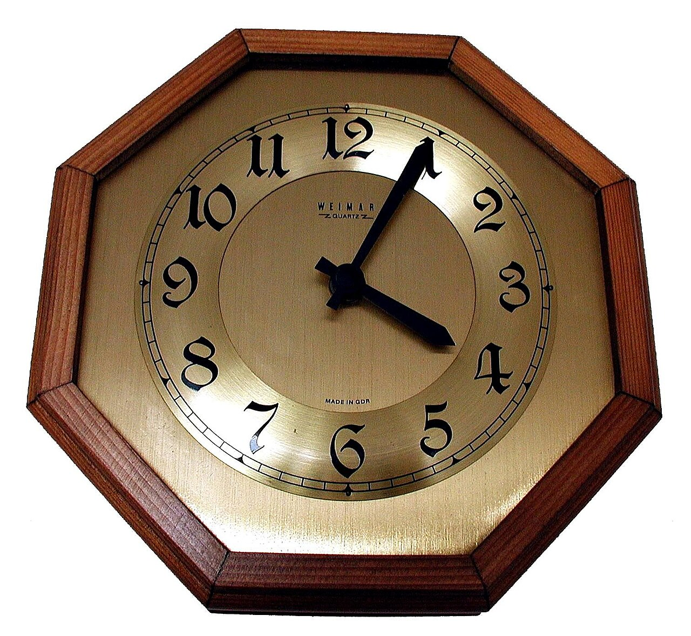

# Date, time & timezone handling

*Model instants with timestamptz, local civil values with timestamp without time zone, use IANA zone names, and test DST boundaries instead of subtracting wall clocks and calling it elapsed time.*

> “The meeting is at 9” is not a timestamp. It is a future bug report waiting for a country, date, and daylight-saving rule.

> **In real life**
>
> A wall clock shows local presentation; the instant is the shared point in time underneath. PostgreSQL stores aware timestamps as UTC and renders them in the session zone.

**timestamp semantics**: In PostgreSQL, timestamp with time zone (timestamptz) represents an instant stored internally as UTC and displayed in the session TimeZone. Timestamp without time zone stores local date-time fields without zone interpretation.

## Model intent, not formatting

```sql
SET TIME ZONE 'Asia/Kathmandu';
SELECT occurred_at,
       occurred_at AT TIME ZONE 'UTC' AS utc_wall_time
FROM incidents;
```

PostgreSQL does not retain the originally supplied zone name in `timestamptz`; retain a separate
IANA zone identifier when the original civil-zone choice matters. Prefer `America/New_York` over
ambiguous abbreviations because full names carry DST rules.

> **Tip**
>
> Use ISO 8601 input with explicit offsets for instants and set the session timezone in tests so output does not depend on the runner.

> **Common mistake**
>
> Writing `timestamp` and assuming it includes a zone. The SQL standard—and PostgreSQL—treat bare `timestamp` as without time zone.


*Clock on wall — Paolo Neo, Wikimedia Commons, public domain. [Source](https://commons.wikimedia.org/wiki/File:Clock_on_wall.jpg)*
- **Local display** — Session TimeZone controls how an instant is rendered.
- **UTC instant** — timestamptz stores the common point in time internally as UTC.
- **Civil rule** — IANA zone names carry historical and daylight-saving transitions.

**Test time without lying to yourself**

1. **Classify the value** — Instant, local civil time, date, or duration?
2. **Choose the type** — timestamptz for instants; timestamp for zone-less civil values.
3. **Control session zone** — Make test rendering deterministic.
4. **Probe boundaries** — DST gaps, overlaps, midnight, leap day, and precision.

*Run it — one instant, two local displays (Python)*

```python
from datetime import datetime, timezone
from zoneinfo import ZoneInfo
instant = datetime(2026, 1, 15, 6, 0, tzinfo=timezone.utc)
print("UTC", instant.strftime("%Y-%m-%d %H:%M"))
print("Kathmandu", instant.astimezone(ZoneInfo("Asia/Kathmandu")).strftime("%Y-%m-%d %H:%M"))
print("New_York", instant.astimezone(ZoneInfo("America/New_York")).strftime("%Y-%m-%d %H:%M"))

# UTC 2026-01-15 06:00
# Kathmandu 2026-01-15 11:45
# New_York 2026-01-15 01:00
```

*Run it — one instant, two local displays (Java)*

```java
import java.time.*;
import java.time.format.DateTimeFormatter;
public class Main {
  public static void main(String[] args){
    Instant instant=Instant.parse("2026-01-15T06:00:00Z");
    DateTimeFormatter f=DateTimeFormatter.ofPattern("yyyy-MM-dd HH:mm");
    System.out.println("UTC "+f.withZone(ZoneOffset.UTC).format(instant));
    System.out.println("Kathmandu "+f.withZone(ZoneId.of("Asia/Kathmandu")).format(instant));
    System.out.println("New_York "+f.withZone(ZoneId.of("America/New_York")).format(instant));
  }
}

/* UTC 2026-01-15 06:00
   Kathmandu 2026-01-15 11:45
   New_York 2026-01-15 01:00 */
```

### Your first time: Your mission: make time deterministic

- [ ] Classify four date-time fields — State whether each is an instant, civil schedule, date, or duration.
- [ ] Set session TimeZone explicitly — Run the same instant under UTC and Asia/Kathmandu.
- [ ] Test a DST gap and overlap — Use a zone that observes DST and documented expected conversion.
- [ ] Round-trip precision — Verify microseconds or chosen application precision survive serialization.

- **Test passes locally but shifts hours in CI.**
  Control database session TimeZone and application serializer zone explicitly.
- **Original zone name disappears.**
  Expected: timestamptz stores the instant, not the source zone label; persist that label separately if required.
- **A local time occurs twice or never occurs.**
  You hit a DST overlap or gap; define product policy and test both offsets.

### Where to check

- Column data types and session `SHOW TimeZone`.
- Serialized offsets and original zone-name fields.
- IANA-zone DST transitions and precision at boundaries.

### Worked example: the five-hour bug that only appeared abroad

A CI runner displays a stored instant in UTC while a developer expects New York time. The database value is correct; the assertion compared formatted local text. Setting the session zone—or asserting the instant—removes environment dependence.

**Quiz.** Does PostgreSQL timestamptz preserve the originally supplied zone name?

- [ ] Yes
- [x] No; it stores the instant as UTC and displays using the current session zone
- [ ] Only abbreviations
- [ ] Only in indexes

*PostgreSQL converts input to UTC and does not retain the original zone designation.*

- **Bare timestamp** — Timestamp without time zone in PostgreSQL and the SQL standard.
- **timestamptz** — An instant stored internally as UTC and rendered in the session zone.
- **IANA zone** — A named rule set such as America/New_York, including DST history.
- **DST overlap** — A local clock time occurs twice with two possible offsets.

### Challenge

Test one instant across UTC, Kathmandu, and New York plus one DST gap and overlap, with fixed session settings.

### Ask the community

> My timestamp shifts by `[offset]` between environments; here are column type, input literal, session TimeZone, and expected instant.

Include offsets and zone names, not screenshots of clocks.

- [PostgreSQL — date/time types and time zones](https://www.postgresql.org/docs/current/datatype-datetime.html)
- [PostgreSQL — date/time functions and AT TIME ZONE](https://www.postgresql.org/docs/current/functions-datetime.html)

🎬 [freeCodeCamp — SQL tutorial, full database course](https://www.youtube.com/watch?v=HXV3zeQKqGY) (261 min)

- Use timestamptz for instants and timestamp without time zone for intentionally zone-less civil values.
- timestamptz stores UTC and renders in the session zone; it does not retain the source zone label.
- Use IANA zone names when civil-time rules matter.
- Control session settings and test DST gaps, overlaps, and precision.


## Related notes

- [[Notes/relational-databases-engineer-level/sql-mastery/window-functions|Window functions]]
- [[Notes/relational-databases-engineer-level/schema-design/er-modeling-from-requirements|ER modeling from requirements]]
- [[Notes/relational-databases-engineer-level/data-integrity-at-scale/auditing-data-changes|Auditing data changes]]


---
_Source: `packages/curriculum/content/notes/relational-databases-engineer-level/sql-mastery/date-time-and-timezone-handling.mdx`_
