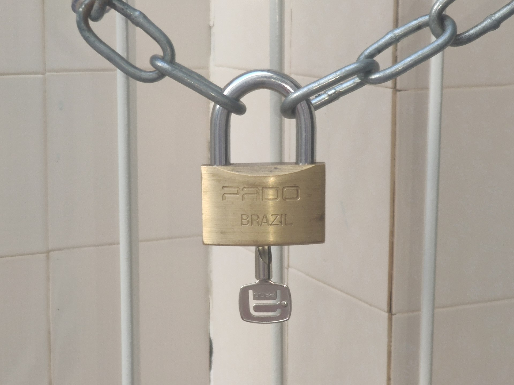

# Locks and deadlocks

*Locks coordinate conflicting work; deadlocks form when transactions wait in a cycle. Learn PostgreSQL lock behavior, diagnosis, prevention, and recovery without blaming every wait on a deadlock.*

> A lock wait is a queue. A deadlock is a circle: everyone holds something the next transaction needs, so nobody can move without intervention.

> **In real life**
>
> Two people each clutch one end of a chained gate while asking the other to release first. Waiting longer cannot solve the cycle; one participant must give way.

**lock and deadlock**: A database lock reserves a resource or conflicts with particular operations so concurrent work cannot violate a coordination rule. A deadlock is a cycle in the wait-for graph where every transaction waits for another transaction in that same cycle.

## Distinguish ordinary blocking from a cycle

PostgreSQL uses table-level, row-level, page-level, and advisory locks. Lock modes conflict selectively; they do not all exclude all work. MVCC lets ordinary readers and writers often proceed without blocking each other, while writers targeting the same row conflict. Locks normally remain until transaction end.

A long wait has an owner and a waiter. A deadlock has a cycle. PostgreSQL detects a deadlock and aborts one transaction; the application must handle that failure. Consistent lock ordering is the strongest general prevention technique.

> **Tip**
>
> Acquire shared resources in one global order and keep transactions bounded. This shortens waits and removes many cycles before monitoring has to explain them.

> **Common mistake**
>
> Calling every slow blocked query a deadlock. A single wait chain can eventually progress; only a cycle requires a victim to break it.


*Padlock with chain — Lacz02, Wikimedia Commons, CC BY-SA 4.0. [Source](https://commons.wikimedia.org/wiki/File:Padlock_with_chain.jpg)*
- **Held lock** — One transaction owns a resource until it commits or rolls back.
- **Waiting link** — A conflicting request waits behind the current owner.
- **Cycle risk** — Opposite acquisition order can connect waiters into a deadlock cycle.

**From conflicting updates to deadlock recovery**

1. **A locks account 1** — Transaction A updates the first row.
2. **B locks account 2** — Transaction B updates the second row.
3. **A waits for account 2** — A conflicting row lock is already held by B.
4. **B waits for account 1** — The wait-for graph closes into a cycle.
5. **PostgreSQL aborts a victim** — One transaction rolls back; the survivor can continue.

*Run it — detect a wait-for cycle (Python)*

```python
waits_for = {"txA": "txB", "txB": "txC", "txC": "txA"}

def cycle_from(start):
    seen = []
    current = start
    while current in waits_for:
        if current in seen:
            first = seen.index(current)
            return seen[first:] + [current]
        seen.append(current)
        current = waits_for[current]
    return []

cycle = cycle_from("txA")
print(" -> ".join(cycle))
print("deadlock:", bool(cycle))

# txA -> txB -> txC -> txA
# deadlock: True
```

*Run it — prevent a cycle with ordered acquisition (Java)*

```java
import java.util.*;
public class Main {
  static List<Integer> lockOrder(int first, int second) {
    List<Integer> ids = new ArrayList<>(Arrays.asList(first, second));
    Collections.sort(ids);
    return ids;
  }
  public static void main(String[] args) {
    System.out.println("txA order=" + lockOrder(2, 1));
    System.out.println("txB order=" + lockOrder(1, 2));
    System.out.println("same order prevents opposite-edge cycle");
  }
}
/* txA order=[1, 2]
   txB order=[1, 2]
   same order prevents opposite-edge cycle */
```

### Your first time: Your mission: diagnose one blocker chain

- [ ] Capture active sessions — Record transaction age, query, state, and wait event.
- [ ] Join waiters to blockers — Use pg_locks with pg_stat_activity or pg_blocking_pids.
- [ ] Draw the wait-for graph — Separate a chain from a cycle before naming the incident.
- [ ] Fix acquisition order — Shorten boundaries and make all paths lock shared resources consistently.

You can now explain who waits for whom and why.

- **Sessions wait but no deadlock error appears.**
  Look for a long-running blocker or idle-in-transaction owner; a chain is not necessarily a cycle.
- **Deadlocks recur during transfers.**
  Sort account identifiers and lock/update both rows in that order on every code path.
- **The victim transaction leaves an error state.**
  Roll back the failed transaction and retry the complete idempotent unit when policy permits.

### Where to check

- `pg_stat_activity` for transaction age, state, query, and wait event.
- `pg_locks` and `pg_blocking_pids(pid)` for owners and waiters.
- PostgreSQL logs for deadlock detail and involved statements.
- Application traces for transaction boundaries and lock acquisition order.

### Worked example: the transfer deadlock

1. Transaction A updates account 1, then asks for account 2.
2. Transaction B updates account 2, then asks for account 1.
3. Each holds the row lock required by the other.
4. PostgreSQL detects the wait cycle and aborts one transaction.
5. Sorting account IDs before either update prevents the opposite acquisition order.

**Quiz.** What separates a deadlock from ordinary lock waiting?

- [ ] The wait lasts more than one second
- [ ] The blocked query is an UPDATE
- [x] The wait-for relationships contain a cycle
- [ ] More than one table is involved

*A chain can progress when its owner finishes; a cycle cannot progress without aborting or releasing one participant.*

- **Wait-for graph** — Directed edges from waiting transactions to transactions holding required locks.
- **Deadlock victim** — A transaction PostgreSQL aborts so the cycle is broken.
- **Consistent ordering** — Acquiring shared resources in the same global order on every path.

### Challenge

Create two transfer paths that acquire the same accounts in opposite orders, reproduce the deadlock, then change both paths to sorted order and verify the cycle disappears.

### Ask the community

> PID `[waiter]` waits on `[resource]` held by `[blocker]`; the transaction timelines are `[steps]`. Is this a chain or cycle, and which boundary/order should change?

Include transaction age and complete acquisition order.

- [PostgreSQL — Explicit locking and deadlocks](https://www.postgresql.org/docs/current/explicit-locking.html)
- [PostgreSQL — Monitoring database activity](https://www.postgresql.org/docs/current/monitoring-stats.html)

🎬 [Transactions: myths, surprises and opportunities — Martin Kleppmann](https://www.youtube.com/watch?v=5ZjhNTM8XU8) (41 min)

- Lock modes conflict selectively; not every lock blocks every operation.
- MVCC allows many readers and writers to overlap, while conflicting row writers wait.
- A deadlock is a cycle, not merely a long wait.
- PostgreSQL aborts one participant to break a detected deadlock.
- Consistent acquisition order and short transactions prevent many incidents.


## Related notes

- [[Notes/relational-databases-engineer-level/transactions-and-concurrency/isolation-levels-and-anomalies|Isolation levels & anomalies]]
- [[Notes/relational-databases-engineer-level/transactions-and-concurrency/testing-concurrent-behavior|Testing concurrent behavior]]


---
_Source: `packages/curriculum/content/notes/relational-databases-engineer-level/transactions-and-concurrency/locks-and-deadlocks.mdx`_
