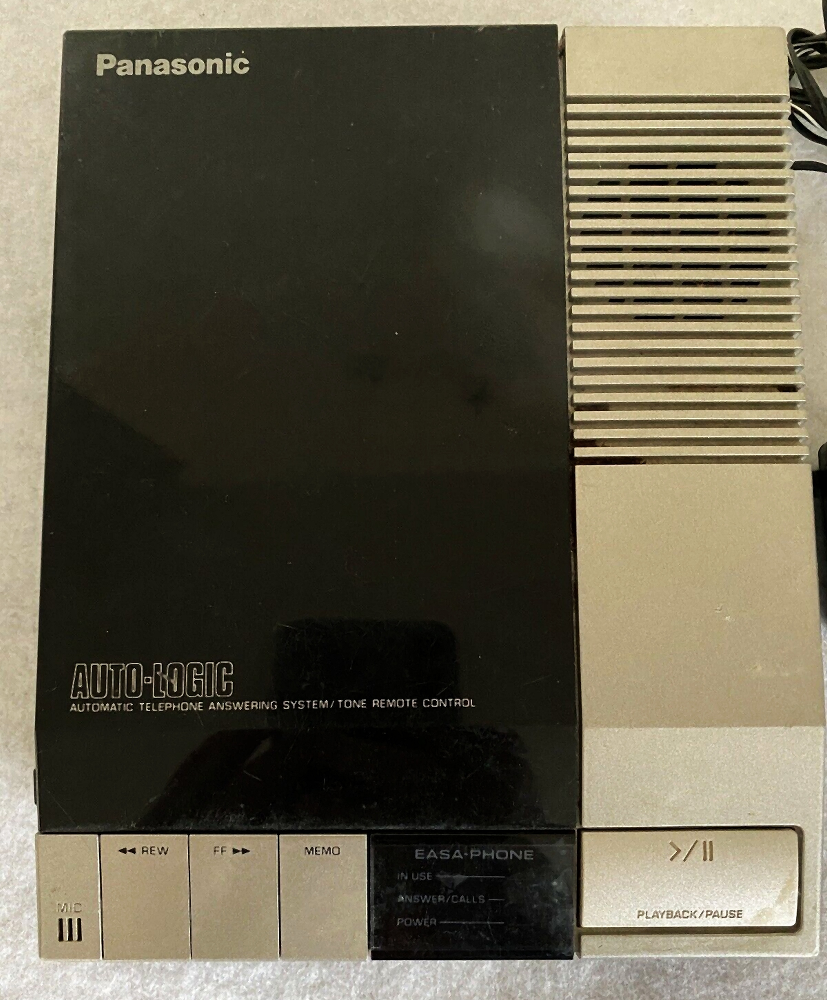

# Cover letters, short

*A short cover letter helps when it addresses a specific gap or shows genuine interest in one company - three to four specific sentences, not a restated resume. A generic one is just noise a reader skips.*

> "To whom it may concern, I am writing to express my interest in this position" could be attached to any
> job, at any company, by anyone. A reader who has seen a thousand of those skips straight to the resume -
> and a short, specific note that mentions their actual product is the rare one they stop and read.

> **In real life**
>
> An old answering machine gives a caller about thirty seconds before the tape runs out. A message that
> says "hi, it's me, call me back" wastes the time and gets a shrug. A message that says "it's about the
> invoice from Tuesday, the total looks off, call me before Thursday" gets returned, because it names the
> one specific thing and asks for the one specific action - inside the time it actually has.

**A short cover letter**: A brief, specific cover note - three to four sentences - written when it can genuinely add something a resume cannot: addressing a visible gap, or showing real, checkable interest in one particular company, rather than restating the resume in prose.

## When a short cover letter actually helps

A short cover letter earns its place when it does something the resume alone cannot: explains a visible
gap (a career change, a short tenure, a return after time away) in one honest sentence, or demonstrates
specific, checkable interest in the company - naming an actual product, a recent release, or a stated
problem the team is solving. Both of those require the letter to say something a generic version could
not have said about any other company. When neither applies, skipping the letter (where the application
allows it) costs nothing; a generic one attached out of habit costs a little of the reader's patience.

## What noise looks like

Noise is a letter that could be sent to any company unchanged: restating the resume in paragraph form,
listing adjectives like "hard-working" and "detail-oriented" with no evidence attached, or opening with
"I am writing to apply for the position of..." - a sentence every reader has already seen a thousand
times. None of it is dishonest, exactly; it just adds reading time without adding information, and a
reader moving through a stack of applications treats that as a cost, not a courtesy.

> **Tip**
>
> Structure a short cover letter in three to four sentences: name something specific about the company or
> role, connect one real, relevant accomplishment to it, and close with a plain, direct interest in
> speaking further. Every sentence should say something a generic template could not have said.

> **Common mistake**
>
> Do not pad a short cover letter with restated resume bullets to make it look more substantial. Length
> signals effort to the writer; specificity is what actually signals effort to the reader.


*Panasonic Answering Machine KX-T1423 with two Compact Cassettes — Pittigrilli, Wikimedia Commons, CC BY-SA 4.0. [Source](https://commons.wikimedia.org/wiki/File:Panasonic_Answering_Machine_KX-T1423_with_two_Compact_Cassettes.jpg)*
- **The one moment you speak** — The MIC button is the single chance to record - there is no editing after the tone, so every word has to earn its place before you start, the same discipline a short cover letter needs before you send it.
- **The limit that forces brevity** — The tape's fixed length is the real constraint behind every good short message - the same constraint a reader's patience puts on a cover letter, whether or not it's ever stated out loud.
- **The reader's side of the exchange** — PLAYBACK/PAUSE is where the message either gets heard in full or gets cut off - a distracted reader treats a rambling cover letter the same way.
- **Editing happens before you commit** — REW, FF, and MEMO exist for reviewing and re-recording - draft and trim a cover letter before sending it, since once it's in an inbox there's no rewind.

**Deciding whether to write one, then keeping it short**

1. **Ask what a letter would add** — A visible gap to explain, or specific, checkable interest in this one company - otherwise consider skipping it.
2. **Name one real, specific detail** — An actual product, release, or stated problem - something a generic version could not have said.
3. **Connect one real accomplishment** — Tie a genuine, relevant piece of your background to that specific detail, in a sentence or two.
4. **Close plainly and stop** — State direct interest in speaking further and end - three to four sentences total, no restated resume.

*A cover-letter length and specificity checker (Python)*

```python
letters = {
    "GENERIC": "To whom it may concern, I am writing to express my interest in this position. I am a hard-working, detail-oriented professional who is passionate about quality. I believe I would be a great fit for your team. Thank you for your consideration.",
    "SPECIFIC_SHORT": "Your job post mentions migrating BuggyShop's regression suite off a flaky in-house runner. I did the same migration to Playwright at my last role, cutting a 3-hour manual run to 20 minutes. I would like to bring that experience to your QA team.",
}

generic_phrases = ["to whom it may concern", "hard-working", "detail-oriented", "great fit", "passionate about"]

def word_count(text):
    return len(text.split())

def specificity_flags(text):
    lower = text.lower()
    return [p for p in generic_phrases if p in lower]

for name, text in letters.items():
    wc = word_count(text)
    flags = specificity_flags(text)
    length_ok = wc <= 120
    specific = len(flags) == 0
    verdict = "PASS" if (length_ok and specific) else "FAIL"
    print(name + "_WORDS=" + str(wc))
    print(name + "_GENERIC_PHRASES=" + (",".join(flags) if flags else "none"))
    print(name + "_VERDICT=" + verdict)
```

*A cover-letter length and specificity checker (Java)*

```java
import java.util.*;

public class Main {
    static String[] genericPhrases = {"to whom it may concern", "hard-working", "detail-oriented", "great fit", "passionate about"};

    static int wordCount(String text) {
        return text.trim().split("\\\\s+").length;
    }

    static List<String> specificityFlags(String text) {
        String lower = text.toLowerCase();
        List<String> flags = new ArrayList<>();
        for (String p : genericPhrases) if (lower.contains(p)) flags.add(p);
        return flags;
    }

    public static void main(String[] args) {
        LinkedHashMap<String, String> letters = new LinkedHashMap<>();
        letters.put("GENERIC", "To whom it may concern, I am writing to express my interest in this position. I am a hard-working, detail-oriented professional who is passionate about quality. I believe I would be a great fit for your team. Thank you for your consideration.");
        letters.put("SPECIFIC_SHORT", "Your job post mentions migrating BuggyShop's regression suite off a flaky in-house runner. I did the same migration to Playwright at my last role, cutting a 3-hour manual run to 20 minutes. I would like to bring that experience to your QA team.");

        for (Map.Entry<String, String> e : letters.entrySet()) {
            String name = e.getKey();
            String text = e.getValue();
            int wc = wordCount(text);
            List<String> flags = specificityFlags(text);
            boolean lengthOk = wc <= 120;
            boolean specific = flags.isEmpty();
            String verdict = (lengthOk && specific) ? "PASS" : "FAIL";
            System.out.println(name + "_WORDS=" + wc);
            System.out.println(name + "_GENERIC_PHRASES=" + (flags.isEmpty() ? "none" : String.join(",", flags)));
            System.out.println(name + "_VERDICT=" + verdict);
        }
    }
}
```

### Your first time: Write one short, specific cover note

- [ ] Decide if a letter adds anything — Check for a visible gap to explain or genuine, specific interest in this one company - otherwise it may not be worth writing.
- [ ] Name one real, specific detail — An actual product, release, or team problem the posting mentions - not a generic compliment.
- [ ] Connect one genuine accomplishment — Tie a real, relevant piece of your background to that specific detail in a sentence or two.
- [ ] Cut it to three or four sentences — Remove any sentence that could be sent unchanged to a different company.

- **The letter reads like the resume restated in paragraph form.**
  Delete any sentence that just repeats a resume bullet - the letter should add something the resume alone cannot say.
- **You are not sure whether to write one at all.**
  Write one only if there's a specific gap to address or genuine, checkable interest in the company - skip it otherwise if the application allows.
- **The draft keeps growing past four sentences.**
  Cut any sentence that could be sent unchanged to a different company - what remains is usually the actually useful part.

### Where to check

- The job posting itself (see [[resume-and-applications/applying-smart/reading-job-posts]]) for a specific detail worth naming.
- Your own resume for the one real accomplishment most relevant to connect to that detail.
- The company's own site or recent release notes for a genuine, checkable reason for interest.
- [[resume-and-applications/the-qa-resume/common-mistakes]] for the generic phrasing patterns to avoid repeating in a cover letter.

### Worked example: cutting a generic draft down to a short, specific one

1. A first draft opens "To whom it may concern, I am writing to express my interest in this Manual QA Tester position at your company."
2. The candidate notices the posting specifically mentions migrating away from a flaky in-house test runner.
3. They rewrite the opening to name that detail directly and connect it to a real migration they did in a past role, with a real number attached.
4. The final version is three sentences: the specific detail, the matching real accomplishment, and a plain closing request to speak further.

**Quiz.** When does a short cover letter genuinely add value over the resume alone?

- [ ] Always, for every application, regardless of content
- [ ] When it restates the strongest resume bullets in paragraph form
- [x] When it addresses a visible gap or shows specific, checkable interest in the company
- [ ] Never - cover letters are always ignored

*A cover letter earns its place when it says something a generic version, or the resume alone, could not have said - a real gap explained, or real, specific interest in one company.*

- **When a short cover letter helps** — Addressing a visible gap, or showing specific, checkable interest in one company - not restating the resume.
- **What makes a cover letter noise** — Generic phrasing and restated resume bullets that could be sent unchanged to any other company.
- **Short cover letter structure** — Three to four sentences: a specific detail, one real matching accomplishment, and a plain closing request.

### Challenge

Write a three-sentence cover letter for a real posting: one sentence naming something specific about the company, one connecting a real accomplishment, one plain closing request.

- [Indeed — Short Cover Letters: Examples, Benefits and Helpful Tips](https://www.indeed.com/career-advice/resumes-cover-letters/short-cover-letter-examples)
- [Indeed — How To Write the Perfect Cover Letter (With Template and Example)](https://www.indeed.com/career-advice/resumes-cover-letters/how-to-write-the-perfect-cover-letter)
- [PROVEN 3 Sentence Cover Letter - Best Cover Letter Format & Examples](https://www.youtube.com/watch?v=5q4E5wP86o8)

🎬 [PROVEN 3 Sentence Cover Letter - Best Cover Letter Format & Examples](https://www.youtube.com/watch?v=5q4E5wP86o8) (9 min)

- A short cover letter earns its place by addressing a real gap or showing specific, checkable company interest.
- Generic phrasing and restated resume bullets read as noise, not effort, to a reader moving through applications.
- Three to four specific sentences beat a longer, generic letter every time.
- Every sentence in a short cover letter should say something a template sent to any company could not have said.


## Related notes

- [[Notes/resume-and-applications/applying-smart/tailoring-per-role|Tailoring per role]]
- [[Notes/resume-and-applications/applying-smart/reading-job-posts|Reading job posts]]
- [[Notes/resume-and-applications/the-qa-resume/common-mistakes|Common mistakes]]


---
_Source: `packages/curriculum/content/notes/resume-and-applications/applying-smart/cover-letters-short.mdx`_
