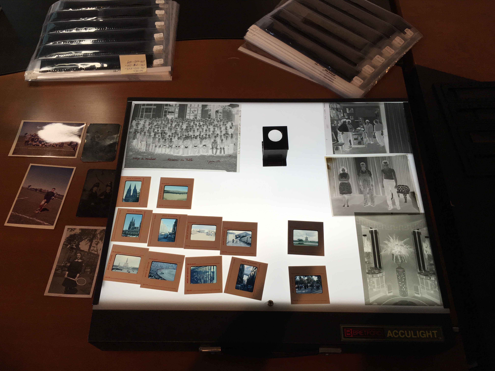

# Tailoring per role

*Honest tailoring reorders and emphasizes genuinely-held skills to match a specific posting's priorities. It never invents experience - a resume can honestly lead with different real projects for different roles.*

> Two postings land the same week: one wants a manual tester who writes airtight test plans, the other
> wants someone fluent in Selenium and CI pipelines. The candidate has done real work on both fronts. The
> question is not what to invent - it is what to lead with, for this reader, today.

> **In real life**
>
> A wedding photographer shoots four hundred real frames in one afternoon: the ceremony, the reception,
> a candid shot of someone crying happily by the punch bowl. The album she builds for the couple leads
> with the vows and the first dance. The set she submits to a venue's marketing site leads with wide shots
> of the room and the light fixtures. Same shoot, same real photographs, nothing staged twice - just a
> different, honest selection and order for a different audience.

**Tailoring per role**: Reordering and emphasizing genuinely-held skills and real projects to match a specific posting's stated priorities, without inventing experience that was never done or claiming depth in a tool never actually used.

## What tailoring actually changes

Tailoring changes order, emphasis, and wording - never the underlying facts. A candidate with both
manual and automation experience can lead their summary and top bullets with the automation project
for an automation-heavy posting, and lead with the manual test-plan work for a manual-QA-heavy posting.
The same two projects exist on both versions of the resume; only which one sits at the top, and how much
detail it gets, changes. Wording can shift too - describing the same regression suite as "written in
Selenium" for one reader and "covering 40 manual and automated cases" for another - as long as both
descriptions are true.

## The line tailoring must not cross

Tailoring stops being honest the moment it adds a skill, tool, or year of experience that was not
actually there. Listing "Selenium" because a posting mentions it, without ever having written a
Selenium test, collapses in the first technical question of an interview - and the damage is not
limited to that one skill; an interviewer who catches one invented line stops trusting the rest of the
resume. The test is simple: would every sentence survive a direct, specific follow-up question about it.

> **Tip**
>
> Keep one master resume with every real project and skill documented in full. Tailoring per role becomes
> copying and reordering from that master list, never writing something new from scratch under deadline
> pressure.

> **Common mistake**
>
> Do not copy a posting's exact buzzwords into a resume for skills you do not actually have. Matching an
> ATS keyword with a skill you cannot discuss in an interview trades a short-term parsing win for a
> longer-term credibility loss.


*BAnQ Scan-A-Thon Examples — Sarah Stierch, Wikimedia Commons, CC BY 4.0. [Source](https://commons.wikimedia.org/wiki/File:BAnQ_Scan-A-Thon_Examples_-_Sarah_Stierch.jpg)*
- **The full, real body of material** — Dozens of real slides, all genuinely shot, spread across the table - the equivalent of a candidate's master resume holding every real project before any tailoring happens.
- **The loupe for close inspection** — A tool for evaluating one frame closely before deciding whether it fits the current selection - the same judgment a candidate applies when deciding which real project best matches a specific posting.
- **The selection pulled aside** — A smaller set of prints set apart from the rest - the tailored subset chosen for one particular purpose, still entirely real photographs, just reordered and selected.
- **Real context attached to one frame** — The labeled group photo carries a real date and place - the same way a strong resume bullet carries a real, specific, checkable detail rather than a vague description.

**Tailoring one resume for two postings**

1. **Start from the master resume** — Every real project and skill lives in one full document, nothing invented, nothing omitted.
2. **Read the posting's stated priorities** — Note which skills and project types the posting emphasizes as hard requirements.
3. **Reorder and re-emphasize, honestly** — Move the genuinely matching project to the top; adjust wording to the posting's terms without changing the facts.
4. **Check every line survives a follow-up** — Confirm each bullet could withstand a specific interview question before sending the tailored version.

*A resume-tailoring keyword-match scorer across two postings (Python)*

```python
candidate_skills = [
    "manual test case design", "exploratory testing", "bug reporting", "Selenium",
    "API testing", "SQL", "test plans", "Jira", "regression testing", "Python",
]

manual_qa_posting = ["manual test case design", "exploratory testing", "bug reporting", "test plans", "Jira"]
automation_posting = ["Selenium", "API testing", "Python", "regression testing", "CI/CD"]

def score(skills, posting):
    matched = [s for s in skills if s in posting]
    missing = [p for p in posting if p not in skills]
    pct = round(100 * len(matched) / len(posting))
    return matched, missing, pct

def report(name, posting):
    matched, missing, pct = score(candidate_skills, posting)
    print(name + "_MATCHED=" + ",".join(matched))
    print(name + "_MISSING=" + ",".join(missing))
    print(name + "_SCORE=" + str(pct))

report("MANUAL_QA", manual_qa_posting)
report("AUTOMATION", automation_posting)

lead_role = "AUTOMATION" if score(candidate_skills, automation_posting)[2] >= score(candidate_skills, manual_qa_posting)[2] else "MANUAL_QA"
print("LEAD_WITH=" + lead_role)
```

*A resume-tailoring keyword-match scorer across two postings (Java)*

```java
import java.util.*;

public class Main {
    static List<String> candidateSkills = Arrays.asList(
        "manual test case design", "exploratory testing", "bug reporting", "Selenium",
        "API testing", "SQL", "test plans", "Jira", "regression testing", "Python"
    );

    static Object[] score(List<String> skills, List<String> posting) {
        List<String> matched = new ArrayList<>();
        for (String s : skills) if (posting.contains(s)) matched.add(s);
        List<String> missing = new ArrayList<>();
        for (String p : posting) if (!skills.contains(p)) missing.add(p);
        long pct = Math.round(100.0 * matched.size() / posting.size());
        return new Object[]{matched, missing, pct};
    }

    static void report(String name, List<String> posting) {
        Object[] result = score(candidateSkills, posting);
        @SuppressWarnings("unchecked")
        List<String> matched = (List<String>) result[0];
        @SuppressWarnings("unchecked")
        List<String> missing = (List<String>) result[1];
        long pct = (long) result[2];
        System.out.println(name + "_MATCHED=" + String.join(",", matched));
        System.out.println(name + "_MISSING=" + String.join(",", missing));
        System.out.println(name + "_SCORE=" + pct);
    }

    public static void main(String[] args) {
        List<String> manualQaPosting = Arrays.asList("manual test case design", "exploratory testing", "bug reporting", "test plans", "Jira");
        List<String> automationPosting = Arrays.asList("Selenium", "API testing", "Python", "regression testing", "CI/CD");

        report("MANUAL_QA", manualQaPosting);
        report("AUTOMATION", automationPosting);

        long manualScore = (long) score(candidateSkills, manualQaPosting)[2];
        long autoScore = (long) score(candidateSkills, automationPosting)[2];
        String leadRole = autoScore >= manualScore ? "AUTOMATION" : "MANUAL_QA";
        System.out.println("LEAD_WITH=" + leadRole);
    }
}
```

### Your first time: Tailor your resume for two real postings

- [ ] Build or update a master resume — List every real project, tool, and outcome in full, with nothing invented and nothing left out.
- [ ] Pick two genuinely different postings — One leaning manual-QA-heavy, one leaning automation-heavy, both roles you would honestly consider.
- [ ] Reorder and re-emphasize for each — Move the genuinely matching project to the top of each version; adjust wording to the posting's own terms.
- [ ] Check every changed line against the master — Confirm nothing on either tailored version says more than the master resume actually supports.

- **Tailoring starts to feel like writing a new resume each time.**
  Keep a complete master resume; tailoring should only mean copying, reordering, and re-emphasizing from it, not drafting fresh content under deadline.
- **A posting's keyword does not match anything you've actually done.**
  Leave it out rather than forcing a match - an honest gap survives an interview better than an invented skill does.
- **Two tailored versions of the same resume start contradicting each other.**
  Both versions must trace back to the same real, master set of facts - reordering and emphasis should never introduce a claim the other version doesn't support.

### Where to check

- The posting's own stated priorities (from [[resume-and-applications/applying-smart/reading-job-posts]]) for which real project to lead with.
- Your master resume, for the full, honest set of facts every tailored version must trace back to.
- Past project write-ups or a personal log for the specific, real numbers each version's bullets should carry.
- [[resume-and-applications/the-qa-resume/numbers-and-impact]] for how to quantify whichever project a given tailored version leads with.

### Worked example: tailoring one background for two different postings

1. A candidate has real experience in both manual regression testing and a Selenium-based automation project from the same job.
2. Posting A wants a manual tester with strong test-plan and bug-report skills; posting B wants automation experience with CI pipelines.
3. For posting A, the resume leads with the regression testing and bug-report bullets, moving the Selenium project further down.
4. For posting B, the same two projects appear, but the Selenium project moves to the top with CI detail added - nothing is invented on either version, only the order and emphasis change.

**Quiz.** A posting asks for a skill the candidate has never actually used. What is the honest tailoring move?

- [ ] Add the skill to the resume anyway since it's just one word
- [ ] List it under a 'familiar with' section without ever having used it
- [x] Leave it off and lead with real, matching skills instead
- [ ] Copy the posting's exact phrase to pass the ATS scan

*Honest tailoring reorders and emphasizes real skills; it never adds a skill that was never actually used, no matter how the posting is worded.*

- **What tailoring changes** — Order, emphasis, and wording of real projects and skills - never the underlying facts.
- **The line tailoring must not cross** — Never add a skill, tool, or year of experience that was not actually there.
- **The master resume** — One complete, honest document every tailored version is built from, so tailoring means reordering, not inventing.

### Challenge

Take one of your own resume bullets and honestly rewrite its emphasis for two different postings - without changing any underlying fact.

- [Indeed — How To Tailor Your Resume To a Job Description (With Example)](https://www.indeed.com/career-advice/resumes-cover-letters/tailoring-resume)
- [Rezi — How to Tailor Your Resume to a Job Description (Insider Tips)](https://www.rezi.ai/posts/how-to-tailor-your-resume)
- [How to TAILOR Your RESUME to Any JOB](https://www.youtube.com/watch?v=MQUkGZzYqOs)

🎬 [How to TAILOR Your RESUME to Any JOB](https://www.youtube.com/watch?v=MQUkGZzYqOs) (10 min)

- Tailoring reorders, re-emphasizes, and rewords real experience - it never invents a skill or project.
- A master resume holding every real project makes honest tailoring a copy-and-reorder task, not a rewrite.
- The same two real projects can honestly lead a manual-QA-heavy resume and an automation-heavy one differently.
- Every tailored line should survive a direct interview follow-up question about it.


## Related notes

- [[Notes/resume-and-applications/applying-smart/reading-job-posts|Reading job posts]]
- [[Notes/resume-and-applications/the-qa-resume/numbers-and-impact|Numbers & impact]]
- [[Notes/resume-and-applications/the-qa-resume/structure-that-works|Structure that works]]


---
_Source: `packages/curriculum/content/notes/resume-and-applications/applying-smart/tailoring-per-role.mdx`_
