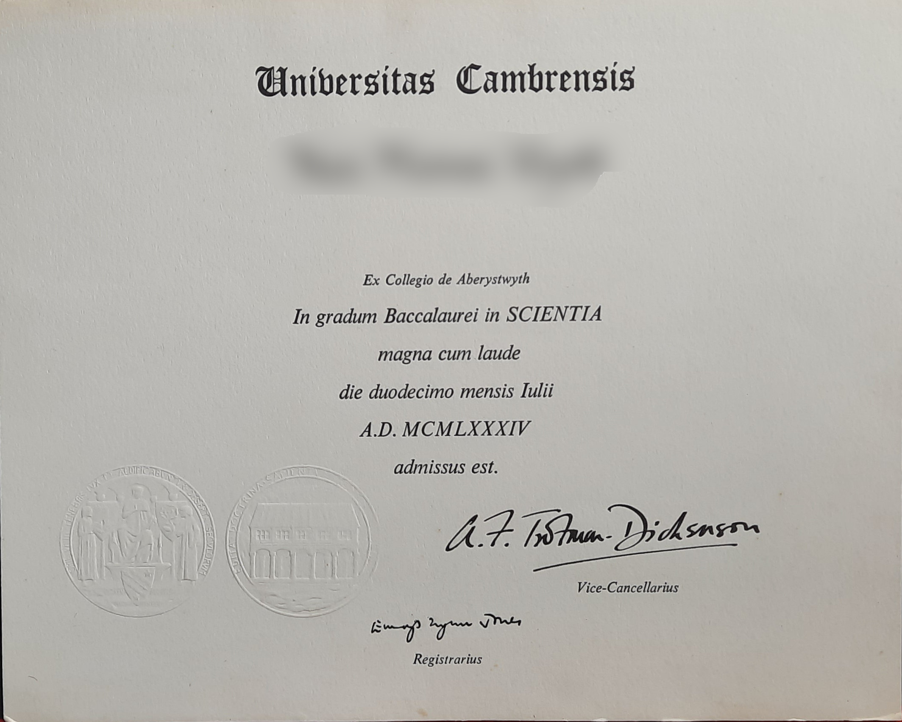

# ISTQB — worth it or not

*ISTQB Foundation Level is real and widely recognized, but understand exactly what it signals to employers, where it falls short as proof of skill, and when the cost and study time actually pay off.*

> Ask ten QA professionals whether ISTQB Foundation Level is worth it and the answers split hard - some call it
> a baseline every serious tester should hold, others call it a paper credential that proves nothing about
> actually finding bugs. Both camps are describing the same exam accurately; they're just weighing it against
> different goals.

> **In real life**
>
> A driver's permit proves someone has studied the rules of the road and can answer questions about them
> correctly. It does not prove they can parallel park, merge into heavy traffic, or stay calm when something
> goes wrong at speed - that only shows up once they're actually behind the wheel. ISTQB Foundation Level works
> the same way: real proof of shared vocabulary and concepts, no proof at all of how someone handles an actual,
> messy test cycle.

**ISTQB Foundation Level**: A globally recognized, vendor-neutral entry-level certification that tests recall of standard software testing terminology, concepts, and processes through a multiple-choice exam, administered by ISTQB-affiliated national boards.

## What it actually signals to an employer

At its best, ISTQB Foundation Level signals that a candidate has deliberately studied a shared, vendor-neutral
vocabulary for testing - terms like test levels, test types, and static versus dynamic testing mean the same
thing to every certified person, regardless of which company or country they trained in. Some enterprise,
government, and regulated-industry employers lean on that shared vocabulary directly: a posting for a role on
a banking or healthcare platform will sometimes name it as required or preferred, because procurement rules
or client contracts already assume it. Staffing agencies placing testers into those same clients often value
it for the same reason - it is an easy, defensible checkbox in a process built around checkboxes.

## Where it falls short

The most common criticism, and it is a fair one, is that ISTQB Foundation Level is "testing theory" - a
multiple-choice exam scored on recall, with no lab component, no code, and no requirement to have ever tested
a real, running piece of software. It teaches almost nothing about automation, tooling, or the judgment calls
that come up in an actual sprint. Passing it says a candidate can recognize the right term on a quiz; it says
nothing about whether they can write a useful bug report, design a test that actually catches a real defect,
or read a stack trace. Many senior testers and automation engineers are openly skeptical of it for exactly
this reason, and some hiring managers ignore it entirely when reviewing candidates who show real, checkable
work instead.

> **Tip**
>
> It tends to be worth the cost and study time early in a search that includes enterprise, government, or
> regulated-industry roles where a specific posting names it - and worth skipping, at least for now, if your
> target postings never mention it at all. Check the actual postings first; see
> [[resume-and-applications/certifications-honestly/when-certs-matter]].

> **Common mistake**
>
> Don't mistake passing the exam for being job-ready. A certificate that proves you can recall the right term
> is not a substitute for hands-on testing experience - treat it as one input alongside real practice, never as
> the whole case for your candidacy.


*Degree Certificate from the University of Wales.jpg — Stub Mandrel, Wikimedia Commons, CC BY-SA 4.0. [Source](https://commons.wikimedia.org/wiki/File:Degree_Certificate_from_the_University_of_Wales.jpg)*
- **The institution's name, prominent** — The branding a credential leads with is the first thing any viewer's eye lands on, whether it's a university seal or a certification body's logo.
- **A blurred, individual name** — A credential is issued to one named person for one dated event, not a lasting proof of current ability - the name and date matter, but neither says what that person can do today.
- **The actual claim being made** — Read closely, this line states a specific degree, a class of honours, and a date - a real credential's actual claim is often narrower than the impression its framed presence creates.
- **An official seal, meant to signal legitimacy** — An embossed mark exists to make the document harder to fake, not to describe what its holder can actually do in practice.
- **A human signature underwriting it** — Someone vouched for this credential once, in this case a vice-chancellor - an exam board's scoring process plays the same underwriting role, without ever watching the candidate actually test software.

**What an ISTQB Foundation Level exam actually verifies**

1. **Study the syllabus** — Standard terminology, test levels, test types, and static versus dynamic testing concepts, memorized for recall.
2. **Sit a multiple-choice exam** — No code, no lab component, no requirement to have tested a real running application.
3. **Receive a certificate** — Proof of a passing recall score on testing vocabulary and concepts, dated and issued in your name.
4. **The certificate proves vocabulary, not skill** — Whether the holder can actually design a useful test or file a clear bug report still has to be shown separately.

*Does an exam score predict hands-on skill? (Python)*

```python
candidates = [
    {"name": "Amir", "exam_score": 92, "bugs_found": 2, "bugs_total": 10},
    {"name": "Priya", "exam_score": 68, "bugs_found": 8, "bugs_total": 10},
    {"name": "Jon", "exam_score": 88, "bugs_found": 7, "bugs_total": 10},
]
PASS_EXAM = 65

hands_on_pcts = []
all_passed = True
for c in candidates:
    exam_result = "PASS" if c["exam_score"] >= PASS_EXAM else "FAIL"
    if c["exam_score"] < PASS_EXAM:
        all_passed = False
    hands_on_pct = round(100 * c["bugs_found"] / c["bugs_total"])
    hands_on_pcts.append(hands_on_pct)
    print(c["name"] + "=EXAM_" + exam_result + ",HANDS_ON_" + str(hands_on_pct))

spread = max(hands_on_pcts) - min(hands_on_pcts)
print("ALL_PASSED_EXAM=" + ("YES" if all_passed else "NO"))
print("HANDS_ON_SPREAD=" + str(spread))
result = "EXAM_SCORE_DOES_NOT_PREDICT_HANDS_ON_SKILL" if spread >= 30 else "EXAM_SCORE_ROUGHLY_PREDICTS_SKILL"
print("CONCLUSION=" + result)
```

*Does an exam score predict hands-on skill? (Java)*

```java
import java.util.*;

public class Main {
    static class Candidate {
        String name;
        int examScore;
        int bugsFound;
        int bugsTotal;
        Candidate(String n, int e, int bf, int bt) { name = n; examScore = e; bugsFound = bf; bugsTotal = bt; }
    }

    public static void main(String[] args) {
        List<Candidate> candidates = Arrays.asList(
            new Candidate("Amir", 92, 2, 10),
            new Candidate("Priya", 68, 8, 10),
            new Candidate("Jon", 88, 7, 10)
        );
        int passExam = 65;

        List<Integer> handsOnPcts = new ArrayList<>();
        boolean allPassed = true;
        for (Candidate c : candidates) {
            String examResult = c.examScore >= passExam ? "PASS" : "FAIL";
            if (c.examScore < passExam) allPassed = false;
            int handsOnPct = (int) Math.round(100.0 * c.bugsFound / c.bugsTotal);
            handsOnPcts.add(handsOnPct);
            System.out.println(c.name + "=EXAM_" + examResult + ",HANDS_ON_" + handsOnPct);
        }

        int spread = Collections.max(handsOnPcts) - Collections.min(handsOnPcts);
        System.out.println("ALL_PASSED_EXAM=" + (allPassed ? "YES" : "NO"));
        System.out.println("HANDS_ON_SPREAD=" + spread);
        String result = spread >= 30 ? "EXAM_SCORE_DOES_NOT_PREDICT_HANDS_ON_SKILL" : "EXAM_SCORE_ROUGHLY_PREDICTS_SKILL";
        System.out.println("CONCLUSION=" + result);
    }
}
```

### Your first time: Decide whether ISTQB is worth it for your specific goal

- [ ] List 10-15 real job postings in your target market — Not general advice - the actual postings you're applying to, saved as you find them.
- [ ] Count how often a posting names a certification explicitly — ISTQB, CSTE, CSQA, or similar, stated as required or preferred, not just implied.
- [ ] Weigh the exam's cost and study time against that count — A cert study investment only pays off if enough of your actual target postings ask for it.
- [ ] If it's rare, put that time into a portfolio project instead — See [[resume-and-applications/certifications-honestly/free-alternatives]] for what to build instead.

- **You passed ISTQB but still get filtered out early.**
  Check whether your target postings actually name a certification at all - some markets never look for it, and no exam substitutes for the tailoring covered in [[resume-and-applications/applying-smart/tailoring-per-role]].
- **A recruiter asks a hands-on question you can't answer despite being certified.**
  Treat the certificate as vocabulary, not proof of practice - pair it with real testing work before interviews, not instead of it.
- **You're not sure if your target market cares at all.**
  Scan real postings the way described in [[resume-and-applications/applying-smart/reading-job-posts]] rather than guessing from general advice.

### Where to check

- The actual job postings you're applying to, for whether a certification is named explicitly.
- Your own study time budget against how often that certification actually appears in your target postings.
- Whether you can discuss the terminology confidently in an interview, not just recognize it on a multiple-choice exam.
- [[resume-and-applications/certifications-honestly/when-certs-matter]] for which markets tend to ask for it at all.

### Worked example: weighing the cost against the actual signal

1. A candidate targeting only early-stage startups scans 12 real postings and finds zero mentions of any certification.
2. The same candidate is also considering one large insurance company, whose posting explicitly requires ISTQB Foundation Level.
3. Since only one of thirteen target postings names it, the candidate skips the exam for now and spends the study time on a public test-automation project instead.
4. If the insurance role becomes the priority later, the certification decision gets revisited against that one specific requirement - not against the whole search.

**Quiz.** What does passing the ISTQB Foundation Level exam actually verify?

- [ ] That the holder can independently design and execute a full test plan
- [ ] That the holder has automated at least one real application
- [x] That the holder recognizes and can define standard testing terminology and concepts
- [ ] That the holder is qualified for a senior QA role

*It's a vocabulary-and-concepts exam - a real, useful shared language, but not a hands-on skills assessment, which is exactly why it draws criticism as 'testing theory' from working testers.*

- **What ISTQB Foundation Level actually measures** — Recall of standard testing terminology and concepts via a multiple-choice exam - not hands-on testing ability.
- **Where it tends to matter most** — Enterprise, government, and regulated-industry postings that name it explicitly as required or preferred.
- **The most common criticism** — It's widely described as 'testing theory' - passing it does not demonstrate you can actually test real software.

### Challenge

Search 10 real job postings in your specific target market. Count how many name ISTQB or an equivalent certification explicitly, then decide honestly whether the exam fee and study time are worth it for your search - not for testers in general.

- [ISTQB — Certified Tester Foundation Level (CTFL) v4.0 Overview](https://istqb.org/certifications/certified-tester-foundation-level-ctfl-v4-0/)
- [BrowserStack — Top QA Certifications for Beginners & Advanced Professionals](https://www.browserstack.com/guide/qa-professional-certification)
- [Coursera — Quality Assurance Certification: Options, Testing, and Careers](https://www.coursera.org/articles/quality-assurance-certification)

🎬 [ISTQB Foundation Level Certification Explained – Chapter 1](https://www.youtube.com/watch?v=Ea42EUXgk8E) (16 min)

- ISTQB Foundation Level tests recall of testing terminology and concepts, not hands-on testing skill.
- It's a real, unavoidable checkbox in many enterprise, government, and regulated-industry postings - and largely irrelevant elsewhere.
- Its harshest critics are working testers who call it testing theory disconnected from real practice.
- Decide based on how often it's actually named in the postings you're targeting, not on general advice.


## Related notes

- [[Notes/resume-and-applications/certifications-honestly/when-certs-matter|When certs matter]]
- [[Notes/resume-and-applications/certifications-honestly/free-alternatives|Free alternatives]]
- [[Notes/resume-and-applications/the-qa-resume/skills-and-keywords-ats|Skills & keywords (ATS)]]


---
_Source: `packages/curriculum/content/notes/resume-and-applications/certifications-honestly/istqb-worth-it-or-not.mdx`_
