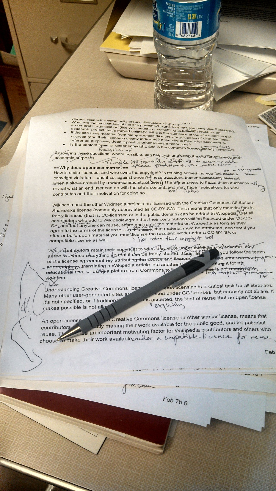

# Common mistakes

*Tool lists without context, evidence-free claims, generic objectives, inconsistent tense, and a resume that doesn't match the portfolio behind it - five patterns worth catching before you apply.*

> Most resume mistakes are not typos - they are patterns that quietly undercut an otherwise reasonable
> candidate: a tool list with no story behind it, a claim with no evidence, an objective that could belong
> to anyone, tense that drifts between roles, or a portfolio link that tells a different story than the page
> above it.

> **In real life**
>
> A dating profile that doesn't match the person who shows up. The photos are years old, the bio lists
> hobbies nobody actually does anymore, and the first five minutes are spent explaining the gap between the
> profile and reality. A resume that oversells, uses stock phrases, or contradicts your portfolio creates
> the exact same awkward first five minutes - in an interview instead of on a first date.

**Common resume mistake**: A recurring, avoidable pattern that weakens an otherwise reasonable resume: tool names without context, unquantified claims, generic filler language, inconsistent verb tense, or content that contradicts the candidate's own portfolio.

## Tools without context, claims without evidence

Listing "Selenium, Jira, Postman, SQL" tells a reader you have touched these tools, not what you did with
them or how well. The same is true of any claim with no backing - "excellent attention to detail" is an
assertion; "found 15 critical bugs pre-release, including one blocking payment" is evidence. A reader
weighs evidence far more than adjectives, because adjectives are free and evidence is not.

## Generic objectives, tense drift, and a mismatched portfolio

A summary like "seeking a challenging position at a dynamic company" could sit on any resume for any job -
it signals nothing. Tense should be consistent within a role: present tense for your current job ("Automate
regression suites"), past tense for former roles ("Automated regression suites"). And if your resume claims
automation experience but your linked GitHub is empty or your portfolio shows only manual testing, that gap
is the first thing a careful reader will notice and the hardest thing to explain away.

> **Tip**
>
> Read your resume as if you were the hiring manager who will interview you next week. Would every line
> survive a follow-up question? If not, rewrite or cut it now, not in the interview.

> **Common mistake**
>
> Do not let your resume and your portfolio tell different stories. If the resume claims automation skills,
> the linked repository should show automation work - not a single manual test script from two years ago.


*Example of copyedited manuscript.jpg — Phoebe, Wikimedia Commons, CC BY-SA 3.0. [Source](https://commons.wikimedia.org/wiki/File:Example_of_copyedited_manuscript.jpg)*
- **A sentence crossed out mid-line** — Left uncorrected, this is what a generic phrase or an unquantified claim looks like to a careful reader - something that should have been cut before submission.
- **A correction inserted above the line** — The fix was added by hand after the fact - the same way a real number should replace a vague claim before the resume goes out, not after a rejection.
- **A mark whose meaning isn't obvious later** — Even the person who wrote this note may not recall exactly what it meant weeks later - much like an un-quantified claim nobody, including the candidate, can defend in an interview.
- **Draft pages stacked, not version-controlled** — Multiple dated drafts with no clear final version - the same risk as a resume and a portfolio that were updated separately and now disagree.

**How one weak line survives to submission**

1. **A generic phrase gets written first** — 'Responsible for testing' or 'team player' fills space during a first draft.
2. **It never gets revisited** — The rest of the resume gets polished, but this line is assumed to be fine.
3. **It ships in the final version** — The resume goes out with the one line that would not survive a follow-up question.
4. **A careful reader catches it** — The mismatch, the vague phrase, or the missing evidence becomes the reason for silence.

*A common-mistakes linter (Python)*

```python
GENERIC_PHRASES = ["hardworking", "team player", "detail-oriented", "seeking a challenging position"]

def contains_generic_phrase(text):
    lower = text.lower()
    return any(phrase in lower for phrase in GENERIC_PHRASES)

def is_tool_dump(text):
    words = text.replace(",", " ").split()
    verb_like = ("wrote", "built", "led", "ran")
    has_verb = any(w.lower().endswith(("ed", "ing")) or w.lower() in verb_like for w in words)
    return (not has_verb) and len(words) <= 6

def first_word(text):
    return text.split()[0]

def tense_ok_present(bullets):
    return all(not first_word(b).lower().endswith("ed") for b in bullets)

def tense_ok_past(bullets):
    return all(first_word(b).lower().endswith("ed") for b in bullets)

summary = "Detail-oriented, hardworking team player seeking a challenging position in a dynamic company."
tool_bullet = "Selenium, Jira, Postman, SQL"
current_role_bullets = ["Automated regression suites for the checkout flow.", "Wrote test plans for new features."]
past_role_bullets = ["Test payment APIs for edge cases.", "Log defects in Jira daily."]

checks = {
    "detects_generic_filler_in_summary": contains_generic_phrase(summary),
    "detects_tool_only_bullet": is_tool_dump(tool_bullet),
    "flags_current_role_using_past_tense": not tense_ok_present(current_role_bullets),
    "flags_past_role_using_present_tense": not tense_ok_past(past_role_bullets),
}
for name, passed in checks.items():
    print(name + "=" + ("PASS" if passed else "FAIL"))
result = "PASS" if all(checks.values()) else "FAIL"
assert result == "PASS", "linter failed to catch a planted mistake"
print("RESULT=" + result)
```

*A common-mistakes linter (Java)*

```java
import java.util.*;

public class Main {
    static final List<String> GENERIC_PHRASES = Arrays.asList(
        "hardworking", "team player", "detail-oriented", "seeking a challenging position");
    static final List<String> VERB_LIKE = Arrays.asList("wrote", "built", "led", "ran");

    static boolean containsGenericPhrase(String text) {
        String lower = text.toLowerCase();
        for (String phrase : GENERIC_PHRASES) if (lower.contains(phrase)) return true;
        return false;
    }

    static boolean isToolDump(String text) {
        String[] words = text.replace(",", " ").trim().split("\\\\s+");
        boolean hasVerb = false;
        for (String w : words) {
            String lw = w.toLowerCase();
            if (lw.endsWith("ed") || lw.endsWith("ing") || VERB_LIKE.contains(lw)) { hasVerb = true; break; }
        }
        return (!hasVerb) && words.length <= 6;
    }

    static String firstWord(String text) {
        return text.split("\\\\s+")[0];
    }

    static boolean tenseOkPresent(List<String> bullets) {
        for (String b : bullets) if (firstWord(b).toLowerCase().endsWith("ed")) return false;
        return true;
    }

    static boolean tenseOkPast(List<String> bullets) {
        for (String b : bullets) if (!firstWord(b).toLowerCase().endsWith("ed")) return false;
        return true;
    }

    public static void main(String[] args) {
        String summary = "Detail-oriented, hardworking team player seeking a challenging position in a dynamic company.";
        String toolBullet = "Selenium, Jira, Postman, SQL";
        List<String> currentRoleBullets = Arrays.asList(
            "Automated regression suites for the checkout flow.", "Wrote test plans for new features.");
        List<String> pastRoleBullets = Arrays.asList(
            "Test payment APIs for edge cases.", "Log defects in Jira daily.");

        Map<String, Boolean> checks = new LinkedHashMap<>();
        checks.put("detects_generic_filler_in_summary", containsGenericPhrase(summary));
        checks.put("detects_tool_only_bullet", isToolDump(toolBullet));
        checks.put("flags_current_role_using_past_tense", !tenseOkPresent(currentRoleBullets));
        checks.put("flags_past_role_using_present_tense", !tenseOkPast(pastRoleBullets));

        boolean allPass = true;
        for (Map.Entry<String, Boolean> e : checks.entrySet()) {
            System.out.println(e.getKey() + "=" + (e.getValue() ? "PASS" : "FAIL"));
            allPass &= e.getValue();
        }
        String result = allPass ? "PASS" : "FAIL";
        if (!result.equals("PASS")) throw new AssertionError("linter failed to catch a planted mistake");
        System.out.println("RESULT=" + result);
    }
}
```

### Your first time: Audit your resume for these five patterns

- [ ] Search for tool-only bullets — Any bullet that is just a list of tools with no verb or outcome needs a rewrite.
- [ ] Search for unquantified claims — Flag adjectives like 'excellent' or 'strong' that have no number or specific evidence attached.
- [ ] Check the summary for generic filler — 'Hardworking,' 'team player,' and 'seeking a challenging position' say nothing a reader can use.
- [ ] Check tense consistency — Present tense for your current role, past tense for every prior role - no mixing within a role.
- [ ] Compare the resume against the linked portfolio — Confirm every claimed skill has visible, matching evidence at the linked GitHub or portfolio URL.

- **A bullet is just a comma-separated tool list.**
  Add a verb and an outcome: what you did with the tool and what happened as a result.
- **The summary reads like it could belong to anyone.**
  Name your specific specialty, years of experience, and one concrete strength instead of generic praise words.
- **A reviewer notices your portfolio doesn't match your resume.**
  Update whichever one is stale - do not let a resume claim skills the linked work does not demonstrate.

### Where to check

- Every bullet, for a verb and a concrete outcome rather than a bare tool name.
- The summary line, for generic phrases that could apply to any candidate.
- Verb tense within each role, checked separately for current versus former positions.
- [[resume-and-applications/the-qa-resume/numbers-and-impact]] for how to replace an unquantified claim with a real, defensible figure.

### Worked example: catching a portfolio mismatch before an interview

1. A resume states "built an automated regression suite with Selenium and CI integration."
2. The linked GitHub repository shows only a handful of manual test scripts, last updated over a year ago.
3. A friend reviewing the resume asks to see the automation work and cannot find it in the linked repo.
4. The candidate either builds out the claimed work first or rewrites the bullet to match what the portfolio actually shows.

**Quiz.** Why is a tool-only bullet like 'Selenium, Jira, Postman, SQL' considered a common mistake?

- [ ] It uses too many commas
- [x] It lists tools without context, outcome, or evidence of real use
- [ ] It should be written as a table instead
- [ ] ATS software cannot read comma-separated lists

*A bare tool list tells a reader you have been exposed to these tools but gives no evidence of what you did with them or how well - context and outcome are what make the line credible.*

- **Tool list without context** — Naming tools with no verb or outcome attached - exposure, not demonstrated skill.
- **Tense consistency rule** — Present tense for your current role's bullets, past tense for every prior role - no mixing within one role.
- **Portfolio mismatch** — A resume claiming skills the linked portfolio does not show - the first thing a careful reader checks.

### Challenge

Pick your three weakest resume bullets. For each, identify which mistake pattern it fits - tool dump, unquantified claim, generic filler, tense drift, or portfolio mismatch - and rewrite it.

- [Indeed — 16 Resume Mistakes and How To Avoid Them](https://www.indeed.com/career-advice/resumes-cover-letters/15-resume-mistakes-to-avoid)
- [Indeed — Important Resume Objective Do's and Don'ts](https://www.indeed.com/career-advice/resumes-cover-letters/resume-objective-dos-and-donts)
- [The Most Common Resume Mistakes You Need to Avoid](https://www.youtube.com/watch?v=JxFYsiz0SyI)

🎬 [The Most Common Resume Mistakes You Need to Avoid](https://www.youtube.com/watch?v=JxFYsiz0SyI) (7 min)

- Tool lists need a verb and an outcome, not just exposure to a name.
- Generic summaries and filler phrases say nothing a reader can use to judge you.
- Keep verb tense consistent within each role: present for current, past for former.
- A resume and its linked portfolio must tell the same story - mismatches are easy to spot and hard to explain.


## Related notes

- [[Notes/resume-and-applications/the-qa-resume/structure-that-works|Structure that works]]
- [[Notes/resume-and-applications/the-qa-resume/skills-and-keywords-ats|Skills & keywords (ATS)]]
- [[Notes/resume-and-applications/the-qa-resume/numbers-and-impact|Numbers & impact]]


---
_Source: `packages/curriculum/content/notes/resume-and-applications/the-qa-resume/common-mistakes.mdx`_
